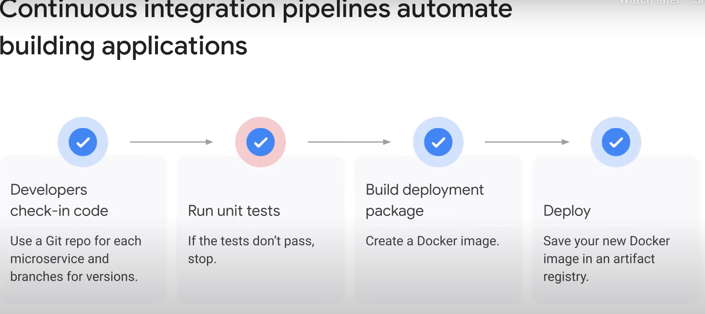

# DevOps Automation

## Introduction

- **DevOps Automation**: Key factor in achieving consistency, reliability, and speed of deployment.
- **Focus**: Services supporting continuous integration (CI) and continuous delivery (CD) practices.

## Automated Pipelines

- **Requirement**: Automated pipelines for integrating, delivering, and potentially deploying code.
- **On-Demand Resources**: Pipelines ideally run on on-demand provisioned resources.

## Google Cloud Tools

- **Cloud Source Repositories**: For source and version control.
- **Cloud Build**: Includes build triggers for automating builds.
- **Artifact Registry**: Managing containers.

## Infrastructure as Code

- **Tools**: Review of tools like Terraform for creating automated delivery pipelines.

# Continuous Integration Pipelines


## Overview

- **Automation**: Continuous integration pipelines automate building applications.
- **Process**: Starts with checking code into a repository, running unit tests, building a deployment package as a Docker image, and saving it in a container registry.
- **Customization**: Pipelines are customized to meet specific requirements.

## Typical Steps



- **Unit Tests**: Run on checked-in code.
- **Deployment Package**: Built as a Docker image.
- **Container Registry**: Image saved for deployment.
- **Additional Steps**: Linting, quality analysis (e.g., SonarQube), integration tests, test reports, image scanning.

## Google Cloud Components

- **Cloud Source Repositories**: Private Git repositories hosted on Google Cloud.
- **Cloud Build**: Executes builds on Google Cloud infrastructure.
- **Artifact Registry**: Manages Docker images and deployment packages.

## Cloud Source Repositories

- **Features**: Collaboration, version control, integration with Google Cloud.
- **IAM**: Add team members and grant permissions.
- **Pub/Sub Integration**: Publish messages on repository events.
- **Additional Features**: Cloud Debugger, audit logging, direct deployment to App Engine.
- **Synchronization**: Connect existing GitHub or Bitbucket repositories.

## Cloud Build

- **Build Execution**: Executes builds as a series of steps in Docker containers.
- **Build Triggers**: Automatically start builds on source code changes.
- **Build Config**: Instructions for tasks, defined as steps executed by cloud builders.
- **Cloud Builders**: Containers with common languages and tools.
- **Custom Steps**: Define custom build steps if needed.

## Build Triggers

- **Automatic Builds**: Start builds on code changes.
- **Configuration**: Specify branch or tag for triggers, build configuration in Dockerfile or Cloud Build file.

## Container Registry

- **Secure Repository**: Private Docker image repository on Google Cloud.
- **IAM**: Configure access, view, or download permissions.
- **Native Docker Support**: Push and pull images using Docker CLI.
- **Multiple Registries**: Define multiple registries.
- **Container Analysis**: Perform vulnerability scanning of images.
- **Binary Authorization**: Enforce deployment of trusted containers into GKE.

## Binary Authorization Workflow

- **Code Check-In**: Triggers a Cloud Build.
- **Vulnerability Scan**: Performed by Container Registry.
- **Pub/Sub Notifications**: Scanner publishes messages.
- **Kritis Signer**: Listens to notifications and makes attestations.
- **Deployment Enforcement**: Google Cloud binary authorization service enforces policy requiring attestations.

## Additional Resources

- **Links**: More details on creating Binary Authorization attestations and using Kritis Signer available in course resources.

# Infrastructure as Code

## Mindset Change

- **Cloud Model**: On-demand, pay-per-use model differs from traditional on-premises infrastructure.
- **On-Premises Model**: Buy machines, keep running continuously, capital expenditure.
- **Cloud Model**: Rent resources, turn off when not needed, operating expense.

## Infrastructure as Code (IaC)

- **Disposable Infrastructure**: All infrastructure in the cloud needs to be disposable.
- **Automation**: Provisioning, configuration, and deployment activities are automated.
- **Benefits**: Minimizes risks, eliminates manual mistakes, supports repeatable deployments, scales easily.

## Automation Tools

- **Scripts and Declarative Tools**: Use tools like Terraform for automation.
- **No Maintenance**: Remove and recreate machines instead of fixing or patching.
- **Ephemeral Environments**: Provision test environments that replicate production and delete when not in use.

## Terraform

- **Quick Provisioning**: Allows quick provisioning and removal of infrastructures.
- **Integration**: Can be integrated into continuous integration pipelines.
- **Flexibility**: Infrastructure can be changed as requirements change.
- **Consistency**: Repeat deployments with consistent results, delete entire deployments with one command.

## Google Cloud Support

- **Terraform**: Describes deployments in configuration files.
- **Modularization**: Use templates to create reusable components.
- **Other Tools**: Chef, Puppet, Ansible, Packer.

## Terraform Configuration

- **Declarative Format**: Specify resources needed for the application.
- **HCL**: HashiCorp Configuration Language for concise descriptions.
- **Parallel Deployment**: Deploy resources in parallel.
- **APIs**: Uses Google Cloud service APIs to deploy resources.

## Terraform Language

- **Resources**: Infrastructure objects like VMs, storage buckets, containers, networks.
- **Configuration**: Complete document in Terraform language to manage infrastructure.
- **Syntax**: Includes blocks, arguments, and expressions.
- **Multi-Cloud**: Can be used on multiple public and private clouds.

## Example Configuration

- **Provider Block**: Indicates Google Cloud as the provider, specifies deployment region.
- **Resource Block**: Specifies a Google Cloud Compute Engine instance.
- **Output Block**: Specifies an output variable for the Terraform module.

## Benefits of IaC

- **On-Demand Provisioning**: Powerful for continuous deployment.
- **Automated Provisioning**: Manages deployment complexity in code.
- **Replicable Environments**: Easily replicate production environments for development and testing.
- **Cost Efficiency**: Provision and delete environments as needed to save costs.

# Building a DevOps Pipeline Lab

## Objectives

In this lab, you will learn how to perform the following tasks:

1. Create a Git repository
2. Create a simple Python application
3. Test your web application in Cloud Shell
4. Define a Docker build
5. Manage Docker images with Cloud Build and Artifact Registry
6. Automate builds with triggers
7. Test your build changes

## Task 1: Create a Git Repository

1. **Create Repository**:
   - Go to Google Cloud console, search for "Source Repositories", and click on it.
   - Click "Add repository".
   - Select "Create new repository" and click "Continue".
   - Name the repository `devops-repo`.
   - Select your current project ID and click "Create".

2. **Activate Cloud Shell**:
   - Click "Activate Cloud Shell" in the Cloud Console.
   - Enter the following commands in Cloud Shell:

     ```sh
     mkdir gcp-course
     cd gcp-course
     gcloud source repos clone devops-repo
     cd devops-repo
     ```

## Task 2: Create a Simple Python Application

1. **Create Python Application**:
   - Open Cloud Shell Editor.
   - Create a file named `main.py` in the `devops-repo` folder with the following content:

     ```python
     from flask import Flask, render_template, request

     app = Flask(__name__)

     @app.route("/")
     def main():
         model = {"title": "Hello DevOps Fans."}
         return render_template('index.html', model=model)

     if __name__ == "__main__":
         app.run(host='0.0.0.0', port=8080, debug=True, threaded=True)
     ```

2. **Create Templates**:
   - Create a folder named `templates` in the `devops-repo` folder.
   - Create a file named `layout.html` in the `templates` folder with the following content:

     ```html
     <!doctype html>
     <html lang="en">
     <head>
         <title>{{model.title}}</title>
         <link rel="stylesheet" href="https://stackpath.bootstrapcdn.com/bootstrap/4.4.1/css/bootstrap.min.css">
     </head>
     <body>
         <div class="container">
             
             <footer></footer>
         </div>
     </body>
     </html>
     ```

   - Create a file named `index.html` in the `templates` folder with the following content:

     ```html
     
     
     <div class="jumbotron">
         <div class="container">
             <h1>{{model.title}}</h1>
         </div>
     </div>
     
     ```

3. **Create Requirements File**:
   - Create a file named `requirements.txt` in the `devops-repo` folder with the following content:

     ```sh
     Flask>=2.0.3
     ```

4. **Commit Changes**:
   - Add and commit the files to the local Git repository:

     ```sh
     cd ~/gcp-course/devops-repo
     git add --all
     git config --global user.email "you@example.com"
     git config --global user.name "Your Name"
     git commit -a -m "Initial Commit"
     git push origin master
     ```

## Task 3: Define a Docker Build

1. **Create Dockerfile**:
   - Create a file named `Dockerfile` in the `devops-repo` folder with the following content:

     ```Dockerfile
     FROM python:3.9
     WORKDIR /app
     COPY . .
     RUN pip install gunicorn
     RUN pip install -r requirements.txt
     ENV PORT=80
     CMD exec gunicorn --bind :$PORT --workers 1 --threads 8 main:app
     ```

2. **Save Dockerfile**:
   - Ensure the Dockerfile is saved with the correct content.

## Task 4: Manage Docker Images with Cloud Build and Artifact Registry

1. **Ensure Correct Folder**:

   ```sh
   cd ~/gcp-course/devops-repo
   ```

2. **View Project ID**:

   ```sh
   echo $DEVSHELL_PROJECT_ID
   ```

3. **Create Artifact Registry Repository**:

   ```sh
   gcloud artifacts repositories create devops-repo \
       --repository-format=docker \
       --location="REGION"
   ```

4. **Configure Docker Authentication**:

   ```sh
   gcloud auth configure-docker "REGION"-docker.pkg.dev
   ```

5. **Build and Store Docker Image**:

   ```sh
   gcloud builds submit --tag "REGION"-docker.pkg.dev/$DEVSHELL_PROJECT_ID/devops-repo/devops-image:v0.1 .
   ```

6. **Verify Image in Artifact Registry**:
   - Go to Artifact Registry in the Google Cloud console.
   - Click on `devops-repo` and then `devops-image` to see your image.

7. **Verify Build in Cloud Build**:
   - Go to Cloud Build in the Google Cloud console.
   - Check the build history.

8. **Run Image from Compute Engine VM**:
   - Go to Compute Engine > VM Instances.
   - Click "Create Instance".
   - Specify the following:
     - **Container**: Click "DEPLOY CONTAINER".
     - **Container Image**: `Lab Region-docker.pkg.dev/Project ID/devops-repo/devops-image:v0.1`
     - **Firewall**: Allow HTTP traffic.
   - Click "Create".
   - Once the VM starts, click the VM's external IP address to see "Hello DevOps Fans".

9. **Save Changes to Git Repository**:

   ```sh
   cd ~/gcp-course/devops-repo
   git add --all
   git commit -am "Added Docker Support"
   git push origin master
   ```

## Task 5: Automate Builds with Triggers

1. **Configure Cloud Build Service Account**:
   - Go to Cloud Build > Settings.
   - Select the service account `Project ID@Project ID.iam.gserviceaccount.com`.
   - Enable "Set as Preferred Service Account".

2. **Create Build Trigger**:
   - Go to Cloud Build > Triggers and click "Create trigger".
   - Specify the following:
     - **Name**: `devops-trigger`
     - **Region**: Lab Region
     - **Repository**: `devops-repo` (Cloud Source Repositories)
     - **Branch**: `.*` (any branch)
     - **Configuration Type**: Cloud Build configuration file (yaml or json)
     - **Location**: Inline
   - Click "Open Editor" and replace the code with:

     ```yaml
     steps:
       - name: 'gcr.io/cloud-builders/docker'
         args: ['build', '-t', 'REGION-docker.pkg.dev/Project ID/devops-repo/devops-image:$COMMIT_SHA', '.']
     images:
       - 'REGION-docker.pkg.dev/Project ID/devops-repo/devops-image:$COMMIT_SHA'
     options:
       logging: CLOUD_LOGGING_ONLY
     ```

   - Select the service account and click "Create".

3. **Test the Trigger**:
   - Click "Run" and then "Run trigger".
   - Check the build history and logs.

4. **Modify Application**:
   - Change the title in `main.py` to "Hello Build Trigger.":

     ```python
     @app.route("/")
     def main():
         model = {"title":  "Hello Build Trigger."}
         return render_template("index.html", model=model)
     ```

   - Commit and push the changes:

     ```sh
     cd ~/gcp-course/devops-repo
     git commit -a -m "Testing Build Trigger"
     git push origin master
     ```

## Task 6: Test Your Build Changes

1. **Verify Build Completion**:
   - Check the build details in Cloud Build.

2. **Copy Image Name**:
   - Go to Artifact Registry and copy the image name.

3. **Deploy New VM**:
   - Go to Compute Engine and create a new VM.
   - Deploy the container using the copied image name.
   - Allow HTTP traffic.

4. **Test the Change**:
   - Access the VM's external IP address in your browser to see the new message "Hello Build Trigger.".
