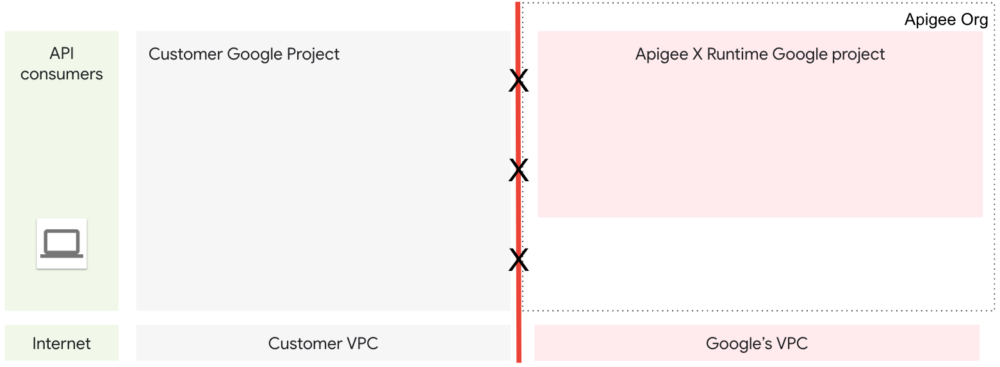
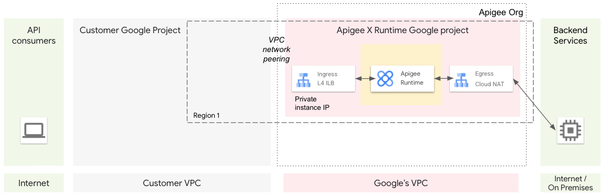
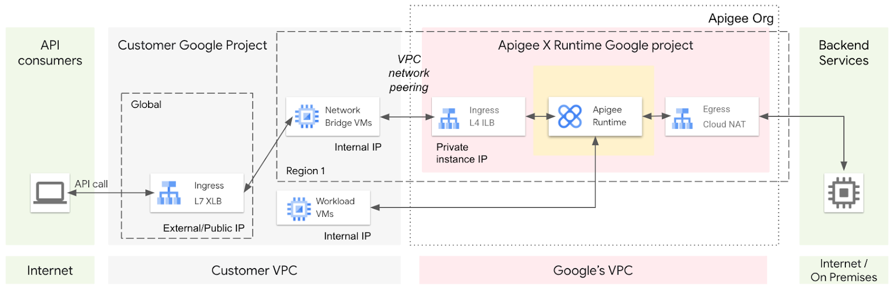
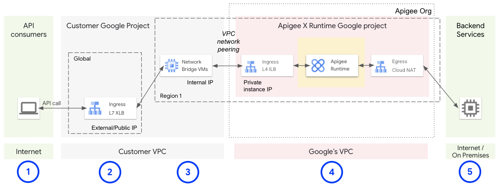

# Provisioning an Apigee X Evaluation Organization Lab

## Overview

In this lab, you learn how to create an Apigee X organization (org). You use the Apigee X provisioning wizard to create the Apigee X org. After installing and configuring the org, you install an API proxy and make API calls to verify that the org is operational.

An Apigee evaluation org created in your own Google Cloud project is typically available for 60 days. The org you provision for this lab is deleted when the lab ends, and you lose access to the org.

It is recommended that you read through the lab before you click Start Lab. After starting the lab, you will have 90 minutes to complete the lab. When the allowed time for the lab has expired, the lab ends and the Apigee evaluation org is deleted.

## Lab Tasks

In this lab, you learn how to perform the following tasks:

- Create an Apigee X evaluation org using the provisioning wizard
- Understand the Apigee X architecture and how it integrates with a Google Cloud project
- Create a VM to call an Apigee proxy from an internal IP address
- Call an Apigee proxy from an external IP address

## Setup

### Task 1: Provision an Apigee X Org

In this task, you use the provisioning wizard to provision an Apigee X evaluation org.

An Apigee X org is attached to a customer-managed Google Cloud project.

### Prerequisites

Before creating an Apigee X evaluation org, certain prerequisites must be met:

- The name of your Apigee organization matches the name of the associated Google Cloud project. The project name must start with a lowercase letter, and the only allowed characters are lowercase letters (a-z), digits (0-9), and hyphens.
- A project used for Apigee X must be associated with a Google Cloud account with active billing. This requirement applies whether you are creating a paid or an evaluation Apigee X org. An evaluation org does not incur charges against your account, but some APIs used by the organization do.
- The Cloud SDK is used to install and interact with your Apigee organization.

The lab project adheres to these prerequisites.

### Start the Provisioning Wizard

1. Open a new incognito tab and open the provisioning wizard at apigee.google.com/setup.
2. From the lab information on the left, copy your Google Cloud project name into the clipboard.
3. Paste the project name into the Project text box.
4. A message is displayed indicating that an Apigee subscription is not enabled for this project.
5. Click **Start Evaluation**.

### Enable APIs

Apigee X organizations require that the Apigee, Service Networking, and Compute Engine APIs must be enabled in the Google Cloud project. The wizard enables the required APIs.

1. Next to **Enable APIs**, click **Edit**.
2. Click **Enable APIs**.
3. After a short wait, the APIs will be completed and a check mark will appear next to **Enable APIs**.

### Set Up Networking

The provisioning wizard creates Virtual Private Cloud (VPC) network peering between the customer's Google Cloud project and the Google-managed project containing the Apigee runtime. The wizard also creates a private service connection for communication with the Apigee runtime.

1. Next to **Networking**, click **Edit**.
2. Click **See VPC networks in your project**.
3. Click **+Create VPC Network**.
4. Name the network `apigeex-vpc`.
5. In the New subnet pane, set the following values:
   - **Name**: `apigeex-vpc`
   - **Region**: select the region specified at lab start
   - **IPv4 range**: `10.0.0.0/20`
   - **Private Google Access**: On
6. Click **Done**.
7. Click **Create**.
8. Wait for the `apigeex-vpc` network to be created, and then return to the wizard Setup tab.
9. Click **Refresh authorized networks**, and then select the `apigeex-vpc` authorized network.
10. Select **Automatically allocate IP range**.
11. Click **Allocate and connect**.
12. Wait for the Networking configuration to finish.
13. Return to the VPC networks tab, and then click **Refresh**.
14. Click `apigeex-vpc`.
15. Select the **Private Service Connection** tab.
16. Verify the `google-managed-services-apigeex-vpc` IP range has been created with a /22 internal IP range.

## Create the Apigee Evaluation Organization

### Task 1: Create the Apigee Evaluation Organization

The provisioning wizard creates an Apigee evaluation org.

1. Return to the wizard Setup tab.
2. Next to **Apigee evaluation organization**, click **Edit**.
3. In the **Create an Apigee evaluation organization** pane, select the Google Cloud regions for the Apigee runtime and Analytics hosting:
   - Select `<region specified at lab start>` for the Runtime location.
   - Select `<region specified at lab start>` for the Analytics hosting region.
   - Note: If the chosen runtime region is not available as an analytics hosting region, choose a region that is geographically close to the runtime region.
4. Click **Provision**.

You will return to the provisioning wizard later to configure Access Routing.

### Task 2: Wait for Provisioning to Complete

In this task, you wait for the Apigee evaluation org provisioning to complete.

The Apigee organization provisioning takes quite a while to complete. The org provisioning progress can be monitored by using the Apigee API.

#### Start Monitoring Script

1. Return to the console tab.
2. On the top-right toolbar, click the **Activate Cloud Shell** button.
3. If prompted, click **Continue**.
4. In the Cloud Shell, verify the variable with your Apigee org name:

   ```bash
   echo ${GOOGLE_CLOUD_PROJECT}
   ```

   The variable `GOOGLE_CLOUD_PROJECT` should contain the name of your project, which is the same as your Apigee organization name.
5. If the `GOOGLE_CLOUD_PROJECT` variable is not set, set the variable manually using a command that looks like this, replacing `<project>` with your project name:

   ```bash
   export GOOGLE_CLOUD_PROJECT=<project>
   ```

6. Paste the following command into Cloud Shell:

   ```bash
   export INSTANCE_NAME=eval-instance; export ENV_NAME=eval; export PREV_INSTANCE_STATE=; echo "waiting for runtime instance ${INSTANCE_NAME} to be active"; while : ; do export INSTANCE_STATE=$(curl -s -H "Authorization: Bearer $(gcloud auth print-access-token)" -X GET "https://apigee.googleapis.com/v1/organizations/${GOOGLE_CLOUD_PROJECT}/instances/${INSTANCE_NAME}" | jq "select(.state != null) | .state" --raw-output); [[ "${INSTANCE_STATE}" == "${PREV_INSTANCE_STATE}" ]] || (echo; echo "INSTANCE_STATE=${INSTANCE_STATE}"); export PREV_INSTANCE_STATE=${INSTANCE_STATE}; [[ "${INSTANCE_STATE}" != "ACTIVE" ]] || break; echo -n "."; sleep 5; done; echo; echo "instance created, waiting for environment ${ENV_NAME} to be attached to instance"; while : ; do export ATTACHMENT_DONE=$(curl -s -H "Authorization: Bearer $(gcloud auth print-access-token)" -X GET "https://apigee.googleapis.com/v1/organizations/${GOOGLE_CLOUD_PROJECT}/instances/${INSTANCE_NAME}/attachments" | jq "select(.attachments != null) | .attachments[] | select(.environment == \"${ENV_NAME}\") | .environment" --join-output); [[ "${ATTACHMENT_DONE}" != "${ENV_NAME}" ]] || break; echo -n "."; sleep 5; done; echo; echo "${ENV_NAME} environment attached"; echo "***ORG IS READY TO USE***";
   ```

   This series of commands uses the Apigee API to determine when the runtime instance has been created, and then waits for the eval environment to be attached to the instance.

7. Wait for the provisioning to complete.
8. When the text `***ORG IS READY TO USE***` is printed, the org can be tested.

Note: Continue reading this lab to learn about the Apigee X architecture, API proxy call lifecycle, and Apigee UI while you wait for the organization to be fully created. This process may take close to 30 minutes. Pay attention to the time remaining in the lab, and periodically check the Cloud Shell output to see when the org can be tested.

### Apigee X Architecture Overview

An Apigee X organization requires two Google Cloud projects: one managed by the customer, and one managed by Google for the Apigee X runtime. Each project uses its own Virtual Private Cloud (VPC) network. By default, VPC networks in two separate projects cannot communicate with each other.



To enable communication between these VPCs, Apigee uses VPC network peering. Network peering allows internal IP address connectivity between the two networks.



The Apigee runtime runs your API proxies, and is provisioned in the Google-managed project. Incoming requests to the runtime are sent to an internal TCP load balancer which is accessible by using a private IP address in the peered network.

To route traffic from clients on the internet to the Apigee runtime, you can use a global external HTTPS load balancer (XLB). However, an XLB cannot communicate directly with an internal IP address in another project, even if the networks are peered. To solve this problem, a managed instance group (MIG) of virtual machines (VMs) serves as a network bridge.



The VMs in the MIG can communicate bidirectionally across the peered networks. A request coming from the internet would flow through the XLB to a bridge VM in the MIG. The VM can call the private IP of the Apigee runtime's internal load balancer.

The runtime can also directly call internal IP addresses in the peered network in the customer project, or call external IPs through the Google-managed project's Cloud NAT (network address translation) gateway.

### API Proxy Call Lifecycle

The following illustration shows the lifecycle of an API proxy call for a paid Apigee X org:



1. A client calls an Apigee API proxy.
2. The request lands on a global external HTTPS load balancer (XLB). The XLB is configured with an external public IP address and a TLS certificate.
3. The XLB forwards the request to a VM in the MIG.
4. The VM forwards the request to the internal load balancer private IP address which is routed to the Apigee runtime.
5. After processing the request, the Apigee runtime sends the request to the backend service. The response returns along the same path.

### Apigee UI

The Apigee UI is used to manage your org. You may explore your org in the UI by navigating to apigee.google.com.

Note: The Apigee X org should be visible in the Apigee UI a few minutes after the provisioning process has started.

## Task 3: Set Up Access Routing

In this task, you use the provisioning wizard to create the infrastructure that allows API calls to be made from outside of the VPC network.

1. Return to the wizard Setup tab.
2. Next to **Access routing**, click **Edit**.
3. Select **Enable internet access**.
   - Note: The wizard mentions a cost for the Google Cloud Load Balancer. There is no cost for you when using this lab.
4. Select **Use wildcard DNS service**.
   - A wildcard DNS service will automatically return a DNS entry based upon an IP address embedded in the hostname. For example, the hostname `eval-34.100.120.55.nip.io` would resolve to the IP address `34.100.120.55`.
   - To use the default wildcard DNS provider, nip.io, leave the domain unchanged.
5. For **Subnetwork**, select `apigeex-vpc`.
6. Click **Set Access**.
7. Wait until the access routing configuration has completed.
8. Click **Check my progress** to verify the objective.

## Task 4: Test the Apigee Evaluation Org Using Internal Access

In this task, you test that a proxy in the Apigee evaluation org can be called from an internal IP address.

### Create a Virtual Machine that Can Make Calls to the Apigee Runtime

1. Using Cloud Shell, set the following variables:

   ```bash
   export ORG=${GOOGLE_CLOUD_PROJECT}
   export PROJECT_NUMBER=$(gcloud projects describe ${GOOGLE_CLOUD_PROJECT} --format="value(projectNumber)")
   export NETWORK=apigeex-vpc
   export SUBNET=apigeex-vpc
   export INSTANCE_NAME=eval-instance
   export VM_NAME=apigeex-test-vm
   export VM_ZONE=ZONE
   export RUNTIME_IP=$(curl -s -H "Authorization: Bearer $(gcloud auth print-access-token)" -X GET "https://apigee.googleapis.com/v1/organizations/${ORG}/instances/${INSTANCE_NAME}" | jq ".host" --raw-output)
   echo "RUNTIME_IP=${RUNTIME_IP}"
   ```

2. Create a virtual machine:

   ```bash
   gcloud beta compute --project=${GOOGLE_CLOUD_PROJECT} \
   instances create ${VM_NAME} \
   --zone=${VM_ZONE} \
   --machine-type=e2-micro \
   --subnet=${SUBNET} \
   --service-account=${PROJECT_NUMBER}-compute@developer.gserviceaccount.com \
   --scopes=https://www.googleapis.com/auth/cloud-platform \
   --tags=http-server,https-server \
   --image-family=debian-11 \
   --image-project=debian-cloud \
   --boot-disk-size=10GB \
   --boot-disk-device-name=${VM_NAME} \
   --metadata=startup-script="sudo apt-get update -y && sudo apt-get install -y jq"
   ```

3. Add a firewall rule to allow secure shell (ssh) access to VMs in the network:

   ```bash
   gcloud compute --project=${GOOGLE_CLOUD_PROJECT} \
   firewall-rules create ${NETWORK}-allow-ssh \
   --direction=INGRESS \
   --priority=65534 \
   --network=${NETWORK} \
   --action=ALLOW \
   --rules=tcp:22 \
   --source-ranges=0.0.0.0/0
   ```

4. In Cloud Shell, open an SSH connection to the new VM:

   ```bash
   gcloud compute ssh ${VM_NAME} --zone=${VM_ZONE} --force-key-file-overwrite
   ```

5. For each question asked, click Enter or Return to specify the default input.

### Test the Apigee Evaluation Org

1. In the VM's shell, set required shell variables:

   ```bash
   export PROJECT_NAME=$(gcloud config get-value project)
   export ORG=${PROJECT_NAME}
   export INSTANCE_NAME=eval-instance
   export INSTANCE_IP=$(curl -s -H "Authorization: Bearer $(gcloud auth print-access-token)" -X GET "https://apigee.googleapis.com/v1/organizations/${ORG}/instances/${INSTANCE_NAME}" | jq ".host" --raw-output)
   export ENV_GROUP_HOSTNAME=$(curl -s -H "Authorization: Bearer $(gcloud auth print-access-token)" -X GET "https://apigee.googleapis.com/v1/organizations/${ORG}/envgroups" | jq ".environmentGroups[0].hostnames[0]" --raw-output)
   echo "INSTANCE_IP=${INSTANCE_IP}"
   echo "ENV_GROUP_HOSTNAME=${ENV_GROUP_HOSTNAME}"
   ```

2. Call the deployed hello-world API proxy using an internal IP address:

   ```bash
   curl -i -k --resolve "${ENV_GROUP_HOSTNAME}:443:${INSTANCE_IP}" \
   "https://${ENV_GROUP_HOSTNAME}/hello-world"
   ```

3. Click **Check my progress** to verify the objective.

## Task 5: Test the Apigee Evaluation Org Using External Access

In this task, you test that a proxy in the Apigee evaluation org can be called from an external IP address.

### Explore the Created Infrastructure

1. In the console, navigate to **Network services > Load balancing**.
2. A load balancer named `apigee-proxy-url-map` was created.
3. Click `apigee-proxy-url-map`.
4. The load balancer configuration sections include the Frontend, Host and path rules, and the Backend.
   - The Frontend specifies details about incoming traffic. This load balancer should be accepting HTTPS traffic on port 443 of an external IP address. The certificate is named `apigee-ssl-cert`.
   - The Host and path rules specify which hostnames and URL paths can be used to call a specific backend. In this case, requests containing any hostname and path will be forwarded to the `apigee-proxy-backend` backend service.
   - The Backend specifies the service to be called by the load balancer. The `apigee-proxy-<region specified at lab start>` instance group contains 2 virtual machines to forward requests to the runtime instance. A global load balancer cannot forward requests to an internal IP address, but the instance group VMs can call an internal IP address.
5. To access the certificate details, in the Frontend configuration, click `apigee-ssl-cert`.
   - The certificate used by the load balancer, when active, has a certificate chain that allows curl to call the load balancer without skipping certificate validation. The domain for the certificate is `[IP_ADDRESS].nip.io`, where the IP address is the frontend external IP address.
   - Google Cloud needs to provision the certificate, and it may take a significant period of time to complete the provisioning.
   - If the certificate's status is `PROVISIONING`, Google Cloud may have created the certificate but is still working with the Certificate Authority to sign it.
   - Provisioning typically takes under 10 minutes, but may take up to an hour. Refer to the Managed status troubleshooting guide for details.

### Test the Apigee Evaluation Org Using External Access

1. In Cloud Shell, open a new tab by clicking **Open a new tab (+)**.
2. Call the deployed hello-world API proxy using an external IP address:

   ```bash
   export PROJECT_NAME=$(gcloud config get-value project)
   export SSL_HOSTNAME=$(curl -s -H "Authorization: Bearer $(gcloud auth print-access-token)" -X GET "https://compute.googleapis.com/compute/v1/projects/${PROJECT_NAME}/global/sslCertificates/apigee-ssl-cert" | jq ".managed.domains[0]" --raw-output)
   echo "SSL_HOSTNAME=${SSL_HOSTNAME}"
   curl -H "Cache-Control: no-cache" "https://${SSL_HOSTNAME}/hello-world"
   ```

3. If the certificate is fully provisioned, the curl command again returns the output from the hello-world proxy: `Hello, Guest!`
4. If the curl command returns a handshake failure, the SSL certificate is not yet configured for the load balancer.
5. Return to the certificate details page and check the status of the certificate. If the certificate's status is still not `ACTIVE`, wait for the certificate to become active and then retry the curl command.
