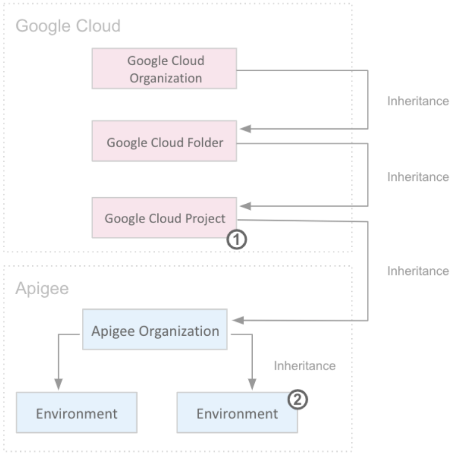

# Apigee X Environment and Group Lab Notes

## Overview

In this lab, you will learn how to add a new environment and environment group to an Apigee X organization.

- **Environment**: A runtime execution context for API proxies. An API proxy must be deployed to an environment before it can be accessed over the network.
- **Environment Group**: A logical grouping of environments. Hostnames are defined on an environment group, and Apigee routes requests to the environments within a group based on the hostname.

## Objectives

- Add a second environment to an Apigee X org.
- Add a second environment group to an Apigee X org, assigning environments and hostnames.
- Deploy an environment to a runtime instance.
- Deploy and call an API proxy in each environment.

## Task 1: Examine the `eval` Environment and Environment Group

1. Open the Apigee Console:
   - In the Google Cloud Console, navigate to **Apigee API Management** via the Navigation menu.
2. Explore the `eval` environment:
   - Go to **Admin > Environments > Overview**.
   - Click on the `eval` environment.
   - The `eval` environment is part of the `eval-group` environment group and is marked "Ready for deployment."
3. Explore the `eval-group` environment group:
   - Navigate to **Admin > Environments > Groups**.
   - Click **Edit** on the `eval-group` box.
   - Observe the hostname (`eval.example.com`) and the `eval` environment as the only member.
   - Click **Cancel**.

## Task 2: Create a `prod` Environment

1. Navigate to **Admin > Environments > Overview**.
2. Click **+Environment** in the upper right corner.
3. Specify:
   - **Display Name**: `prod`
   - **Environment Name**: `prod`
4. Click **Create**.
5. The `prod` environment will initially be marked "Pending Provisioning" and will later be marked "Ready for use."

## Task 3: Create a `prod-group` Environment Group

1. Navigate to **Admin > Environments > Groups**.
2. Click **+Environment Group** in the upper right corner.
3. Name the environment group `prod-group` and click **Add**.
4. Edit the `prod-group`:
   - Click the **Edit** (pencil) icon.
   - Add the `prod` environment to the group.
   - Replace the existing hostname with `prod.example.com`.
5. Click **Save**.

## Task 4: Wait for Instance Provisioning to Complete

1. Monitor the provisioning progress using the Apigee API:
   - Open **Cloud Shell** in the Google Cloud Console.
   - Verify the `GOOGLE_CLOUD_PROJECT` variable:

     ```bash
     echo ${GOOGLE_CLOUD_PROJECT}
     ```

   - If not set, manually set it:

     ```bash
     export GOOGLE_CLOUD_PROJECT={project}
     ```

   - Run the following commands to monitor the provisioning:

     ```bash
     export INSTANCE_NAME=eval-instance; export ENV_NAME=eval; export PREV_INSTANCE_STATE=; echo "waiting for runtime instance ${INSTANCE_NAME} to be active"; while : ; do export INSTANCE_STATE=$(curl -s -H "Authorization: Bearer $(gcloud auth print-access-token)" -X GET "https://apigee.googleapis.com/v1/organizations/${GOOGLE_CLOUD_PROJECT}/instances/${INSTANCE_NAME}" | jq "select(.state != null) | .state" --raw-output); [[ "${INSTANCE_STATE}" == "${PREV_INSTANCE_STATE}" ]] || (echo; echo "INSTANCE_STATE=${INSTANCE_STATE}"); export PREV_INSTANCE_STATE=${INSTANCE_STATE}; [[ "${INSTANCE_STATE}" != "ACTIVE" ]] || break; echo -n "."; sleep 5; done; echo; echo "instance created, waiting for environment ${ENV_NAME} to be attached to instance"; while : ; do export ATTACHMENT_DONE=$(curl -s -H "Authorization: Bearer $(gcloud auth print-access-token)" -X GET "https://apigee.googleapis.com/v1/organizations/${GOOGLE_CLOUD_PROJECT}/instances/${INSTANCE_NAME}/attachments" | jq "select(.attachments != null) | .attachments[] | select(.environment == \"${ENV_NAME}\") | .environment" --join-output); [[ "${ATTACHMENT_DONE}" != "${ENV_NAME}" ]] || break; echo -n "."; sleep 5; done; echo; echo "${ENV_NAME} environment attached"; echo "***ORG IS READY TO USE***";
     ```

2. When the message `***ORG IS READY TO USE***` appears, the org is ready for testing.

## Users and Roles

- **Users**: Represent authenticated accounts that can access Apigee resources.
- **Roles**: Define the capabilities granted to users.
- **Access Model**:
  - Permissions granted at the Cloud project level are inherited by resources within the project.
  - Roles can also be assigned at the environment level within the Apigee UI.
  - Follow the principle of least privilege by granting minimum permissions at the project level and expanding them at the environment level.



# Apigee Roles and Task 5: Adding the `prod` Environment to the Runtime Instance

## Apigee Roles

The following table summarizes the pre-defined Apigee roles:

| **Apigee Role**              | **Description**                                                                 |
|------------------------------|---------------------------------------------------------------------------------|
| **Apigee Org Admin**          | Full access to all Apigee resources in an Apigee organization.                  |
| **Apigee Read Only Admin**    | Read-only access to all Apigee resources in an Apigee organization.             |
| **Apigee Analytics Editor**   | Creates and analyzes reports on API proxy traffic. Can edit queries and reports.|
| **Apigee Analytics Viewer**   | Can view Apigee Analytics reports but cannot edit queries or reports.           |
| **Apigee API Admin**          | A developer who creates and tests API proxies.                                  |
| **Apigee Environment Admin**  | Deploys and undeploys API proxies in environments.                              |
| **Apigee Developer Admin**    | Manages developer access to APIs.                                               |

For more details on API permissions for each role, refer to the [Apigee roles guide](https://cloud.google.com/apigee/docs).

---

## Task 5: Add the `prod` Environment to the Runtime Instance

In this task, you will attach the `prod` environment to the runtime instance, enabling proxies deployed to `prod` to run.

### Steps to Attach the `prod` Environment

1. **Confirm Readiness**:
   - Ensure the Cloud Shell commands from Task 4 have returned `***ORG IS READY TO USE***`.

2. **Attach the `prod` Environment**:
   - Run the following command to begin attaching the `prod` environment to the runtime instance:

     ```bash
     export INSTANCE_NAME=eval-instance; curl -s -H "Authorization: Bearer $(gcloud auth print-access-token)" -H "Content-Type: application/json" -X POST "https://apigee.googleapis.com/v1/organizations/${GOOGLE_CLOUD_PROJECT}/instances/${INSTANCE_NAME}/attachments" -d '{ "environment": "prod" }' | jq
     ```

3. **Handle Errors**:
   - If you encounter errors:
     - **NOT_FOUND**: Indicates the `prod` environment may not have been created successfully.
     - **FAILED_PRECONDITION**: Indicates the `eval` environment provisioning may not have completed.

4. **Check for Success**:
   - A successful attachment will return a message with a state of `IN_PROGRESS`, similar to:

     ```json
     {
       "name": "organizations/qwiklabs-gcp-01-e12f9fd402f4/operations/c4e1a09f-05d2-4c46-95ed-559457507379",
       "metadata": {
         "@type": "type.googleapis.com/google.cloud.apigee.v1.OperationMetadata",
         "operationType": "INSERT",
         "targetResourceName": "organizations/qwiklabs-gcp-01-e12f9fd402f4/instances/eval-instance/attachments/c2e04a79-15e6-4656-9d25-f618080b57fb",
         "state": "IN_PROGRESS"
       }
     }
     ```

5. **Monitor Attachment Progress**:
   - Use the following command to check the status of the `prod` environment attachment:

     ```bash
     export ATTACHING_ENV=prod; export INSTANCE_NAME=eval-instance; echo "waiting for ${ATTACHING_ENV} attachment"; while : ; do export ATTACHMENT_DONE=$(curl -s -H "Authorization: Bearer $(gcloud auth print-access-token)" -X GET "https://apigee.googleapis.com/v1/organizations/${GOOGLE_CLOUD_PROJECT}/instances/${INSTANCE_NAME}/attachments" | jq "select(.attachments != null) | .attachments[] | select(.environment == \"${ATTACHING_ENV}\") | .environment" --join-output); [[ "${ATTACHMENT_DONE}" != "${ATTACHING_ENV}" ]] || break; echo -n "."; sleep 5; done; echo; echo "***${ATTACHING_ENV} ENVIRONMENT ATTACHED***";
     ```

   - When the message `***prod ENVIRONMENT ATTACHED***` appears, proxies deployed to the `prod` environment can accept traffic.

6. **Continue with Next Task**:
   - Leave the command running and proceed to the next task.

# Task 6: Create an API Proxy

In this task, you will create an API proxy that uses flow variables to return the hostname and environment for the API call.

## Steps to Create the API Proxy

1. **Open the Apigee Console**:
   - Select the **Apigee Console** tab in your browser.
   - Navigate to **Develop > API Proxies**.

2. **Start the Proxy Wizard**:
   - Click **Create New**.
   - Select **No Target** (do not click "Use OpenAPI Spec").

3. **Specify Proxy Properties**:
   - **Name**: `test-env`
   - **Base Path**: `/test-env`
   - Click **Next**.

4. **Configure Common Policies**:
   - Leave the default settings and click **Next**.

5. **Create the Proxy**:
   - On the **Summary** page, click **Create**.
   - The API proxy will be generated. Click **Edit Proxy**.

6. **Switch to Classic View**:
   - If a **Switch to Classic** link appears in the upper right corner, click it.

7. **Edit the Proxy**:
   - Click the **Develop** tab.
   - In the **Flow** pane, ensure **Proxy Endpoint PreFlow** is selected.

8. **Add a Policy Step**:
   - Click **+Step** in the lower left corner.
   - Select **Assign Message**.
   - Specify:
     - **Name**: `AM-SetResponse`
     - **Display Name**: `AM-SetResponse`
   - Click **Add**.

9. **Replace the AssignMessage Code**:
   - Replace the existing code with the following:

     ```xml
     <AssignMessage continueOnError="false" enabled="true" name="AM-SetResponse">
         <Set>
             <Payload contentType="application/json">{
         "environment": "{environment.name}",
         "hostname": "{request.header.Host}"
     }
     </Payload>
         </Set>
         <IgnoreUnresolvedVariables>true</IgnoreUnresolvedVariables>
         <AssignTo createNew="true" transport="http" type="response"/>
     </AssignMessage>
     ```

   - This policy creates a response containing the environment name and hostname.

10. **Save and Deploy**:
    - Click **Save**.
    - If prompted about a new revision, click **OK**.
    - Click **Deploy to eval**, then click **Deploy** in the message box.
    - Expand the dropdown next to **Deploy to eval** and select **Deploy 1 for prod**.
    - Click **Deploy** in the message box.

11. **Verify Deployment**:
    - Go to the **Overview** tab.
    - Wait for both deployments to complete. The **Deployments** section should show:
      - **Revision 1** for both `eval` and `prod` environments.

---

# Task 7: Test the `prod` and `eval` Environments

In this task, you will make calls to the `test-env` API proxy in both the `prod` and `eval` environments.

## Steps to Test the Environments

1. **Connect to the Test VM**:
   - In **Cloud Shell**, run the following commands to SSH into the VM:

     ```bash
     TEST_VM_ZONE=$(gcloud compute instances list --filter="name=('apigeex-test-vm')" --format "value(zone)")
     gcloud compute ssh apigeex-test-vm --zone=${TEST_VM_ZONE} --force-key-file-overwrite
     ```

   - Press **Enter** for all default inputs.

2. **Set Shell Variables**:
   - Run the following commands to set required variables:

     ```bash
     export PROJECT_NAME=$(gcloud config get-value project)
     export ORG=${PROJECT_NAME}
     export INSTANCE_NAME=eval-instance
     export INTERNAL_LB_IP=$(curl -s -H "Authorization: Bearer $(gcloud auth print-access-token)" -X GET "https://apigee.googleapis.com/v1/organizations/${ORG}/instances/${INSTANCE_NAME}" | jq ".host" --raw-output)
     export EVAL_ENVGROUP_HOSTNAME=$(curl -s -H "Authorization: Bearer $(gcloud auth print-access-token)" -X GET "https://apigee.googleapis.com/v1/organizations/${ORG}/envgroups/eval-group" | jq ".hostnames[0]" --raw-output)
     export PROD_ENVGROUP_HOSTNAME=$(curl -s -H "Authorization: Bearer $(gcloud auth print-access-token)" -X GET "https://apigee.googleapis.com/v1/organizations/${ORG}/envgroups/prod-group" | jq ".hostnames[0]" --raw-output)
     echo "INTERNAL_LB_IP=${INTERNAL_LB_IP}"
     echo "EVAL_ENVGROUP_HOSTNAME=${EVAL_ENVGROUP_HOSTNAME}"
     echo "PROD_ENVGROUP_HOSTNAME=${PROD_ENVGROUP_HOSTNAME}"
     ```

3. **Call the `eval` Environment**:
   - Run the following command to call the `test-env` proxy in the `eval` environment:

     ```bash
     curl -i -k --resolve "${EVAL_ENVGROUP_HOSTNAME}:443:${INTERNAL_LB_IP}" \
       "https://${EVAL_ENVGROUP_HOSTNAME}/test-env"
     ```

   - Expected Response:

     ```json
     HTTP/2 200
     content-type: application/json
     content-length: 66
     date: Tue, 10 Aug 2021 17:02:53 GMT
     server: apigee

     {
         "environment": "eval",
         "hostname": "eval.example.com"
     }
     ```

4. **Call the `prod` Environment**:
   - Run the following command to call the `test-env` proxy in the `prod` environment:

     ```bash
     curl -i -k --resolve "${PROD_ENVGROUP_HOSTNAME}:443:${INTERNAL_LB_IP}" \
       "https://${PROD_ENVGROUP_HOSTNAME}/test-env"
     ```

   - Expected Response:

     ```json
     HTTP/2 200
     content-type: application/json
     content-length: 66
     date: Tue, 10 Aug 2021 17:02:53 GMT
     server: apigee

     {
         "environment": "prod",
         "hostname": "prod.example.com"
     }
     ```

---

## Notes

- If the proxy is not deployed to the `prod` environment after a few minutes, check the status in **Cloud Shell** and wait for the message `***prod ENVIRONMENT ATTACHED***`.
