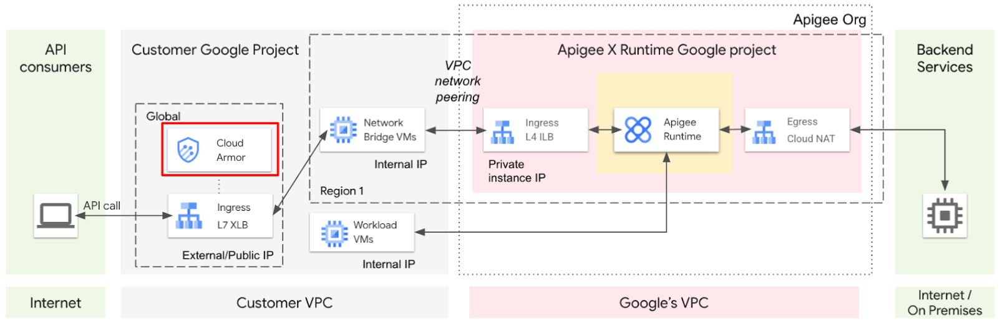

# Protecting APIs with Apigee X and Cloud Armor Lab

## Overview

In this lab, you will:

- Use **Apigee X threat protection policies** to protect APIs against content-based threats.
- Add **Cloud Armor** to a global external HTTPS load balancer to provide:
  - Distributed denial-of-service (DDoS) protection.
  - Mitigation of OWASP Top 10 risks.
  - IP-based and geo-based access control.

### Architecture


- **Incoming API calls** enter the **Customer project** through a **global external HTTPS load balancer**.
- The load balancer cannot forward calls directly to the tenant project. Instead:
  - Requests are forwarded to a **managed instance group of bridge VMs** in the customer project.
  - These bridge VMs are in a peered network connected to the **Apigee runtime instance**, allowing them to forward API calls to the runtime instance.
- **Cloud Armor security policies** are added to block specific traffic from reaching the runtime instance.

### Key Features

- **JSON and XML Attacks**:
  - Cloud Armor does not detect these attacks, but **Apigee** can.
  - Apigee's **JSONThreatProtection** and **XMLThreatProtection** policies detect malicious payloads without loading them into a parser.
- **Applicability**:
  - Instructions apply to both **paid** and **evaluation** Apigee organizations.

---

## Objectives

In this lab, you will learn how to:

1. Use **Apigee threat protection policies** to block malicious JSON and XML payloads.
2. Create a **Cloud Armor policy**.
3. Create **Cloud Armor rules** for blocking and allowing requests.
4. Apply a **Cloud Armor policy** to a load balancer.

---

## Lab Steps

1. **Set up the environment**:
   - Ensure the load balancer and managed instance group of bridge VMs are configured.
   - Verify network peering between the customer project and Apigee runtime instance.

2. **Configure Apigee Threat Protection**:
   - Use the **JSONThreatProtection** policy to block malformed JSON payloads.
   - Optionally, configure the **XMLThreatProtection** policy for XML-based threats.

3. **Create a Cloud Armor Policy**:
   - Define a new Cloud Armor policy in the Google Cloud Console.
   - Add rules to block specific IP addresses, geolocations, or request patterns.

4. **Apply Cloud Armor to the Load Balancer**:
   - Attach the Cloud Armor policy to the global external HTTPS load balancer.
   - Test the configuration by sending requests to the load balancer and verifying blocked traffic.

5. **Validate the Setup**:
   - Send test requests with malicious JSON payloads to ensure Apigee blocks them.
   - Verify that Cloud Armor blocks requests based on the defined rules.

## Key Takeaways

- Apigee X provides **content-based

# Task 1: Create JSON Threat Protection Shared Flow

## Overview

In this task, you will:

- Create a **shared flow** with a **JSONThreatProtection** policy.
- Use a **flow hook** to enable the shared flow for all Apigee APIs.

The **JSONThreatProtection** policy will reject incoming JSON requests that exceed specified limits. By placing the policy in a shared flow and attaching it with a flow hook, the policy can protect all requests for any proxy deployed in the environment.

---

## Steps

### 1. Create the Shared Flow

1. Open the **Apigee Console**.
2. Navigate to **Develop > Shared Flows**.
3. Click **Create**.
4. Name the shared flow `protect-json` and click **Create**.
5. If a **Switch to Classic** link appears, click it.
6. Click the **Develop** tab.
7. To add a policy, click **+Step**.
8. Select **JSON Threat Protection** and set the **Display Name** and **Name** to `JTP-Protect`.
9. Click **Add**.
10. Keep the default configuration for the policy.

- The policy executes only if the `Content-Type` header is set to `application/json`.

11. Click **Save**.
12. Click **Deploy to eval**, then click **Deploy**.

### 2. Attach the Shared Flow to a Flow Hook

1. Navigate to **Admin > Environments > Flow Hooks**.
2. Hover over the **Pre-proxy** row and click the **edit (pencil) icon**.
3. Select the `protect-json` shared flow and click **OK**.
4. The shared flow will now execute before any proxy in the `eval` environment.

---

# Task 2: Add a Cloud Armor Security Policy

## Overview

In this task, you will:

- Add a **Cloud Armor security policy** to protect your load balancer and control access to your APIs.
- Use Cloud Armor to block specific traffic before it reaches the Apigee runtime instance.



## Steps

### 1. Create a New Security Policy

1. In the **Cloud Console**, navigate to **Network Security > Cloud Armor policies**.
2. Click **Create Policy**.
3. For **Name**, specify `protect-apis`.
4. For **Default rule action**, select **Deny**.
5. For **Deny status**, select `403 (Forbidden)`.
6. Click **Next Step**.

### 2. Add a Rule to Allow Requests by Origin Country Code

1. Click **Add a Rule**.
2. Click **Advanced mode**.
3. For **Match**, specify:

   ```plaintext
   origin.region_code == 'US'
   ```

4. For **Action**, select **Allow**.
5. Set **Priority** to `1000`.
6. Click **Done**.

### 3. Add a Rule to Block SQL Injection Attacks

1. Click **Add a Rule**.
2. Click **Advanced mode**.
3. For **Match**, specify:

   ```plaintext
   evaluatePreconfiguredExpr('sqli-stable', ['owasp-crs-v030001-id942251-sqli', 'owasp-crs-v030001-id942420-sqli', 'owasp-crs-v030001-id942431-sqli', 'owasp-crs-v030001-id942460-sqli', 'owasp-crs-v030001-id942421-sqli', 'owasp-crs-v030001-id942432-sqli'])
   ```

4. Leave **Action** as **Deny** and **Deny status** as `403 (Forbidden)`.
5. Set **Priority** to `500`.
6. Click **Done**.

### 4. Attach the Policy to the Load Balancer

1. Next to `protect-apis`, click the **policy menu button** and select **Apply policy to target**.
2. For **Backend Service target 1**, select `apigee-proxy-backend`.
3. Click **Add**.
4. Verify that the policy is applied to 1 target.

---

# Task 3: Wait for Apigee Instance Provisioning to Complete

## Overview

In this task, you will wait for the Apigee evaluation org provisioning to complete. This process may take some time.

---

## Steps

### 1. Start Monitoring Script

1. In **Cloud Shell**, verify the `GOOGLE_CLOUD_PROJECT` variable contains your project name:

   ```bash
   echo ${GOOGLE_CLOUD_PROJECT}
   ```

2. If the variable is not set, set it manually:

   ```bash
   export GOOGLE_CLOUD_PROJECT={project}
   ```

3. Paste the following command into Cloud Shell to monitor the provisioning status:

   ```bash
   export INSTANCE_NAME=eval-instance; export ENV_NAME=eval; export PREV_INSTANCE_STATE=; echo "waiting for runtime instance ${INSTANCE_NAME} to be active"; while : ; do export INSTANCE_STATE=$(curl -s -H "Authorization: Bearer $(gcloud auth print-access-token)" -X GET "https://apigee.googleapis.com/v1/organizations/${GOOGLE_CLOUD_PROJECT}/instances/${INSTANCE_NAME}" | jq "select(.state != null) | .state" --raw-output); [[ "${INSTANCE_STATE}" == "${PREV_INSTANCE_STATE}" ]] || (echo; echo "INSTANCE_STATE=${INSTANCE_STATE}"); export PREV_INSTANCE_STATE=${INSTANCE_STATE}; [[ "${INSTANCE_STATE}" != "ACTIVE" ]] || break; echo -n "."; sleep 5; done; echo; echo "instance created, waiting for environment ${ENV_NAME} to be attached to instance"; while : ; do export ATTACHMENT_DONE=$(curl -s -H "Authorization: Bearer $(gcloud auth print-access-token)" -X GET "https://apigee.googleapis.com/v1/organizations/${GOOGLE_CLOUD_PROJECT}/instances/${INSTANCE_NAME}/attachments" | jq "select(.attachments != null) | .attachments[] | select(.environment == \"${ENV_NAME}\") | .environment" --join-output); [[ "${ATTACHMENT_DONE}" != "${ENV_NAME}" ]] || break; echo -n "."; sleep 5; done; echo; echo "${ENV_NAME} environment attached, waiting for hello-world to be deployed"; while : ; do export ATTACHMENT_DONE=$(curl -s -H "Authorization: Bearer $(gcloud auth print-access-token)" -X GET "https://apigee.googleapis.com/v1/organizations/${GOOGLE_CLOUD_PROJECT}/instances/${INSTANCE_NAME}/attachments" | jq "select(.attachments != null) | .attachments[] | select(.environment == \"${ENV_NAME}\") | .environment" --join-output); [[ "${ATTACHMENT_DONE}" != "${ENV_NAME}" ]] || break; echo -n "."; sleep 5; done; echo "***ORG IS READY TO USE***";
   ```

4. Wait until the text `***ORG IS READY TO USE***` is printed.

## Key Takeaways

- **Apigee Threat Protection**: Protects APIs from malicious JSON payloads.
- **Cloud Armor**: Provides DDoS protection, OWASP Top 10 mitigation, and access control.
- **Provisioning**: Ensure the Apigee instance is fully provisioned before proceeding.

## Next Steps

- Test the configuration by sending requests to the load balancer.
- Verify that the JSON threat protection and Cloud Armor rules are working as expected.

# Task 4: Test from an Allowed Region

## Overview

In this task, you will:

- Verify that the **Cloud Armor security policy** allows traffic from the allowed region (United States).
- Test the **JSON threat protection** policy to ensure it blocks malicious JSON payloads.

## Steps

### 1. Connect to the Test VM in the United States

1. In **Cloud Shell**, open an SSH connection to the test VM:

   ```bash
   TEST_VM_ZONE=$(gcloud compute instances list --filter="name=('apigeex-test-vm')" --format "value(zone)")
   gcloud compute ssh apigeex-test-vm --zone=${TEST_VM_ZONE} --force-key-file-overwrite
   ```

2. Authorize the connection if prompted.
3. Press **Enter** or **Return** for all default inputs.

### 2. Verify the Hello-World API Proxy is Accessible

1. Run the following command to wait for the `hello-world` proxy to become accessible:

   ```bash
   export PREV_STATUS_CODE=; echo "waiting for hello-world to be accessible"; while : ; do export STATUS_CODE=$(curl -k -s -o /dev/null -w "%{http_code}" --max-time 5 -X GET "https://eval.example.com/hello-world"); [[ "${STATUS_CODE}" == "${PREV_STATUS_CODE}" ]] || (echo; echo "STATUS_CODE=${STATUS_CODE}"); export PREV_STATUS_CODE=${STATUS_CODE}; [[ "${STATUS_CODE}" != "200" ]] || break; echo -n "."; sleep 5; done; echo; echo "***HELLO-WORLD IS ACCESSIBLE***";
   ```

2. When the output shows `***HELLO-WORLD IS ACCESSIBLE***`, the proxy is ready.

### 3. Call the Hello-World API Proxy

1. Use the following command to call the `hello-world` API:

   ```bash
   curl -i -k "https://eval.example.com/hello-world"
   ```

   - The `-i` option displays the response headers and status code.
   - The `-k` option skips TLS certificate verification (for testing purposes only).
2. The response should include:

   ```plaintext
   HTTP/2 200
   ...
   Hello, Guest!
   ```

### 4. Test JSON Threat Protection

1. Send a POST request with a malformed JSON payload:

   ```bash
   curl -i -k -X POST "https://eval.example.com/hello-world" -H "Content-Type: application/json" -d '{ "ThisIsAReallyLongElementNameIMeanReallyReallyReallyLong": 42 }'
   ```

2. The response should indicate a `500` error due to the JSON threat protection policy:

   ```plaintext
   HTTP/2 500
   ...
   {"fault":{"faultstring":"JSONThreatProtection[JTP-Protect]: Execution failed. reason: JSONThreatProtection[JTP-Protect]: Exceeded object entry name length at line 1","detail":{"errorcode":"steps.jsonthreatprotection.ExecutionFailed"}}}
   ```

### 5. Test SQL Injection Protection

1. Attempt to call the API with a SQL injection pattern:

   ```bash
   curl -i -k "https://eval.example.com/hello-world?item=name'%20OR%20'a'='a"
   ```

2. The response should be blocked by Cloud Armor with a `403 Forbidden` status:

   ```plaintext
   HTTP/2 403
   ...
   <!doctype html><meta charset="utf-8"><meta name=viewport content="width=device-width, initial-scale=1"><title>403</title>403 Forbidden
   ```

### 6. Exit the SSH Connection

1. Type `exit` to close the SSH connection to the VM.

---

# Task 5: Test the Security Policy from a Disallowed Region

## Overview

In this task, you will:

- Verify that the **Cloud Armor security policy** blocks traffic from a disallowed region (outside the United States).

---

## Steps

### 1. Connect to the Test VM Outside the United States

1. In **Cloud Shell**, open an SSH connection to the test VM:

   ```bash
   export SECOND_VM_NAME=apigeex-outside-us
   export SECOND_VM_ZONE=Secondary Zone
   gcloud compute ssh ${SECOND_VM_NAME} --zone=${SECOND_VM_ZONE} --force-key-file-overwrite
   ```

2. Authorize the connection if prompted.
3. Press **Enter** or **Return** for all default inputs.

### 2. Call the Hello-World API Proxy

1. Use the following command to call the `hello-world` API:

   ```bash
   curl -i -k "https://eval.example.com/hello-world"
   ```

2. The response should be blocked by Cloud Armor with a `403 Forbidden` status:

   ```plaintext
   HTTP/2 403
   ...
   <!doctype html><meta charset="utf-8"><meta name=viewport content="width=device-width, initial-scale=1"><title>403</title>403 Forbidden
   ```

### 3. Exit the SSH Connection

1. Type `exit` to close the SSH connection to the VM.

---

# Task 6: Explore Policy Monitoring for Cloud Armor

## Overview

In this task, you will:

- Check the **Cloud Armor policy dashboard** in **Cloud Monitoring** to view allowed and blocked requests.

---

## Steps

### 1. Navigate to the Cloud Armor Dashboard

1. In the **Cloud Console**, navigate to **Monitoring > Dashboards**.
2. Click **Network Security Policies**.

### 2. View Policy Metrics

1. In the **Policies** pane, click `protect-apis`.
2. The dashboard shows the rate of allowed and blocked requests for the `protect-apis` policy.

### 3. Enable Request Logging (Optional)

- To log individual request details, enable request logging for the load balancer.

---

## Key Takeaways

- **Cloud Armor** effectively blocks traffic from disallowed regions and malicious patterns.
- **JSON Threat Protection** ensures APIs are protected from malformed JSON payloads.
- **Cloud Monitoring** provides visibility into allowed and blocked requests.

---

## Next Steps

- Review the Cloud Armor dashboard for additional insights.
- Test additional security policies and rules as needed.
