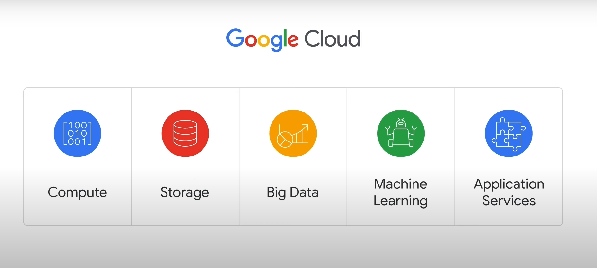

# Introducing Google Cloud

## Overview of Cloud Computing

### What is Cloud Computing?

- The term "cloud computing" was created by the US National Institute of Standards and Technology (NIST).
- Cloud computing is a way of using information technology (IT) with five key traits:
  1. **On-Demand Self-Service**: Users can access computing resources (processing power, storage, network) as needed through a web interface without human intervention.
  2. **Broad Network Access**: Resources are accessible over the internet from anywhere with a connection.
  3. **Resource Pooling**: Providers have a large pool of resources and allocate them to users, allowing for bulk purchasing and cost savings.
  4. **Elasticity**: Resources are flexible; users can scale up or down quickly based on their needs.
  5. **Measured Service**: Users pay only for what they use or reserve. If they stop using resources, they stop paying.

### Why is the Cloud Model Compelling Now?

- **Historical Context**:
  - **First Wave: Colocation**: Users rented physical space for financial efficiency instead of investing in data center real estate.
  - **Second Wave: Virtualized Data Centers**: Similar to private data centers and colocation facilities but with virtual devices (servers, CPUs, disks, load balancers, etc.). Enterprises maintain infrastructure but in a user-controlled and configured environment.
  - **Third Wave: Container-Based Architecture**: Google switched to this model for faster business operations. It involves automated, elastic cloud services and scalable data. Services automatically provision and configure the infrastructure for applications.

### Google Cloud's Vision

- Google Cloud offers third-wave cloud services to customers.
- Future companies will differentiate through technology, primarily software.
- High-quality data is essential for great software.
- Every company will eventually become a data company.

## Cloud Computing Models

### Infrastructure as a Service (IaaS)

- **Definition**: Delivers on-demand infrastructure resources via the cloud, such as raw compute, storage, and network capabilities, organized virtually into resources similar to physical data centers.
- **Example**: Compute Engine (Google Cloud IaaS service).
- **Payment Model**: Customers pay for the resources they allocate ahead of time.

### Platform as a Service (PaaS)

- **Definition**: Binds code to libraries that provide access to the infrastructure needed by applications, allowing more focus on application logic.
- **Example**: App Engine (Google Cloud PaaS service).
- **Payment Model**: Customers pay for the resources they actually use.

### Evolution of Cloud Computing

- **Managed Infrastructure and Services**:
  - Shift towards managed resources and services.
  - Allows companies to focus on business goals rather than maintaining technical infrastructure.
  - Enables quicker and more reliable delivery of products and services.

### Serverless Computing

- **Definition**: Allows developers to focus on code without managing server configuration, eliminating the need for infrastructure management.
- **Examples**:
  - **Cloud Functions**: Manages event-driven code as a pay-as-you-go service.
  - **Cloud Run**: Deploys containerized microservices-based applications in a fully-managed environment.

### Software as a Service (SaaS)

- **Definition**: Provides the entire application stack, delivering a cloud-based application that customers can access and use over the internet.
- **Examples**: Gmail, Docs, and Drive (part of Google Workspace).
- **Characteristics**: Applications are not installed on local computers but run in the cloud and are consumed directly by end users.

## Google Cloud Infrastructure

### Global Network

- **Overview**: Google Cloud runs on Google's own global network, the largest of its kind, built with billions of dollars of investment over many years.
- **Content Caching Nodes**: Over 100 nodes worldwide cache high-demand content for quicker access, ensuring applications respond from the location providing the quickest response time.

### Infrastructure Design

- **Redundant Cloud Regions**: Ensures high availability and durability.
- **High-Bandwidth Connectivity**: Utilizes subsea cables for global connectivity.
- **Geographic Locations**: Google Cloud infrastructure spans five major regions:
  - North America
  - South America
  - Europe
  - Asia
  - Australia

### Importance of Multiple Service Locations

- **Availability**: Ensures services are always available.
- **Durability**: Protects data integrity.
- **Latency**: Measures the time a packet of information takes to travel from its source to its destination.

### Regions and Zones

- **Regions**: Independent geographic areas composed of multiple zones.
  - Example: London (europe-west2) has three zones.
- **Zones**: Areas where Google Cloud resources are deployed.
  - Example: Virtual machines in Compute Engine run in specified zones for resource redundancy.

### Multi-Region Configurations

- **Definition**: Some services support placing resources in multiple regions.
- **Example**: Spanner multi-region configurations replicate data across multiple zones and regions for low-latency access.
  - Locations like The Netherlands and Belgium.

### Current Infrastructure

- **Statistics**: Google Cloud supports 121 zones in 40 regions (numbers are continually increasing).
- **Up-to-Date Information**: Available at Google Cloud Locations.

## Environmental Impact and Sustainability

### Energy Usage

- **Physical Infrastructure**: Google Cloud's network is built on physical infrastructure, including data centers that consume significant energy.
- **Global Energy Consumption**: Data centers use approximately 2% of the world's electricity.

### Efficiency and Environmental Goals

- **Google's Efforts**: Google aims to make data centers as efficient as possible to reduce environmental impact.
- **Customer Alignment**: Google Cloud helps customers meet their own environmental goals by running workloads efficiently.

### ISO 14001 Certification

- **Achievement**: Google's data centers were the first to achieve ISO 14001 certification.
- **Standard**: ISO 14001 maps out a framework for enhancing environmental performance through improved resource efficiency and waste reduction.

### Example: Hamina, Finland Data Center

- **Advanced Efficiency**: One of the most advanced and efficient data centers in Google's fleet.
- **Innovative Cooling System**: Uses sea water from the Bay of Finland to reduce energy use, a first-of-its-kind system.

### Carbon Neutral and Renewable Energy

- **Carbon Neutrality**: Google became the first major company to be carbon neutral in its founding decade.
- **100% Renewable Energy**: Achieved 100% renewable energy in its second decade.
- **Future Goal**: Aims to operate completely carbon-free by 2030.

## Security in Google Cloud

### Importance of Security

- **User Base**: Nine of Google’s services have over one billion users each, emphasizing the importance of security.
- **Design for Security**: Security is integrated throughout Google Cloud and Google services infrastructure.

### Security Infrastructure Layers

1. **Hardware Infrastructure Layer**:
   - **Hardware Design and Provenance**: Custom-designed server boards and networking equipment, including custom security chips.
   - **Secure Boot Stack**: Ensures correct software stack booting using cryptographic signatures over BIOS, bootloader, kernel, and base OS image.
   - **Premises Security**: Multiple layers of physical security in data centers, limited access to a small number of employees, and additional security in third-party data centers.

2. **Service Deployment Layer**:
   - **Encryption of Inter-Service Communication**: Cryptographic privacy and integrity for RPC data, automatic encryption of RPC traffic between data centers, and deployment of hardware cryptographic accelerators.

3. **User Identity Layer**:
   - **Central Identity Service**: Goes beyond username and password, using risk-based challenges and secondary factors like U2F devices.

4. **Storage Services Layer**:
   - **Encryption at Rest**: Encryption using centrally managed keys at the storage services layer, with hardware encryption support in hard drives and SSDs.

5. **Internet Communication Layer**:
   - **Google Front End (GFE)**: Ensures TLS connections with public-private key pairs and X.509 certificates, supports perfect forward secrecy, and applies DoS protections.
   - **Denial of Service (DoS) Protection**: Multi-tier, multi-layer protections to absorb and mitigate DoS attacks.

6. **Operational Security Layer**:
   - **Intrusion Detection**: Uses rules and machine intelligence for incident warnings, conducts Red Team exercises.
   - **Reducing Insider Risk**: Limits and monitors administrative access activities.
   - **Employee U2F Use**: Requires U2F-compatible Security Keys to guard against phishing.
   - **Stringent Software Development Practices**: Central source control, two-party code review, and libraries to prevent security bugs. Runs a Vulnerability Rewards Program.

### Additional Resources

- **Learn More**: Detailed information available at Google Cloud Security Design.

## Avoiding Vendor Lock-In

### Concerns About Vendor Lock-In

- **Fear of Lock-In**: Some organizations hesitate to move to the cloud due to concerns about being locked into a particular vendor.

### Google Cloud's Approach

- **Flexibility**: Google provides the ability for customers to run their applications elsewhere if needed.
- **Open Source Technologies**: Google publishes key elements of its technology using open source licenses to create ecosystems with alternatives to Google.

### Examples of Open Source and Interoperability

- **TensorFlow**: An open source software library for machine learning developed by Google, central to a strong open source ecosystem.
- **Kubernetes and Google Kubernetes Engine (GKE)**: Allow customers to mix and match microservices across different clouds.
- **Google Cloud Observability**: Enables monitoring of workloads across multiple cloud providers.

## Google Cloud Pricing Structure

### Per-Second Billing

- **First Major Provider**: Google was the first major cloud provider to offer per-second billing for its IaaS compute offering, Compute Engine.
- **Other Services**: Per-second billing is also available for:
  - Google Kubernetes Engine (GKE)
  - Dataproc (big data system Hadoop as a service)
  - App Engine flexible environment VMs (PaaS)

### Sustained-Use Discounts

- **Automatic Discounts**: Compute Engine offers discounts for running a VM instance for a significant portion of the billing month.
- **Details**: Discounts apply when an instance runs for more than 25% of a month, with incremental discounts for every additional minute.

### Custom Virtual Machine Types

- **Customization**: Allows fine-tuning of vCPU and memory for optimal pricing tailored to workloads.

### Pricing Calculator

- **Tool**: Estimate costs using the Google Cloud Pricing Calculator.

### Budgeting and Alerts

- **Defining Budgets**: Set budgets at the billing account or project level.
- **Fixed or Metric-Based**: Budgets can be fixed limits or tied to metrics (e.g., percentage of previous month’s spend).
- **Alerts**: Create alerts to notify when costs approach budget limits (e.g., 50%, 90%, 100%).

### Monitoring Expenditure

- **Reports Tool**: Visual tool in the Google Cloud Console to monitor expenditure based on projects or services.

### Quotas

- **Purpose**: Prevent over-consumption of resources due to errors or malicious attacks.
- **Types**:
  - **Rate Quotas**: Reset after a specific time (e.g., GKE API calls quota).
  - **Allocation Quotas**: Govern the number of resources in projects (e.g., VPC networks quota).
- **Adjustments**: Some quotas can be increased by requesting from Google Cloud Support.

