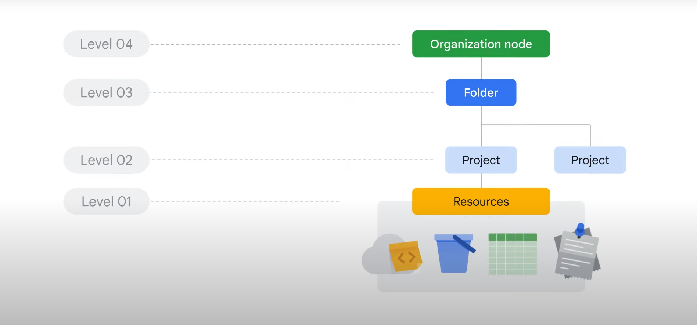
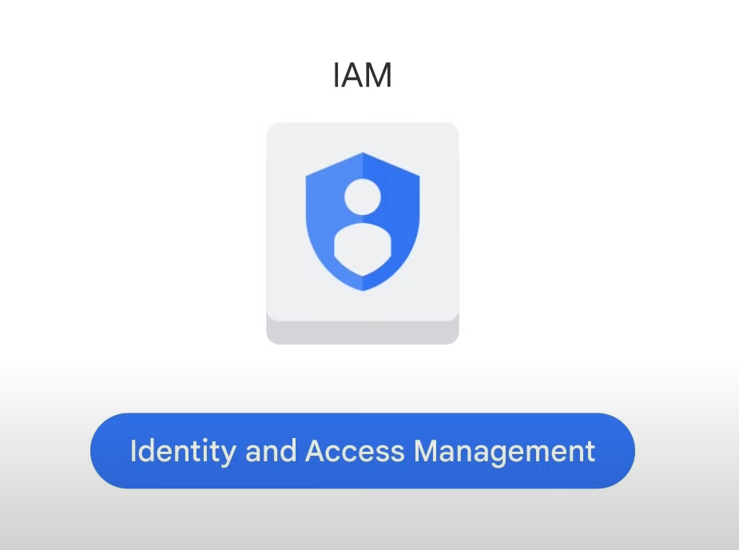
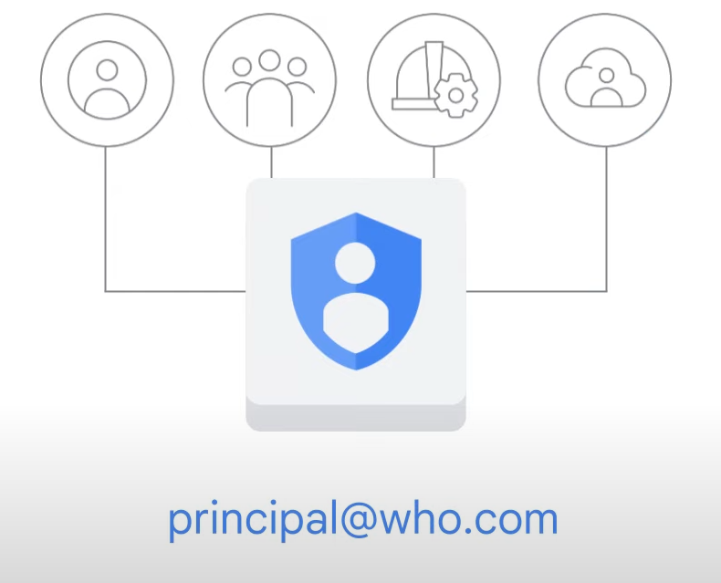
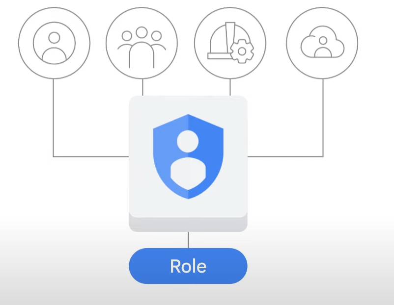
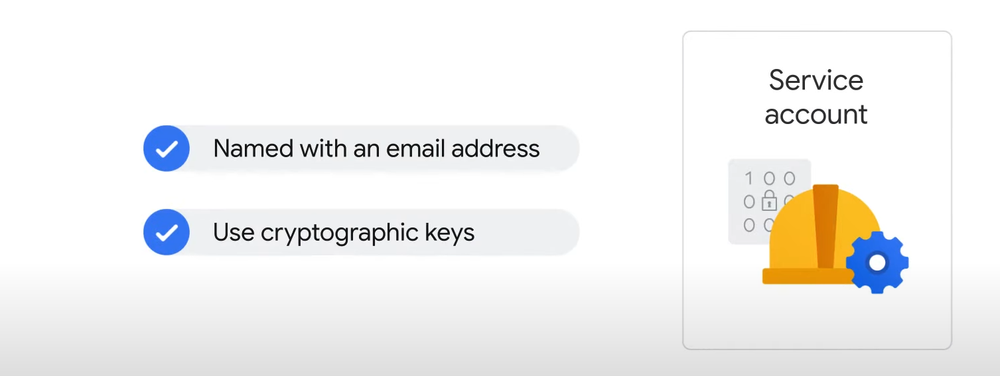
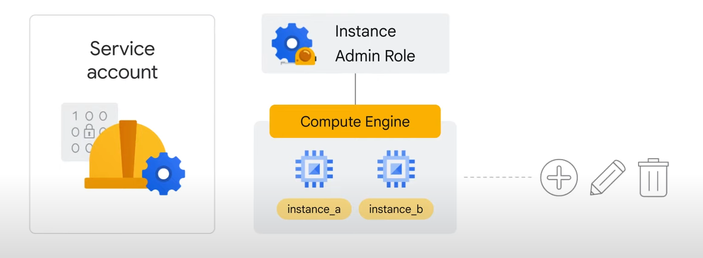
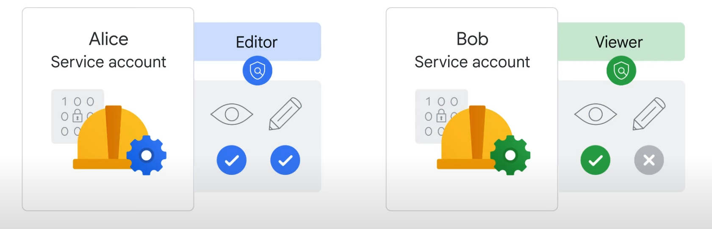
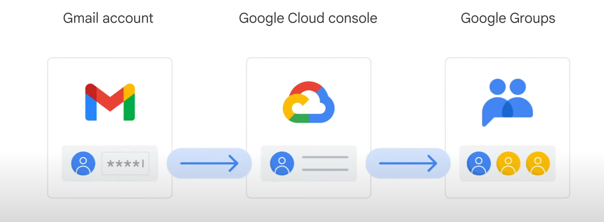
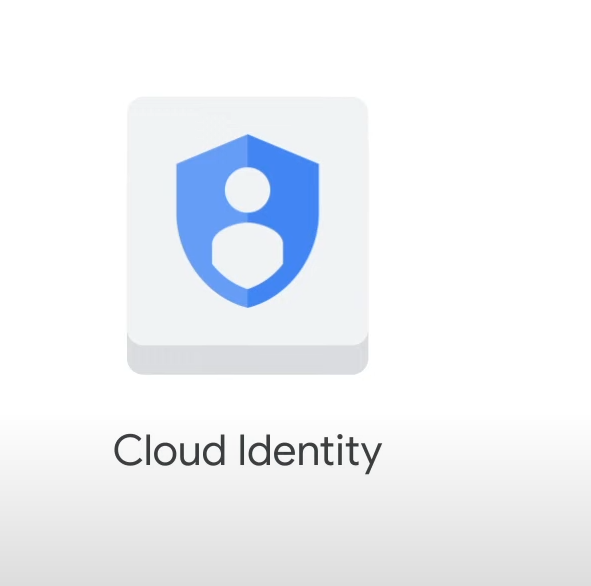
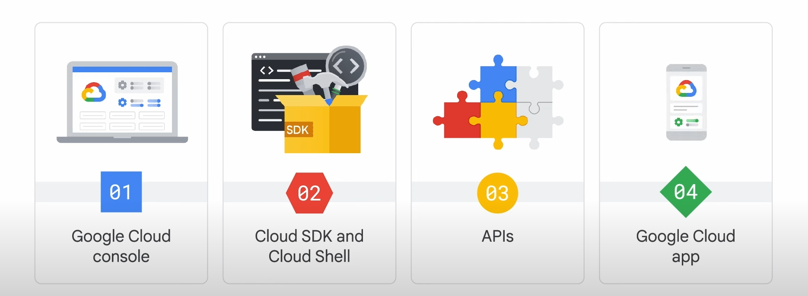

# Google Cloud Resource Hierarchy

## Levels of Resource Hierarchy

1. **Resources**:
   - Represent virtual machines, Cloud Storage buckets, BigQuery tables, etc.
2. **Projects**:
   - Organize resources and are the basis for enabling and using Google Cloud services.
3. **Folders**:
   - Can contain projects and other folders, allowing for hierarchical organization.
4. **Organization Node**:
   - The top level, encompassing all projects, folders, and resources in an organization.

### Policies and Management

- **Policy Application**: Policies can be defined at the project, folder, and organization node levels, and some services allow policies on individual resources.
- **Policy Inheritance**: Policies applied to a folder are inherited by all projects within that folder.

### Projects in Detail

- **Purpose**: Enable and use Google Cloud services, manage APIs, billing, collaborators, and other services.
- **Attributes**:
  - **Project ID**: Globally unique, immutable identifier assigned by Google.
  - **Project Name**: User-created, not unique, and can be changed.
  - **Project Number**: Unique number assigned by Google, used internally.
- **Resource Manager Tool**: API to manage projects programmatically (list, create, update, delete, recover).

### Folders

- **Function**: Assign policies to resources at a chosen granularity.
- **Inheritance**: Resources in a folder inherit policies and permissions from that folder.
- **Structure**: Can contain projects, other folders, or both.
- **Use Case**: Group resources by department or team, delegate administrative rights.

### Organization Node

- **Role**: Topmost resource in the hierarchy, encompassing all other resources.
- **Special Roles**:
  - **Organization Policy Administrator**: Controls who can change policies.
  - **Project Creator**: Controls who can create projects and spend money.
- **Creation**:
  - **Google Workspace Customers**: Projects automatically belong to the organization node.
  - **Non-Workspace Customers**: Use Cloud Identity to generate an organization node.
- **Functionality**: Allows creation of projects and billing accounts, and organization of folders and projects.

## Identity and Access Management (IAM)

### Purpose of IAM

- **Access Control**: Helps restrict who has access to what within an organization node containing multiple folders, projects, and resources.
- **Policy Application**: Administrators can apply policies defining who can do what on which resources.

### IAM Policy Components

- **Principal (Who)**: Can be a Google account, Google group, service account, or Cloud Identity domain. Each principal has an identifier, usually an email address.

- **Role (Can Do What)**: A collection of permissions. Granting a role to a principal grants all permissions within that role.

### Role Types

1. **Basic Roles**:
   - **Scope**: Broad, affecting all resources in a project.
   - **Roles**: Owner, Editor, Viewer, Billing Administrator.
   - **Details**:
     - **Project Viewer**: Access resources without making changes.
     - **Project Editor**: Access and make changes to resources.
     - **Project Owner**: Access, make changes, manage roles, and set up billing.
     - **Billing Administrator**: Control billing without changing resources.

2. **Predefined Roles**:
   - **Specificity**: Offered by specific Google Cloud services, defining where roles can be applied.
   - **Example**: Compute Engine's "instanceAdmin" role for managing virtual machines.

3. **Custom Roles**:
   - **Flexibility**: Define specific permissions tailored to job roles.
   - **Use Case**: Implement a "least-privilege" model, e.g., "instanceOperator" role to stop/start VMs without reconfiguring them.
   - **Management**: Requires managing permissions for custom roles.
   - **Application**: Can be applied at the project or organization level, not at the folder level.

### Policy Inheritance and Deny Rules

- **Inheritance**: Policies applied to an element in the resource hierarchy are inherited by all elements below it.
- **Deny Rules**: Prevent certain principals from using specific permissions, checked before allow policies.

## Service Accounts

### Purpose of Service Accounts

- **Use Case**: Assign permissions to a Compute Engine virtual machine (VM) rather than to a person.
- **Example**: An application running in a VM needs to store data in Cloud Storage without granting internet-wide access.

### Authentication and Access

- **Service Account Creation**: Authenticate a VM to Cloud Storage using a service account.
- **Naming**: Service accounts are named with an email address.
- **Access Method**: Use cryptographic keys instead of passwords to access resources.

### Roles and Permissions

- **Example Role**: If a service account is granted the Compute Engine’s Instance Admin role, it allows an application running in the VM to create, modify, and delete other VMs.

### Management of Service Accounts

- **Role Assignment**: Service accounts need to be managed like other resources.
  - **Example**: Alice can manage which Google accounts can act as service accounts, while Bob can view a list of service accounts.
- **IAM Policies**: Service accounts can have IAM policies attached to them.
  - **Example**: Alice can have the editor role on a service account, and Bob can have the viewer role.

## Managing Identities and Access

### Initial Setup with Google Cloud

- **Common Practice**: New customers often log in to the Google Cloud Console with a Gmail account and use Google Groups for collaboration.
- **Challenges**: This approach can lead to issues with centrally managing team identities, especially when someone leaves the organization.

### Cloud Identity

- **Purpose**: Allows organizations to define policies and manage users and groups using the Google Admin Console.
- **Integration**: Admins can manage Google Cloud resources using existing usernames and passwords from Active Directory or LDAP systems.
- **User Management**: Administrators can disable accounts and remove users from groups when they leave the organization.

### Editions of Cloud Identity

- **Free Edition**: Basic functionality for managing users and groups.
- **Premium Edition**: Additional capabilities for managing mobile devices.

### Google Workspace Integration

- **Availability**: Google Cloud customers who are also Google Workspace customers have this functionality available in the Google Admin Console.

## Accessing and Interacting with Google Cloud

### Methods of Access

1. **Google Cloud Console**:
   - **Description**: A graphical user interface (GUI) for deploying, scaling, and diagnosing production issues via a web-based interface.
   - **Features**:
     - Find and manage resources.
     - Check resource health.
     - Set budgets to control spending.
     - Search facility for quick resource location.
     - SSH access to instances via the browser.

2. **Cloud SDK and Cloud Shell**:
   - **Cloud SDK**:
     - A set of tools for managing resources and applications on Google Cloud.
     - Includes Google Cloud CLI and bq (BigQuery command-line tool).
     - Tools are located under the `bin` directory when installed.
   - **Cloud Shell**:
     - Provides command-line access to cloud resources from a browser.
     - Debian-based VM with a persistent 5 GB home directory.
     - Pre-installed, up-to-date, and fully authenticated Cloud SDK tools.

3. **APIs**:
   - **Description**: Google Cloud services offer APIs for programmatic control.
   - **Google APIs Explorer**: Tool in the Cloud Console to explore available APIs and their versions.
   - **Client Libraries**: Available in multiple languages (Java, Python, PHP, C#, Go, Node.js, Ruby, C++) to simplify API usage.

4. **Google Cloud App**:
   - **Functions**:
     - Start, stop, and SSH into Compute Engine instances.
     - View logs and manage Cloud SQL instances.
     - Administer App Engine applications (view errors, roll back deployments, change traffic splitting).
     - Monitor billing information and set alerts.
     - Create customizable graphs for key metrics (CPU usage, network usage, requests per second, server errors).
     - Alerts and incident management.
   - **Download**: Available at Google Cloud App.

## Google Cloud Fundamentals: Getting Started with Cloud Marketplace

### Overview

- **Objective**: Use Google Cloud Marketplace to deploy a LAMP stack on a Compute Engine instance.
- **Components**:
  - **Linux**: Operating system
  - **Apache HTTP Server**: Web server
  - **MySQL**: Relational database
  - **PHP**: Web application framework
  - **phpMyAdmin**: PHP administration tool

### Task 1: Sign in to the Google Cloud Console

1. **Start Lab**:
   - Click **Start Lab**.
   - If payment is required, select your payment method.
   - Use the temporary credentials provided for the lab.
2. **Open Google Cloud Console**:
   - Click **Open Google Cloud console**.
   - Sign in with the provided credentials.
   - Accept terms and conditions.
   - Do not add recovery options or two-factor authentication.
   - Do not sign up for free trials.
   - The Google Cloud Console will open.

### Task 2: Use Cloud Marketplace to Deploy a LAMP Stack

1. **Navigate to Marketplace**:
   - In the Google Cloud Console, click the **Navigation menu** and select **Marketplace**.
2. **Search and Select LAMP**:
   - Type **LAMP** in the search bar and press ENTER.
   - Select **Bitnami package for LAMP**.
3. **Deploy LAMP Stack**:
   - Click **GET STARTED**.
   - Agree to the terms and click **DEPLOY**.
   - Select the deployment zone (e.g., europe-west1-d).
   - Select **E2** as the Series and **e2-medium** as the Machine Type.
   - Click **Deploy**.
   - Wait for the deployment to complete.

### Task 3: Verify Your Deployment

1. **Access the Site**:
   - Click the **Site address** link to view your new site.
   - If the site is not responding, wait 30 seconds and try again.
   - Alternatively, click **Visit the site** in the Bitnami package section.
   - Confirm the Apache HTTP Server is running by checking the congratulations message.

### Ending the Lab

1. **End Lab**:
   - Click **End Lab** to remove resources and clean the account.
   - Provide feedback and rate the lab experience.

### Additional Information

- **Google Cloud App**: Manage Compute Engine instances, Cloud SQL instances, and App Engine applications.
- **Pricing Calculator**: Estimate costs at Google Cloud Pricing Calculator.

