# Virtual Machines and Networks in the Cloud

## Google Compute Engine and Virtual Networking

### Virtual Private Cloud (VPC)

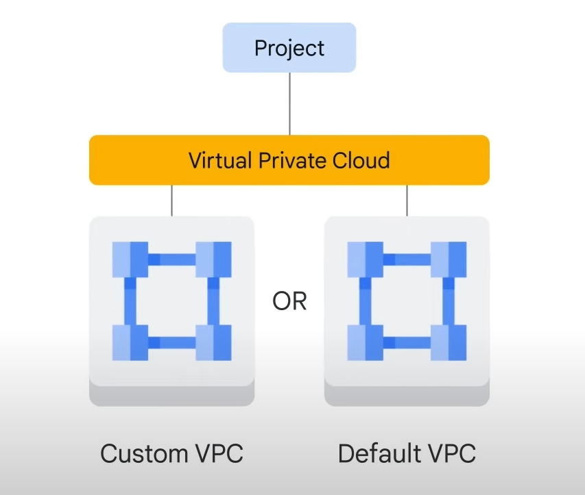

- **Definition**: A secure, individual, private cloud-computing model hosted within a public cloud.
- **Capabilities**: Run code, store data, host websites, and more, with the scalability and convenience of public cloud computing combined with the data isolation of private cloud computing.

### VPC Networks

- **Connectivity**: Connect Google Cloud resources to each other and to the internet.
- **Features**:
  - **Network Segmentation**: Segment networks for better organization and security.
  - **Firewall Rules**: Restrict access to instances.
  - **Static Routes**: Forward traffic to specific destinations.

### Global Scope of VPC Networks

- **Global Networks**: Google VPC networks are global and can have subnets in any Google Cloud region worldwide.
- **Subnets**: Segmented pieces of the larger network that can span zones within a region.
- **Resource Placement**: Resources can be in different zones on the same subnet.

### Subnet Management

- **Expanding Subnets**: Increase the range of IP addresses allocated to a subnet without affecting existing virtual machines.

### Example Scenario

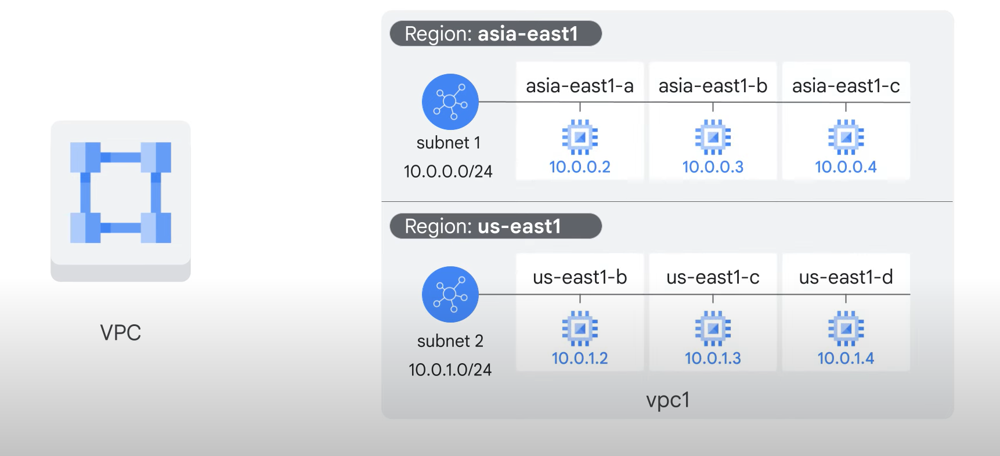

- **VPC Network Example**: A VPC network named `vpc1` with subnets in `asia-east1` and `us-east1` regions.
- **Compute Engine VMs**: Three VMs attached to the VPC, acting as neighbors on the same subnet despite being in different zones.
- **Resilience and Simplicity**: Build solutions that are resilient to disruptions while maintaining a simple network layout.

## Google Compute Engine

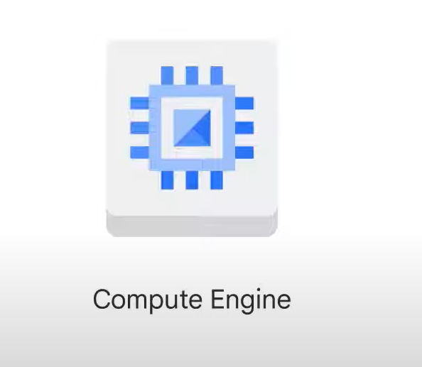

### Overview of Compute Engine

- **Purpose**: Create and run virtual machines (VMs) on Google infrastructure.
- **Benefits**: No upfront investments, scalable, fast, and consistent performance.

### Virtual Machine Configuration

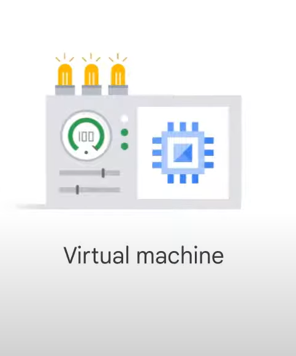

- **Customization**: Specify CPU power, memory, storage type, and operating system.
- **Creation Methods**: Google Cloud Console, Google Cloud CLI, Compute Engine API.
- **Operating Systems**: Run Linux, Windows Server, or customized OS images.

### Cloud Marketplace

- **Quick Start**: Offers solutions from Google and third-party vendors.
- **Configuration**: No need for manual configuration, but options can be modified before launch.
- **Cost**: Most packages are free beyond normal usage fees; some third-party images may have additional charges.

### Pricing and Billing

- **Billing**: Per-second billing with a one-minute minimum.
- **Sustained-Use Discounts**: Automatically applied for VMs running more than 25% of a month.
- **Committed-Use Discounts**: Up to 57% discount for committing to one or three-year usage terms.

### Preemptible and Spot VMs

- **Cost Savings**: Up to 90% savings for non-interactive workloads.
- **Preemptible VMs**: Can be terminated if resources are needed elsewhere, maximum runtime of 24 hours.
- **Spot VMs**: No maximum runtime, same pricing as preemptible VMs, but with more features.

### Storage and Custom Machine Types

- **High Throughput**: No extra cost for high throughput between processing and persistent disks.
- **Custom Machine Types**: Choose the number of virtual CPUs and memory, or create custom machine types.

## Compute Engine: Machine Types and Autoscaling

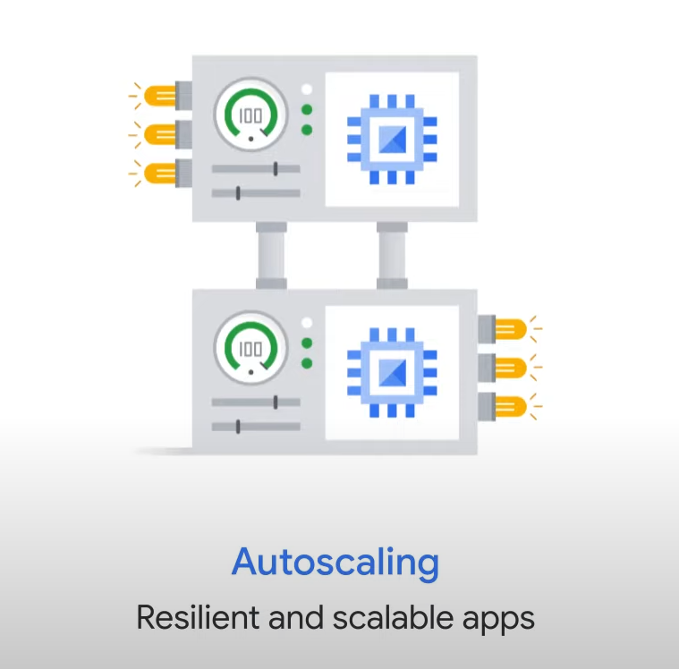

### Machine Types

- **Predefined Machine Types**: Choose from a set of predefined configurations for virtual CPUs and memory.
- **Custom Machine Types**: Create custom configurations tailored to specific needs.

### Autoscaling

- **Function**: Automatically add or remove VMs based on load metrics.
- **Purpose**: Ensure applications can handle varying levels of traffic efficiently.

### Load Balancing

- **VPC Support**: Google’s Virtual Private Cloud supports several types of load balancing to distribute incoming traffic among VMs.

### Scaling Strategies

- **Scaling Out**: Most customers start by adding more VMs to handle increased load.
- **Scaling Up**: Configure larger VMs for intensive workloads like in-memory databases and CPU-intensive analytics.

### VM Specifications

- **Machine Family**: The maximum number of CPUs per VM depends on its machine family and user quota, which is zone-dependent.
- **Reference**: Specifications for available VM machine types can be found at Google Cloud Machine Types.

## Virtual Private Cloud (VPC) Compatibility Features

### Routing Tables

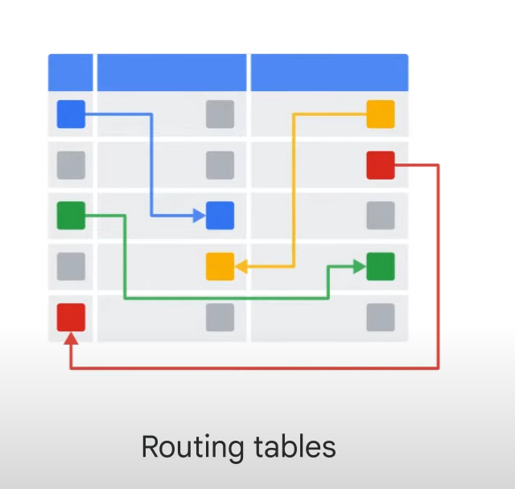

- **Built-In**: VPC routing tables are built-in, eliminating the need to provision or manage a router.
- **Function**: Forward traffic within the same network, across subnetworks, or between Google Cloud zones without requiring an external IP address.

### Firewalls

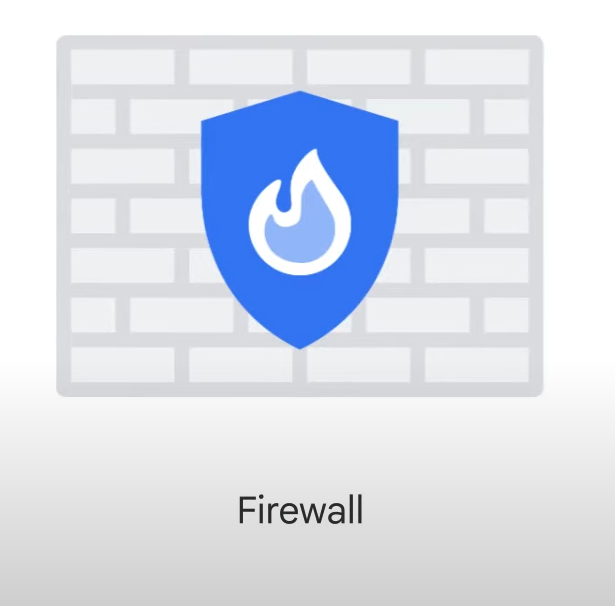

- **Global Distributed Firewall**: VPCs provide a global distributed firewall to control access to instances.

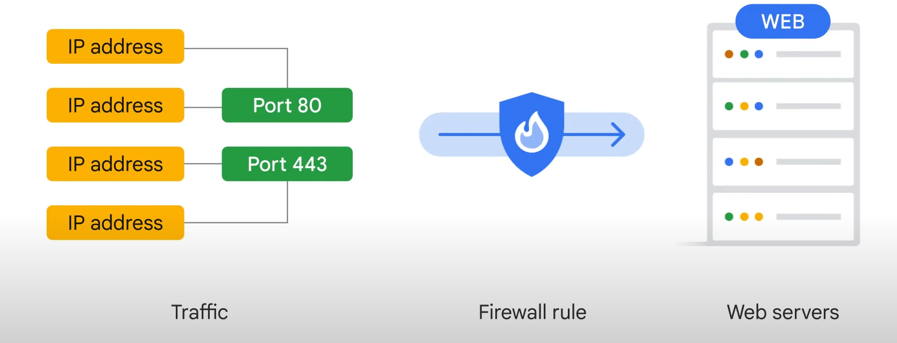

- **Firewall Rules**: Can be defined using network tags on Compute Engine instances.
  - **Example**: Tag web servers with "WEB" and create a rule to allow traffic on ports 80 or 443 to all VMs with the "WEB" tag.

### VPC Peering

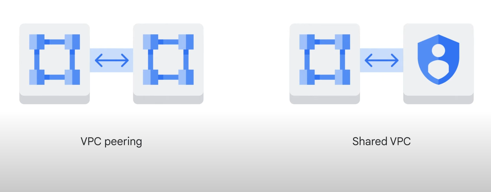

- **Purpose**: Establish a relationship between two VPCs to exchange traffic.
- **Use Case**: Useful for companies with multiple Google Cloud projects needing VPCs to communicate.

### Shared VPC

- **Purpose**: Use Identity Access Management (IAM) to control interactions between projects.
- **Function**: Configure a Shared VPC to allow resources in one project to interact with a VPC in another project.

## Cloud Load Balancing

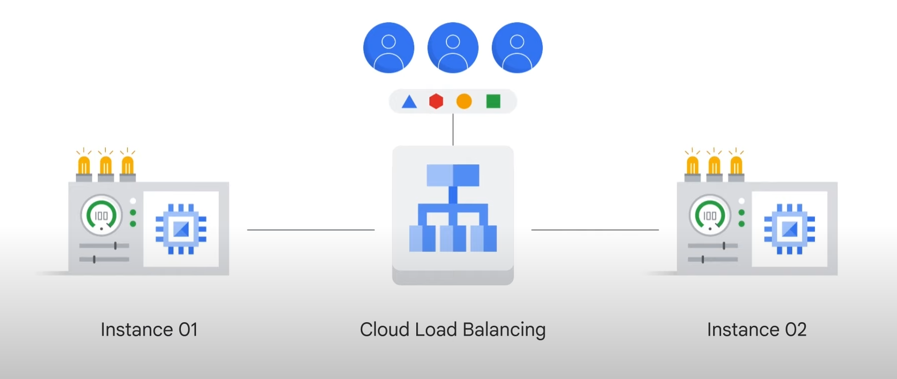

### Purpose of Cloud Load Balancing

- **Function**: Distribute user traffic across multiple instances of an application to reduce performance issues.
- **Managed Service**: Fully distributed, software-defined, and managed service for all traffic types.

### Features of Cloud Load Balancing

- **Traffic Types**: Supports HTTP/HTTPS, TCP, SSL, and UDP traffic.
- **Cross-Region Load Balancing**: Includes automatic multi-region failover to handle unhealthy backends.
- **No Pre-Warming Required**: Automatically handles spikes in demand without needing pre-warming.

### Load Balancing Options

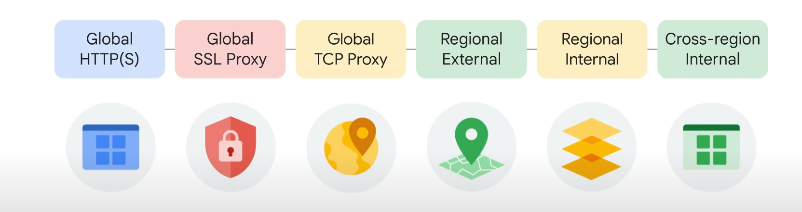

1. **Global HTTP(S) Load Balancing**: For cross-regional load balancing of web applications.
2. **Global SSL Proxy Load Balancer**: For SSL traffic that is not HTTP.
3. **Global TCP Proxy Load Balancer**: For other TCP traffic that doesn’t use SSL.
4. **Regional External Passthrough Network Load Balancer**: For UDP traffic or traffic on any port number within a region.
5. **Regional External Application Load Balancer**: For application-level load balancing within a region.
6. **Regional External Proxy Network Load Balancer**: For proxy network load balancing within a region.

### Internal Load Balancing

- **Regional Internal Load Balancer**: For load balancing traffic inside a project, such as between the presentation layer and business layer of an application.
  - Supports Proxy Network Load Balancer, Passthrough Network Load Balancer, and Application Load Balancer.
  - Accepts traffic on a Google Cloud internal IP address and balances it across Compute Engine VMs.
- **Cross-Region Internal Load Balancer**: A Layer 7 load balancer for globally distributed backend services, ensuring traffic is directed to the closest backend.

Here's the next section of your notes on cloud computing for the Google Associate Cloud Engineer exam:

## DNS and Content Delivery in Google Cloud

### Cloud DNS

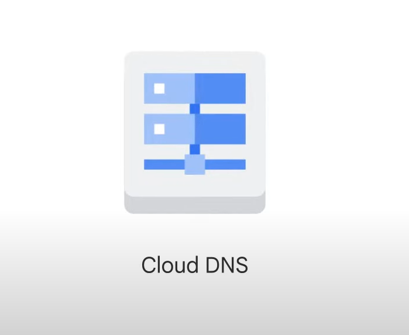

- **Public DNS Service**: Google offers 8.8.8.8 as a public DNS service.

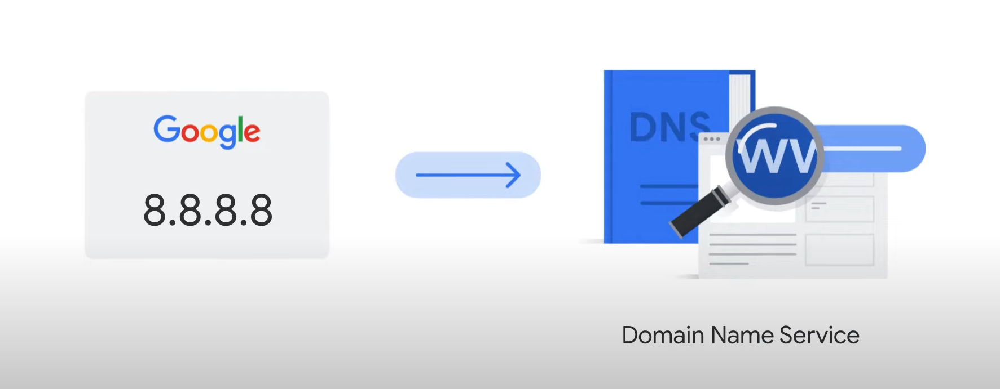

- **Managed DNS Service**: Cloud DNS helps manage the internet hostnames and addresses of applications built in Google Cloud.
- **Features**:
  - Runs on the same infrastructure as Google.
  - Low latency and high availability.
  - Cost-effective for making applications and services available to users.
  - DNS information is served from redundant locations worldwide.
  - Programmable via Cloud Console, command-line interface, or API.

### Edge Caching and Cloud CDN

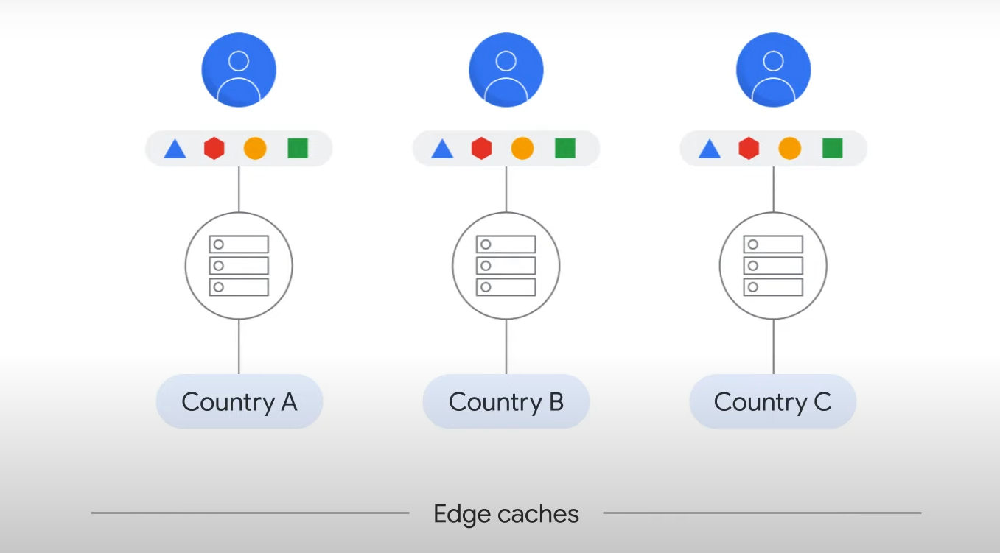

- **Edge Caching**: Uses caching servers to store content closer to end users, reducing latency.

- **Cloud CDN (Content Delivery Network)**:

  - Accelerates content delivery.
  - Reduces load on content origins.
  - Can save money.
  - Enabled with a single checkbox after setting up HTTP(S) Load Balancing.
- **CDN Interconnect Partner Program**: Supports integration with other CDNs.

## Connecting Google VPC to Other Networks

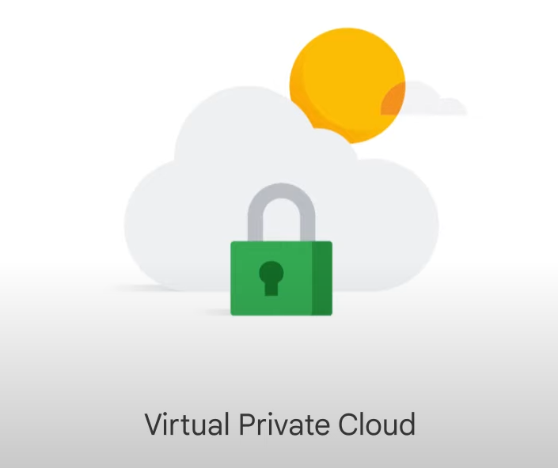

### Options for Connecting Networks

1. **Cloud VPN**

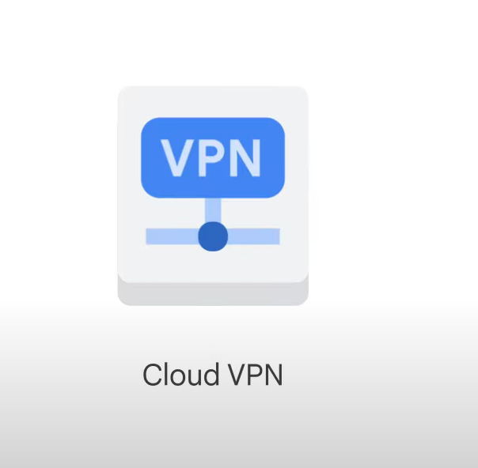

- **Description**: Creates a “tunnel” connection over the internet.
- **Dynamic Routing**: Use Cloud Router to exchange route information using the Border Gateway Protocol (BGP).
- **Benefit**: Automatically updates routes when new subnets are added to the Google VPC.

2. **Direct Peering**

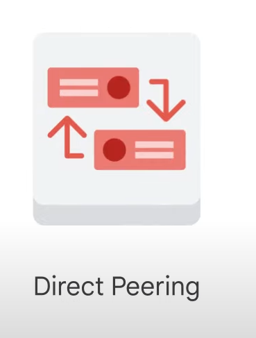

- **Description**: Place a router in the same public data center as a Google point of presence to exchange traffic.
- **Points of Presence**: Over 100 locations worldwide.

- **Carrier Peering**

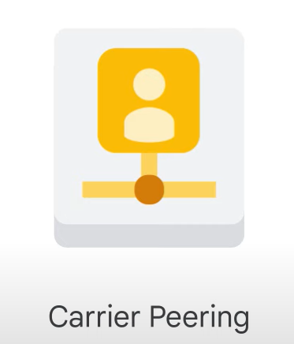

- Connect through a service provider's network to Google Workspace and Google Cloud products.
- **Limitation**: Not covered by a Google Service Level Agreement (SLA).

3. **Dedicated Interconnect**

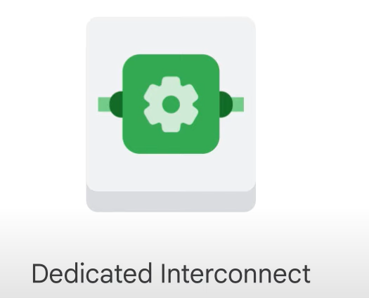

- **Description**: Provides one or more direct, private connections to Google.
- **SLA**: Up to 99.99% uptime if connections meet Google’s specifications.
- **Backup**: Can be backed up by a VPN for greater reliability.

4. **Partner Interconnect**

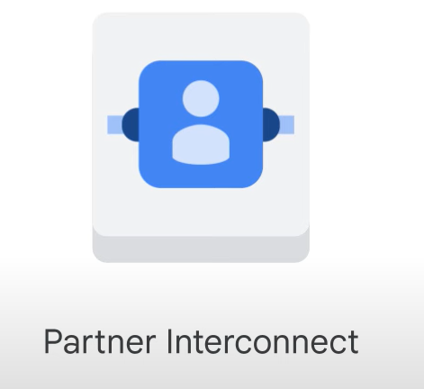

- **Description**: Connectivity between an on-premises network and a VPC network through a supported service provider.
- **Use Case**: Ideal for data centers that can't reach a Dedicated Interconnect facility or don't need a full 10 Gbps connection.
- **SLA**: Up to 99.99% uptime if connections meet Google’s specifications.
- **Limitation**: Google is not responsible for third-party service provider issues.

5. **Cross-Cloud Interconnect**

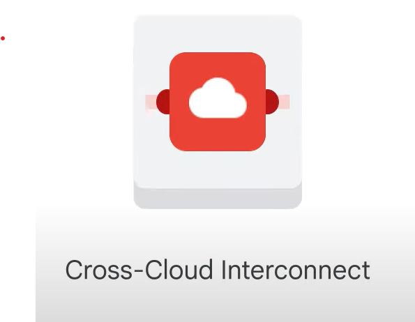

- **Description**: Establishes high-bandwidth dedicated connectivity between Google Cloud and another cloud service provider.
- **Physical Connection**: Google provisions a dedicated connection between the Google network and another cloud provider.
- **Multicloud Strategy**: Supports integrated multicloud strategies with reduced complexity, site-to-site data transfer, and encryption.
- **Connection Sizes**: Available in 10 Gbps or 100 Gbps.

# Getting Started with VPC Networking and Google Compute Engine

### Task 1: Explore the Default Network

#### View the Subnets

1. **Navigate to VPC Networks**:
   - In the Cloud Console, click **VPC network > VPC networks**.
   - Click **default**.
   - Click **Subnets**.
   - Observe the subnets associated with each Google Cloud region, each with a private RFC 1918 CIDR block for internal IP addresses.

#### View the Routes

1. **Navigate to Routes**:
   - In the left pane, click **Routes**.
   - In **Effective Routes**, select **Network** and choose **default**.
   - Select the **Lab Region** assigned by Qwiklabs.
   - Click **View**.
   - Notice the routes for each subnet, managed by default but customizable for specific destinations.

#### View the Firewall Rules

1. **Navigate to Firewall**:
   - In the left pane, click **Firewall**.
   - Observe the four ingress firewall rules for the default network:
     - `default-allow-icmp`
     - `default-allow-rdp`
     - `default-allow-ssh`
     - `default-allow-internal`
   - These rules allow ICMP, RDP, and SSH ingress traffic from anywhere and all TCP, UDP, and ICMP traffic within the network.

#### Delete the Firewall Rules

1. **Delete Rules**:
   - Select all default network firewall rules.
   - Click **Delete** and confirm.

#### Delete the Default Network

1. **Delete Network**:
   - In the Cloud Console, click **VPC network > VPC networks**.
   - Select the **default** network.
   - Click **Delete VPC network** and confirm.
   - Verify that there are no routes or firewall rules left.

#### Try to Create a VM Instance

1. **Attempt VM Creation**:
   - Navigate to **Compute Engine > VM instances**.
   - Click **Create instance** and accept default values.
   - Notice the error due to the absence of a VPC network.

### Task 2: Create a VPC Network and VM Instances

#### Create an Auto Mode VPC Network with Firewall Rules

1. **Create Network**:
   - Navigate to **VPC network > VPC networks**.
   - Click **Create VPC network**.
   - Name the network `mynetwork`.
   - Set **Subnet creation mode** to **Automatic**.
   - Select all available firewall rules.
   - Click **Create**.
   - Verify that subnets are created for each region.

#### Create a VM Instance in Region 1

1. **Create VM**:
   - Navigate to **Compute Engine > VM instances**.
   - Click **Create instance**.
   - Set the following properties:
     - **Name**: `mynet-us-vm`
     - **Region**: Region 1
     - **Zone**: Zone 1
     - **Series**: E2
     - **Machine type**: e2-micro (2 vCPU, 1 GB memory)
   - Click **Create**.

#### Create a VM Instance in Region 2

1. **Create VM**:
   - Click **Create instance**.
   - Set the following properties:
     - **Name**: `mynet-r2-vm`
     - **Region**: Region 2
     - **Zone**: Zone 2
     - **Series**: E2
     - **Machine type**: e2-micro (2 vCPU, 1 GB memory)
   - Click **Create**.

#### Note on External IP Addresses

- **Ephemeral IPs**: External IP addresses for VM instances are ephemeral and may change if the instance is stopped.
- **Static IPs**: Reserve a static external IP address to keep it indefinitely until explicitly released.

Here's the final section of your notes on cloud computing for the Google Associate Cloud Engineer exam:

### Task 3: Explore the Connectivity for VM Instances

#### Verify Connectivity for the VM Instances

1. **SSH to VM Instances**:
   - Navigate to **Compute Engine > VM instances**.
   - Note the external and internal IP addresses for `mynet-r2-vm`.
   - Click **SSH** for `mynet-us-vm` to launch a terminal and connect.
   - Authorize if prompted.

2. **Ping Internal and External IPs**:
   - **Internal IP**: `ping -c 3 <mynet-r2-vm-internal-IP>`
   - **External IP**: `ping -c 3 <mynet-r2-vm-external-IP>`

#### Remove the Allow-ICMP Firewall Rule

1. **Delete Rule**:
   - Navigate to **VPC network > Firewall**.
   - Select `mynetwork-allow-icmp` and click **Delete**.
   - Confirm deletion.

2. **Test Connectivity**:
   - **Internal IP**: `ping -c 3 <mynet-r2-vm-internal-IP>` (should work due to `allow-custom` rule).
   - **External IP**: `ping -c 3 <mynet-r2-vm-external-IP>` (should fail due to deleted `allow-icmp` rule).

#### Remove the Allow-Custom Firewall Rule

1. **Delete Rule**:
   - Navigate to **VPC network > Firewall**.
   - Select `mynetwork-allow-custom` and click **Delete**.
   - Confirm deletion.

2. **Test Connectivity**:
   - **Internal IP**: `ping -c 3 <mynet-r2-vm-internal-IP>` (should fail due to deleted `allow-custom` rule).

3. **Close SSH Terminal**:
   - `exit`

#### Remove the Allow-SSH Firewall Rule

1. **Delete Rule**:
   - Navigate to **VPC network > Firewall**.
   - Select `mynetwork-allow-ssh` and click **Delete**.
   - Confirm deletion.

2. **Test SSH Connectivity**:
   - Navigate to **Compute Engine > VM instances**.
   - Click **SSH** for `mynet-us-vm` (should fail due to deleted `allow-ssh` rule).

### Task 4: Review

- **Explored Default Network**: Subnets, routes, and firewall rules.
- **Deleted Default Network**: Verified inability to create VM instances without a VPC network.
- **Created New VPC Network**: Auto mode with subnets, routes, firewall rules, and two VM instances.
- **Tested Connectivity**: Verified effects of firewall rules on connectivity.
