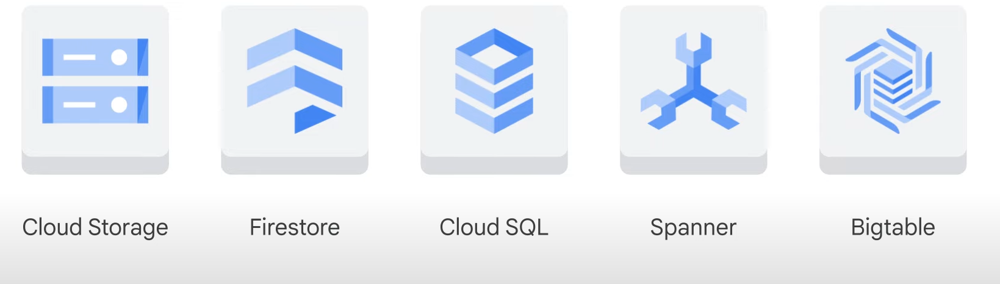
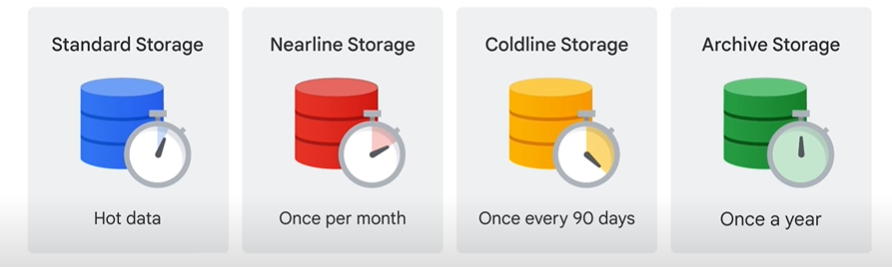
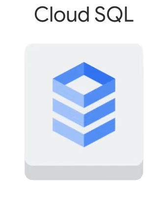
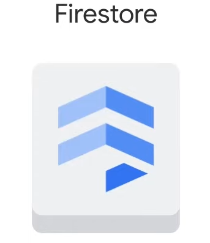
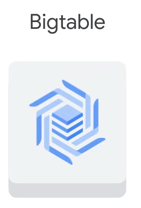

# Storage in the Cloud

## Overview

- **Purpose**: Every application needs to store data, whether it's media to be streamed or sensor data from devices.
- **Storage Needs**: Different applications and workloads require different storage database solutions.

### Google Cloud Storage Options

- **Structured Data**: Organized in a predefined manner, often in tables.
- **Unstructured Data**: Data that doesn't have a predefined data model or isn't organized in a predefined manner.
- **Transactional Data**: Data that is generated from transactions, often requiring ACID (Atomicity, Consistency, Isolation, Durability) properties.
- **Relational Data**: Data that is stored in a relational database, organized in tables with rows and columns.

### Core Storage Products



1. **Cloud Storage**:
   - **Description**: Object storage for storing and accessing any amount of data.
   - **Use Cases**: Media files, backups, and data archives.

2. **Cloud SQL**:
   - **Description**: Managed relational database service for MySQL, PostgreSQL, and SQL Server.
   - **Use Cases**: Web frameworks, structured data storage, and transactional applications.

3. **Spanner**:
   - **Description**: Globally distributed, horizontally scalable, strongly consistent database service.
   - **Use Cases**: Mission-critical applications requiring high availability and consistency.

4. **Firestore**:
   - **Description**: NoSQL document database built for automatic scaling, high performance, and ease of application development.
   - **Use Cases**: Mobile, web, and server applications requiring real-time updates.

5. **Bigtable**:
   - **Description**: Fully managed, scalable NoSQL database service for large analytical and operational workloads.
   - **Use Cases**: IoT, finance, adtech, and other applications requiring low-latency data access.

### Choosing the Right Storage Solution

- **Application Requirements**: Depending on your application, you might use one or several of these services to meet your storage needs.

## Cloud Storage


- **Service**: Durable and highly available object storage for developers and IT organizations.
- **Object Storage**: Manages data as objects, not as file hierarchies or disk blocks.

### Object Storage

- **Data Format**: Objects contain the binary data, metadata (e.g., date created, author, permissions), and a globally unique identifier.
- **Interaction**: Uses URLs, making it compatible with web technologies.
- **Common Data Types**: Video, pictures, audio recordings.

### Features of Cloud Storage

- **Scalability**: Store any amount of data and retrieve it as needed.
- **Use Cases**: Serving website content, archival and disaster recovery, distributing large data objects via Direct Download.
- **Primary Use**: Binary large-object storage (BLOB) for online content, backups, archives, and intermediate processing results.

### Buckets

- **Organization**: Files are organized into buckets.
- **Naming**: Buckets need a globally unique name and a specific geographic location.
- **Location**: Choose a location to minimize latency (e.g., a specific Google Cloud region or multi-region).

### Immutability and Versioning

- **Immutability**: Storage objects are immutable; new versions are created with each change.
- **Versioning**: Option to enable versioning to keep a detailed history of modifications.
  - **Without Versioning**: New versions overwrite older versions.
  - **With Versioning**: List archived versions, restore to older states, or permanently delete versions.

### Access Control

- **Security**: Essential for maintaining security and privacy, especially with personally identifiable information.
- **IAM Roles**: Control access using IAM roles, inherited from project to bucket to object.
- **Access Control Lists (ACLs)**: For finer control, define scopes (who can access) and permissions (what actions can be performed).

### Lifecycle Management Policies

- **Cost Management**: Policies to manage storage costs by deleting or archiving objects based on criteria.
  - **Examples**: Delete objects older than 365 days, delete objects created before a specific date, keep only the most recent versions.

### Storage Classes



1. **Standard Storage**:
   - **Best For**: Frequently accessed ("hot") data and data stored for brief periods.
2. **Nearline Storage**:
   - **Best For**: Infrequently accessed data (e.g., once a month or less).
   - **Examples**: Data backups, long-tail multimedia content, data archiving.
3. **Coldline Storage**:
   - **Best For**: Infrequently accessed data (e.g., once every 90 days).
   - **Examples**: Long-term storage with lower access frequency.
4. **Archive Storage**:
   - **Best For**: Data archiving, online backup, disaster recovery.
   - **Access Frequency**: Less than once a year.
   - **Cost**: Lowest cost, higher access and operation costs, 365-day minimum storage duration.

### Common Characteristics

- **Unlimited Storage**: No minimum object size requirement.
- **Worldwide Accessibility**: Available in multiple locations.
- **Low Latency and High Durability**: Ensures quick access and data integrity.
- **Uniform Experience**: Consistent security, tools, and APIs across all classes.
- **Geo-Redundancy**: Data stored in multi-region or dual-region for disaster protection and load balancing.

### Autoclass Feature

- **Function**: Automatically transitions objects to appropriate storage classes based on access patterns.
- **Benefit**: Reduces storage costs and optimizes future accesses.

### Cost and Security

- **No Minimum Fee**: Pay only for what you use, no prior capacity provisioning needed.
- **Encryption**: Data is encrypted on the server side before being written to disk. Data in transit is encrypted using HTTPS/TLS.

### Data Transfer Methods

1. **Online Transfer**:
   - **gcloud storage**: Command from the Cloud SDK.
   - **Drag and Drop**: Option in the Cloud Console (Google Chrome browser).
2. **Storage Transfer Service**:
   - **Function**: Import large amounts of online data quickly and cost-effectively.
   - **Sources**: Other cloud providers, different Cloud Storage regions, HTTP(S) endpoints.
3. **Transfer Appliance**:
   - **Description**: Rackable, high-capacity storage server leased from Google Cloud.
   - **Capacity**: Transfer up to a petabyte of data on a single appliance.

### Integration with Other Google Cloud Services

- **BigQuery and Cloud SQL**: Import and export tables.
- **App Engine**: Store logs, backups, and objects.
- **Compute Engine**: Store instance startup scripts, images, and application objects.

## Cloud SQL



- **Service**: Fully managed relational databases, including MySQL, PostgreSQL, and SQL Server as a service.
- **Purpose**: Offload mundane tasks to Google, such as applying patches, managing backups, and configuring replications.

### Features

- **No Maintenance**: No software installation or maintenance required.
- **Scalability**:
  - Up to 128 processor cores.
  - Up to 864 GB of RAM.
  - Up to 64 TB of storage.
- **Automatic Replication**: Supports replication from Cloud SQL primary instances, external primary instances, and external MySQL instances.
- **Managed Backups**: Securely stored and accessible backups, with the cost covering seven backups.
- **Encryption**: Data is encrypted on Google’s internal networks and when stored in database tables, temporary files, and backups.
- **Network Firewall**: Controls network access to each database instance.

### Integration

- **Google Cloud Services**: Accessible by other Google Cloud services and external services.
- **App Engine**: Use standard drivers like Connector/J for Java or MySQLdb for Python.
- **Compute Engine**: Authorize instances to access Cloud SQL and configure them in the same zone as your VM.
- **External Applications**: Supports tools like SQL Workbench, Toad, and other applications using standard MySQL drivers.

## Spanner


- **Service**: Fully managed relational database service that scales horizontally, is strongly consistent, and supports SQL.
- **Reliability**: Battle-tested by Google’s mission-critical applications and services.

### Features

- **Scalability**: Horizontally scalable to handle large-scale applications.
- **Consistency**: Strong global consistency.
- **SQL Support**: Supports SQL with joins and secondary indexes.
- **High Availability**: Built-in high availability.
- **Performance**: Handles high numbers of input and output operations per second (tens of thousands of reads and writes per second or more).

### Use Cases

- **Applications Requiring**:
  - SQL relational database management system.
  - High availability and strong consistency.
  - High throughput for reads and writes.

## Firestore



### Overview

- **Firestore**: A flexible, horizontally scalable, NoSQL cloud database for mobile, web, and server development.

### Data Storage

- **Documents and Collections**: Data is stored in documents, which are organized into collections.
  - **Documents**: Can contain complex nested objects and subcollections.
  - **Key-Value Pairs**: Each document contains a set of key-value pairs (e.g., a user document with keys for `firstname` and `lastname`).

### Queries

- **NoSQL Queries**: Used to retrieve individual documents or all documents in a collection that match query parameters.
  - **Chained Filters**: Queries can include multiple, chained filters and combine filtering and sorting options.
  - **Indexed by Default**: Query performance is proportional to the size of the result set, not the dataset.

### Data Synchronization

- **Real-Time Updates**: Firestore uses data synchronization to update data on any connected device.
- **Offline Support**: Caches data that an app is actively using, allowing read, write, listen, and query operations even if the device is offline.
  - **Synchronization**: When the device comes back online, Firestore synchronizes any local changes back to the cloud.

### Infrastructure

- **Google Cloud Integration**: Leverages Google Cloud’s powerful infrastructure.
  - **Multi-Region Data Replication**: Automatic replication across multiple regions.
  - **Strong Consistency Guarantees**: Ensures data consistency.
  - **Atomic Batch Operations**: Supports atomic operations.
  - **Real Transaction Support**: Provides real transaction capabilities.

## Bigtable



### Overview

- **Bigtable**: Google's NoSQL big data database service.
  - Powers many core Google services, including Search, Analytics, Maps, and Gmail.

### Key Features

- **Massive Workloads**: Designed to handle massive workloads with consistent low latency and high throughput.
- **Operational and Analytical Applications**: Ideal for Internet of Things (IoT), user analytics, and financial data analysis.

### Use Cases

- **When to Choose Bigtable**:
  - Working with more than 1TB of semi-structured or structured data.
  - Data requires high throughput or is rapidly changing.
  - Working with NoSQL data, where strong relational semantics are not required.
  - Data is a time-series or has natural semantic ordering.
  - Running big data applications, asynchronous batch, or synchronous real-time processing.
  - Running machine learning algorithms on the data.

### Integration and Interaction

- **Google Cloud Services and Third-Party Clients**:
  - **APIs**: Data can be read from and written to Bigtable through a data service layer like Managed VMs, the HBase REST Server, or a Java Server using the HBase client.
  - **Applications and Dashboards**: Typically used to serve data to applications, dashboards, and data services.

### Data Processing

- **Streaming**: Data can be streamed in through frameworks like Dataflow Streaming, Spark Streaming, and Storm.
- **Batch Processing**: If streaming is not an option, data can be read from and written to Bigtable through batch processes like Hadoop MapReduce, Dataflow, or Spark.
  - Summarized or newly calculated data is often written back to Bigtable or to a downstream database.

## Comparison of Google Cloud Storage Options


### Cloud Storage

- **Use Case**: Storing immutable blobs larger than 10 megabytes (e.g., large images, movies).
- **Capacity**: Petabytes of capacity with a maximum unit size of 5 terabytes per object.

### Cloud SQL and Spanner

- **Use Case**: Full SQL support for online transaction processing systems.
  - **Cloud SQL**:
    - **Capacity**: Up to 64 terabytes, depending on machine type.
    - **Best For**: Web frameworks and existing applications (e.g., storing user credentials, customer orders).
  - **Spanner**:
    - **Capacity**: Petabytes.
    - **Best For**: Applications requiring horizontal scalability beyond read replicas.

### Firestore

- **Use Case**: Massive scaling and predictability with real-time query results and offline query support.
- **Capacity**: Terabytes of capacity with a maximum unit size of 1 megabyte per entity.
- **Best For**: Storing, syncing, and querying data for mobile and web apps.

### Bigtable

- **Use Case**: Storing a large number of structured objects.
- **Capacity**: Petabytes of capacity with a maximum unit size of 10 megabytes per cell and 100 megabytes per row.
- **Limitations**: Does not support SQL queries or multi-row transactions.
- **Best For**: Analytical data with heavy read and write events (e.g., AdTech, financial, IoT data).

### BigQuery

- **Note**: Not purely a data storage product; sits on the edge between data storage and data processing.
- **Use Case**: Big data analysis and interactive querying capabilities.

### Summary

- **Cloud Storage**: Best for large, immutable blobs.
- **Cloud SQL**: Best for web frameworks and existing applications needing SQL support.
- **Spanner**: Best for applications needing horizontal scalability.
- **Firestore**: Best for mobile and web apps needing real-time and offline query support.
- **Bigtable**: Best for analytical data with heavy read/write events.

Depending on your application, you might use one or several of these services to meet your needs.

# Google Cloud Fundamentals: Getting Started with Cloud Storage and Cloud SQL

## Task 2: Deploy a Web Server VM Instance

1. **Navigate to VM Instances**:
   - In the Google Cloud console, go to **Compute Engine > VM instances**.

2. **Create Instance**:
   - Click **Create Instance**.
   - For **Name**, type `bloghost`.
   - For **Region and Zone**, select the region and zone assigned by Qwiklabs.
   - For **Machine type**, accept the default.
   - For **Boot disk**, if the Image shown is not Debian GNU/Linux 12, click **Change** and select **Debian GNU/Linux 11 (bullseye)**.
   - Leave the defaults for **Identity and API access** unmodified.
   - For **Firewall**, click **Allow HTTP traffic**.

3. **Advanced Options**:
   - Click **Advanced options** to open that section.
   - Click **Management** to open that section.
   - Scroll down to the **Automation** section, and enter the following script as the value for **Startup script**:

```bash
     apt-get update
     apt-get install apache2 php php-mysql -y
     service apache2 restart
```

- Leave the remaining settings as their defaults, and click **Create**.

4. **Instance Launch**:
   - Wait for the instance to launch (about two minutes).
   - On the VM instances page, copy the `bloghost` VM instance's internal and external IP addresses to a text editor for later use.

## Task 3: Create a Cloud Storage Bucket Using the gcloud Storage Command Line

1. **Activate Cloud Shell**:
   - In the Google Cloud console, click the **Activate Cloud Shell** icon on the top right toolbar. If a dialog box appears, click **Continue**.

2. **Set Location**:
   - Enter your chosen location into an environment variable called `LOCATION`:

     ```bash
     export LOCATION=US
     ```

     Or

     ```bash
     export LOCATION=EU
     ```

     Or

     ```bash
     export LOCATION=ASIA
     ```

3. **Create Bucket**:
   - Create a bucket named after your project ID:

     ```bash
     gcloud storage buckets create -l $LOCATION gs://$DEVSHELL_PROJECT_ID
     ```

   - If prompted, click **Authorize** to continue.

4. **Retrieve and Copy Banner Image**:
   - Retrieve a banner image:

     ```bash
     gcloud storage cp gs://cloud-training/gcpfci/my-excellent-blog.png my-excellent-blog.png
     ```

   - Copy the banner image to your newly created Cloud Storage bucket:

     ```bash
     gcloud storage cp my-excellent-blog.png gs://$DEVSHELL_PROJECT_ID/my-excellent-blog.png
     ```

5. **Modify Access Control List**:
   - Make the object readable by everyone:

     ```bash
     gsutil acl ch -u allUsers:R gs://$DEVSHELL_PROJECT_ID/my-excellent-blog.png
     ```

## Task 4: Create the Cloud SQL Instance

1. **Navigate to SQL**:
   - In the Google Cloud console, go to **SQL**.

2. **Create Instance**:
   - Click **Create instance**.
   - For **Choose a database engine**, select **MySQL**.
   - For **Choose a Cloud SQL edition**, click **Enterprise** and then select **Sandbox** from the dropdown.
   - For **Instance ID**, type `blog-db`, and for **Root password**, type a password of your choice.

3. **Set Region and Zone**:
   - Select **Single zone** and set the region and zone assigned by Qwiklabs (same as `bloghost` instance).

4. **Instance Launch**:
   - Click **Create Instance** and wait for the instance to finish deploying.

5. **Instance Details**:
   - Click the name of the instance, `blog-db`, to open its details page.
   - Copy the Public IP address for your SQL instance to a text editor for later use.

6. **Add User Account**:
   - Click **Users** menu, then click **Add User Account**.
   - For **User name**, type `blogdbuser`.
   - For **Password**, type a password of your choice and click **Add**.

7. **Add Network**:
   - Click **Connections** menu, then click **Networking** tab.
   - Click **Add a Network**.
   - For **Name**, type `web front end`.
   - For **Network**, type the external IP address of your `bloghost` VM instance, followed by `/32` (e.g., `35.192.208.2/32`).
   - Click **Done** and then **Save**.

## Task 5: Configure an Application in a Compute Engine Instance to Use Cloud SQL

1. **SSH into VM Instance**:
   - In the Google Cloud console, go to **Compute Engine > VM instances**.
   - Click **SSH** in the row for your VM instance `bloghost`.

2. **Change Directory**:
   - In your SSH session, change your working directory to the document root of the web server:

     ```bash
     cd /var/www/html
     ```

3. **Edit index.php**:
   - Use the nano text editor to create and edit a file called `index.php`:

     ```bash
     sudo nano index.php
     ```

   - Paste the following content into the file:

     ```php
     <html>
     <head>
       <title>Welcome to my excellent blog</title>
     </head>
     <body>
       <h1>Welcome to my excellent blog</h1>
       <?php
       $servername = "CLOUDSQLIP";
       $username = "blogdbuser";
       $password = "DBPASSWORD";
       try {
         $conn = new PDO("mysql:host=$servername;dbname=blog", $username, $password);
         $conn->setAttribute(PDO::ATTR_ERRMODE, PDO::ERRMODE_EXCEPTION);
         echo "Connected successfully";
       } catch(PDOException $e) {
         echo "Database connection failed: " . $e->getMessage();
       }
       ?>
     </body>
     </html>
     ```

   - Save the file by pressing `Ctrl+O`, then `Enter`.
   - Exit the nano text editor by pressing `Ctrl+X`.

4. **Restart Web Server**:
   - Restart the web server:

     ```bash
     sudo service apache2 restart
     ```

5. **Test Connection**:
   - Open a web browser and navigate to your `bloghost` VM instance's external IP address followed by `/index.php` (e.g., `35.192.208.2/index.php`).
   - You should see an error message indicating that the database connection failed.

6. **Update index.php with Cloud SQL Details**:
   - Return to your SSH session and edit `index.php` again:

     ```bash
     sudo nano index.php
     ```

   - Replace `CLOUDSQLIP` with your Cloud SQL instance's Public IP address.
   - Replace `DBPASSWORD` with your Cloud SQL database password.
   - Save and exit the file.
   - Restart the web server:

     ```bash
     sudo service apache2 restart
     ```

7. **Verify Connection**:
   - Reload the web page. You should see the message "Database connection succeeded."

## Task 6: Configure an Application in a Compute Engine Instance to Use a Cloud Storage Object

1. **Get Public URL of Cloud Storage Object**:
   - In the Google Cloud console, go to **Cloud Storage > Buckets**.
   - Click the bucket named after your Google Cloud project.
   - Copy the URL of the object `my-excellent-blog.png` from the Public access column.

2. **Edit index.php to Include Image**:
   - Return to your SSH session on `bloghost`.
   - Change your working directory to the document root of the web server:

     ```bash
     cd /var/www/html
     ```

   - Edit `index.php`:

     ```bash
     sudo nano index.php
     ```

   - Add the following HTML markup to include the image:

     ```html
     
     ```

     Replace `YOUR_IMAGE_URL` with the URL you copied earlier.
   - Save and exit the file.
   - Restart the web server:

     ```bash
     sudo service apache2 restart
     ```

3. **Verify Image Display**:
   - Reload the web page. The content should now include the banner image.
