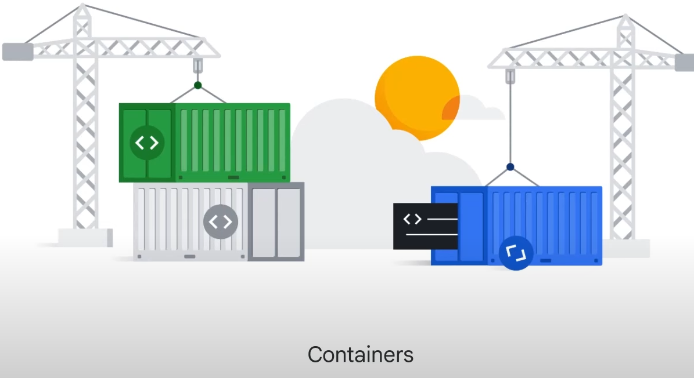
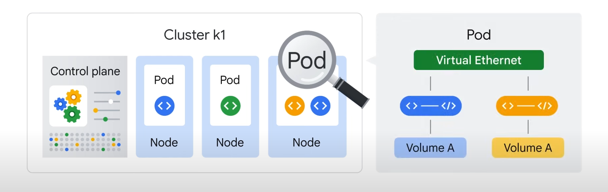
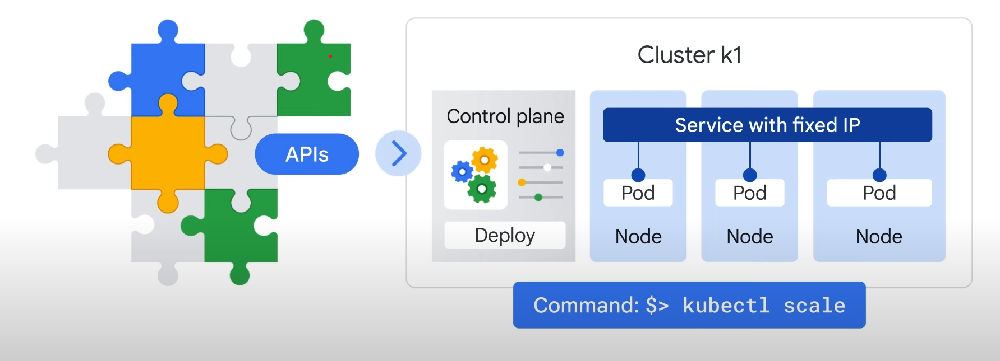
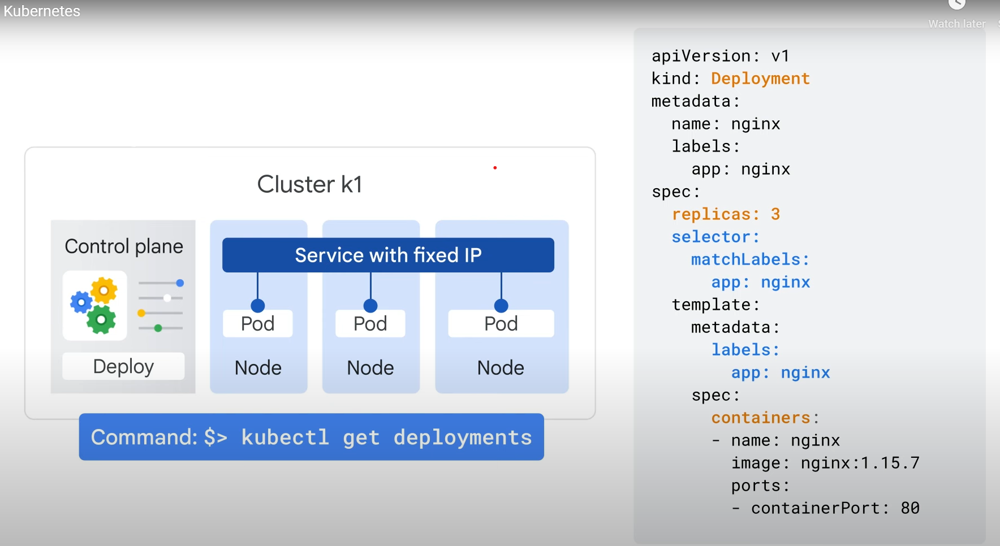
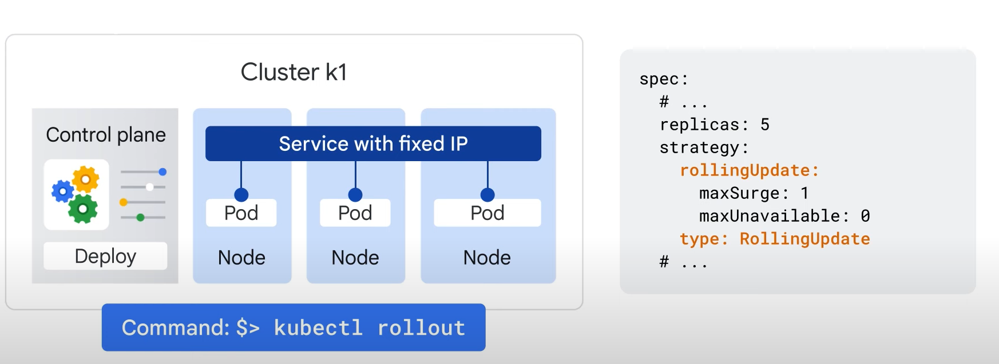
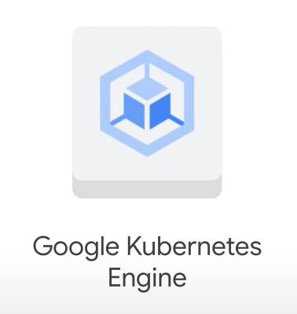

# Containers in the Cloud



## Introduction to Containers

### Infrastructure as a Service (IaaS)

- **IaaS**: Allows sharing of compute resources using virtual machines (VMs) to virtualize hardware.
  - Developers can deploy their own operating system (OS), access hardware, and build applications in a self-contained environment with access to RAM, file systems, networking interfaces, etc.

### Containers

- **Concept**: Containers provide the independent scalability of workloads in Platform as a Service (PaaS) and an abstraction layer of the OS and hardware in IaaS.
  - **Configurable System**: Install runtime, web server, database, or middleware, and configure underlying system resources (disk space, disk I/O, networking).

### Benefits and Challenges

- **Flexibility**: Comes with the cost of larger compute units (VMs) that can be slow and costly to scale.
  - **VMs**: The smallest unit of compute is an app with its VM, which might be large and take minutes to boot.
  - **Scaling**: Copying and booting entire VMs for each instance of an app can be slow and costly.

## Advantages of Containers

### Lightweight and Fast

- **Containers**: Encapsulate code and dependencies with limited access to their own partition of the file system and hardware.
  - **Efficiency**: Require only a few system calls to create and start as quickly as a process.
  - **Requirements**: Need an OS kernel that supports containers and a container runtime on each host.

### Portability and Flexibility

- **Virtualization**: The OS is virtualized, allowing containers to scale like PaaS while providing flexibility similar to IaaS.
  - **Portability**: Code can move from development to staging to production, or from a laptop to the cloud, without changes or rebuilding.

### Example: Scaling a Web Server

- **Scaling**: Containers can scale a web server in seconds, deploying dozens or hundreds of instances on a single host.
  - **Microservices**: Applications can be built using multiple containers, each performing a specific function.
  - **Modularity**: Containers can be connected with network connections, making them modular, easy to deploy, and independently scalable across hosts.

### Dynamic Scaling

- **Hosts**: Can scale up and down, starting and stopping containers as demand changes or as hosts fail.

## Kubernetes and Google Kubernetes Engine (GKE)

### Introduction to Kubernetes

#### What is Kubernetes?


- **Kubernetes**: An open-source platform for managing containerized workloads and services.
  - **Orchestration**: Manages many containers on many hosts, scales them as microservices, and easily deploys rollouts and rollbacks.
  - **APIs**: Provides a set of APIs to deploy containers on a set of nodes called a cluster.

### Components of Kubernetes



- **Control Plane**: Manages the Kubernetes cluster.
- **Nodes**: Run containers and represent computing instances (machines).
  - **Pods**: The smallest unit in Kubernetes, representing a running process on your cluster.
    - **Single Container**: Generally, one container per Pod.
    - **Multiple Containers**: Can package multiple containers with a hard dependency into a single Pod, sharing networking and storage resources.

### Key Concepts

- **Pod**: Provides a unique network IP and set of ports for containers, with configurable options for how containers should run.
- **Deployment**: Represents a group of replicas of the same Pod, ensuring Pods run even when nodes fail.
  - **Commands**:
    - `kubectl run`: Starts a Deployment with a container running inside a Pod.
    - `kubectl get pods`: Lists running Pods.
    - `kubectl scale`: Scales a Deployment.
    - `kubectl apply`: Applies changes from a configuration file.
    - `kubectl rollout`: Manages updates to Deployments.

### Services

- **Service**: An abstraction defining a logical set of Pods and a policy to access them.
  - **Fixed IP Address**: Provides a stable endpoint for Pods.
  - **Load Balancer**: In GKE, a network load balancer is created to route traffic to Pods behind the Service.

### Scaling and Autoscaling



- **Scaling**: Use `kubectl scale` to adjust the number of Pods in a Deployment.
- **Autoscaling**: Automatically scales Pods based on parameters like CPU utilization.

### Declarative Configuration



- **Configuration Files**: Define the desired state of your Kubernetes resources.
  - **Deployment Config File**: Used to specify the number of replicas and other settings.
  - **Commands**:
    - `kubectl get deployments`: Checks the status of Deployments.
    - `kubectl describe deployments`: Provides detailed information about Deployments.

### Rolling Updates



- **Updating Applications**: Use `kubectl rollout` or update the deployment configuration file and apply the changes.
  - **Update Strategy**: Creates new version Pods individually and waits for a new Pod to be available before destroying an old Pod.

## Google Kubernetes Engine (GKE)

### Introduction to GKE

### What is GKE?



- **GKE**: A Google-hosted managed Kubernetes service in the cloud.
  - **Environment**: Consists of multiple machines (Compute Engine instances) grouped together to form a cluster.

### Differences Between GKE and Kubernetes

- **Simplified Management**: GKE manages all the control plane components.
  - **Control Plane**: GKE provisions and manages the control plane infrastructure, exposing an IP address for Kubernetes API requests.
  - **No Separate Control Plane Needed**: GKE handles the control plane, simplifying the user experience.

### GKE Modes

- **Autopilot Mode** (Recommended):
  - **Managed Infrastructure**: GKE manages node configuration, autoscaling, auto-upgrades, baseline security configurations, and baseline networking configuration.
  - **Optimized for Production**: Provides strong security posture and operational efficiency.
- **Standard Mode**:
  - **User-Managed Infrastructure**: Users configure and manage the underlying infrastructure, including individual nodes.
  - **Same Functionality**: Offers the same features as Autopilot but requires user management.

### Creating a Kubernetes Cluster

- **Methods**: Use the Google Cloud console or the `gcloud` command provided by the Cloud SDK.
- **Customization**: GKE clusters support different machine types, number of nodes, and network settings.

### Interacting with Your Cluster

- **Kubernetes Commands and Resources**: Used to deploy and manage applications, perform administration tasks, set policies, and monitor the health of workloads.

## Advanced Cluster Management Features

### Benefits of Running a GKE Cluster

- **Load Balancing**: Google Cloud's load-balancing for Compute Engine instances.
- **Node Pools**: Designate subsets of nodes within a cluster for additional flexibility.
- **Automatic Scaling**: Automatically scales the cluster's node instance count.
- **Automatic Upgrades**: Automatically upgrades the cluster's node software.
- **Node Auto-Repair**: Maintains node health and availability.
- **Logging and Monitoring**: Google Cloud Observability provides visibility into the cluster.

### Starting Kubernetes on a GKE Cluster

- **Command**:

  ```bash
  gcloud container clusters create k1
  ```
