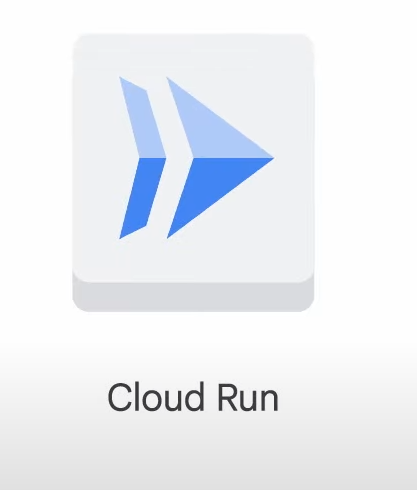
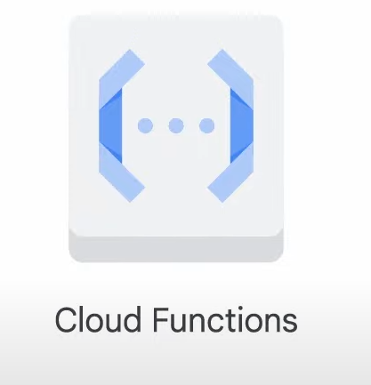

# Applications in the Cloud



## What is Cloud Run?

- **Cloud Run**: A managed compute platform that runs stateless containers via web requests or Pub/Sub events.
  - **Serverless**: Removes all infrastructure management tasks, allowing developers to focus on application development.
  - **Built on Knative**: An open API and runtime environment built on Kubernetes.
  - **Deployment Options**: Can be fully managed on Google Cloud, Google Kubernetes Engine (GKE), or anywhere Knative runs.

### Key Features

- **Automatic Scaling**: Scales up and down from zero almost instantaneously.
- **Cost Efficiency**: Charges only for resources used, calculated to the nearest 100 milliseconds.
- **HTTPS Serving**: Handles HTTPS serving, including encryption.

### Developer Workflow

1. **Write Application**: Use your favorite programming language to write an application that starts a server listening for web requests.
2. **Build and Package**: Package the application into a container image.
3. **Deploy**: Push the container image to Artifact Registry, where Cloud Run will deploy it.

### Deployment

- **Unique HTTPS URL**: After deployment, you receive a unique HTTPS URL.
- **On-Demand Containers**: Cloud Run starts containers on demand to handle requests, dynamically adding and removing containers as needed.

### Flexibility

- **Container-Based Workflow**: Provides transparency and flexibility.
- **Source-Based Workflow**: Deploy source code directly, with Cloud Run building and packaging it into a container image using Buildpacks.

### Pricing Model

- **Pay for Usage**: Only pay for system resources while a container handles web requests, with a granularity of 100ms.
- **No Idle Costs**: No charges if the container doesn't handle requests.
- **Request Fees**: Small fee for every one million requests served.
- **Resource-Based Pricing**: Cost increases with more vCPU and memory.

### Supported Languages

- **Popular Languages**: Java, Python, Node.js, PHP, Go, C++.
- **Less Popular Languages**: Cobol, Haskell, Perl.
- **Requirement**: Applications must handle web requests and be compiled for Linux 64-bit.

## Cloud Functions



### What are Cloud Functions?

- **Cloud Functions**: A lightweight, event-based, asynchronous compute solution.
  - **Single-Purpose Functions**: Allows creation of small functions that respond to cloud events without managing a server or runtime environment.

### Use Case Example

- **Image Processing Application**:
  - Users upload images.
  - Functions handle tasks like converting images to a standard format, creating thumbnails, and storing files in a repository.
  - **Event-Driven**: Functions run automatically when a new image is uploaded.

### Key Features

- **Event-Based**: Functions respond to cloud events.
- **Asynchronous**: Functions run asynchronously.
- **No Server Management**: No need to manage servers or runtime environments.
- **Billing**: Billed to the nearest 100 milliseconds, only while code is running.

### Supported Programming Languages

- **Languages**: Node.js, Python, Go, Java, .NET Core, Ruby, PHP.
- **Runtimes Documentation**: Refer to the runtimes documentation for supported specific versions.

### Integration and Workflow

- **Application Workflows**: Construct workflows from individual business logic tasks.
- **Connecting Services**: Connect and extend cloud services.
- **Triggers**: Events from Cloud Storage and Pub/Sub can trigger Cloud Functions asynchronously.

## Hello Cloud Run

### Activate Google Cloud Shell

### What is Google Cloud Shell?

- **Google Cloud Shell**: A virtual machine loaded with development tools.
  - **Features**: Offers a persistent 5GB home directory and runs on Google Cloud.
  - **Access**: Provides command-line access to Google Cloud resources.

### Steps to Activate Cloud Shell

1. **Open Cloud Shell**:
   - In the Cloud console, on the top right toolbar, click the **Open Cloud Shell** button.
   - Click **Continue**.

2. **Provision and Connect**:
   - It takes a few moments to provision and connect to the environment.
   - Once connected, you are already authenticated, and the project is set to your `PROJECT_ID`.

### Using gcloud Command-Line Tool

- **gcloud**: The command-line tool for Google Cloud, pre-installed on Cloud Shell and supports tab-completion.

#### List Active Account Name

```bash
gcloud auth list
```

- **Output**:

```bash
  Credentialed accounts:
   - @.com (active)
```

#### List Project ID

```bash
gcloud config list project
```

- **Output**:

```bash
  [core]
  project = 
```

### Reference: Basic Linux Commands

Below is a reference list of basic Linux commands that may be included in instructions or code blocks for this lab.

| Command                | Action                                      | Command                | Action                                      |
|------------------------|---------------------------------------------|------------------------|---------------------------------------------|
| `mkdir` (make directory) | Create a new folder                        | `cd` (change directory) | Change location to another folder           |
| `ls` (list)            | List files and folders in the directory     | `cat` (concatenate)    | Read contents of a file without using an editor |
| `apt-get update`       | Update package manager library              | `ping`                 | Signal to test reachability of a host       |
| `mv` (move)            | Move a file                                 | `cp` (copy)            | Make a file copy                            |
| `pwd` (present working directory) | Return your current location         | `sudo` (super user do) | Give higher administration privileges       |

## Hello Cloud Run

### Task 1: Enable the Cloud Run API and Configure Your Shell Environment

1. **Enable the Cloud Run API**:

   ```bash
   gcloud services enable run.googleapis.com
   ```

   - Authorize the use of your credentials if prompted.
   - You should see a success message similar to:

     ```bash
     Operation "operations/acf.cc11852d-40af-47ad-9d59-477a12847c9e" finished successfully.
     ```

2. **Set the Compute Region**:

   ```bash
   gcloud config set compute/region "REGION"
   ```

3. **Create a LOCATION Environment Variable**:

   ```bash
   LOCATION="Region"
   ```

## Task 2: Write the Sample Application

1. **Create a New Directory**:

   ```bash
   mkdir helloworld && cd helloworld
   ```

2. **Create and Edit `package.json`**:

   ```bash
   nano package.json
   ```

   - Add the following content:

     ```json
     {
       "name": "helloworld",
       "description": "Simple hello world sample in Node",
       "version": "1.0.0",
       "main": "index.js",
       "scripts": {
         "start": "node index.js"
       },
       "author": "Google LLC",
       "license": "Apache-2.0",
       "dependencies": {
         "express": "^4.17.1"
       }
     }
     ```

   - Save and exit (`CTRL+X`, then `Y`, then `Enter`).

3. **Create and Edit `index.js`**:

   ```bash
   nano index.js
   ```

   - Add the following content:

     ```javascript
     const express = require('express');
     const app = express();
     const port = process.env.PORT || 8080;

     app.get('/', (req, res) => {
       const name = process.env.NAME || 'World';
       res.send(`Hello ${name}!`);
     });

     app.listen(port, () => {
       console.log(`helloworld: listening on port ${port}`);
     });
     ```

   - Save and exit (`CTRL+X`, then `Y`, then `Enter`).

## Task 3: Containerize Your App and Upload It to Artifact Registry

1. **Create and Edit `Dockerfile`**:

   ```bash
   nano Dockerfile
   ```

   - Add the following content:

     ```dockerfile
     # Use the official lightweight Node.js 12 image.
     FROM node:12-slim

     # Create and change to the app directory.
     WORKDIR /usr/src/app

     # Copy application dependency manifests to the container image.
     COPY package*.json ./

     # Install production dependencies.
     RUN npm install --only=production

     # Copy local code to the container image.
     COPY . .

     # Run the web service on container startup.
     CMD [ "npm", "start" ]
     ```

   - Save and exit (`CTRL+X`, then `Y`, then `Enter`).

2. **Build Your Container Image**:

   ```bash
   gcloud builds submit --tag gcr.io/$GOOGLE_CLOUD_PROJECT/helloworld
   ```

3. **List Container Images**:

   ```bash
   gcloud container images list
   ```

4. **Configure Docker Credentials**:

   ```bash
   gcloud auth configure-docker
   ```

5. **Run and Test Locally**:

   ```bash
   docker run -d -p 8080:8080 gcr.io/$GOOGLE_CLOUD_PROJECT/helloworld
   ```

   - In Cloud Shell, click on **Web preview** and select **Preview on port 8080**.

## Task 4: Deploy to Cloud Run

1. **Deploy Your Containerized Application**:

   ```bash
   gcloud run deploy --image gcr.io/$GOOGLE_CLOUD_PROJECT/helloworld --allow-unauthenticated --region=$LOCATION
   ```

   - Confirm the service name by pressing `Enter`.
   - Enable necessary APIs if prompted.

2. **Access Your Service**:
   - On success, the command line displays the service URL:

     ```bash
     Service [helloworld] revision [helloworld-00001-xit] has been deployed and is serving 100 percent of traffic.
     Service URL: https://helloworld-h6cp412q3a-uc.a.run.app
     ```

   - Visit the service URL in any browser window.

## Task 5: Clean Up

1. **Delete Container Image**:

   ```bash
   gcloud container images delete gcr.io/$GOOGLE_CLOUD_PROJECT/helloworld
   ```

2. **Delete Cloud Run Service**:

   ```bash
   gcloud run services delete helloworld --region="REGION"
   ```

3. **End Your Lab**:
   - Click **End Lab** in Google Cloud Skills Boost to remove resources and clean the account.
