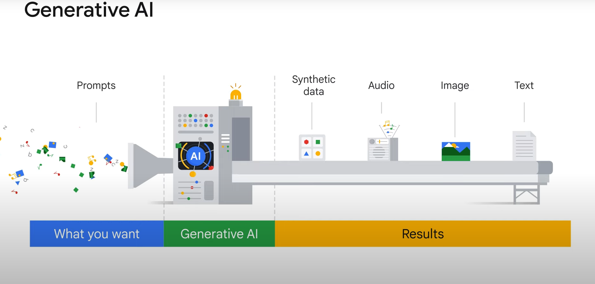
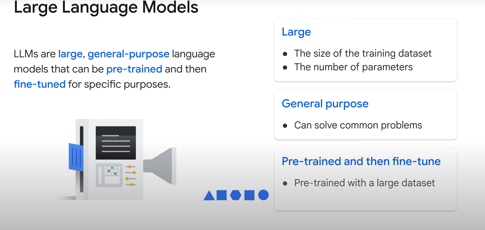
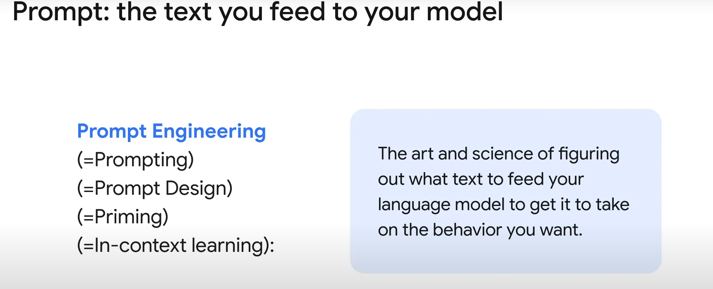

# Google Cloud: Prompt Engineer Guide

## Introduction

### Overview

Generative AI and large language models (LLMs) are powerful tools that require an understanding of their architecture and best practices for implementation. This guide aims to answer key questions and provide best practices for prompt engineering.

### Key Questions

- What is generative AI?
- What is a large language model?
- What is prompt engineering?

## Generative AI

### Definition

- **Generative AI**: A subset of artificial intelligence capable of creating text, images, or other data using generative models, often in response to prompts.
- **History**: AI has been around since the mid-1950s, but generative AI has gained significant popularity since 2021.

### Functionality

- **Prompt**: A specific instruction, question, or cue given to a computer program to initiate a specific action or response.
- **Learning**: Generative AI models learn patterns and structures from input training data and create new data with similar characteristics.

### Applications

- **Industries**: Software development, healthcare, finance, entertainment, customer service, and sales.

## Large Language Models (LLMs)

### Definition

- **LLMs**: Large, general-purpose language models that can be pre-trained and then fine-tuned for specific purposes.
- **Size**: Refers to the size of the training dataset (sometimes petabyte scale) and the number of parameters (billions or trillions).

### Training

- **Pre-Training**: Involves feeding a massive dataset of text, images, and code to the model to learn the underlying structure and patterns of the language.
- **Fine-Tuning**: Adjusting the pre-trained model for specific goals with a smaller dataset.

### Functionality

- **Autocomplete**: LLMs work like a sophisticated autocomplete, suggesting the most common correct response to a prompt.
- **Hallucinations**: Incorrect or nonsensical outputs generated by the model due to limitations in training data or context.

### Causes of Hallucinations

- Insufficient training data.
- Noisy or dirty training data.
- Lack of context.
- Insufficient constraints.

## Prompt Engineering

### Best Practices

- **Clarity**: Ensure prompts are clear and specific.
- **Context**: Provide sufficient context to guide the model.
- **Constraints**: Apply constraints to limit the scope of the model's responses.
- **Iterative Testing**: Continuously test and refine prompts to improve accuracy and relevance.

## Scenario: Sasha's Use Case

### Background

- **Sasha**: A cloud architect creating a prototype design of Google Cloud VPC network architecture for Cymbal Bank.
- **Tool**: Uses Gemini, a generative AI-powered assistant embedded in Google Cloud products.

### Benefits of Gemini

- **Integrated Assistance**: Provides detailed suggestions and guides based on Google Cloud documentation, tutorials, and samples.
- **Automation**: Can create detailed `gcloud` commands and insert them into Cloud Shell.

## Conclusion

Generative AI and LLMs offer significant potential for various applications. Understanding their architecture and implementing best practices in prompt engineering can help harness their full capabilities effectively.

# Prompt Engineering Guide

## Introduction

### Importance of Prompt Engineering

- **Generative AI and LLMs**: Powerful tools that require well-structured prompts to leverage their full capabilities.
- **Goal**: To articulate prompts effectively to get the best responses from models like Gemini.

## Understanding Prompts

### What is a Prompt?

- **Prompt**: Text fed to the model to initiate a specific action or response.
- **Prompt Engineering**: The practice of crafting prompts to get the best possible output from the model.

### Types of Prompts

1. **Zero-Shot Prompts**: No context or examples provided.
   - Example: "What’s the capital of France?"
2. **One-Shot Prompts**: One example provided for context.
   - Example: "Italy's capital is Rome. What’s the capital of France?"
3. **Few-Shot Prompts**: Multiple examples provided for context.
   - Example: "Italy's capital is Rome. Japan's capital is Tokyo. What’s the capital of France?"
4. **Role Prompts**: Frame of reference provided for the model.
   - Example: "I want you to act as a business professor. What is ROI?"

### Elements of a Prompt

1. **Preamble**: Introductory text providing context and instructions.
   - Example: "I want you to act as a cloud architect in Google Cloud."
2. **Input**: The central request or task.
   - Example: "How can I use gcloud to create a network that uses IPv4 and IPv6 subnets?"

## Best Practices for Prompt Engineering

1. **Write Detailed and Explicit Instructions**:
   - Be clear and concise to avoid vague responses.
   - Example: "How can I create a network that uses IPv4 and IPv6 addresses?"

2. **Define Boundaries**:
   - Instruct the model on what to do rather than what not to do.
   - Provide fallback outputs for uncertain situations.
   - Example: "If unsure, respond with 'I'm still learning about that.'"

3. **Adopt a Persona**:
   - Adding a persona provides meaningful context.
   - Example: "You're a cloud architect. How would you design a scalable network?"

4. **Keep Sentences Concise**:
   - Break long sentences into shorter, simpler tasks.
   - Example: "You want to build a Google Cloud VPC network. It should be centrally managed and connect to other VPC networks."

## Example Scenario: Sasha's Use Case

### Initial Prompt

- **Prompt**: "How can I create a network that uses IPv4 and IPv6 addresses?"

### Refined Prompt with Role Context

- **Prompt**: "I want you to act as a cloud architect in Google Cloud. How can I use gcloud to create a network that uses IPv4 and IPv6 subnets?"

### Further Refined Prompt

- **Prompt**: "I want you to act as a cloud architect in Google Cloud. How can I adjust the gcloud command provided to create a subnet to ensure the subnet is dual stack?"

### Final Prompt for Network Architecture

- **Prompt**: "You're a cloud architect. You want to build a Google Cloud VPC network that can be centrally managed. You also connect to other VPC networks in your company's other regions. You don't want to have many different sets of firewall policies to maintain. What sort of network architecture would you recommend?"

### Result

- **Response**: Gemini proposes a hub-and-spoke network architecture, fitting Sasha’s needs exactly.

## Conclusion

By refining and structuring prompts effectively, you can harness the full potential of generative AI and LLMs to get accurate and relevant responses.

