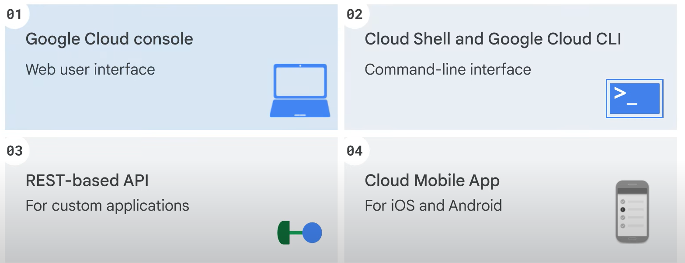
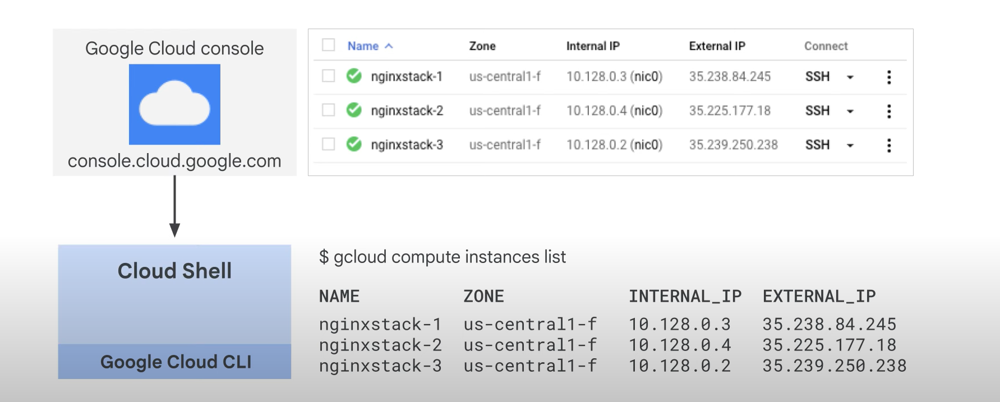
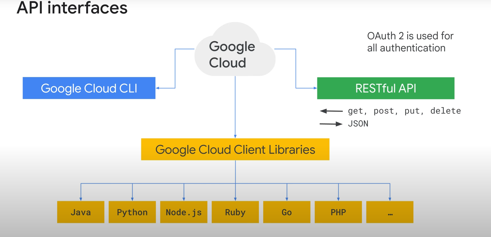

# Essential Google Cloud Infrastructure: Foundation

## Interacting with Google Cloud


### Using Google Cloud

There are four ways you can interact with Google Cloud:



1. **Google Cloud Console**
2. **Cloud Shell and Google Cloud CLI**
3. **APIs**
4. **Cloud Mobile App**



#### Google Cloud Console

- Provides a web-based, graphical user interface.
- Access through console.cloud.google.com.
- Example: View virtual machines and their details.

#### Google Cloud CLI

- Command-line tool for terminal window users.
- Example command: `gcloud compute instances list` to list virtual machines and their details.

#### Cloud Shell

- Browser-based, interactive shell environment.
- Access from the Google Cloud console.
- Temporary virtual machine with 5 GB of persistent disk storage.
- Pre-installed with Google Cloud CLI.

### Labs and Instructions

- Labs will provide instructions using the Google Cloud console.
- Example: “On the Navigation menu, click Compute Engine > VM instances.”

#### Dissecting Instructions

1. Click on the icon with three horizontal lines (Navigation menu).
2. Opens a menu listing all major products and services.
3. Hover over “Compute Engine” to open a submenu.
4. Click on “VM instances” on the submenu.

### Command-Line Instructions

- Enter instructions in Cloud Shell or an SSH terminal by copying and pasting.
- Modify commands when necessary (e.g., choosing a unique name for a Cloud Storage bucket).

### Client Libraries



- Enable easy creation and management of resources.
- **App APIs**: Provide access to services, optimized for languages like Node.js or Python.
- **Admin APIs**: Offer functionality for resource management (e.g., building automated tools).

### Cloud Mobile App

- Manage Google Cloud services from Android or iOS devices.
- Features:
  - Start, stop, and SSH into Compute Engine instances.
  - View logs from each instance.
  - Set up customizable graphs for key metrics (CPU usage, network usage, etc.).
  - Alerts and incident management.
  - Up-to-date billing information and alerts for projects over budget.
- Download from Google Play or the App Store.

# Essential Google Cloud Infrastructure: Foundation

## Working with the Google Cloud Console and Cloud Shell

In this lab, you become familiar with the Google Cloud web-based interface. There are two integrated environments: a GUI (graphical user interface) environment called the Cloud Console, and a CLI (command-line interface) called Cloud Shell. In this lab, you use both environments.

### Cloud Console

- **Continuous Development**: The Cloud Console is under continuous development, so occasionally the graphical layout changes. This is most often to accommodate new Google Cloud features or changes in the technology, resulting in a slightly different workflow.
- **Common Actions**: You can perform most common Google Cloud actions in the Cloud Console, but not all actions. In particular, very new technologies or sometimes detailed API or command options are not implemented (or not yet implemented) in the Cloud Console. In these cases, the command line or the API is the best alternative.
- **Efficiency**: The Cloud Console is extremely fast for some activities. The Cloud Console can perform multiple actions on your behalf that might require many CLI commands. It csan also perform repetitive actions. In a few clicks you can accomplish activities that would require a lot of typing and would be susceptible to typing errors.
- **Error Reduction**: The Cloud Console is able to reduce errors by offering only valid options through its menus. It can leverage access to the platform "behind the scenes" through the SDK to validate configuration before submitting changes. A command line can't do this kind of dynamic validation.

## Task 1: Use the Cloud Console to Create a Bucket

In this task, you create a bucket. This task also helps you become familiar with how actions are presented in the lab instructions and teaches you about the Cloud Console interface.

### Steps to Create a Bucket

1. **Navigate to the Storage Service**:
   - In the Cloud Console, on the Navigation menu, click **Cloud Storage > Buckets**.

2. **Create the Bucket**:
   - Click **Create**.
   - For **Name**, type a globally unique bucket name; leave all other values as their defaults.
   - Click **Create**.
   - If prompted with "Public access will be prevented," click **Confirm**.

### Explore Features in the Cloud Console

- The Google Cloud menu contains a **Notifications** icon. Sometimes, feedback from the underlying commands is provided there. If you are not sure what is happening, check **Notifications** for additional information and history.

## Task 2: Access Cloud Shell

In this section, you explore Cloud Shell and some of its features.

### Overview of Cloud Shell

You can use the Cloud Shell to manage projects and resources via command line without having to install the Cloud SDK and other tools on your computer.

### Cloud Shell Provides

- **Temporary Compute Engine VM**
- **Command-line access** to the instance via a browser
- **5 GB of persistent disk storage** (`$HOME` directory)
- **Pre-installed Cloud SDK and other tools**:
  - `gcloud`: for working with Compute Engine and many Google Cloud services
  - `gcloud storage`: for working with Cloud Storage
  - `kubectl`: for working with Google Kubernetes Engine and Kubernetes
  - `bq`: for working with BigQuery
- **Language support** for Java, Go, Python, Node.js, PHP, and Ruby
- **Web preview functionality**
- **Built-in authorization** for access to resources and instances

Learn more about Cloud Shell from the Google Cloud Cloud Shell Documentation.

**Note**: After 1 hour of inactivity, the Cloud Shell instance is recycled. Only the `/home` directory persists. Any changes made to the system configuration, including environment variables, are lost between sessions.

### Open Cloud Shell and Explore Features

1. In the Google Cloud menu, click **Activate Cloud Shell** (Activate Cloud Shell icon). If prompted, click **Continue**. Cloud Shell opens at the bottom of the Cloud Console window.

2. There are three buttons on the far right of the Cloud Shell toolbar:
   - **Minimize/Restore**: Minimizes or restores the window, giving you full access to the Cloud Console without closing Cloud Shell.
   - **Open in a new window**: Pops the Cloud Shell out into a full-sized terminal window, useful for editing files or seeing the full output of a command.
   - **Close terminal**: Closes Cloud Shell. Every time you close Cloud Shell, the virtual machine is reset and all machine context is lost.

### Cloud Shell Provides You With (Select all that apply)

- Command-line access to a free temporary Compute Engine VM
- Built-in authorization for access to resources and instances
- 5 GB of persistent storage (`/home`)

## Task 3: Use Cloud Shell to Create a Cloud Storage Bucket

### Create a Second Bucket and Verify in the Cloud Console

1. **Open Cloud Shell** again.

2. **Create the Bucket**:
   - Use the `gcloud storage` command to create another bucket. Replace `[BUCKET_NAME]` with a globally unique name (you can append a `2` to the globally unique bucket name you used previously):

     ```sh
     gcloud storage buckets create gs://[BUCKET_NAME]
     ```

   - If prompted, click **Authorize**.

3. **Verify the Bucket**:
   - In the Cloud Console, on the Navigation menu, click **Cloud Storage > Buckets**, or click **Refresh** if you are already in the Storage browser. The second bucket should be displayed in the Buckets list.

**Note**: You have performed equivalent actions using the Cloud Console and Cloud Shell. You created a bucket using the Cloud Console and another bucket using Cloud Shell.

## Task 4: Explore More Cloud Shell Features

### Upload a File

1. **Open Cloud Shell**.

2. **Upload a File**:
   - Click the **More** button in the Cloud Shell toolbar to display further options.
   - Click **Upload**. Upload any file from your local machine to the Cloud Shell VM. This file will be referred to as `[MY_FILE]`.
   - In Cloud Shell, type `ls` to confirm that the file was uploaded.

3. **Copy the File to a Bucket**:
   - Copy the file into one of the buckets you created earlier in the lab. Replace `[MY_FILE]` with the file you uploaded and `[BUCKET_NAME]` with one of your bucket names:

     ```sh
     gcloud storage cp [MY_FILE] gs://[BUCKET_NAME]
     ```

   - If your filename has whitespaces, be sure to place single quotes around the filename. For example:

     ```sh
     gcloud storage cp 'my file.txt' gs://[BUCKET_NAME]
     ```

**Note**: You have uploaded a file to the Cloud Shell VM and copied it to a bucket.

### Explore Cloud Shell Options

- Explore the options available in Cloud Shell by clicking on different icons in the Cloud Shell toolbar.

### Close Cloud Shell Sessions

- Close all the Cloud Shell sessions.

## Task 5: Create a Persistent State in Cloud Shell

In this section, you will learn a best practice for using Cloud Shell. The `gcloud` command often requires you to specify values such as a Region, Zone, or Project ID. Entering them repeatedly increases the chance of making typing errors. If you use Cloud Shell frequently, you may want to set common values in environment variables and use them instead of typing the actual values.

### Identify Available Regions

1. **Open Cloud Shell** from the Cloud Console. Note that this allocates a new VM for you.
2. To list available regions, execute the following command:

   ```sh
   gcloud compute regions list
   ```

3. Select a region from the list and note the value in any text editor. This region will now be referred to as [YOUR_REGION] in the remainder of the lab.

### Create and Verify an Environment Variable

1. Create an environment variable and replace [YOUR_REGION] with the region you selected in the previous step:

```sh
INFRACLASS_REGION=[YOUR_REGION]
```

2. Verify it with **echo**:

```sh
echo $INFRACLASS_REGION
```

You can use environment variables like this in gcloud commands to reduce the opportunities for typos and so that you won’t have to remember a lot of detailed information.

Note: Every time you close Cloud Shell and reopen it, a new VM is allocated, and the environment variable you just set disappears. In the next steps, you create a file to set the value so that you won’t have to enter the command each time Cloud Shell is reset.

### Append the Environment Variable to a File

1. Create a subdirectory for materials used in this lab:

```sh
mkdir infraclass
```

2. Create a file called config in the infraclass directory:

```sh
touch infraclass/config
```

3. Append the value of your Region environment variable to the config file:

```sh
echo INFRACLASS_REGION=$INFRACLASS_REGION >> ~/infraclass/config
```

4. Create a second environment variable for your Project ID, replacing [YOUR_PROJECT_ID] with your Project ID. You can find the project ID on the Cloud Console Home page:

```sh
INFRACLASS_PROJECT_ID=[YOUR_PROJECT_ID]
```

5. Append the value of your Project ID environment variable to the config file:

```sh
echo INFRACLASS_PROJECT_ID=$INFRACLASS_PROJECT_ID >> ~/infraclass/config
```

6. Use the **source** command to set the environment variables, and use the echo command to verify that the project variable was set:

```sh
source infraclass/config
echo $INFRACLASS_PROJECT_ID
```

Note: This gives you a method to create environment variables and to easily recreate them if the Cloud Shell is recycled or reset. However, you will still need to remember to issue the **source** command each time Cloud Shell is opened. In the next step, you modify the .profile file so that the source command is issued automatically every time a terminal to Cloud Shell is opened.

### Modify the Bash Profile and Create Persistence

1. Close and re-open Cloud Shell. Then issue the echo command again:

```sh
echo $INFRACLASS_PROJECT_ID
```

There will be no output because the environment variable no longer exists.

2. Edit the shell profile with the following command:

```sh
nano .profile
```

3. Add the following line to the end of the file:

```sh
source infraclass/config
```

4. Press Ctrl+O, ENTER to save the file, and then press Ctrl+X to exit nano.

5. Close and then re-open Cloud Shell to reset the VM.

6. se the echo command to verify that the variable is still set:

```sh
echo $INFRACLASS_PROJECT_ID
```

You should now see the expected value that you set in the config file.

Note: If your Cloud Shell environment is ever corrupted, instructions on resetting it are in the Cloud Shell Documentation article titled Disabling or Resetting Cloud Shell. This will cause everything in your Cloud Shell environment to be set back to its original default state.

## Task 6: Review the Google Cloud Interface

Cloud Shell is an excellent interactive environment for exploring Google Cloud by using Google Cloud SDK commands like `gcloud` and `gcloud storage`.

### Google Cloud SDK

- You can install the Google Cloud SDK on a computer or on a VM instance in Google Cloud.
- The `gcloud` and `gcloud storage` commands can be automated by using a scripting language like bash (Linux) or PowerShell (Windows).
- You can also explore using the command-line tools in Cloud Shell, and then use the parameters as an implementation guide in the SDK using one of the supported languages.

### Google Cloud Interface

The Google Cloud interface consists of two parts: the Cloud Console and Cloud Shell.

### The Console

- Provides a fast way to perform tasks.
- Presents options to you, instead of requiring you to know them.
- Performs behind-the-scenes validation before submitting the commands.

### Cloud Shell Provides

- Detailed control
- A complete range of options and features
- A path to automation through scripting

# Infrastructure Preview

In this lab, you build a sophisticated deployment in minutes using Marketplace. This lab shows several of the Google Cloud infrastructure services in action and illustrates the power of the platform. It introduces technologies that are covered in detail later in the class.

## Objectives

In this lab, you learn how to perform the following tasks:

- Use Marketplace to build a Jenkins Continuous Integration environment.
- Verify that you can manage the service from the Jenkins UI.
- Administer the service from the Virtual Machine host through SSH.

## Task 1: Use Marketplace to Build a Deployment

### Navigate to Marketplace

1. In the Cloud Console, on the Navigation menu, click **Marketplace**.
2. Locate the Jenkins deployment by searching for **Bitnami package for Jenkins**.
3. Click on the deployment and read about the service provided by the software. Jenkins is an open-source continuous integration environment. You can define jobs in Jenkins that can perform tasks such as running a scheduled build of software and backing up data. Notice the software that is installed as part of Jenkins shown in the left side of the description.
4. The service you are using, Marketplace, is part of Google Cloud. The Jenkins template is developed and maintained by an ecosystem partner named Bitnami. Notice on the left side a field that says "Last updated." How recently was this template updated?

### Quiz

Google Cloud Marketplace lets you quickly deploy functional software packages by providing pre-defined templates with which Google Cloud service?

- Terraform
- Firestore
- Template Manager
- Deployment Manager

### Launch Jenkins

1. Click **Get Started**.
2. Verify the deployment, accept the terms and services, and click **Agree**.
3. For the popup "Successfully agreed to terms," click **Deploy**.
4. Leave everything as default and click **Deploy** again.

**Note**: Ignore the warning after Jenkins is deployed.

**Note**: It will take a minute or two for Deployment Manager to set up the deployment. You can watch the status as tasks are being performed. Deployment Manager is acquiring a virtual machine instance and installing and configuring software for you. You will see `jenkins-1` has been deployed when the process is complete.

### Deployment Manager

Deployment Manager is a Google Cloud service that uses templates written in a combination of YAML, Python, and Jinja2 to automate the allocation of Google Cloud resources and perform setup tasks. Behind the scenes, a virtual machine has been created. A startup script was used to install and configure software, and network Firewall Rules were created to allow traffic to the service.

## Task 2: Examine the Deployment

In this section, you examine what was built in Google Cloud.

### View Installed Software and Login to Jenkins

1. In the right pane, note the **Admin user** and **Admin password (Temporary)** values and add them to a text editor.
2. Click **Visit the site** to view the site in another browser tab. If you get an error, you might have to reload the page a couple of times.
3. Log in with the **Admin user** and **Admin password** values.

**Note**: If you get an HTTP 404 error, then remove the `/jenkins` part from the site address and hit Enter. For example: `http://35.238.162.236`.

4. After logging in, if you are asked to **Customize Jenkins**, click **Install suggested plugins**, and then click **Restart** after the installation is complete. The restart will take a couple of minutes.

**Note**: If you are getting an installation error, retry the installation and if it fails again, continue past the error and save and finish before restarting. The code of this solution is managed and supported by Bitnami.

### Explore Jenkins

1. In the Jenkins interface, in the left pane, click **Manage Jenkins**. Look at all of the actions available. You are now prepared to manage Jenkins. The focus of this lab is Google Cloud infrastructure, not Jenkins management, so seeing that this menu is available is the purpose of this step.
2. Leave the browser window open to the Jenkins service. You will use it in the next task.

**Note**: Now you have seen that the software is installed and working properly. In the next task, you will open an SSH terminal session to the VM where the service is hosted, and verify that you have administrative control over the service.

## Task 3: Administer the Service

### View the Deployment and SSH to the VM

1. On the Google Cloud console title bar, type **Deployment Manager** in the Search field, then click **Deployment Manager** in the Product & Pages section.
2. Click **jenkins-1**.
3. Click **SSH** to connect to the Jenkins server.

**Note**: The Console interface is performing several tasks for you transparently. For example, it has transferred keys to the virtual machine that is hosting the Jenkins software so that you can connect securely to the machine using SSH.

### Shut Down and Restart the Services

1. In the SSH window, enter the following command to shut down all the running services:

   ```sh
   sudo /opt/bitnami/ctlscript.sh stop
   ```

2. Refresh the browser window for the Jenkins UI. You will no longer see the Jenkins interface because the service was shut down.

3. In the SSH window, enter the following command to restart the services:

```sh
sudo /opt/bitnami/ctlscript.sh restart
```

4. Return to the browser window for the Jenkins UI and refresh it. You may have to do it a couple of times before the service is reachable.

5. In the SSH window, type exit to close the SSH terminal session.
