# Virtual Networks

## Overview

In this module, we will be covering virtual networks.

## GCP Network Infrastructure

- **Software Defined Network**: Built on a global fiber infrastructure.
- **Global Network**: One of the world's largest and fastest networks.

## Conceptual Approach

- Think of resources as services instead of hardware to understand available options and their behavior.

## Virtual Private Cloud (VPC)

- **Introduction**: Google's managed networking functionality for Google Cloud Platform (GCP) resources.

## Networking Components

- **Projects**
- **Networks**
- **Subnetworks**
- **IP Addresses**
- **Routes**
- **Firewall Rules**
- **Network Pricing**

## Hands-On Lab

- Create various networks and explore their relationships.

## Common Network Designs

## Google Cloud Structure

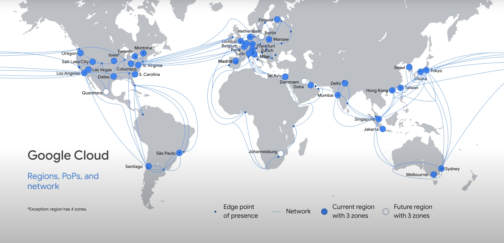

- **Regions**: Specific geographical locations to run resources.
  - Regions with blue icons have three zones.
  - Exception: Iowa (US-Central1) has four zones: US-Central1-A, US-Central1-B, US-Central1-C, and US-Central1-F.
- **Points of Presence (PoPs)**: Where Google's network connects to the internet.
  - Extensive global network of interconnection points.
  - Reduces costs and improves user experience.
- **Global Private Network**: Composed of fiber optic cables and several submarine cable investments.

## Additional Information

- For up-to-date information on regions and zones, refer to the documentation.
- For more details on Google's networking infrastructure, refer to the slides.

## Conclusion

Let's start by talking about GCP's network, specifically Virtual Private Cloud (VPC).

## Exploring VPC Objects: Projects, Networks, and Subnetworks


### Projects

- Key organizer of infrastructure resources in Google Cloud.
- Associates objects and services with billing.
- Projects contain entire networks.
- Default quota: 15 networks per project (additional quota can be requested via Google Cloud console).
- Networks can be shared with other projects or peered with networks in other projects.

### Networks

- Do not have IP ranges; they are constructs of all individual IP addresses and services within the network.
- Global, spanning all available regions across the world.
- Types of networks: default, auto, and custom.

#### Default Network

- Provided with every project.
- Preset subnets and firewall rules.
- Subnet allocated for each region with non-overlapping CIDR blocks.
- Firewall rules allow ingress traffic for ICMP, RDP, and SSH from anywhere, and ingress traffic from within the default network for all protocols and ports.

#### Auto Mode Network

- One subnet from each region is automatically created.
- Default network is an auto mode network.
- Automatically created subnets use predefined IP ranges with a /20 mask (expandable to /16).
- Subnets fit within the 10.128.0.0/9 CIDR block.
- New subnets are automatically added as new Google Cloud regions become available.

#### Custom Mode Network

- Does not automatically create subnets.
- Provides complete control over subnets and IP ranges.
- Subnets and IP ranges are specified by the user.
- IP ranges cannot overlap between subnets of the same network.
- Auto mode network can be converted to a custom mode network (one-way conversion).

### IPv6 Support

- Supported in custom VPC network mode.
- Configure IPv6 addressing on ‘dual-stack’ VM instances running both IPv4 and IPv6.
- More information available in the “Networking in Google Cloud” course.

### Example Project

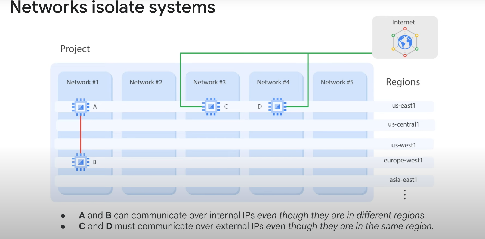

- Contains 5 networks spanning multiple regions.
- Each network contains separate virtual machines (VMs A, B, C, and D).
- VMs in the same network can communicate using internal IP addresses, even if in different regions.
- VMs take advantage of Google's global fiber network, appearing as though they are in the same rack in terms of network configuration protocol.

### VM Communication

- **VMs C and D**: Not in the same network, must use external IP addresses for communication even if in the same region.
  - Traffic between VMs C and D goes through Google Edge routers, not the public internet.
  - Different billing and security implications.

  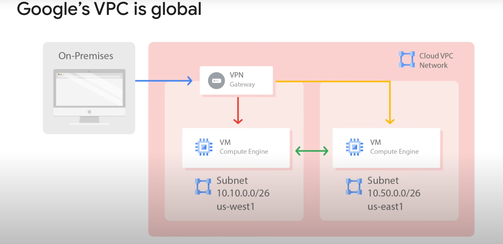

- **Private Communication**: VM instances within a VPC network can communicate privately on a global scale.
  - A single VPN can securely connect your on-premises network to your Google Cloud network.
  - VMs in separate regions (e.g., us-west1 and us-east1) can communicate through Google’s private network and a VPN gateway.
  - Reduces cost and network management complexity.

### Subnetworks

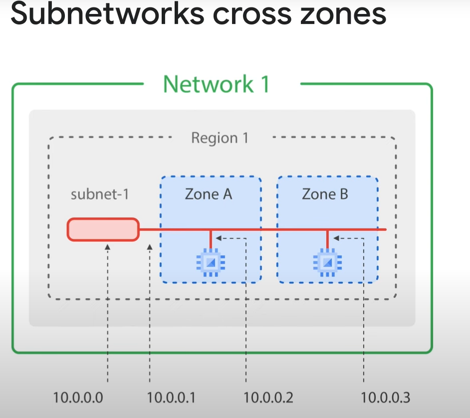

- **Regional Scale**: Subnetworks work on a regional scale and can cross zones within the same region.
  - Example: Region 1 with zones A and B, subnet-1 extends across these zones.
  - Subnet is an IP address range; first and second addresses (.0 and .1) are reserved for the network and subnet’s gateway.
  - First and second available addresses (.2 and .3) are assigned to VM instances.
  - Other reserved addresses: second-to-last (network) and last (broadcast) addresses.
  - Every subnet has four reserved IP addresses in its primary IP range.

- **Communication Across Zones**: VMs in different zones within the same subnet can communicate using the same subnet IP address.
  - A single firewall rule can be applied to VMs in different zones.

### Increasing IP Address Space

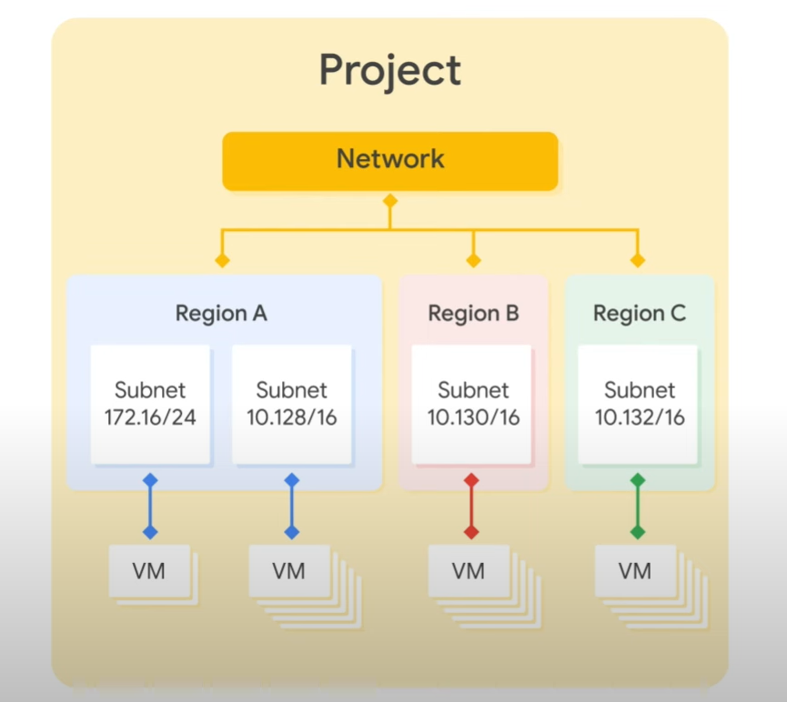

- **Google Cloud VPCs**: Allow increasing the IP address space of subnets without workload shutdown or downtime.
  - Subnets can have different subnet masks for flexibility and growth.
  - New subnet must not overlap with other subnets in the same VPC network.
  - Each IP range for all subnets must be a unique valid CIDR block.
  - New subnet IP address ranges must be regional internal IP addresses within valid IP ranges.
  - Subnet ranges cannot match, be narrower, or broader than a restricted range.
  - Subnet ranges cannot span a valid RFC range and a privately used public IP address range.
  - Subnet ranges cannot span multiple RFC ranges.
  - New network range must be larger than the original (prefix length value must be smaller).

- **Auto Mode Subnets**: Start with a /20 IP range, expandable to /16 but no larger.
  - Can be converted to custom mode subnetwork for further IP range increase.

- **Avoid Large Subnets**: Large subnets can cause CIDR range collisions with Multiple Network Interfaces, VPC Network Peering, or VPN connections to on-premises networks.
  - Scale subnets according to actual needs.

# Expanding a Custom Subnet in GCP

## Overview

This guide demonstrates how to expand a custom subnet within Google Cloud Platform (GCP) without causing any downtime to existing VM instances.

## Steps

### 1. Initial Setup

- **Create a custom subnet** with a `/29` mask.
  - A `/29` mask provides 8 addresses.
  - **Note:** 4 addresses are reserved by GCP, leaving 4 for VM instances.

### 2. Attempt to Create an Additional VM Instance

- Navigate to the GCP console.
- Verify that you have 4 instances running in the subnet.
- Attempt to create another VM instance in the same subnet:
  - Click on **Create Instance**.
  - Select a micro instance.
  - Click **Create**.

### 3. Expected Error

- The instance creation should fail due to exhausted IP space.
- The notification pane will indicate that the IP space of the subnet is exhausted.

### 4. Expand the Subnet

- Navigate to **VPC networks** through the navigation menu or directly through the network interface details.
- Click on the subnet you want to expand.
- Click the **Edit** button.
- Change the subnet mask from `/29` to `/23`.
  - This allows for over 500 instances.
- Save the changes.

### 5. Retry Instance Creation

- Use the **Retry** button in the notification pane to recreate the instance.
- Verify that the instance is created successfully with an internal IP address allocated.

## Conclusion

Expanding a subnet in GCP can be done seamlessly without shutting down any existing workloads.

# Exploring IP Addresses in Google Cloud

## Overview

This guide delves into the types of IP addresses that can be assigned to virtual machines (VMs) in Google Cloud Platform (GCP).

## Types of IP Addresses

### 1. Internal IP Address

- **Assignment:** Assigned via DHCP internally.
- **Usage:** Every VM and service dependent on VMs (e.g., App Engine, Google Kubernetes Engine) receives an internal IP address.
- **DNS Registration:**
  - The VM's symbolic name is registered with an internal DNS service.
  - The DNS translates the name to an internal IP address.
  - **Scope:** The DNS is scoped to the network, translating web URLs and VM names within the same network. It cannot translate host names from VMs in different networks.

### 2. External IP Address

- **Optional:** Can be assigned if the VM needs to be externally accessible.
- **Types:**
  - **Ephemeral:** Assigned from a pool and can change.
  - **Static:** Reserved and does not change.
    - **Cost:** Higher charges apply if a static external IP address is reserved but not assigned to a resource (e.g., VM instance, forwarding rule).
- **Custom IP Prefixes:**
  - You can use your own publicly routable IP address prefixes as Google Cloud external IP addresses.
  - **Eligibility:** Must own and bring a `/24` block or larger.

## Conclusion

Understanding the types of IP addresses and their usage in GCP is crucial for managing network configurations and ensuring proper connectivity for your VMs and services.

# Exploring Internal and External IP Addresses in GCP

## Overview

This guide walks through the process of creating a VM in Google Cloud Platform (GCP) and selecting internal and external IP addresses.

## Steps

### 1. Navigate to Compute Engine

- Go to the **Compute Engine** page in the GCP Console.

### 2. Create a VM Instance

- Click on **Create Instance**.
- You can leave the default name or change it as needed.
- Select the desired **region** and **zone**.

### 3. Configure Networking

- Expand the **Management, security, networking, sole tenancy** section.
- Focus on the **Networking** tab.
- Click the pencil icon next to the **Network interface**.

### 4. Select Network and IP Addresses

- **Network Selection:**
  - Choose between available networks (if multiple networks exist).
- **Primary/Internal IP:**
  - Options include using an ephemeral address (automatically created) or custom selecting one within the range.
  - You can also reserve a static internal IP address for long-term use.
- **External IP:**
  - Options include using an ephemeral address, reserving a static external IP address, or selecting none (if external access is not needed).

### 5. Create the Instance

- Leave the external IP address as ephemeral (default setting).
- Note: With a `/20` subnet, there are over 4,000 addresses available.
- Be aware of the quota limits (e.g., 15,000 instances per network).

### 6. Monitor IP Addresses

- After creating the instance, observe the assigned internal and external IP addresses.
- **Internal IP Address:** Remains within the specified range.
- **External IP Address:** Assigned from Google's pool (ephemeral).

### 7. Test IP Address Persistence

- **Stop the Instance:**
  - Select the instance and click **Stop**.
  - Ensure any shutdown scripts complete within 90 seconds.
- **Start the Instance:**
  - Restart the instance and observe the IP addresses.
  - The internal IP address should remain the same.
  - The external IP address will change if it was ephemeral.

## Conclusion

This process demonstrates that every VM in GCP requires an internal IP address, while external IP addresses are optional and ephemeral by default.

## DNS Resolution

### Internal DNS

- **Types:**
  - **Zonal DNS:** Recommended for higher reliability by isolating failures to individual zones.
  - **Global (Project-wide) DNS:** Available but less recommended.
- **Hostname Resolution:** Each instance has a hostname that resolves to an internal IP address.
  - **FQDN:** Internal fully qualified domain name format.
- **Metadata Server:** Acts as a DNS resolver for the instance, handling local network queries and routing others to Google's public DNS servers.

### External DNS

- **Public DNS Records:** Not published automatically; admins can publish using existing DNS servers.
- **Cloud DNS:** A managed, scalable, and reliable authoritative DNS service.
  - **Features:**
    - Translates domain names to IP addresses.
    - Uses Google's global network of Anycast name servers.
    - Provides lower latency and high availability.
    - Offers a 100% uptime SLA.
    - Allows creation and updating of millions of DNS records via UI, CLI, or API.

## Alias IP Ranges

- **Purpose:** Assign a range of internal IP addresses as an alias to a VM's network interface.
- **Usage:** Useful for multiple services running on a VM, assigning different IP addresses to each service.
- **Configuration:** Draw alias IP ranges from the local subnet's primary or secondary CIDR ranges.

## Conclusion

Understanding the management of internal and external IP addresses, DNS resolution, and the use of Cloud DNS in GCP is crucial for efficient network configuration and ensuring high availability and reliability of services.

# Routes and Firewall Rules in GCP

## Overview

This guide explains how Google Cloud Platform (GCP) routes traffic and how firewall rules are used to control network traffic.

## Routes

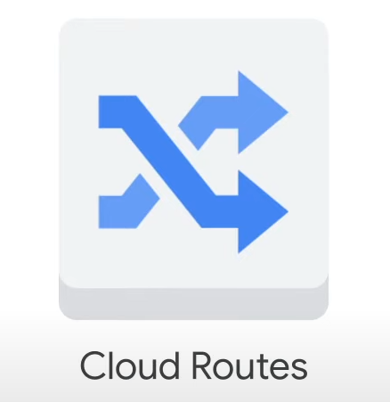

**Route**: A route is a mappping of an IP range to a destination.

### Default Routes

- **Internal Traffic:** Every network has routes that allow instances to send traffic directly to each other, even across subnets.
- **External Traffic:** Every network has a default route that directs packets to destinations outside the network.

### Custom Routes

- **Purpose:** Overwrite default routes for specific routing needs.
- **Requirement:** Creating a route alone does not ensure packet delivery; firewall rules must also allow the packet.

### Route Creation

- **Network Creation:** A route is created to enable traffic delivery from "anywhere".
- **Subnet Creation:** A route is created to enable communication between VMs on the same network.

### Route Application

- **Instance Tags:** Routes apply to instances if the network and instance tags match.
- **No Tags:** If no instance tags are specified, the route applies to all instances in the network.

### Virtual Router

- **Function:** A massively scalable virtual router at the core of each network.
- **Connection:** Every VM instance is directly connected to this router.
- **Routing Table:** The virtual router consults the routing table for each instance to select the next hop for a packet.

## Firewall Rules

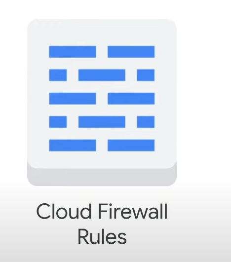

### Default Firewall Rules

- **Pre-configured Rules:** Allow all instances in the default network to communicate with each other.
- **Custom Networks:** Manually created networks do not have pre-configured rules; you must create them.

### Firewall Rule Components

- **Direction:** Ingress (inbound) or egress (outbound).
- **Source/Destination:** Source for ingress, destination for egress.
- **Protocol and Port:** Rules can be restricted to specific protocols and ports.
- **Action:** Allow or deny packets that match the rule criteria.
- **Priority:** Determines the order in which rules are evaluated; the first matching rule is applied.
- **Assignment:** Rules can be assigned to all instances or specific instances.

### Stateful Firewall Rules

- **Bidirectional Communication:** Once a connection is allowed, all subsequent traffic in either direction is allowed.
- **Implied Rules:** If all firewall rules are deleted, an implied "Deny all" ingress rule and an implied "Allow all" egress rule apply.

## Use Cases

### Egress Firewall Rules

- **Allow Rules:** Permit outbound connections matching specific protocols, ports, and IP addresses.
- **Deny Rules:** Prevent instances from initiating connections that match non-permitted criteria.
- **Destination Ranges:** Specify IP CIDR ranges to control outbound connections.

### Ingress Firewall Rules

- **Allow Rules:** Permit inbound connections matching specific protocols, ports, and IP ranges.
- **Deny Rules:** Prevent instances from receiving connections on non-permitted ports and protocols.
- **Source Ranges:** Use source CIDR ranges to control inbound connections.

## Conclusion

Understanding routes and firewall rules in GCP is essential for managing network traffic and ensuring secure communication between instances and external networks.

## Network Pricing

### Understanding GCP's Network Pricing

- **Egress Traffic**: Traffic leaving GCP's network.
  - **Not Charged**:
    - Egress to the same zone through the internal IP address of an instance.
    - Egress to Google products (e.g., YouTube, Maps, Drive).
    - Egress to a different GCP service within the same region.
  - **Charged**:
    - Egress between zones in the same region.
    - Egress within a zone through the external IP address of an instance.
    - Egress between regions.

### Key Points

- **Ingress Traffic**: Traffic coming into GCP's network is not charged unless processed by a resource like a load balancer.
- **Responses to Requests**: Count as egress and are charged.
- **Egress Traffic to the Same Zone**: Not charged if through the internal IP address.
- **Egress Traffic to Google Products**: Not charged.
- **Egress Between Zones in the Same Region**: Charged.
- **Egress Within a Zone**: Charged if through the external IP address.
- **Egress Between Regions**: Charged.

### External IP Addresses

- **Static and Ephemeral External IP Addresses**:
  - **Static External IP (Unassigned)**: Higher rate if not assigned to a resource (e.g., VM instance, forwarding rule).
  - **Static and Ephemeral External IP (In Use)**: Charged.
  - **External IP on Preemptible VMs**: Lower charge than standard VM instances.

### Pricing Changes and Tools

- **Pricing Changes**: Always refer to the latest documentation for updates.
- **GCP Pricing Calculator**:
  - Web-based tool to estimate costs based on expected consumption of services and resources.
  - Allows specification of instance type, region, and egress traffic.
  - Provides estimated costs, adjustable currency, and time frame.
  - Estimates can be emailed or saved for future reference.

### Example Usage of Pricing Calculator

- Specify instance type, region, and egress traffic (e.g., 100 GB monthly to Americas and EMEA).
- Calculator returns total estimated cost.
- Adjust currency and time frame as needed.
- Save or email the estimate for future reference.

Refer to the documentation links in the slides for the most current pricing information.

# VPC Networking

## Overview

Google Cloud Virtual Private Cloud (VPC) provides networking functionality to:

- Compute Engine virtual machine (VM) instances
- Kubernetes Engine containers
- App Engine flexible environment

Without a VPC network, you cannot create VM instances, containers, or App Engine applications. Each Google Cloud project has a default network to get you started.

- **Virtualized Network**: Similar to a physical network but virtualized within Google Cloud.
- **Global Resource**: Consists of regional virtual subnetworks (subnets) in data centers.
- **Global WAN**: All subnets are connected by a global wide area network (WAN).
- **Isolation**: VPC networks are logically isolated from each other in Google Cloud.

## Objectives

In this lab, you will learn how to perform the following tasks:

1. Explore the default VPC network.
2. Create an auto mode network with firewall rules.
3. Convert an auto mode network to a custom mode network.
4. Create custom mode VPC networks with firewall rules.
5. Create VM instances using Compute Engine.
6. Explore the connectivity for VM instances across VPC networks.

## Lab Exercise

1. **Create an Auto Mode VPC Network**:
   - Includes firewall rules.
   - Create two VM instances.

2. **Convert to Custom Mode Network**:
   - Create other custom mode networks as shown in the example network diagram.
   - Test connectivity across networks.

Refer to the example network diagram for visual guidance on network setup and connectivity testing.

# Task 1: Explore the Default Network

Each Google Cloud project has a default network with subnets, routes, and firewall rules.

## View the Subnets

The default network has a subnet in each Google Cloud region.

1. **Navigate to VPC Networks**:
   - In the Cloud Console, on the Navigation menu, click **VPC network > VPC networks**.
   - Notice the default network with its subnets.
   - Each subnet is associated with a Google Cloud region and a private RFC 1918 CIDR block for its internal IP addresses range and a gateway.

## View the Routes

Routes tell VM instances and the VPC network how to send traffic from an instance to a destination, either inside the network or outside Google Cloud. Each VPC network comes with some default routes to route traffic among its subnets and send traffic from eligible instances to the internet.

1. **Navigate to Routes**:
   - In the left pane, click **Routes**.
   - Notice that there is a route for each subnet and one for the Default internet gateway (0.0.0.0/0).
   - These routes are managed for you, but you can create custom static routes to direct some packets to specific destinations. For example, you can create a route that sends all outbound traffic to an instance configured as a NAT gateway.

## View the Firewall Rules

Each VPC network implements a distributed virtual firewall that you can configure. Firewall rules allow you to control which packets are allowed to travel to which destinations. Every VPC network has two implied firewall rules that block all incoming connections and allow all outgoing connections.

1. **Navigate to Firewall**:
   - In the left pane, click **Firewall**.
   - Notice that there are 4 Ingress firewall rules for the default network:
     - `default-allow-icmp`
     - `default-allow-rdp`
     - `default-allow-ssh`
     - `default-allow-internal`
   - These firewall rules allow ICMP, RDP, and SSH ingress traffic from anywhere (0.0.0.0/0) and all TCP, UDP, and ICMP traffic within the network (10.128.0.0/9). The Targets, Filters, Protocols/ports, and Action columns explain these rules.

## Delete the Firewall Rules

1. **Navigate to Firewall Policies**:
   - In the left pane, click **Firewall policies**.
   - From VPC firewall rules, select all default network firewall rules.
   - Click **Delete**.
   - Click **Delete** to confirm the deletion of the firewall rules.

## Delete the Default Network

1. **Navigate to VPC Networks**:
   - In the Navigation menu, click **VPC network > VPC networks**.
   - Select the default network.
   - Click **Delete VPC network**, and type `default`.
   - Click **Delete** to confirm the deletion of the default network.
   - Wait for the network to be deleted before continuing.

2. **Verify Deletion**:
   - In the left pane, click **Routes**. Notice that there are no routes.
   - In the left pane, click **Firewall**. Notice that there are no firewall rules.

> **Note**: Without a VPC network, there are no routes!

### Verify that you cannot create a VM instance without a VPC network

1. **Navigate to VM Instances**:
   - On the Navigation menu, click **Compute Engine > VM instances**.

2. **Attempt to Create an Instance**:
   - Click **Create Instance**.
   - Accept the default values and click **Create**.
   - Notice the error indicating that a VPC network is required.

3. **Check Advanced Options**:
   - Click **Advanced options**.
   - Click **Networking**.
   - Notice the **No more networks available** error under Network interfaces.
   - Click **Cancel**.

# Task 2: Create an Auto Mode Network

You have been tasked to create an auto mode network with two VM instances. Auto mode networks are easy to set up and use because they automatically create subnets in each region. However, you don't have complete control over the subnets created in your VPC network, including regions and IP address ranges used.

## Create an Auto Mode VPC Network with Firewall Rules

1. **Navigate to VPC Networks**:
   - On the Navigation menu, click **VPC network > VPC networks**.
   - Click **Create VPC network**.
   - For **Name**, type `mynetwork`.
   - For **Subnet creation mode**, click **Automatic**.
     - Auto mode networks create subnets in each region automatically.
   - For **Firewall rules**, select all available rules.
     - These are the same standard firewall rules that the default network had. The deny-all-ingress and allow-all-egress rules are also displayed, but you cannot select or disable them because they are implied. These two rules have a lower priority (higher integers indicate lower priorities) so that the allow ICMP, custom, RDP, and SSH rules are considered first.
   - Click **Create**.

2. **Verify Subnets**:
   - When the new network is ready, click `mynetwork > Subnets`.
   - Note the IP address range for the subnets in Region 1 and Region 2.

> **Note**: If you ever delete the default network, you can quickly re-create it by creating an auto mode network as you just did.

## Create a VM Instance in Region 1

1. **Navigate to VM Instances**:
   - On the Navigation menu, click **Compute Engine > VM instances**.
   - Click **Create Instance**.

2. **Specify the Following Settings**:
   - **Name**: `mynet-us-vm`
   - **Region**: Region 1
   - **Zone**: Zone 1
   - **Series**: E2
   - **Machine type**: `e2-micro` (2 vCPU, 1 core, 1 GB memory)
   - **Boot disk**: Debian GNU/Linux 12 (bookworm)
   - Click **Create**.

## Create a VM Instance in Region 2

1. **Create Another Instance**:
   - Click **Create instance**.

2. **Specify the Following Settings**:
   - **Name**: `mynet-notus-vm`
   - **Region**: Region 2
   - **Zone**: Zone 2
   - **Series**: E2
   - **Machine type**: `e2-micro` (2 vCPU, 1 core, 1 GB memory)
   - **Boot disk**: Debian GNU/Linux 12 (bookworm)
   - Click **Create**.

> **Note**: The External IP addresses for both VM instances are ephemeral. If an instance is stopped, any ephemeral external IP addresses assigned to the instance are released back into the general Compute Engine pool and become available for use by other projects. When a stopped instance is started again, a new ephemeral external IP address is assigned to the instance. Alternatively, you can reserve a static external IP address, which assigns the address to your project indefinitely until you explicitly release it.

## Verify Connectivity for the VM Instances

The firewall rules that you created with `mynetwork` allow ingress SSH and ICMP traffic from within `mynetwork` (internal IP) and outside that network (external IP).

1. **Note IP Addresses**:
   - On the Navigation menu, click **Compute Engine > VM instances**.
   - Note the external and internal IP addresses for `mynet-notus-vm`.

2. **SSH to `mynet-us-vm`**:
   - For `mynet-us-vm`, click **SSH** to launch a terminal and connect.
   - You can SSH because of the allow-ssh firewall rule, which allows incoming traffic from anywhere (0.0.0.0/0) for tcp:22. The SSH connection works seamlessly because Compute Engine generates an SSH key for you and stores it in one of the following locations:
     - By default, Compute Engine adds the generated key to project or instance metadata.
     - If your account is configured to use OS Login, Compute Engine stores the generated key with your user account.
     - Alternatively, you can control access to Linux instances by creating SSH keys and editing public SSH key metadata.

3. **Test Connectivity**:
   - To test connectivity to `mynet-notus-vm`'s internal IP, run the following command, replacing `mynet-notus-vm`'s internal IP:

     ```sh
     ping -c 3 <Enter mynet-notus-vm's internal IP here>
     ```

   - You can ping `mynet-notus-vm`'s internal IP because of the allow-custom firewall rule.
   - To test connectivity to `mynet-notus-vm`'s external IP, run the following command, replacing `mynet-notus-vm`'s external IP:

     ```sh
     ping -c 3 <Enter mynet-notus-vm's external IP here>
     ```

> **Question**: Which firewall rule allows the ping to `mynet-notus-vm`'s external IP address?
>
> - `mynetwork-allow-rdp`
> - `mynetwork-allow-icmp`
> - `mynetwork-allow-ssh`
> - `mynetwork-allow-custom`

> **Note**: You can SSH to `mynet-us-vm` and ping `mynet-notus-vm`'s internal and external IP addresses as expected. Alternatively, you can SSH to `mynet-notus-vm` and ping `mynet-us-vm`'s internal and external IP addresses, which also works.

## Convert the Network to a Custom Mode Network

The auto mode network worked great so far, but you have been asked to convert it to a custom mode network so that new subnets aren't automatically created as new regions become available. This could result in overlap with IP addresses used by manually created subnets or static routes, or could interfere with your overall network planning.

1. **Navigate to VPC Networks**:
   - On the Navigation menu, click **VPC network > VPC networks**.
   - Click `mynetwork` to open the network details.
   - Click **Edit**.
   - Select **Custom** for the Subnet creation mode.
   - Click **Save**.

2. **Verify Conversion**:
   - Return to the VPC networks page.
   - Wait for the Mode of `mynetwork` to change to Custom.
   - You can click **Refresh** while you wait.

> **Note**: Converting an auto mode network to a custom mode network is an easy task, and it provides you with more flexibility. We recommend that you use custom mode networks in production.

# Task 3: Create Custom Mode Networks

You have been tasked to create two additional custom networks, `managementnet` and `privatenet`, along with firewall rules to allow SSH, ICMP, and RDP ingress traffic and VM instances as shown in this example diagram (with the exception of vm-appliance).

## Create the `managementnet` Network

1. **Navigate to VPC Networks**:
   - In the Cloud Console, on the Navigation menu, click **VPC network > VPC networks**.
   - Click **Create VPC Network**.
   - For **Name**, type `managementnet`.
   - For **Subnet creation mode**, click **Custom**.

2. **Specify the Subnet Settings**:
   - **Name**: `managementsubnet-us`
   - **Region**: Region 1
   - **IPv4 range**: `10.240.0.0/20`
   - Click **Done**.

3. **View Equivalent Command Line**:
   - Click **Equivalent Command line** to see the gcloud commands.

   ```sh
   gcloud compute networks create managementnet --project=qwiklabs-gcp-01-26b777909140 --subnet-mode=custom --mtu=1460 --bgp-routing-mode=regional --bgp-best-path-selection-mode=legacy
   ```

   ```sh

   gcloud compute networks subnets create managementsubnet-us --project=qwiklabs-gcp-01-26b777909140 --range=10.240.0.0/20 --stack-type=IPV4_ONLY --network=managementnet --region=us-central1
   
   ```

- Click **Close**.

4. **Create the Network**:
   - Click **Create**.

## Create the `privatenet` Network

1. **Activate Cloud Shell**:
   - In the Cloud Console, click **Activate Cloud Shell**.
   - If prompted, click **Continue**.

2. **Create the Network**:
   - Run the following command to create the `privatenet` network:

     ```sh
     gcloud compute networks create privatenet --subnet-mode=custom
     ```

3. **Create the Subnets**:
   - Run the following commands to create the subnets:

     ```sh
     gcloud compute networks subnets create privatesubnet-us --network=privatenet --region=Region 1 --range=172.16.0.0/24
     gcloud compute networks subnets create privatesubnet-notus --network=privatenet --region=Region 2 --range=172.20.0.0/20
     ```

4. **List the VPC Networks**:
   - Run the following command to list the available VPC networks:

     ```sh
     gcloud compute networks list
     ```

5. **List the VPC Subnets**:
   - Run the following command to list the available VPC subnets:

     ```sh
     gcloud compute networks subnets list --sort-by=NETWORK
     ```

## Create Firewall Rules for `managementnet`

1. **Navigate to Firewall Rules**:
   - In the Cloud Console, on the Navigation menu, click **VPC network > Firewall**.
   - Click **Create Firewall Rule**.

2. **Specify the Firewall Rule Settings**:
   - **Name**: `managementnet-allow-icmp-ssh-rdp`
   - **Network**: `managementnet`
   - **Targets**: All instances in the network
   - **Source filter**: IPv4 Ranges
   - **Source IPv4 ranges**: `0.0.0.0/0`
   - **Protocols and ports**: Specified protocols and ports
     - Select **tcp** and specify ports `22` and `3389`.
     - Select **Other protocols** and specify `icmp`.

3. **View Equivalent Command Line**:
   - Click **Equivalent Command line** to see the gcloud commands.

   ```sh
   gcloud compute --project=qwiklabs-gcp-01-26b777909140 firewall-rules create managementnet-allow-icmp-ssh-rdp --direction=INGRESS --priority=1000 --network=managementnet --action=ALLOW --rules=tcp:22,tcp:3389 --source-ranges=0.0.0.0/0
   ```

   - Click **Close**.

4. **Create the Firewall Rule**:
   - Click **Create**.

## Create Firewall Rules for `privatenet`

1. **Return to Cloud Shell**:
   - If necessary, click **Activate Cloud Shell**.

2. **Create the Firewall Rule**:
   - Run the following command to create the firewall rule:

     ```sh
     gcloud compute firewall-rules create privatenet-allow-icmp-ssh-rdp --direction=INGRESS --priority=1000 --network=privatenet --action=ALLOW --rules=icmp,tcp:22,tcp:3389 --source-ranges=0.0.0.0/0
     ```

3. **List the Firewall Rules**:
   - Run the following command to list all the firewall rules:

     ```sh
     gcloud compute firewall-rules list --sort-by=NETWORK
     ```

## Create VM Instances

### Create the `managementnet-us-vm` Instance

1. **Navigate to VM Instances**:
   - In the Cloud Console, on the Navigation menu, click **Compute Engine > VM instances**.
   - Click **Create instance**.

2. **Specify the Instance Settings**:
   - **Name**: `managementnet-us-vm`
   - **Region**: Region 1
   - **Zone**: Zone 1
   - **Series**: E2
   - **Machine type**: `e2-micro` (2 vCPU, 1 core, 1 GB memory)
   - **Boot disk**: Debian GNU/Linux 12 (bookworm)

3. **Configure Networking**:
   - Click **Advanced options**.
   - Click **Networking**.
   - For **Network interfaces**, click the dropdown arrow to edit.
   - **Network**: `managementnet`
   - **Subnetwork**: `managementsubnet-us`
   - Click **Done**.

4. **View Equivalent Code**:
   - Click **Equivalent Code** to see the gcloud commands.

   ```sh
   gcloud compute instances create managementnet-us-vm \
    --project=qwiklabs-gcp-01-26b777909140 \
    --zone=us-central1-a \
    --machine-type=e2-micro \
    --network-interface=network-tier=PREMIUM,stack-type=IPV4_ONLY,subnet=managementsubnet-us \
    --metadata=enable-oslogin=true \
    --maintenance-policy=MIGRATE \
    --provisioning-model=STANDARD \
    --service-account=628740161323-compute@developer.gserviceaccount.com \
    --scopes=https://www.googleapis.com/auth/devstorage.read_only,https://www.googleapis.com/auth/logging.write,https://www.googleapis.com/auth/monitoring.write,https://www.googleapis.com/auth/service.management.readonly,https://www.googleapis.com/auth/servicecontrol,https://www.googleapis.com/auth/trace.append \
    --create-disk=auto-delete=yes,boot=yes,device-name=managementnet-us-vm,image=projects/debian-cloud/global/images/debian-12-bookworm-v20241009,mode=rw,size=10,type=pd-balanced \
    --no-shielded-secure-boot \
    --shielded-vtpm \
    --shielded-integrity-monitoring \
    --labels=goog-ec-src=vm_add-gcloud \
    --reservation-affinity=any
   ```

   - Click **Close**.

5. **Create the Instance**:
   - Click **Create**.

### Create the `privatenet-us-vm` Instance

Create the `privatenet-us-vm` instance using the gcloud command line.

1. **Activate Cloud Shell**:
   - If necessary, click **Activate Cloud Shell**.

2. **Create the VM Instance**:
   - Run the following command:

     ```sh
     gcloud compute instances create privatenet-us-vm --zone=Zone 1 --machine-type=e2-micro --subnet=privatesubnet-us --image-family=debian-12 --image-project=debian-cloud --boot-disk-size=10GB --boot-disk-type=pd-standard --boot-disk-device-name=privatenet-us-vm
     ```

3. **List All VM Instances**:
   - Run the following command to list all the VM instances (sorted by zone):

     ```sh
     gcloud compute instances list --sort-by=ZONE
     ```

4. **Verify in Cloud Console**:
   - In the Cloud Console, on the Navigation menu, click **Compute Engine > VM instances**.
   - Verify that the VM instances are listed in the Cloud Console.
   - For Columns, select **Zone**.

> **Note**: There are three instances in Zone 1 and one instance in Zone 2. However, these instances are spread across three VPC networks (`managementnet`, `mynetwork`, and `privatenet`), with no instance in the same zone and network as another. In the next task, you explore the effect this has on internal connectivity.

> **Tip**: You can explore more networking information on each VM instance by clicking the `nic0` link in the Internal IP column. The resulting network interface details page shows the subnet along with the IP CIDR range, the firewall rules and routes that apply to the instance, and other network analysis.

# Task 4: Explore the Connectivity Across Networks

Explore the connectivity between the VM instances. Specifically, determine the effect of having VM instances in the same zone versus having instances in the same VPC network.

## Ping the External IP Addresses

Ping the external IP addresses of the VM instances to determine whether you can reach the instances from the public internet.

1. **Navigate to VM Instances**:
   - In the Cloud Console, on the Navigation menu, click **Compute Engine > VM instances**.
   - Note the external IP addresses for `mynet-notus-vm`, `managementnet-us-vm`, and `privatenet-us-vm`.

2. **SSH to `mynet-us-vm`**:
   - For `mynet-us-vm`, click **SSH** to launch a terminal and connect.

3. **Test Connectivity**:
   - To test connectivity to `mynet-notus-vm`'s external IP, run the following command, replacing `mynet-notus-vm`'s external IP:

     ```sh
     ping -c 3 <Enter mynet-notus-vm's external IP here>
     ```

     This should work!
   - To test connectivity to `managementnet-us-vm`'s external IP, run the following command, replacing `managementnet-us-vm`'s external IP:

     ```sh
     ping -c 3 <Enter managementnet-us-vm's external IP here>
     ```

     This should work!
   - To test connectivity to `privatenet-us-vm`'s external IP, run the following command, replacing `privatenet-us-vm`'s external IP:

     ```sh
     ping -c 3 <Enter privatenet-us-vm's external IP here>
     ```

     This should work!

> **Note**: You can ping the external IP address of all VM instances, even though they are in either a different zone or VPC network. This confirms that public access to those instances is only controlled by the ICMP firewall rules that you established earlier.

## Ping the Internal IP Addresses

Ping the internal IP addresses of the VM instances to determine whether you can reach the instances from within a VPC network.

### Which instances should you be able to ping from `mynet-us-vm` using internal IP addresses?

- `privatenet-us-vm`
- `mynet-notus-vm`
- `managementnet-us-vm`

1. **Note Internal IP Addresses**:
   - In the Cloud Console, on the Navigation menu, click **Compute Engine > VM instances**.
   - Note the internal IP addresses for `mynet-notus-vm`, `managementnet-us-vm`, and `privatenet-us-vm`.

2. **Return to SSH Terminal**:
   - Return to the SSH terminal for `mynet-us-vm`.

3. **Test Connectivity**:
   - To test connectivity to `mynet-notus-vm`'s internal IP, run the following command, replacing `mynet-notus-vm`'s internal IP:

     ```sh
     ping -c 3 <Enter mynet-notus-vm's internal IP here>
     ```

     You can ping the internal IP address of `mynet-notus-vm` because it is on the same VPC network as the source of the ping (`mynet-us-vm`), even though both VM instances are in separate zones, regions, and continents!
   - To test connectivity to `managementnet-us-vm`'s internal IP, run the following command, replacing `managementnet-us-vm`'s internal IP:

     ```sh
     ping -c 3 <Enter managementnet-us-vm's internal IP here>
     ```

     This should not work, as indicated by a 100% packet loss!
   - To test connectivity to `privatenet-us-vm`'s internal IP, run the following command, replacing `privatenet-us-vm`'s internal IP:

     ```sh
     ping -c 3 <Enter privatenet-us-vm's internal IP here>
     ```

     This should not work either, as indicated by a 100% packet loss! You cannot ping the internal IP address of `managementnet-us-vm` and `privatenet-us-vm` because they are in separate VPC networks from the source of the ping (`mynet-us-vm`), even though they are all in the same zone.

# Task 5: Review

In this lab, you explored the default network and determined that you cannot create VM instances without a VPC network. Thus, you created a new auto mode VPC network with subnets, routes, firewall rules, and two VM instances and tested the connectivity for the VM instances. Because auto mode networks aren't recommended for production, you converted the auto mode network to a custom mode network.

Next, you created two more custom mode VPC networks with firewall rules and VM instances using the Cloud Console and the gcloud command line. Then you tested the connectivity across VPC networks, which worked when pinging external IP addresses but not when pinging internal IP addresses.

VPC networks are by default isolated private networking domains. Therefore, no internal IP address communication is allowed between networks, unless you set up mechanisms such as VPC peering or VPN.

# Common Network Designs

## Availability

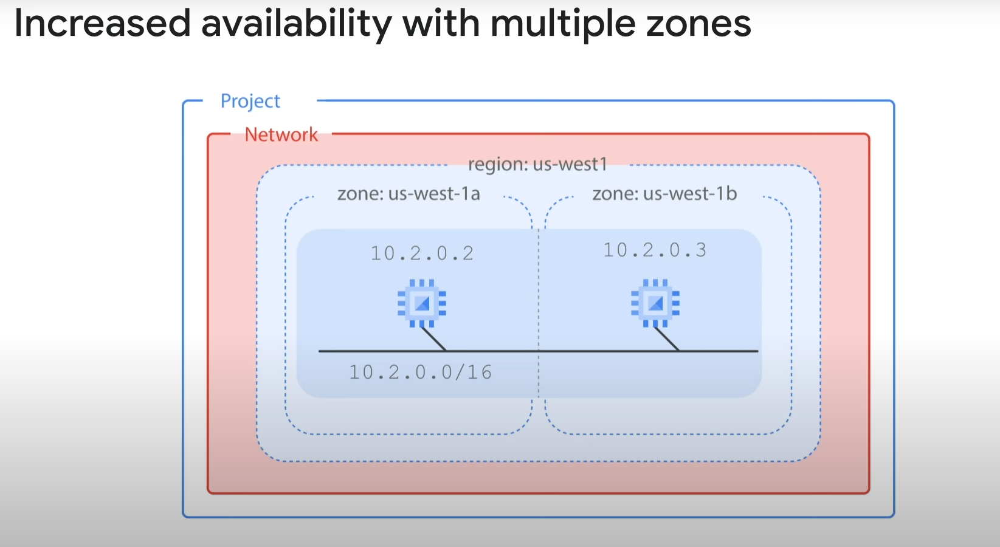

- **Increased Availability**:
  - Place two virtual machines (VMs) into multiple zones within the same subnet.
  - Example subnet: `10.2.0.0/16`.
  - Using a single subnet allows you to create firewall rules against the subnet.
  - Allocating VMs on a single subnet to separate zones improves availability without additional security complexity.
  - A regional managed instance group contains instances from multiple zones across the same region, providing increased availability.

## Globalization

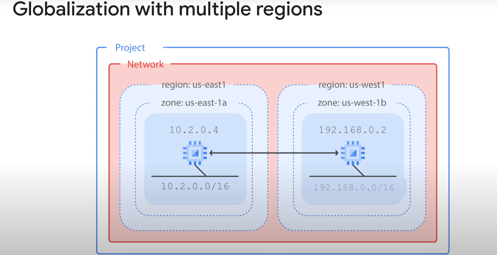

- **Isolation and Failure Independence**:
  - Placing resources in different zones within a single region provides isolation for many types of infrastructure, hardware, and software failures.
  - Placing resources in different regions provides an even higher degree of failure independence.
  - This design allows for robust systems with resources spread across different failure domains.
  - Using a global load balancer (e.g., HTTP load balancer) routes traffic to the region closest to the user, resulting in better latency and lower network traffic costs.

## Security Best Practices

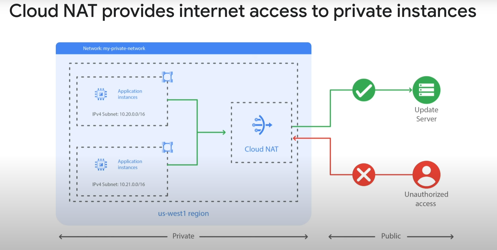

- **Internal IP Addresses**:
  - Assign internal IP addresses to VM instances whenever possible.
  - **Cloud NAT**:
    - Google's managed network address translation service.
    - Allows provisioning of application instances without public IP addresses.
    - Enables private instances to access the internet for updates, patching, configuration management, etc.
    - Implements outbound NAT but not inbound NAT, keeping VPC networks isolated and secure.

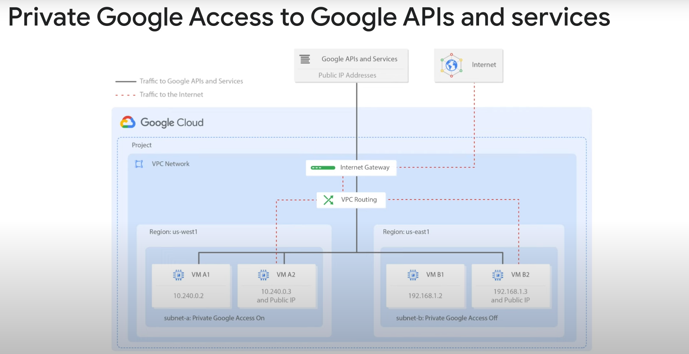

- **Private Google Access**:
  - Allows VM instances with only internal IP addresses to reach the external IP addresses of Google APIs and services.
  - Enable private Google access on a subnet-by-subnet basis.
  - Example:
    - Subnet A with private Google access enabled allows VM A1 to access Google APIs and services without an external IP address.
    - Subnet B with private Google access disabled prevents VM B1 from accessing Google APIs and services without an external IP address.
  - Private Google access has no effect on instances with external IP addresses (e.g., VMs A2 and B2 can access Google APIs and services).

## Example Diagrams

- **Availability Diagram**:
  - Shows VMs in multiple zones within the same subnet for improved availability.

- **Globalization Diagram**:
  - Shows resources in different regions for higher failure independence and better latency.

- **Cloud NAT Diagram**:
  - Illustrates private instances accessing an update server on the internet via Cloud NAT.

- **Private Google Access Diagram**:
  - Demonstrates how private Google access enables or restricts access to Google APIs and services based on subnet settings.

Feel free to explore more networking designs and best practices as you continue with this module!

# Implement Private Google Access and Cloud NAT

## Overview

In this lab, you implement Private Google Access and Cloud NAT for a VM instance that doesn't have an external IP address. Then, you verify access to public IP addresses of Google APIs and services and other connections to the internet.

VM instances without external IP addresses are isolated from external networks. Using Cloud NAT, these instances can access the internet for updates and patches, and in some cases, for bootstrapping. As a managed service, Cloud NAT provides high availability without user management and intervention.

## Objectives

In this lab, you learn how to perform the following tasks:

- Configure a VM instance that doesn't have an external IP address
- Connect to a VM instance using an Identity-Aware Proxy (IAP) tunnel
- Enable Private Google Access on a subnet
- Configure a Cloud NAT gateway
- Verify access to public IP addresses of Google APIs and services and other connections to the internet

## Steps

### 1. Configure a VM Instance Without an External IP Address

- Create a VM instance in your Google Cloud project.
- Ensure the VM does not have an external IP address.

### 2. Connect to the VM Instance Using an IAP Tunnel

- Use Identity-Aware Proxy (IAP) to establish a secure connection to your VM instance.
- Verify that you can access the VM instance through the IAP tunnel.

### 3. Enable Private Google Access on a Subnet

- Navigate to the VPC network section in the Google Cloud Console.
- Select the subnet where your VM instance is located.
- Enable Private Google Access for the subnet.

### 4. Configure a Cloud NAT Gateway

- Go to the Cloud NAT section in the Google Cloud Console.
- Create a new Cloud NAT configuration.
- Attach the Cloud NAT gateway to your VPC network and subnet.

### 5. Verify Access to Public IP Addresses of Google APIs and Services

- From your VM instance, attempt to access a Google API or service using its public IP address.
- Confirm that the connection is successful, indicating that Cloud NAT is functioning correctly.

### 6. Verify Other Connections to the Internet

- Test access to other internet resources from your VM instance.
- Ensure that the VM can reach external sites and services as needed.

# Task 1: Create the VM Instance

## Create a VPC Network and Firewall Rules

First, create a VPC network for the VM instance and a firewall rule to allow SSH access.

1. **Create a VPC Network**
   - In the Cloud Console, on the Navigation menu, click **VPC network > VPC networks**.
   - Click **Create VPC Network**.
   - For **Name**, type `privatenet`.
   - For **Subnet creation mode**, click **Custom**.
   - In **New Subnet**, specify the following, and leave the remaining settings as their defaults:
     - **Name**: `privatenet-us`
     - **Region**: `REGION`
     - **IPv4 address range**: `10.130.0.0/20`
     - Note: Don't enable Private Google access yet!
   - Click **Done**.
   - Click **Create** and wait for the network to be created.

2. **Create Firewall Rules**
   - In the left pane, click **Firewall**.
   - Click **Create Firewall Rule**.
   - Specify the following, and leave the remaining settings as their defaults:
     - **Name**: `privatenet-allow-ssh`
     - **Network**: `privatenet`
     - **Targets**: All instances in the network
     - **Source filter**: IPv4 ranges
     - **Source IPv4 ranges**: `35.235.240.0/20`
     - **Protocols and ports**: Specified protocols and ports
       - For **tcp**, click the checkbox and specify port `22`.
   - Click **Create**.

   Note: In order to connect to your private instance using SSH, you need to open an appropriate port on the firewall. IAP connections come from a specific set of IP addresses (`35.235.240.0/20`). Therefore, you can limit the rule to this CIDR range.

## Create the VM Instance with No Public IP Address

1. In the Cloud Console, on the Navigation menu, click **Compute Engine > VM instances**.
2. Click **Create Instance**.
3. Specify the following, and leave the remaining settings as their defaults:
   - **Name**: `vm-internal`
   - **Region**: `REGION`
   - **Zone**: `ZONE`
   - **Series**: `E2`
   - **Machine type**: `e2-medium (2vCPU, 1 core, 4 GB memory)`
   - **Boot disk**: `Debian GNU/Linux 12 (bookworm)`
4. Click **Advanced options**.
5. Click **Networking**.
6. In **Network interfaces**, click the default network to edit it.
7. Specify the following, and leave the remaining settings as their defaults:
   - **Network**: `privatenet`
   - **Subnetwork**: `privatenet-us`
   - **External IPv4 address**: `None`
   - Note: The default setting for a VM instance is to have an ephemeral external IP address. This behavior can be changed with a policy constraint at the organization or project level. To learn more about controlling external IP addresses on VM instances, refer to the external IP address documentation.
8. Click **Done**.
9. Click **Create**, and wait for the VM instance to be created.
10. On the VM instances page, verify that the **External IP** of `vm-internal` is `None`.
11. Click **Check my progress** to verify the objective.

## SSH to vm-internal to Test the IAP Tunnel

1. In the Cloud Console, click **Activate Cloud Shell**.
2. If prompted, click **Continue**.
3. To connect to `vm-internal`, run the following command:

   ```sh
   gcloud compute ssh vm-internal --zone ZONE --tunnel-through-iap
   ```

4. If prompted, click Authorize.

5. If prompted to continue, type Y.

6 When prompted for a passphrase, press ENTER.

7. When prompted for the same passphrase, press ENTER. Did the command prompt change to @vm-internal?
True
False

8. To test the external connectivity of vm-internal, run the following command:

   ```sh
   ping -c 2 www.google.com
   ```
  
9. Wait for the ping command to complete.

10. To return to your Cloud Shell instance, run the following command:

```sh
exit
```

> ***Note***: When instances do not have external IP addresses, they can only be reached by other instances on the network via a managed VPN gateway or via a Cloud IAP tunnel. Cloud IAP enables context-aware access to VMs via SSH and RDP without bastion hosts. To learn more about this, see the blog post Cloud IAP enables context-aware access to VMs via SSH and RDP without bastion hosts.

## Task 2: Enable Private Google Access

VM instances that have no external IP addresses can use Private Google Access to reach external IP addresses of Google APIs and services. By default, Private Google Access is disabled on a VPC network.

### Create a Cloud Storage Bucket

Create a Cloud Storage bucket to test access to Google APIs and services.

1. In the Cloud Console, on the Navigation menu, click **Cloud Storage > Buckets**.
2. Click **Create**.
3. Specify the following, and leave the remaining settings as their defaults:
   - **Name**: Enter a globally unique name
   - **Location type**: Multi-region
4. Click **Create**. If prompted to enable public access prevention, ensure it is checked and click **Confirm**.

 >**Note** the name of your storage bucket.

5. Store the name of your bucket in an environment variable:

```bash
export MY_BUCKET=[enter your bucket name here]
```

6. Verify it with echo:

```bash

echo $MY_BUCKET

```

### Copy an image file into your bucket

Copy an image from a public Cloud Storage bucket to your own bucket.

1. In Cloud Shell, run the following command:

```bash
gcloud storage cp gs://cloud-training/gcpnet/private/access.svg gs://$MY_BUCKET
```

2. In the Cloud Console, click your bucket name to verify that the image was copied.

You can click on the name of the image in the Cloud Console to view an example of how Private Google Access is implemented.

### Access the image from your VM instance

1. In Cloud Shell, to try to copy the image from your bucket, run the following command:

```bash
gcloud storage cp gs://$MY_BUCKET/*.svg .
```

This should work because Cloud Shell has an external IP address!

2. To connect to vm-internal, run the following command:

```bash
gcloud compute ssh vm-internal --zone ZONE --tunnel-through-iap
```

3. If prompted, type Y to continue.

4. Store the name of your bucket in an environment variable:

  ```bash
  export MY_BUCKET=[enter your bucket name here]
  ```

5. Verify it with echo:

 ```bash
 echo $MY_BUCKET
 ```

6. Try to copy the image to vm-internal, run the following command:

 ```bash
gcloud storage cp gs://$MY_BUCKET/*.svg .
```

7. Press Ctrl+Z to stop the request.

### Enable Private Google Access

Private Google Access is enabled at the subnet level. When it is enabled, instances in the subnet that only have private IP addresses can send traffic to Google APIs and services through the default route (0.0.0.0/0) with a next hop to the default internet gateway.

1. In the Cloud Console, on the Navigation menu (Navigation menu icon), click VPC network > VPC networks.
2. Click privatenet to open the network.
3. Click Subnets, and then click privatenet-us.
4. Click Edit.
5. For Private Google access, select On.
6. Click Save.

7. Run the following command, in Cloud Shell for vm-internal, to try to copy the image to vm-internal.

  ```bash
   gcloud storage cp gs://$MY_BUCKET/*.svg .
  ```

This should work because vm-internal's subnet has Private Google Access enabled!

8. To return to your Cloud Shell instance, run the following command:

  ```bash
  exit
  ```

9. Again type exit if needed to return to your Cloud Shell instance.

  ```bash
  exit
  ```

## Task 3: Configure a Cloud NAT Gateway

Although `vm-internal` can now access certain Google APIs and services without an external IP address, the instance cannot access the internet for updates and patches. Configure a Cloud NAT gateway, which allows `vm-internal` to reach the internet.

### Try to Update the VM Instances

In Cloud Shell, to try to re-synchronize the package index, run the following:

```bash
sudo apt-get update
```

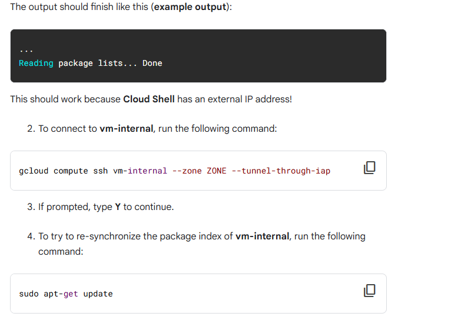
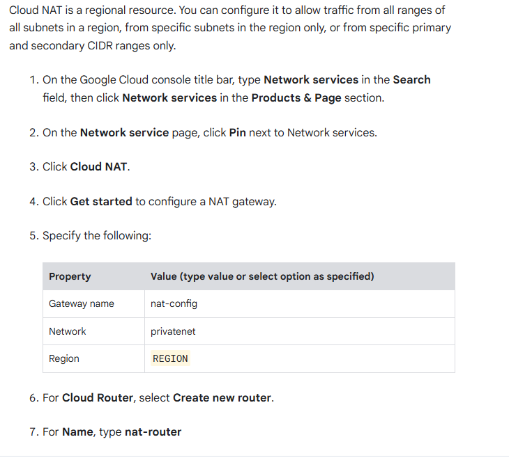

8. Click Create.

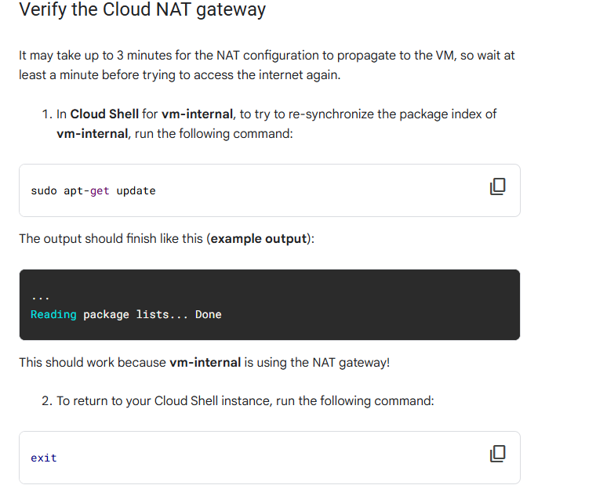
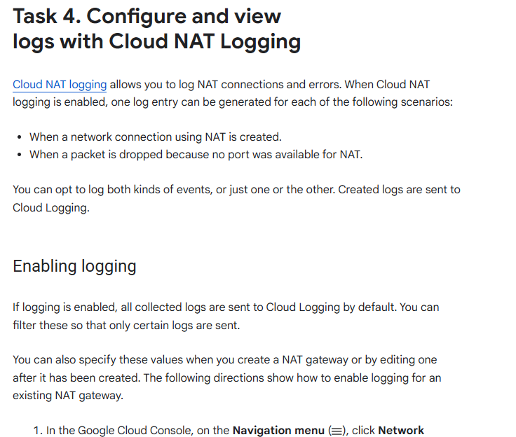
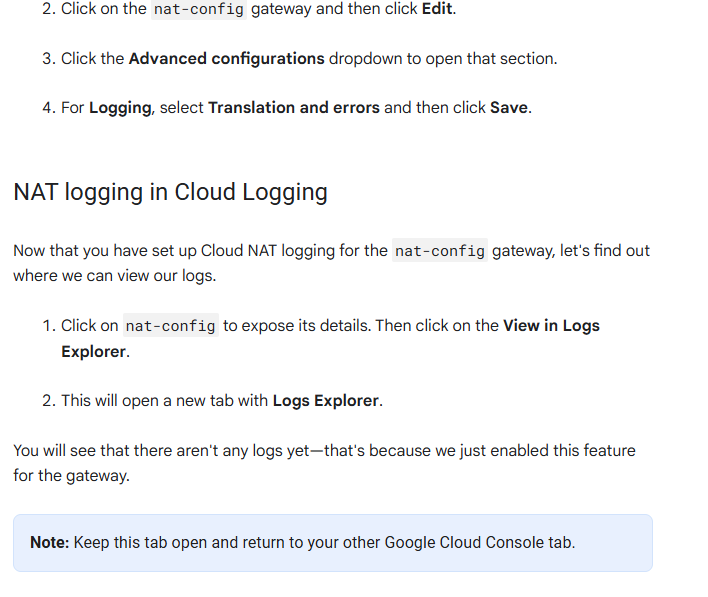
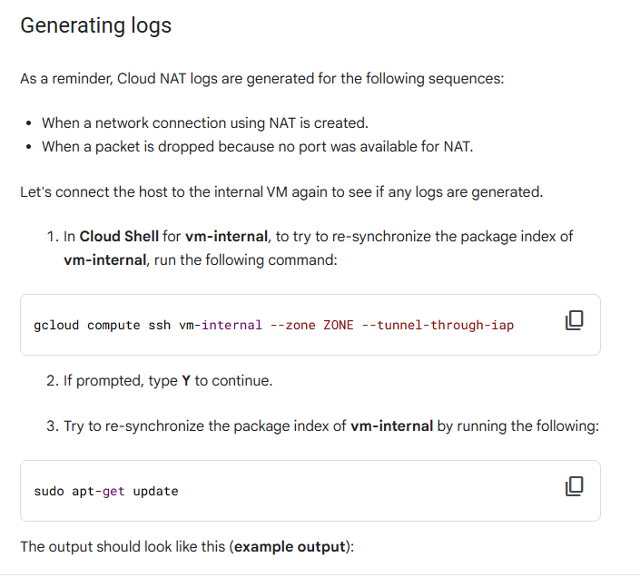
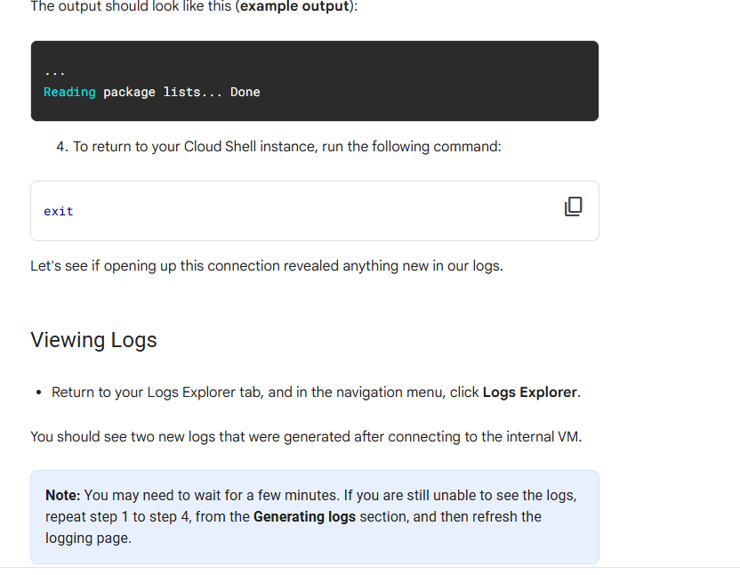

# Google Associate Cloud Engineer Notes

## Module: Virtual Machine Instances (VMs)

### Overview

- **Virtual Machine Instances (VMs)**: Most common infrastructure component in GCP, provided by Compute Engine.
- **VMs vs. Hardware Computers**: VMs are similar to but not identical to hardware computers.
  - Consist of a virtual CPU, memory, disk storage, and an IP address.

### Compute Engine

- **Service**: GCP's service to create VMs.
- **Flexibility**: Offers many options, including some that can't exist in physical hardware.
  - **Micro VM**: Shares a CPU with other VMs, offering less capacity at a lower cost.
  - **Burst Capability**: Some VMs can run above their rated capacity for brief periods using shared physical CPU resources.

### Main VM Options

- **CPU**
- **Memory**
- **Disks**
- **Networking**

### Module Structure

1. **Basics of Compute Engine**
   - Introduction to Compute Engine.
   - Quick lab to familiarize with creating VMs.
2. **CPU and Memory Options**
   - Different configurations for creating VMs.
3. **Images and Disk Options**
   - Various disk options available with Compute Engine.
4. **Common Compute Engine Actions**
   - Actions you might encounter in your day-to-day job.
5. **In-Depth Lab**
   - Explores many features and services covered in the module.

### Getting Started

- **Overview of Compute Engine**: Introduction to the service and its capabilities.'

## Compute and Processing Options in Google Cloud

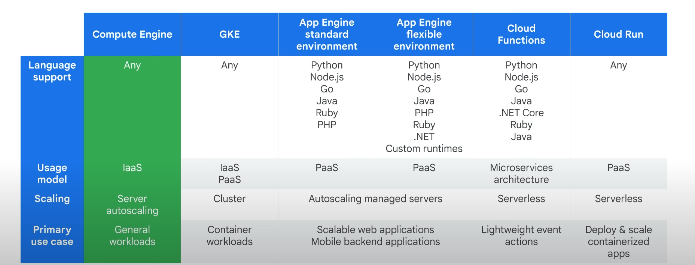

### Introduction

- **Spectrum of Options**: Google Cloud offers a variety of compute and processing options.
- **Focus**: This module focuses on traditional virtual machine instances.

### Compute Engine Flexibility

- **Flexibility**: Compute Engine provides the utmost flexibility.
  - Run any language on your virtual machine.
  - Purely an Infrastructure as a Service (IaaS) model.
  - Manage your VM and operating system.
  - Configure autoscaling rules for adding more VMs in specific situations (covered later in the course).

### Primary Use Case

- **Generic Workloads**: Ideal for enterprise applications designed to run on server infrastructure.
- **Portability**: Easy to run in the cloud.
- **Comparison**: Other services like Google Kubernetes Engine (containerized workloads) may not be as easily transferable from on-premises.

### What is Compute Engine?

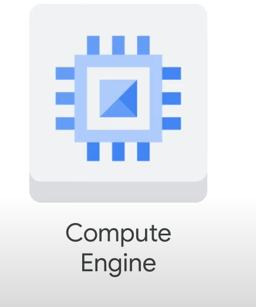

- **Physical Servers**: Similar to physical servers, but running inside Google Cloud.
- **Configurations**: Offers predefined and custom machine types.
  - Choose memory and CPU configurations.
  - Select disk types: persistent disks (standard hard drives or SSDs), local SSDs, Cloud Storage, or a mix.
  - Configure networking interfaces.
  - Run a combination of Linux and Windows machines.

### Features Covered in the Module

- **Machine Rightsizing**
- **Startup and Shutdown Scripts**
- **Metadata**
- **Availability Policies**
- **OS Patch Management**
- **Pricing and Usage Discounts**

### Hardware Limitations and TPUs

- **Limitations**: CPUs and GPUs face scaling limitations for machine learning (ML) demands.
- **Tensor Processing Units (TPUs)**: Introduced by Google in 2016.
  - Custom-developed ASICs for accelerating ML workloads.
  - Domain-specific hardware for higher efficiency.
  - Faster and more energy-efficient than GPUs and CPUs for AI and ML applications.
  - Integrated across Google products and available to Google Cloud customers.
  - Recommended for long-duration training and large models with large batch sizes.

### Compute Options

- **Machine Types**: Several predefined machine types available.
  - Customizable machines if predefined types don't meet needs.
- **CPU and Network Throughput**: Network scales at 2 Gbps per CPU core.
  - Instances with 2 or 4 CPUs receive up to 10 Gbps bandwidth.
  - Maximum throughput of 200 Gbps for instances with 176 vCPUs (C3 machine series).
- **Virtual CPUs (vCPUs)**: Implemented as single hardware hyper-threads on available CPU platforms.
  - Refer to CPU platforms documentation for up-to-date information.

### Next Steps

- **Explore Compute Options**: Detailed discussion on machine types and customization.
- **Documentation**: Refer to course resources for CPU platforms documentation.

### Disk Options

- **Choosing Your Disk**: After selecting compute options, choose your disk type.
  - **Options**: Standard (HDD), SSD, or local SSD.
  - **Standard HDDs**: Spinning hard disk drives.
  - **SSDs**: Flash memory solid-state drives.
  - **Local SSDs**: Attached to physical hardware, offering higher throughput and lower latency.

### Performance vs. Cost

- **Capacity**: Both HDDs and SSDs provide the same disk size capacity when choosing a persistent disk.
- **Cost Structure**: Different pricing structures based on performance.
  - **SSDs**: Higher IOPS per dollar.
  - **Standard Disks**: Higher capacity per dollar.
- **Local SSDs**: Data persists only until the instance is stopped or deleted.
  - Typically used as swap disks or for additional capacity.

### Disk Sizing

- **Standard and Non-Local SSD Disks**: Can be sized up to 257 TB per instance.
- **Performance Scaling**: Performance scales with each GB of allocated space.

### Networking Features

- **Previous Module Lab**: Covered networking features applied to Compute Engine.
  - Created firewall rules using IP addresses and network tags.
- **Load Balancing**: Regional HTTPS load balancing and network load balancing.
  - No pre-warming required.
  - Load balancer applies traffic engineering rules within the Google network.
  - VPC applies rules to your IP address subnet range.

### Future Topics

- **Load Balancers**: More details in a later course of the Architecting with Google Compute Engine series.

### Accessing a VM

- **Root Privileges**: The creator of an instance has full root privileges.
  - **Linux Instances**: Creator has SSH capability and can grant SSH access to other users via the Google Cloud console.
  - **Windows Instances**: Creator can generate a username and password via the console. Users can connect using Remote Desktop Protocol (RDP).

### Firewall Rules

- **SSH and RDP**: Required firewall rules for both protocols.
  - Not needed if using the default network covered in the previous module.

### VM Lifecycle

- **Provisioning State**: Resources (CPU, memory, disks) are reserved but the instance isn't running yet.
- **Staging State**: Resources acquired, instance prepared for launch (adding IP addresses, booting system image).
- **Running State**: Instance goes through startup scripts, enables SSH or RDP access.

### Actions While Running

- **Live Migration**: Move VM to another host in the same zone without rebooting.
- **Other Actions**: Move VM to a different zone, take a snapshot, export system image, reconfigure metadata.

### Stopping and Terminating

- **Stopping**: Required for actions like upgrading the machine (e.g., adding more CPU).
  - Goes through shutdown scripts, ends in the terminated state.
- **Restarting**: Brings instance back to provisioning state.
- **Deleting**: Permanently removes the instance.
- **Resetting**: Similar to pressing the reset button on a computer, wipes memory contents, resets VM to initial state.

### Repairing State

- **Repairing**: Occurs due to internal errors or maintenance.
  - VM is unusable and not billed during repair.
  - Not covered by SLA during repair.
  - If repair succeeds, VM returns to a previous state.

### Suspending State

- **Suspending**: VM enters suspending state before being suspended.
  - Can resume or delete the VM.

### Changing VM State

- **Methods**: Use Google Cloud console, gcloud command, or OS commands (reboot, shutdown).
- **Shutdown Process**: Takes about 90 seconds.
  - **Preemptible VMs**: If not stopped after 30 seconds, Compute Engine sends an ACPI G3 Mechanical Off signal.

### Availability Policy

- **Maintenance Events**: Default behavior is live migration.
  - Can change behavior to terminate instance during maintenance events.

### VM Termination and Restart

- **Automatic Restart**: By default, a terminated VM due to a crash or maintenance event restarts automatically.
  - Can be configured during instance creation or while running.
  - Configure via **Automatic restart** and **On host maintenance** options.
  - Refer to documentation for more details on live migration.

### OS Updates and Patch Management

- **Managing Updates**: Essential for maintaining infrastructure.
  - **Premium Images**: Cost includes OS usage and patch management.
  - **Patch Management**: Keeps infrastructure up-to-date and reduces security vulnerabilities.
  - **OS Patch Management**: Apply patches across Compute Engine VM instances.

### Patch Management Components

1. **Patch Compliance Reporting**: Provides insights on patch status for Windows and Linux VMs.
   - View recommendations for VM instances.
2. **Patch Deployment**: Automates OS and software patch updates.
   - Schedules patch jobs that run across VM instances.

### Patch Management Tasks

- **Patch Approvals**: Select patches to apply from available updates.
- **Flexible Scheduling**: Choose when to run patch updates (one-time or recurring).
- **Advanced Configuration**: Customize patches with pre and post patching scripts.
- **Centralized Management**: Manage patch jobs or updates from a single location.

### VM Termination State

- **Billing**: No charges for memory and CPU resources when VM is terminated.
  - Charged for attached disks and reserved IP addresses.
- **Actions**: Can change machine type, but not the image of a stopped VM.
  - Some actions do not require stopping the VM (e.g., changing availability policies).

### Availability Policies

- **Changing Policies**: Can be done while VM is running.
  - Default behavior is live migration during maintenance events.
  - Can change to terminate instance during maintenance events.

### Diving Deeper into Compute Options: CPU and Memory

#### Creating and Configuring a VM

- **Three Options**:
  1. **Cloud Console**: As used in the previous lab.
  2. **Cloud Shell Command Line**.
  3. **RESTful API**: Ideal for automating and processing complex configurations.
- **Recommendation**: Configure the instance through the Google Cloud console first, then use the equivalent REST request or command line to avoid typos and access dropdown lists of available options.

#### Machine Types

- **Selection**: Choose a machine type from a machine family, which determines the resources available to the VM.
- **Machine Families**: Curated sets of processor and hardware configurations optimized for specific workloads.
  - **Predefined Machine Types**: Available within each machine family.
  - **Custom Machine Types**: Specify the number of vCPUs and the amount of memory.

#### Compute Engine Machine Families

1. **General-purpose**:
   - **Best Price-Performance**: Flexible vCPU to memory ratios.
   - **E2 Machine Series**: Suited for day-to-day computing at a lower cost.
     - **Standard E2 VMs**: 2 to 32 vCPUs, 0.5 GB to 8 GB of memory per vCPU.
     - **Shared-core E2 Machine Types**: 0.25 to 1 vCPUs, 0.5 GB to 8 GB of memory.
   - **N2 and N2D Machine Series**: Next generation following N1 VMs.
     - **N2 VMs**: Up to 128 vCPUs, 0.5 to 8 GB of memory per vCPU.
     - **Processors**: Cascade Lake (up to 80 vCPUs), Ice Lake (larger machine types in specific regions and zones).

2. **Compute-optimized**:
   - **Details to be covered in the next section**.

3. **Memory-optimized**:
   - **Details to be covered in the next section**.

4. **Accelerator-optimized**:
   - **Details to be covered in the next section**.

#### General-purpose Machine Family

- **E2 Machine Series**:
  - **Cost-Effective**: Ideal for web servers, small to medium databases, development and test environments.
  - **Performance Baseline**: Compatible with current N1 VMs.
  - **Shared-core Types**: Cost-effective for small, non-resource intensive applications.

- **N2 and N2D Machine Series**:
  - **Performance Jump**: Significant improvement over N1 VMs.
  - **Flexibility**: Balance between price and performance for a wide range of workloads.
  - **Discounts**: Supports committed use and sustained use discounts.
  - **Latest Processors**: Second generation scalable processor from Intel.

### N2D Machine Series

- **AMD-Based VMs**: General-purpose VMs leveraging EPYC Milan and EPYC Rome processors.
- **vCPUs**: Up to 224 vCPUs per node.

### Tau Machine Series

- **Tau T2D and Tau T2A VMs**: Optimized for cost-effective performance of demanding scale-out workloads.
  - **T2D VMs**: Built on 3rd Gen AMD EPYC processors, full x86 compatibility.
    - **Workloads**: Web servers, containerized microservices, media transcoding, large-scale Java applications.
    - **Specs**: Up to 60 vCPUs per VM, 4 GB of memory per vCPU.
  - **Tau T2A VMs**: First Google Cloud machine series running on Arm processors.
    - **Processor**: 64 core Ampere Altra, 3 GHz all-core frequency.
    - **GKE Support**: Add T2D nodes to GKE clusters for optimized price-performance.

### Compute-Optimized Machine Family

- **Highest Performance Per Core**: Optimized for compute-intensive workloads.
  - **C2 VMs**: Best fit for compute-intensive tasks (AAA gaming, electronic design automation, high-performance computing).
    - **Processors**: High-frequency Intel-scalable processors, Cascade Lake.
    - **Specs**: 4 to 60 vCPUs, up to 240 GB of memory, up to 3 TB local storage.
  - **C2D VMs**: Largest VM sizes, best for high-performance computing.
    - **Specs**: 2 to 112 vCPUs, 4 GB of memory per vCPU, up to 3 TB local storage.
    - **Platform**: Third generation AMD EPYC Milan.
  - **H3 Series**: 88 cores, 352 GB DDR5 memory, Intel Sapphire Rapids CPU, custom Intel Infrastructure Processing Unit (IPU).

### Memory-Optimized Machine Family

- **Most Compute and Memory Resources**: Ideal for workloads requiring higher memory-to-vCPU ratios than high-memory machine types in the general-purpose family.

### Memory-Optimized Machine Family

- **M1 Machine Series**: Up to 4 TB of memory.
- **M2 Machine Series**: Up to 12 TB of memory.
  - **Use Cases**: Large in-memory databases (e.g., SAP HANA), in-memory data analytics workloads.
  - **Cost Efficiency**: Lowest cost per GB of memory on Compute Engine.
  - **Discounts**: Up to 30% sustained use discounts, eligible for committed use discounts (over 60% savings for three-year commitments).

- **M3 VMs**: Up to 128 vCPUs, 30.5 GB of memory per vCPU.
  - **Platform**: Intel Ice Lake CPU.
  - **Use Cases**: Memory-intensive applications (e.g., genomic modeling, electronic design automation, high-performance computing).

### Accelerator-Optimized Machine Family

- **Ideal for CUDA Compute Workloads**: Machine learning, high-performance computing.
  - **A2 Series**: 12 to 96 vCPUs, up to 1360 GB of memory.
    - **GPUs**: Up to 16 NVIDIA Ampere A100 GPUs (40 GB GPU memory each).
    - **Use Cases**: Large language models, databases, high-performance computing.
  - **G2 VMs**: 4 to 96 vCPUs, up to 432 GB of memory.
    - **Platform**: Intel Cascade Lake CPU.
    - **Use Cases**: CUDA-enabled ML training and inference, video transcoding, remote visualization workstation.

### Custom Machine Types

- **When to Use**: Workloads not fitting predefined types, requiring more processing power or memory without all upgrades of larger predefined types.
- **Cost**: Slightly higher than equivalent predefined types.
- **Limitations**:
  - Only machine types with 1 vCPU or an even number of vCPUs can be created.
  - Memory must be between 1 GB and 8 GB per vCPU.
  - Total memory must be a multiple of 256 MB.
  - **Extended Memory**: Available at additional cost for more than 8 GB per vCPU.

### Choosing a Region and Zone

- **Geographical Location**: Consider where you want to run your resources.
- **Current and Planned Regions**: Refer to the map and documentation for up-to-date information.
- **Supported Platforms**: Each zone supports a combination of Ivy Bridge, Sandy Bridge, Haswell, Broadwell, and Skylake platforms.
  - **Example**: Instances in us-central1-a zone use the Sandy Bridge processor.

For more detailed information, refer to the machine types documentation and the module PDF in Course Resources.

### Pricing and Discounts

#### Billing

- **Minimum Charge**: All vCPUs, GPUs, and GB of memory are charged a minimum of 1 minute.
  - Example: Running a VM for 30 seconds is billed for 1 minute.
  - After 1 minute, instances are charged in 1-second increments.
- **Resource-Based Pricing**: Each vCPU and GB of memory is billed separately.
  - Instances are created using predefined machine types, but billed as individual vCPUs and memory used.

#### Discounts

- **Types**: Several discounts available, but cannot be combined.
- **Sustained Use Discounts**: Applied to all predefined machine types usage in a region collectively.
  - **Stable Workloads**: Purchase specific amounts of vCPUs and memory for discounts (1-year or 3-year commitments).
  - **Discount Rates**: Up to 57% for most machine types, up to 70% for memory-optimized machine types.

#### Preemptible and Spot VMs

- **Lower Price**: Run at a much lower price than normal instances.
- **Termination**: Compute Engine might terminate these instances if resources are needed elsewhere.
- **Availability**: Varies with usage.
  - **Preemptible VMs**: Can run for up to 24 hours.
  - **Spot VMs**: No maximum runtime.

#### Custom Machine Types

- **Pricing Customization**: Customize memory and CPU for further pricing customization.
- **VM Sizing Recommendations**: Provided 24 hours after instance creation to optimize resource usage.

#### Free Usage Limits and Sustained Use Discounts

- **Automatic Discounts**: For running specific resources (vCPUs, memory, GPUs) for a significant portion of the billing month.
  - **Discount Rates**: Up to 30% net discount for instances running the entire month.
  - **Effective Discounts**: Increase with usage (e.g., 10% for 50% of the month, 20% for 75%, 30% for 100%).

#### Example Scenario

- **Two Instances in Same Region**:
  - **First Half of Month**: n1-standard-4 instance (4 vCPUs, 15 GB memory).
  - **Second Half of Month**: n1-standard-16 instance (16 vCPUs, 60 GB memory).
  - **Resource Reorganization**: Compute Engine combines usage to qualify for largest sustained usage discounts.
    - **Result**: 4 vCPUs and 15 GB memory for full month, 12 vCPUs and 45 GB memory for half month.

#### Tools

- **Google Cloud Pricing Calculator**: Estimate sustained use discounts for any workload.
- **Documentation**: Refer to machine types documentation for latest specs and details.

### Preemptible VMs

- **Cost-Effective**: Run at a much lower cost than normal instances (60 to 91% discount).
- **Preemption**: Can be preempted at any time, no charge if preempted within the first minute.
- **Lifespan**: Live for up to 24 hours, with a 30-second notification before preemption.
- **Limitations**: No live migrations or automatic restarts.
- **Use Case**: Ideal for batch processing jobs where job slows but does not stop if instances terminate.
- **External Monitoring**: Can use monitoring and load balancers to restart preemptible VMs in case of failure.

### Spot VMs

- **Latest Version of Preemptible VMs**: Use the same pricing model.
- **Features**: No maximum runtime, might be preempted if resources are needed.
- **Availability**: Finite resources, availability varies.
- **Limitations**: Cannot live-migrate to standard VMs or automatically restart during maintenance.
- **Best Practices**: Easier to get capacity for smaller machine types.

### Sole-Tenant Nodes

- **Physical Isolation**: Dedicated server for your project, ensuring compliance requirements.
- **Use Cases**: Payment processing workloads needing isolation.
- **Flexibility**: Can host multiple smaller VM instances, including custom machine types and extended memory.
- **Licensing**: Bring existing OS licenses to Compute Engine.

### Shielded VMs

- **Verifiable Integrity**: Protects against boot or kernel-level malware or rootkits.
- **Shielded Cloud Initiative**: Provides a secure foundation with features like vTPM shielding.
- **Usage**: Requires selecting a shielded image.

### Confidential VMs

- **Data Encryption in Use**: Encrypts data while being processed without performance compromise.
- **Technology**: Uses AMD Secure Encrypted Virtualization (SEV) on AMD Epyc processors.
- **Security**: Keeps sensitive code and data encrypted in memory, Google does not have access to encryption keys.
- **Deployment**: Available via Google Cloud Console, Compute Engine API, or gcloud command-line tool.

### Images

#### Boot Disk Image

- **Components**: Includes boot loader, operating system, file system structure, pre-configured software, and customizations.
- **Types**: Public or custom images.
  - **Public Images**: Available for both Linux and Windows.
  - **Premium Images**: Indicated with a (p), charged per second after a 1-minute minimum (SQL Server images charged per minute after a 10-minute minimum).
    - Prices vary with machine type but are global (do not vary by region or zone).

#### Custom Images

- **Creation**: Pre-install software authorized for your organization.
- **Importing**: Import images from your premises, workstation, or another cloud provider (no-cost service).
- **Sharing**: Share custom images within your project or among other projects.

#### Machine Images

- **Definition**: Compute Engine resource storing configuration, metadata, permissions, and data from one or more disks.
- **Use Cases**: Ideal for system maintenance scenarios such as creation, backup and recovery, and instance cloning.
  - **Disk Backups**: Most suitable for disk backups and instance cloning/replication.

### Disk Options

#### Boot Disk

- **Root Persistent Disk**: Every VM comes with a single root persistent disk.
  - **Bootable**: Can attach to a VM and boot from it.
  - **Durable**: Survives if the VM terminates.
  - **Option**: Disable “Delete boot disk when instance is deleted” to retain the boot disk after VM deletion.

#### Persistent Disks

- **Attachment**: Attached to the VM through the network interface, not physically.
- **Survivability**: Disk survives if the VM terminates.
- **Snapshots**: Perform incremental backups.
- **HDD vs. SSD**: Choice depends on cost and performance.
- **Dynamic Resizing**: Resize disks while running and attached to a VM.
- **Read-Only Mode**: Attach a disk in read-only mode to multiple VMs for sharing static data.

#### Types of Persistent Disks

1. **Zonal Persistent Disks**: Efficient, reliable block storage.
2. **Regional Persistent Disks**: Active-active disk replication across two zones in the same region.
   - **Use Case**: High-performance databases and enterprise applications requiring high availability.

#### Disk Types

- **Standard Persistent Disks**: Backed by HDDs, suitable for large data processing workloads with sequential I/Os.
- **Performance SSD Persistent Disks**: Backed by SSDs, suitable for enterprise applications and high-performance databases.
- **Balanced Persistent Disks**: SSDs balancing performance and cost, suitable for most general-purpose applications.
- **Extreme Persistent Disks**: SSDs designed for high-end database workloads, provision desired IOPS.

#### Encryption

- **Default**: Compute Engine encrypts all data at rest.
- **Options**: Use Cloud Key Management Service (customer-managed encryption keys) or manage your own keys (customer-supplied encryption keys).

#### Local SSDs

- **Attachment**: Physically attached to the VM, providing high IOPS.
- **Size**: 375 GB per partition, up to 24 partitions (9 TB total per instance).
- **Ephemeral**: Data survives reset but not VM stop or terminate.

#### RAM Disks

- **Usage**: Use `tmpfs` for storing data in memory.
- **Performance**: Fastest type of performance for small data structures.
- **Recommendation**: Use high-memory VMs and persistent disks for backup.

#### Disk Limits

- **Persistent Disks**: Limit depends on machine type.
  - **Shared-core**: Up to 16 disks.
  - **Standard, High Memory, High-CPU, Memory-optimized, Compute-optimized**: Up to 128 disks.

#### Throughput and Disk IO

- **Bandwidth Sharing**: Disk IO throughput shares bandwidth with network egress/ingress throughput.

#### Differences from Physical Hard Disks

- **Partitioning**: No need to manually partition or reformat.
- **Redundancy and Snapshots**: Built-in services.
- **Encryption**: Automatic, with option to use your own keys.

### Common Compute Engine Actions

#### Metadata Server

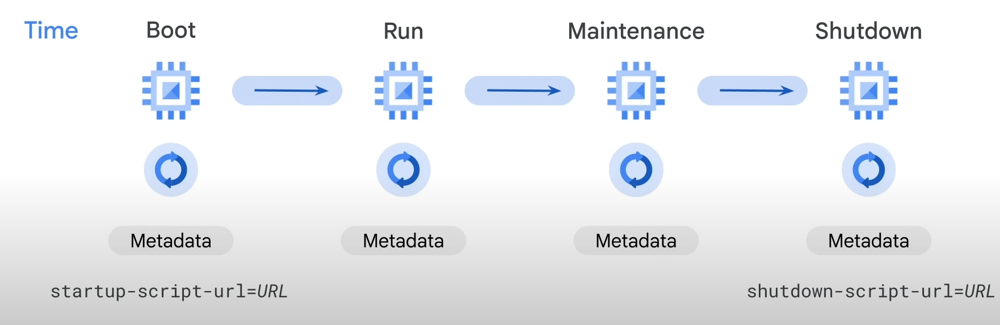

- **Usage**: Stores metadata for each VM instance.
- **Combination with Scripts**: Useful with startup and shutdown scripts to programmatically get unique instance information.
  - **Example**: Use metadata key/value pairs to set up a database with the instance's external IP address.
- **Recommendation**: Store startup and shutdown scripts in Cloud Storage.

#### Moving an Instance to a New Zone

- **Reasons**: Geographical reasons or zone deprecation.
- **Scenarios**: Can move a VM in TERMINATED state or a Shielded VM using UEFI firmware.
- **Automation**: Use `gcloud compute instances move` command for moves within the same region.
- **Manual Move**: For different regions, create snapshots of persistent disks, create new disks in the destination zone, and attach them to a new VM.

#### Snapshots

- **Use Cases**: Backup critical data, migrate data between zones, transfer data to different disk types.
- **Persistent Disk Snapshots**: Available only for persistent disks, not local SSDs.
  - **Incremental and Compressed**: Faster and cheaper than full disk images.
  - **Snapshot Schedule**: Regularly and automatically back up disks.
- **Restoration**: Restore snapshots to new persistent disks for zone moves.

#### Resizing Persistent Disks

- **Benefit**: Increase storage capacity and improve I/O performance.
- **Dynamic Resizing**: Can resize while disk is attached to a running VM.
- **Limitation**: Disks can be grown in size but not shrunk.

# Working with Virtual Machines

## Overview

In this lab, you set up a game application—a Minecraft server.

- **Server Software**: Runs on a Compute Engine instance.
- **Machine Type**: e2-medium with a 10-GB boot disk, 2 virtual CPUs (vCPUs), and 4 GB of RAM (Debian Linux by default).
- **Additional Storage**: Attach a high-performance 50-GB persistent SSD to the instance.
- **Capacity**: Supports up to 50 players.

## Objectives

In this lab, you will learn how to:

1. **Customize an Application Server**
2. **Install and Configure Necessary Software**
3. **Configure Network Access**
4. **Schedule Regular Backups**
