# Google Associate Cloud Engineer Notes

## Module: Cloud Identity and Access Management (Cloud IAM)

### Overview

In this module, we cover Cloud Identity and Access Management or Cloud IAM.

### Introduction

Cloud IAM is a sophisticated system built on top of email-like address names, job type roles, and granular permissions. If you're familiar with IAM from other implementations, look for the differences that Google has implemented to make IAM easier to administer and more secure.

### High-Level Perspective

We will start by introducing Cloud IAM from a high-level perspective.

### Components of Cloud IAM

We will then dive into each of the components within Cloud IAM:

- **Organizations**
- **Roles**
- **Members**
- **Service Accounts**

### Best Practices

I will also introduce some best practices to help you apply these concepts in your day-to-day work.

### Hands-On Lab

Finally, you will gain firsthand experience with Cloud IAM through a Lab.

Let's get started with an overview of Cloud Identity and Access Management.

### What is Identity Access Management?

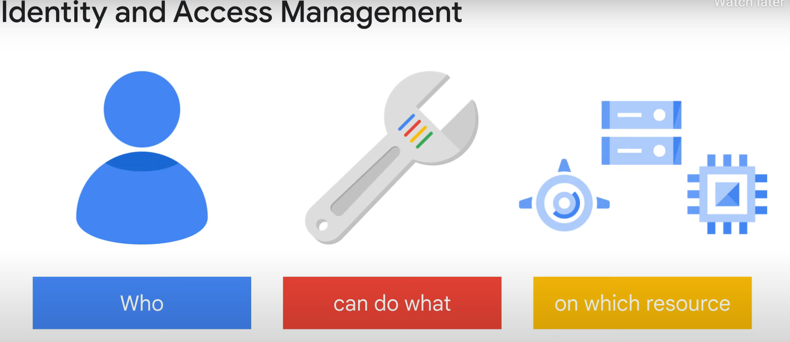

Identity Access Management (IAM) is a way of identifying who can do what on which resource.

- **Who**: This can be a person, group, or application.
- **What**: Refers to specific privileges or actions.
- **Resource**: Could be any Google Cloud service.

For example, you could be given the privilege or role of **compute viewer**, which provides read-only access to get and list Compute Engine resources without being able to read the data stored on them.

### Cloud IAM Objects

Cloud IAM is composed of different objects, which we will cover in this module.

### Cloud IAM Policies and Resource Hierarchy

To understand where these objects fit in, let's look at Cloud IAM policies and the Cloud IAM resource hierarchy.

#### Resource Hierarchy

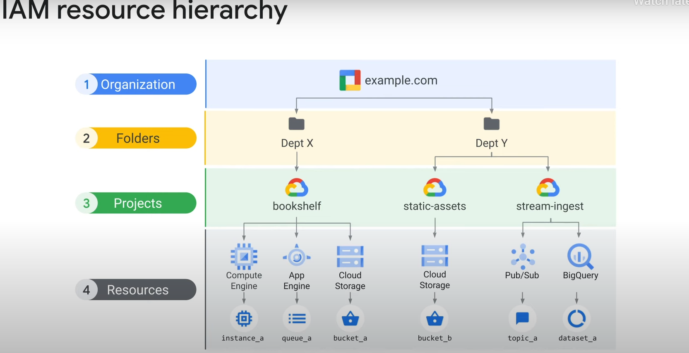

Google Cloud resources are organized hierarchically as shown in this tree structure:

- **Organization Node**: The root node in this hierarchy.
- **Folders**: Children of the organization.
- **Projects**: Children of folders.
- **Individual Resources**: Children of projects.

Each resource has exactly one parent.

- **Organization Resource**: Represents your company. Cloud IAM roles granted at this level are inherited by all resources under the organization.
- **Folder Resource**: Could represent your department. Cloud IAM roles granted at this level are inherited by all resources that the folder contains.
- **Projects**: Represent a trust boundary within your company. Services within the same project have the same default level of trust.

### Organization Node

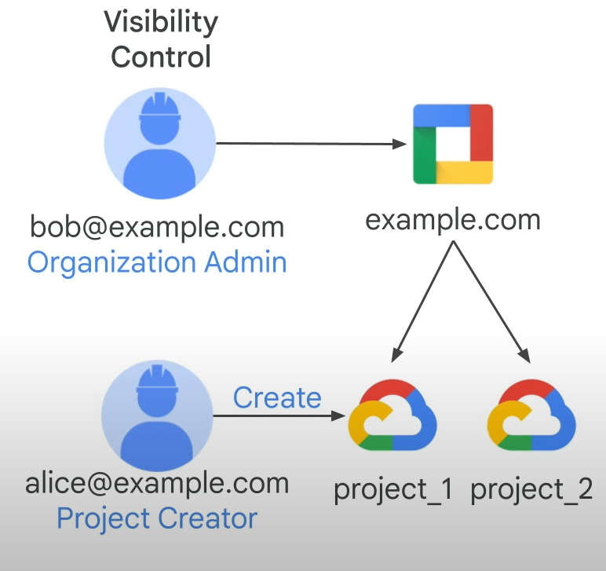

The organization resource is the root node in the GCP resource hierarchy. This node has many roles, such as:

- **Organization Admin**: Provides a user like Bob with access to administer all resources belonging to his organization, which is useful for auditing.
- **Project Creator**: Allows a user like Alice to create projects within her organization. This role can also be applied at the organization level, which would then be inherited by all the projects within the organization.

The organization resource is closely associated with a G Suite or Cloud Identity Account. When a user with a G Suite or Cloud Identity Account creates a GCP project, an organization resource is automatically provisioned for them. Google Cloud then communicates its availability to the G Suite or Cloud Identity super admins.

#### Key Roles and Responsibilities

- **G Suite or Cloud Identity Super Administrators**:
  - Assign the organization admin role to some users.
  - Be a point of contact in case of recovery issues.
  - Control the lifecycle of the G Suite or Cloud Identity account and organization resource.

- **Organization Admin**:
  - Define IAM policies.
  - Determine the structure of the resource hierarchy.
  - Delegate responsibility over critical components such as networking, billing, and resource hierarchy through IAM roles.

Following the principle of least privilege, the organization admin role does not include the permission to perform other actions, such as creating folders. To get these permissions, an organization admin must assign additional roles to their account.

### Folders

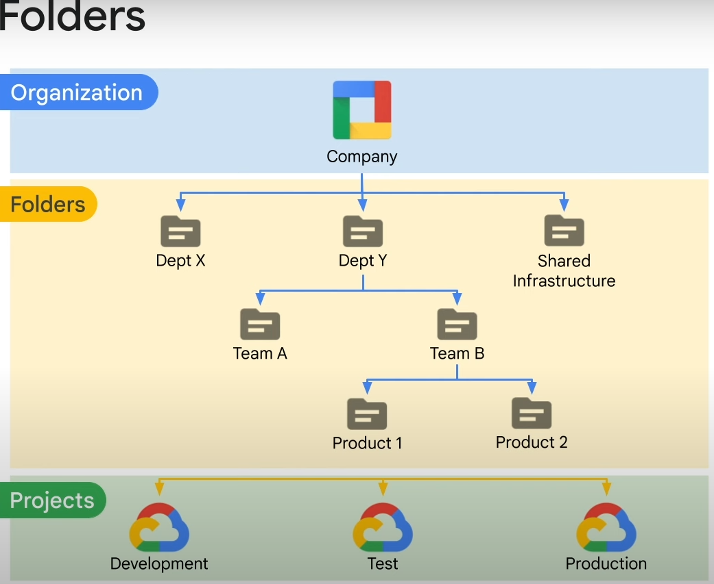

Folders can be viewed as sub-organizations within the organization. They provide an additional grouping mechanism and isolation boundary between projects. Folders can be used to model different legal entities, departments, and teams within a company.

- **First-Level Folders**: Represent the main departments in your organization, like departments X and Y.
- **Subfolders**: Represent different teams, like teams A and B, and can contain additional subfolders to represent different applications, like products 1 and 2.

Folders allow delegation of administration rights. For example, each head of a department can be granted full ownership of all GCP resources that belong to their department. Similarly, access to resources can be limited by folder, so users in one department can only access and create GCP resources within that folder.

### Resource Manager Roles

Remember that policies are inherited from top to bottom.

- **Organization Node**:
  - **Viewer Role**: Grants view access to all resources within an organization.

- **Folder Node**:
  - **Admin Role**: Provides full control over folders.
  - **Creator Role**: Allows browsing the hierarchy and creating folders.
  - **Viewer Role**: Allows viewing folders and projects below a resource.

- **Project Node**:
  - **Creator Role**: Allows a user to create new projects, making that user automatically the owner.
  - **Project Deleter Role**: Grants deletion privileges for projects.

  ### Roles in Cloud IAM

Roles define the "can do what on which resource" part of Cloud IAM. There are three types of roles in Cloud IAM:

1. **Basic Roles**
2. **Predefined Roles**
3. **Custom Roles**

#### Basic Roles

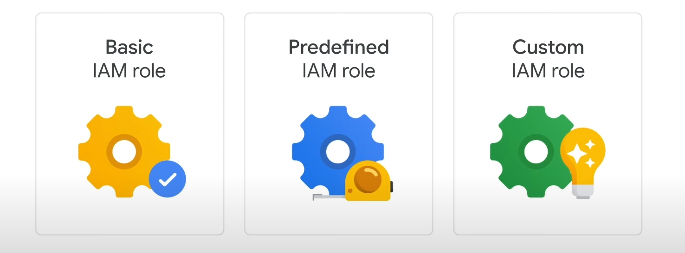

Basic roles are the original roles available in the Cloud console, but they are broad. You apply them to a Google Cloud project, and they affect all resources in that project. IAM basic roles offer fixed, coarse-grained levels of access:

- **Owner**: Full administrative access, including the ability to add and remove members and delete projects.
- **Editor**: Modify and delete access, allowing developers to deploy applications and modify or configure resources.
- **Viewer**: Read-only access.
- **Billing Administrator**: Manages billing and adds or removes administrators without the right to change the resources in the project.

Each project can have multiple owners, editors, viewers, and billing administrators.

#### Predefined Roles

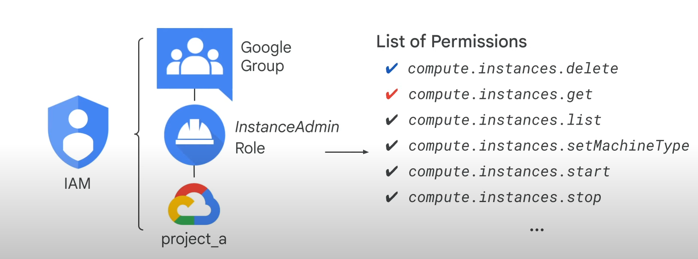

GCP services offer their own set of predefined roles, which define where the roles can be applied. These roles provide members with granular access to specific GCP resources and prevent unwanted access to other resources. These roles are a collection of permissions, as meaningful operations usually require more than one permission.

For example, a group of users granted the **Instance Admin** role on a project will have all the Compute Engine permissions needed to manage instances.

- **Compute Admin**: Full control of all Compute Engine resources, including all permissions that start with `compute`.
- **Network Admin**: Permissions to create, modify, and delete network resources, except for firewall rules and SSL certificates. Allows read-only access to firewall rules, SSL certificates, and instances to view their ephemeral IP addresses.
- **Storage Admin**: Permissions to create, modify, and delete disks, images, and snapshots.

For the full list of predefined roles for Compute Engine, refer to the links section in the slides.

#### Custom Roles

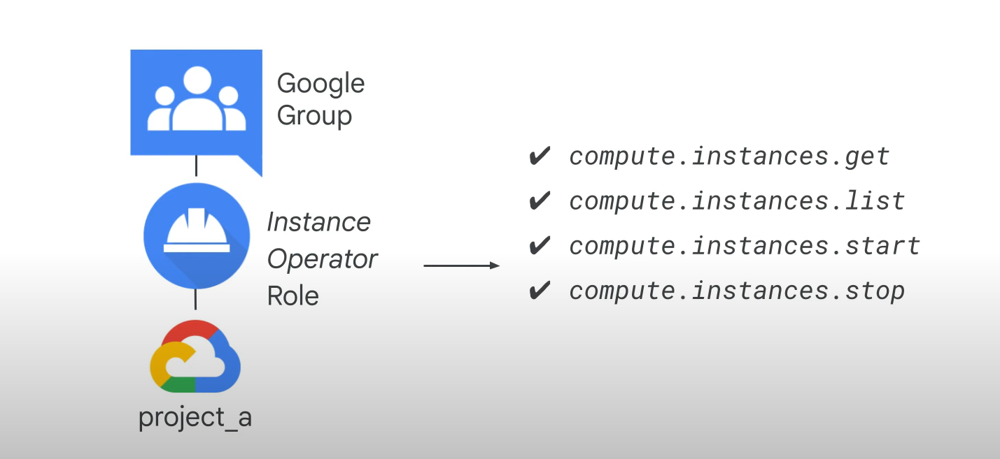

Roles are meant to represent abstract functions and are customized to align with real jobs. However, if predefined roles do not have enough permissions or you need something finer-grained, custom roles allow you to define specific permissions.

Many companies use the least privileged model, where each person in the organization is given the minimal amount of privilege needed to do their job. For example, you can define an **Instance Operator** role to allow some users to start and stop Compute Engine virtual machines without reconfiguring them.

Custom roles enable you to tailor permissions to fit specific needs within your organization.

### Members in Cloud IAM

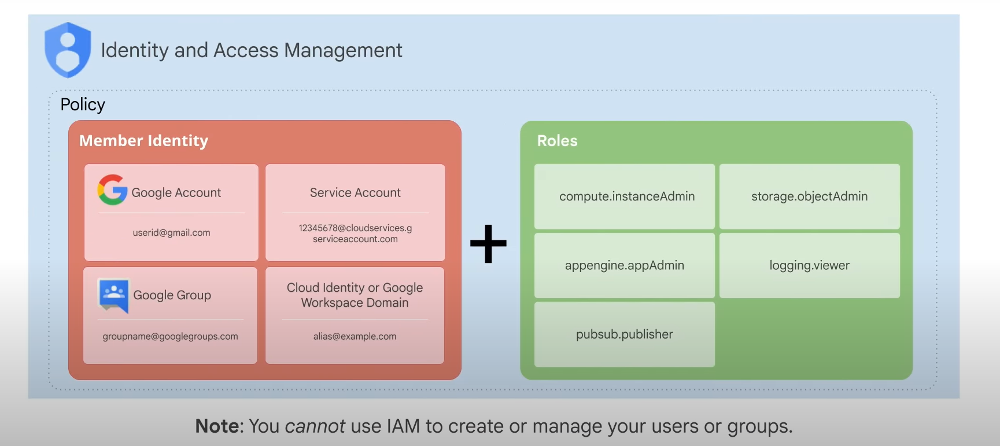

Members define the “who” part of “who can do what on which resource.” There are five different types of members:

1. **Google Accounts**: Represents a developer, an administrator, or any other person who interacts with Google Cloud. Any email address associated with a Google account can be an identity, including gmail.com or other domains. New users can sign up for a Google account without using Gmail.

2. **Service Accounts**: Accounts that belong to your application instead of an individual end user. When you run code hosted on Google Cloud, you specify the account that the code should run as. You can create multiple service accounts to represent different logical components of your application.

3. **Google Groups**: Named collections of Google accounts and service accounts. Each group has a unique email address. Google groups are a convenient way to apply an access policy to a collection of users, allowing you to grant and change access controls for the whole group at once.

4. **Google Workspace Domains**: Represents a virtual group of all the Google accounts created in an organization's Workspace account. Workspace domains represent your organization's internet domain name, such as example.com. When you add a user to your Workspace domain, a new Google account is created for the user inside this virtual group.

5. **Cloud Identity Domains**: Provides similar capabilities to Workspace domains for Google Cloud customers who are not Workspace customers. Cloud Identity lets you manage users and groups using the Google Admin Console without paying for or receiving Workspace’s collaboration products.

#### Policies and Bindings

A policy consists of a list of bindings. A binding binds a list of members to a role, where the members can be user accounts, Google groups, Google domains, and service accounts. A role is a named list of permissions defined by IAM.

#### IAM Resource Hierarchy

A policy is a collection of access statements attached to a resource. Each policy contains a set of roles and role members, with resources inheriting policies from their parent. Resource policies are a union of parent and resource policies, where a less restrictive parent policy will always override a more restrictive resource policy.

The IAM policy hierarchy follows the same path as the Google Cloud resource hierarchy. Changing the resource hierarchy also changes the policy hierarchy. For example, moving a project into a different organization updates the project's IAM policy to inherit from the new organization's IAM policy. Child policies cannot restrict access granted at the parent level.

#### Best Practices

- **Principle of Least Privilege**: Always select the smallest scope necessary for the task to reduce exposure to risk.
- **Recommender for Role Recommendations**: Identifies and removes excess permissions from your principals, improving your resources’ security configurations. Recommender uses policy insights, which are ML-based findings about permission usage in your project, folder, or organization.

#### Allow Policies

Allow policies, also known as IAM policies, are attached to resources and control access to the resource itself and any descendants that inherit the allow policy. An allow policy associates one or more principals (members or identities) with a single IAM role and any context-specific conditions that change how and when the role is granted.

For example:

- **Jie (<jie@example.com>)** is granted the **Organization Admin** predefined role (`roles/resourcemanager.organizationAdmin`), which contains permissions for organizations, folders, and limited projects operations.
- **Jie and Raha (<raha@example.com>)** are granted the ability to create projects via the **Project Creator** role (`roles/resourcemanager.projectCreator`).

Together, these role bindings grant fine-grained access to both Jie and Raha, with Jie having more access than Raha.

### Deny Policies

With deny policies, you can define deny rules that prevent certain principals from using certain permissions, regardless of the roles they're granted. Deny policies are made up of deny rules. Each deny rule specifies:

- A set of principals that are denied permissions.
- The permissions that the principals are denied or unable to use.
- Optionally, a condition that must be true for the permission to be denied.

When a principal is denied a permission, they can't do anything that requires that permission, regardless of the IAM roles they've been granted. This is because IAM always checks relevant deny policies before checking relevant allow policies.

### IAM Conditions

IAM Conditions allow you to define and enforce conditional, attribute-based access control for Google Cloud resources. With IAM Conditions, you can choose to grant resource access to identities (members) only if configured conditions are met. For example, you can configure temporary access for users in the event of a production issue or limit access to resources only for employees making requests from your corporate office.

Conditions are specified in the role bindings of a resource's IAM policy. When a condition exists, the access request is only granted if the condition expression evaluates to true. Each condition expression is defined as a set of logic statements allowing you to specify one or more attributes to check.

### Organization Policies

An organization policy is a configuration of restrictions, defined by configuring a constraint with the desired restrictions for that organization. An organization policy can be applied to the organization node and all of its folders or projects within that node. Descendants of the targeted resource hierarchy inherit the organization policy that has been applied to their parents. Exceptions to these policies can be made, but only by a user who has the organization policy admin role.

### Synchronizing Users and Groups

If you already have a different corporate directory, you can get your users and groups into Google Cloud using Google Cloud Directory Sync. This tool synchronizes users and groups from your existing Active Directory or LDAP system with the users and groups in your Cloud Identity domain. The synchronization is one-way only, meaning no information in your Active Directory or LDAP map is modified. Google Cloud Directory Sync is designed to run scheduled synchronizations without supervision, after its synchronization rules are set up.

### Single Sign-On (SSO) Authentication

Google Cloud also provides single sign-on (SSO) authentication. If you have your identity system, you can continue using your own system and processes with SSO configured. When user authentication is required, Google will redirect to your system. If the user is authenticated in your system, access to Google Cloud is given; otherwise, the user is prompted to sign in. This allows you to also revoke access to Google Cloud.

If your existing authentication system supports SAML2, SSO configuration is as simple as three links and a certificate. Otherwise, you can use a third-party solution like ADFS, Ping, or Okta. Additionally, if you want to use a Google account but are not interested in receiving mail through Gmail, you can still create an account without Gmail.

### Service Accounts

A service account is an account that belongs to your application instead of to an individual end user. This provides an identity for carrying out service-to-service interactions in a project without supplying user credentials.

For example, if you write an application that interacts with Google Cloud Storage, it must first authenticate to either the Google Cloud Storage XML API or JSON API. You can enable service accounts and grant read-write access to the account on the instance where you plan to run your application. Then, program the application to obtain credentials from the service account. Your application authenticates seamlessly to the API without embedding any secret keys or credentials in your instance, image, or application code.

Service accounts are identified by an email address. There are three types of service accounts:

1. **User-Created or Custom Service Accounts**
2. **Built-In Service Accounts**
3. **Google APIs Service Accounts**

By default, all projects come with the built-in Compute Engine default service account. Additionally, all projects come with a Google Cloud APIs service account, identifiable by the email: `project-number@cloudservices.gserviceaccount.com`. This service account is designed specifically to run internal Google processes on your behalf and is automatically granted the Editor role on the project.

Alternatively, you can start an instance with a custom service account. Custom service accounts provide more flexibility than the default service account but require more management from you. You can create as many custom service accounts as you need, assign any arbitrary access scopes or IAM roles to them, and assign the service accounts to any virtual machine instance.

#### Default Compute Engine Service Account

This account is automatically created per project and is identifiable by the email `project-number-compute@developer.gserviceaccount.com`. It is automatically granted the Editor role on the project. When you start a new instance using `gcloud`, the default service account is enabled on that instance. You can override this behavior by specifying another service account or by disabling service accounts for the instance.

#### Authorization and Scopes

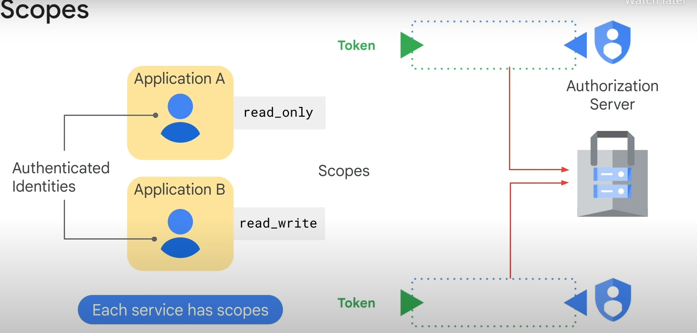

Authorization is the process of determining what permissions an authenticated identity has on a set of specified resources. Scopes are used to determine whether an authenticated identity is authorized. For example, applications requesting access to a Cloud Storage bucket receive an access token with specific scopes (e.g., read-only or read-write).

Scopes can be customized when you create an instance using the default service account. These scopes can be changed after an instance is created by stopping it. Access scopes are the legacy method of specifying permissions for your VM. For user-created service accounts, use IAM roles instead to specify permissions.

#### Assigning Roles to Service Accounts

Roles for service accounts can also be assigned to groups or users. For example, you can create a service account with the `InstanceAdmin` role, which has permissions to create, modify, and delete virtual machine instances and disks. You can then provide users or a group with the `Service Account User` role, allowing them to act as that service account to create, modify, and delete virtual machine instances and disks.

Users who are `Service Account Users` for a service account can access all the resources that the service account has access to. Therefore, be cautious when granting the `Service Account User` role to a user or group.

#### Example

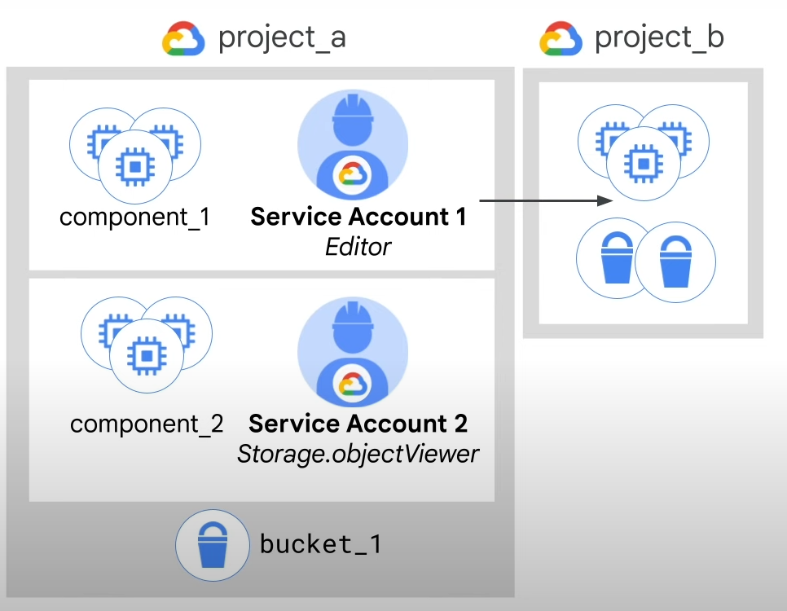

- VMs running component_1 are granted Editor access to project_b using Service Account 1.
- VMs running component_2 are granted objectViewer access to bucket_1 using an isolated Service Account 2.

This way, you can scope permissions for VMs without re-creating VMs. IAM lets you slice a project into different microservices, each with access to different resources, by creating service accounts to represent each one. You assign the service accounts to the VMs when they are created, and Google Cloud manages security for you.

#### Service Account Authentication

There are two types of service account keys:

1. **Google-Managed Keys**: Google stores both the public and private portion of the key and rotates them regularly. Each public key can be used for signing for a maximum of two weeks. The private key is always held securely in escrow and is never directly accessible.

2. **User-Managed Keys**: You can create and manage your own service account keys if you want to use service accounts outside of Google Cloud or want a different rotation period. Google only stores the public portion of a user-managed key. The user is responsible for the security of the private key and performing other management operations such as key rotation. Users can create up to 10 service account keys per service account to facilitate key rotation.

User-managed keys can be managed using the IAM API, the `gcloud` command-line tool, or the Service Accounts page in the Google Cloud console. Google does not save your user-managed private keys, so if you lose them, Google cannot help you recover them. You are responsible for keeping these keys safe and performing key rotation. User-managed keys should be used as a last resort. Consider alternatives such as short-lived service account credentials (tokens) or service account impersonation.

The `gcloud` command line is a fast and easy way to list all of the keys associated with a particular service account.

### Organization Restrictions

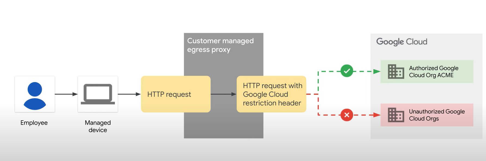

The Organization Restrictions feature helps prevent data exfiltration through phishing or insider attacks. For managed devices in an organization, this feature restricts access only to resources in authorized Google Cloud organizations.

#### Purpose

Organizations need to restrict access of their employees only to resources in authorized Google Cloud organizations. Google Cloud administrators and egress proxy administrators work together to set up organization restrictions.

#### How It Works

- **Managed Device**: Governed by the organizational policies of a company. Employees use managed devices to access organization resources.
- **Egress Proxy Administrator**: Configures the proxy to add organization restrictions headers to any requests originating from a managed device. This configuration prevents users from accessing any Google Cloud resources in non-authorized Google Cloud organizations.
- **Google Cloud**: Inspects all requests for organization restrictions headers and allows or denies the requests based on the organization being accessed.

#### Use Cases

- **Restrict Access**: Employees can access resources only in your Google Cloud organization and not other organizations.
- **Conditional Access**: Allow employees to read from Cloud Storage resources but restrict access only to resources in your Google Cloud organization.
- **Vendor Access**: Allow employees to access a vendor Google Cloud organization in addition to your Google Cloud organization.

### Cloud IAM Best Practices

#### Resource Hierarchy

1. **Leverage and Understand the Resource Hierarchy**:
   - Use projects to group resources that share the same trust boundary.
   - Check the policy granted on each resource and recognize the inheritance.
   - Use the principle of least privilege when granting roles.
   - Audit policies using Cloud audit logs and audit memberships of groups using policies.

#### Granting Roles

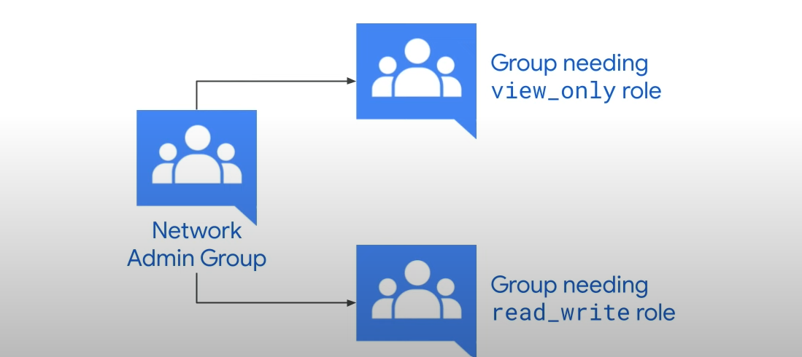

2. **Grant Roles to Groups Instead of Individuals**:
   - Update group membership instead of changing a Cloud IAM policy.
   - Audit membership of groups used in policies and control the ownership of the Google group used in Cloud IAM policies.
   - Use multiple groups for better control. For example, a network admin group can have members with different roles (read-write or read-only) to a Cloud Storage bucket. Adding and removing individuals from all three groups controls their total access.

#### Service Accounts

3. **Best Practices for Using Service Accounts**:
   - Be cautious when granting the service accounts user role as it provides access to all the resources the service account has access to.
   - Give service accounts a display name that clearly identifies their purpose, ideally using an established naming convention.
   - Establish key rotation policies and methods and audit keys with the `serviceAccount.keys.list` method.

#### Cloud Identity-Aware Proxy (Cloud IAP)

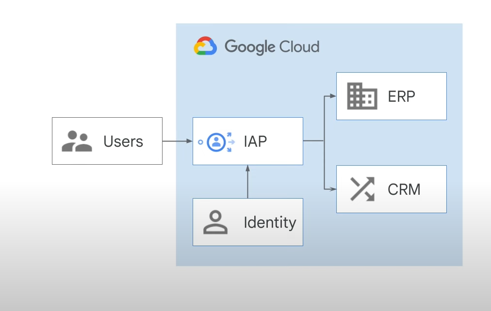

4. **Use Cloud Identity-Aware Proxy (Cloud IAP)**:
   - Establish a central authorization layer for applications accessed by HTTPS.
   - Use an application-level access control model instead of relying on network-level firewalls.
   - Applications and resources protected by Cloud IAP can only be accessed through the proxy by users and groups with the correct Cloud IAM role.
   - When you grant a user access to an application or resource via Cloud IAP, they are subject to the fine-grained access controls implemented by the product in use without requiring a VPN.
   - Cloud IAP performs authentication and authorization checks when a user tries to access a Cloud IAP secure resource.
