# Google Associate Cloud Engineer: Storage and Database Services

## Overview

In this module, we cover storage and database services in Google Cloud.

### Key Points

- Every application needs to store data, whether it's business data, media to be streamed, or sensor data from devices.
- From an application-centered perspective, the technology stores and retrieves the data.
- Whether it's a database or an object store is less important than whether that service supports the application’s requirements for efficiently storing and retrieving the data, given its characteristics.
- Google offers several data storage services to choose from.

### Services Covered

- Cloud Storage
- Filestore
- Cloud SQL
- Cloud Spanner
- AlloyDB
- Firestore
- Cloud Bigtable
- Memorystore

## High-Level Overview

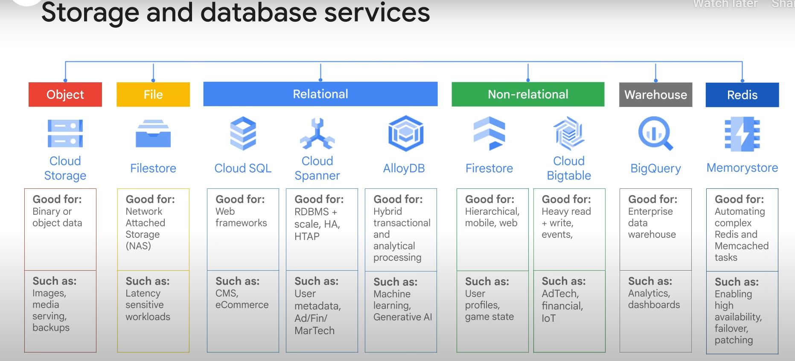

This table shows the storage and database services and highlights the storage service type, what each service is good for, and intended use.

### BigQuery

- BigQuery sits on the edge between data storage and data processing.
- You can store data in BigQuery, but the intended use for BigQuery is big data analysis and interactive querying.
- BigQuery is covered later in the course.

## Decision Tree for Choosing a Service

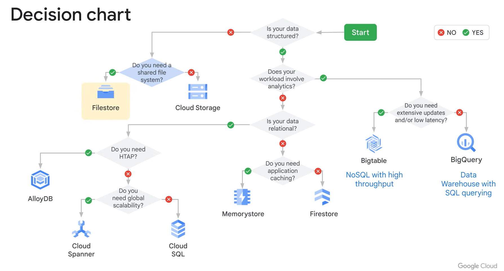

## Scope of the Module

- The purpose of this module is to explain which services are available and when to consider using them from an infrastructure perspective.
- You should be able to set up and connect to a service without detailed knowledge of how to use a database system.
- For a deeper dive into the design, organizations, structures, schemas, and details on how data can be optimized, served, and stored properly within those different services, refer to Google Cloud’s Data Engineering courses.

## Agenda

- This module covers all of the services mentioned.
- You will apply these services in two labs.
- A quick overview of Memorystore, Google Cloud’s fully managed Redis service, is also provided.

## Cloud Storage

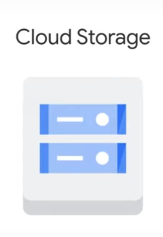

Cloud Storage is Google Cloud’s object storage service, allowing worldwide storage and retrieval of any amount of data at any time.

### Key Features

- **Scalable**: Up to exabytes of data.
- **Fast**: Time to first byte is in milliseconds.
- **High Availability**: Across all storage classes.
- **Single API**: Consistent API across all storage classes.

### Usage Scenarios

- Serving website content.
- Storing data for archival and disaster recovery.
- Distributing large data objects to users via direct download.

### Storage Structure

- **Buckets**: Collections of objects, not a traditional file system.
  - Globally unique names.
  - Cannot be nested.
- **Objects**: Data stored in buckets (e.g., text files, doc files, video files).
  - Inherit the storage class of the bucket.
  - No minimum size.
  - Accessible via specific URLs.

### Storage Classes

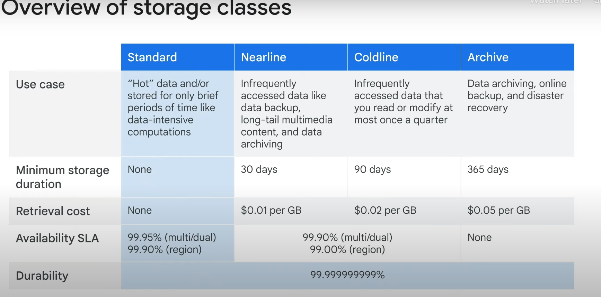

1. **Standard Storage**
   - **Best for**: Frequently accessed data ("hot" data), short-term storage.
   - **Cost**: Most expensive, no minimum storage duration, no retrieval cost.
   - **Use Cases**:
     - Regional: Co-located with Google Kubernetes Engine clusters or Compute Engine instances.
     - Dual-region: Optimized performance and improved availability.
     - Multi-region: Global access, suitable for website content, streaming videos, interactive workloads, mobile and gaming applications.

2. **Nearline Storage**
   - **Best for**: Infrequently accessed data (e.g., data backup, long-tail multimedia content, data archiving).
   - **Cost**: Lower than Standard Storage, 30-day minimum storage duration, costs for data access.
   - **Trade-offs**: Slightly lower availability.

3. **Coldline Storage**
   - **Best for**: Very infrequently accessed data.
   - **Cost**: Lower than Nearline Storage, 90-day minimum storage duration, higher costs for data access.
   - **Trade-offs**: Slightly lower availability.

4. **Archive Storage**
   - **Best for**: Data archiving, online backup, disaster recovery.
   - **Cost**: Lowest, 365-day minimum storage duration, higher costs for data access and operations.
   - **Trade-offs**: Suitable for data accessed less than once a year.

### Durability and Availability

- **Durability**: 11 nines (99.999999999%) across all storage classes.
  - Ensures data is not lost.
- **Availability**: Varies between storage classes and location types.

### Accessing Data

- **Commands**: `gcloud storage` command, JSON or XML APIs.
- **Storage Class Assignment**: Objects inherit the bucket's storage class unless specified otherwise.
- **Changing Storage Class**: Possible without moving the object or changing its URL.

### Object Lifecycle Management

- Helps manage the classes of objects in your bucket.
- More details to be covered later.

## Access Control

### IAM (Identity and Access Management)

- **Purpose**: Control which individual user or service account can see the bucket, list objects, view object names, or create new buckets.
- **Inheritance**: Roles are inherited from project to bucket to object.
- **Sufficiency**: For most purposes, IAM is sufficient.

### Access Control Lists (ACLs)

- **Purpose**: Offer finer control over access to buckets and objects.
- **Maximum Entries**: 100 ACL entries per bucket or object.
- **Components**:
  - **Scope**: Defines who can perform specified actions (e.g., specific user or group of users).
  - **Permission**: Defines what actions can be performed (e.g., read or write).
- **Identifiers**:
  - **allUsers**: Represents anyone on the internet, with or without a Google account.
  - **allAuthenticatedUsers**: Represents anyone authenticated with a Google account.

### Signed URLs

- **Purpose**: Provide time-limited access to a bucket or object using a cryptographic key.
- **Use Case**: Easier and more efficient for granting limited-time access tokens, especially when users do not have a Google account.
- **Creation**:
  - Create a URL that grants read or write access to a specific Cloud Storage resource.
  - Specify when the access expires.
  - Sign the URL using a private key associated with a service account.
- **Verification**: Cloud Storage verifies that the URL was issued on behalf of a trusted security principal (the service account) and delegates trust to the URL holder.
- **Expiration**: Ensure the signed URL expires after a reasonable amount of time to maintain control.

### Signed Policy Documents

- **Purpose**: Further refine control by determining what kind of file can be uploaded by someone with a signed URL.

## Cloud Storage Features

### Customer-Supplied Encryption Keys

- Allows you to supply your own encryption keys instead of using Google-managed keys.

### Object Lifecycle Management

- Automatically delete or archive objects based on specified rules.

### Object Versioning

- Maintain multiple versions of objects in your bucket.
- **Charges**: Versions are charged as if they were multiple files.
- **Immutability**: Objects are immutable; an uploaded object cannot change throughout its storage lifetime.
- **Archived Versions**: Created each time the live version of an object is overwritten or deleted.
- **Generation Number**: Archived versions are uniquely identified by a generation number.
- **Actions**: List archived versions, restore to an older state, or permanently delete archived versions.
- **Soft Delete**: Recommended for protecting against permanent data loss from accidental or malicious deletions.

### Soft Delete

- Provides default bucket-level protection by preserving recently deleted objects for a specified period.
- **Retention Duration**: Default is seven days, can be increased to 90 days or disabled.
- **Restoration**: Deleted objects can be restored during the retention duration.

### Object Lifecycle Management

- **Purpose**: Manage costs and data retention by setting rules for objects in a bucket.
- **Example Use Cases**:
  - Downgrade storage class of objects older than a year to Coldline Storage.
  - Delete objects created before a specific date.
  - Keep only the 3 most recent versions of each object in a bucket with versioning enabled.
- **Asynchronous Batches**: Rules may not be applied immediately; updates may take up to 24 hours to go into effect.

### Object Retention Lock

- **Purpose**: Set retention configuration on objects to meet regulatory and compliance requirements.
- **Retention Configuration**: Governs how long the object must be retained and can permanently prevent the retention time from being reduced or removed.

### Data Transfer Services

1. **Transfer Appliance**
   - Hardware appliance for securely migrating large volumes of data (hundreds of terabytes to 1 petabyte) to Google Cloud.
2. **Storage Transfer Service**
   - High-performance imports of online data from another Cloud Storage bucket, Amazon S3 bucket, or HTTP/HTTPS location.
3. **Offline Media Import**
   - Third-party service for uploading data from physical media (storage arrays, hard disk drives, tapes, USB flash drives).

### Strong Consistency

- **Uploads**: Strongly consistent; objects are immediately available for download and metadata operations.
- **Deletions**: Strongly consistent; successful deletion results in a 404 Not Found status code for immediate download attempts.
- **Bucket Listing**: Strongly consistent; new buckets appear immediately in the list.
- **Object Listing**: Strongly consistent; new objects appear immediately in the list.

## Decision Tree for Choosing a Storage Class

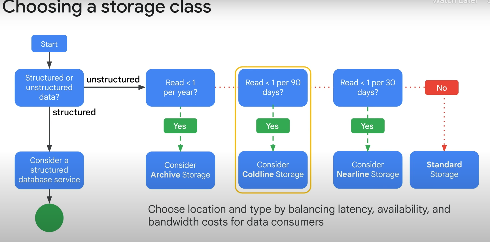

### Storage Class Selection

1. **Archive Storage**
   - **Use Case**: Read data less than once a year.
2. **Coldline Storage**
   - **Use Case**: Read data less than once per 90 days.
3. **Nearline Storage**
   - **Use Case**: Read data less than once per 30 days.
4. **Standard Storage**
   - **Use Case**: Read and write data more frequently.

### Location Type Considerations

- **Region**: Optimize latency and network bandwidth for data consumers in the same region (e.g., analytics pipelines).
- **Dual-Region**: Similar performance advantages as regions with higher availability due to geo-redundancy.
- **Multi-Region**: Serve content to data consumers outside the Google network and across large geographic areas, with higher data availability due to geo-redundancy.

### Autoclass Feature

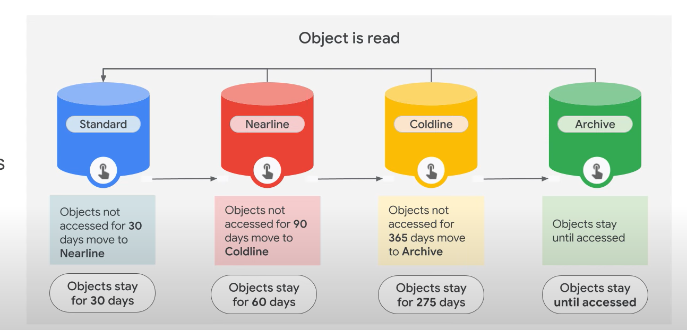

- **Purpose**: Automatically transitions objects to appropriate storage classes based on access patterns.
- **Initial Storage**: All objects start in Standard storage.
- **Transitions**:
  - Moves infrequently accessed data to colder storage classes to reduce costs.
  - Moves accessed data to Standard storage to optimize future accesses.
- **Benefits**: No early deletion charges, no retrieval charges, and no charges for storage class transitions when enabled on a bucket.

### Summary

- **Unstructured Data**: Consider the appropriate storage class based on access frequency and location type.
- **Autoclass**: Simplifies and automates cost savings for Cloud Storage data.

## Filestore

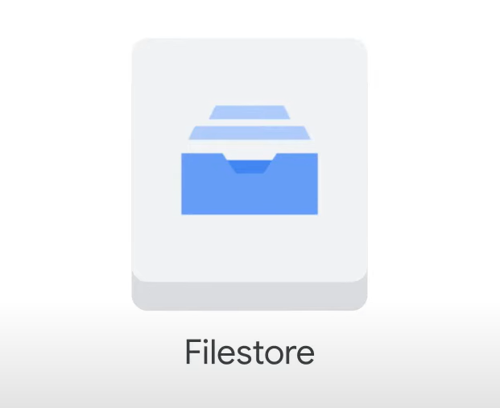

Filestore is a managed file storage service for applications that require a file system interface and a shared file system for data.

### Key Features

- **Native Experience**: Simple setup for managed network attached storage with Compute Engine or Google Kubernetes Engine instances.
- **Performance and Capacity**: Fine-tune independently for predictably fast performance.
- **Compatibility**: Supports any NFSv3 compatible clients.
- **Scale-Out Performance**: Hundreds of terabytes of capacity and file locking without specialized plug-ins or client-side software.

### Use Cases

1. **Enterprise Applications Migration**
   - Supports a broad range of enterprise applications needing a shared file system.
2. **Media Rendering**
   - Easily mount Filestore file shares on Compute Engine instances for collaborative visual effects work.
   - Scales to meet rendering needs across fleets of Compute Machines.
3. **Electronic Design Automation (EDA)**
   - Manages data across thousands of cores with large memory needs.
   - Ensures files are universally accessible for manufacturing customers.
4. **Data Analytics**
   - Supports complex financial models or environmental data analysis.
   - Offers low latency for file operations and scalable capacity/performance.
5. **Genome Sequencing**
   - Handles billions of data points per person with speed, scalability, and security.
   - Predictable pricing for performance.
6. **Web Content Management**
   - Manages and serves web content for web developers and large hosting providers (e.g., WordPress hosting).

### Benefits

- **Persistent and Shareable Storage**: Immediate access to data for high-performance analytics without loading/offloading delays.
- **Scalability**: Easily grow or shrink instances as needed to meet performance and capacity requirements.

## Cloud SQL

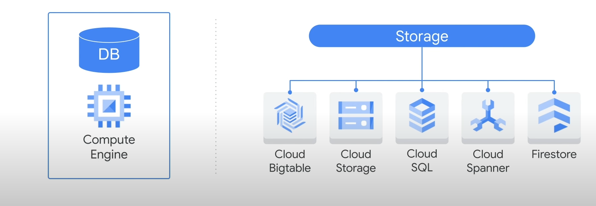

#### Why Use Cloud SQL?

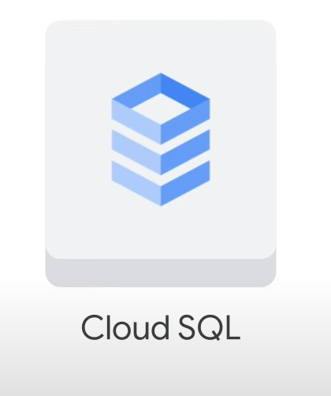

- **Managed Service vs. Self-Managed**: Should you build your own database solution or use a managed service?
- **Benefits of Managed Service**: Learn why you'd use Cloud SQL as a managed service inside Google Cloud.

#### Overview of Cloud SQL

- **Fully Managed Service**: Supports MySQL, PostgreSQL, or Microsoft SQL Server databases.
  - Patches and updates are automatically applied.
  - Administration of MySQL users with native authentication tools is still required.
- **Client Support**: Compatible with Cloud Shell, App Engine, Google Workspace scripts, SQL Workbench, Toad, and other external applications using standard MySQL drivers.
- **Performance and Scalability**:
  - Up to 64 TB of storage capacity.
  - 60,000 IOPS.
  - 624 GB of RAM per instance.
  - Scale up to 96 processor cores and scale out with read replicas.

#### Supported Versions

- **MySQL**: 5.6, 5.7, 8.0
- **PostgreSQL**: 9.6, 10, 11, 12, 13, 14, 15
- **SQL Server**: Web, Express, Standard, Enterprise (2017, 2019 editions)

#### High Availability (HA) Configuration

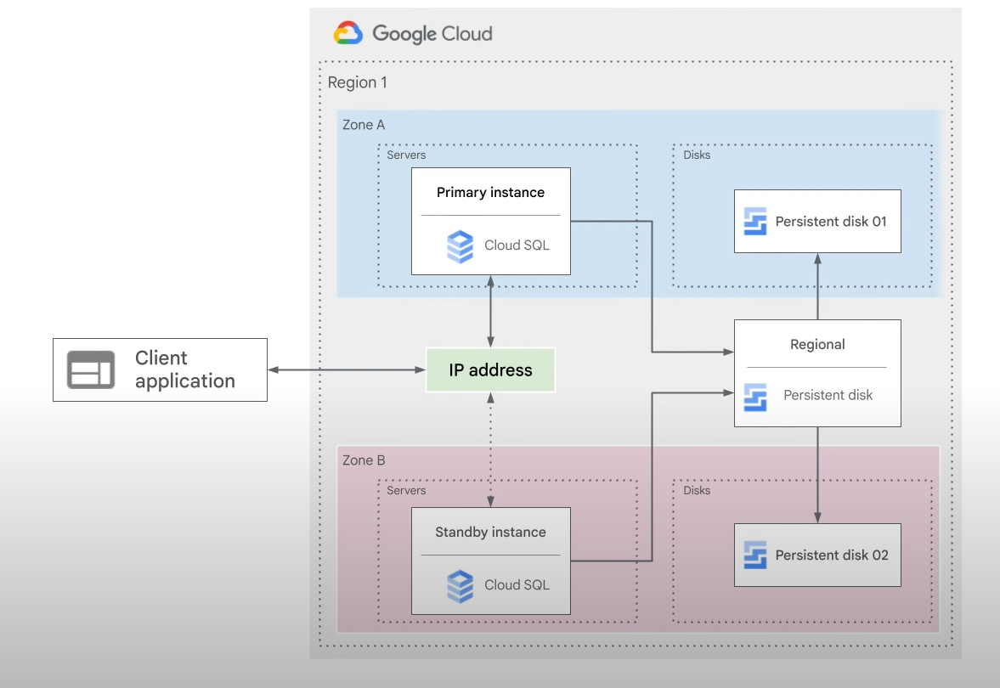

- **Primary and Standby Instances**: In a regional instance, the configuration includes a primary instance and a standby instance.
- **Synchronous Replication**: Writes to the primary instance are replicated to disks in both zones before a transaction is reported as committed.
- **Failover Process**: In case of an instance or zone failure, the persistent disk is attached to the standby instance, which becomes the new primary instance. Users are rerouted to the new primary.

#### Backup and Recovery

- **Automated and On-Demand Backups**: Includes point-in-time recovery.
- **Import and Export**: Use `mysqldump` or import/export CSV files.

#### Scalability

- **Scale Up**: Requires a machine restart.
- **Scale Out**: Use read replicas.
- **Horizontal Scalability**: For concerns about horizontal scalability, consider Cloud Spanner.

#### Connection Types

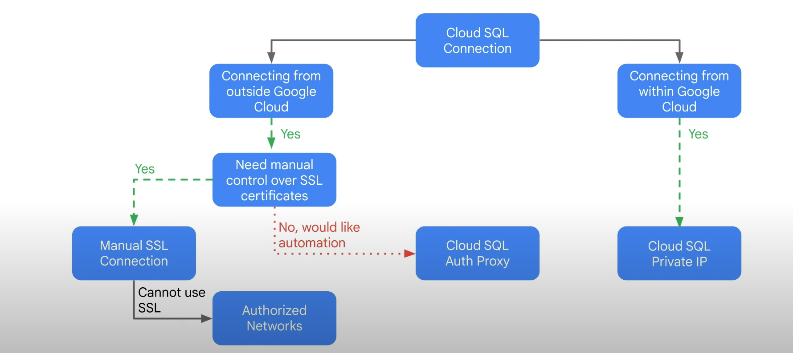

- **Private IP Connection**: Recommended for applications hosted within the same Google Cloud project and region as your Cloud SQL instance.
  - Provides the most performant and secure connection using private connectivity.
  - Traffic is never exposed to the public internet.
- **Other Connection Options**:
  - **Cloud SQL Auth Proxy**: Handles authentication, encryption, and key rotation.
  - **Manual SSL Connection**: Generate and periodically rotate certificates yourself.
  - **Unencrypted Connection**: Authorize a specific IP address to connect to your SQL server over its external IP address.

#### Decision Tree for Data Storage Services

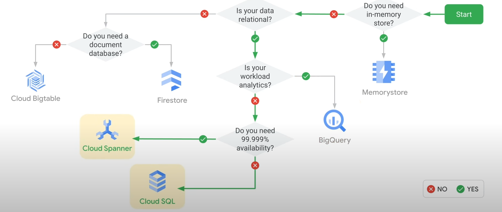

- **Memorystore**: For workloads requiring microsecond response times or large spikes in traffic (e.g., gaming environments, real-time analytics).
- **BigQuery**: For relational data used primarily for analytics.
- **Cloud Spanner vs. Cloud SQL**:
  - **Cloud SQL**: Cost-effective solution if you don't need horizontal scaling or a globally available system.

**Implementing Cloud SQL**
==========================

### **Overview**

---------------

Configure a Cloud SQL server and connect an application via a proxy over an external connection, as well as over a Private IP link for enhanced performance and security. This lab features Wordpress as the demonstration app, but the principles apply broadly to any SQL-dependent application.

### **Lab Outcome**

- 2 operational Wordpress frontend instances
- Each connected to a SQL instance backend via:

 1. **External Connection** (via Proxy)
 2. **Private IP** link

### **Lab Diagram**

### **Objectives**

By the end of this lab, you will be able to:

#### **Key Tasks**

####

1. **Create a Cloud SQL Database**

- *Task Overview:* Initialize a Cloud SQL database instance.

2. **Configure a Virtual Machine to Run a Proxy**

- *Task Overview:* Set up a VM to act as a proxy for external connections.

3. **Establish a Connection between an Application and Cloud SQL**

- *Task Overview:* Link your application to the Cloud SQL instance.

4. **Connect an Application to Cloud SQL using a Private IP Address**

- *Task Overview:* Utilize a Private IP for a secure, high-performance connection.

### **Quick Navigation**

-----------------------

- [Task 1: Create a Cloud SQL Database](#task-1-create-cloud-sql-db)
- [Task 2: Configure VM for Proxy](#task-2-configure-vm-proxy)
- [Task 3: Connect App to Cloud SQL](#task-3-connect-app-cloud-sql)
- [Task 4: Connect via Private IP](#task-4-connect-via-private-ip)

#### **Detailed Task Sections (To be filled with step-by-step guides or additional information as needed)**

<a name="task-1-create-cloud-sql-db"></a>

### **Task 1: Create a Cloud SQL Database**

### **Objective**

Configure a SQL server according to Google Cloud best practices and establish a Private IP connection.

### **Step-by-Step Guide**

#### **1. Access Cloud SQL**

- Navigate to the **Navigation menu** (Navigation menu icon)
- Click on **SQL**
- If prompted to explore Gemini in Databases, click **DISMISS**

#### **2. Initialize Instance Creation**

- Click on **Create instance**
- Select **Choose MySQL**

#### **3. Configure Instance Settings**

| **Property** | **Value** |
| --- | --- |
| **Instance ID** | `wordpress-db` |
| **Root password** | *Type a secure password* (**Note:** Save this as `[ROOT_PASSWORD]` for later use) |
| **Choose a Cloud SQL edition** | `Enterprise` |
| **Region** | `Lab Region` |
| **Zone** | `Any` |
| **Database Version** | `MySQL 5.7` |

- Leave all other settings at their **defaults**

#### **4. Advanced Configuration**

- Expand **Show configuration options**
- Expand the **Machine configuration** section

##### **Machine Configuration**

- **Considerations:**
- Shared-core machines are suitable for prototyping but not covered by Cloud SLA.
- Each vCPU has a 250 MB/s network throughput cap; additional cores increase this cap up to 2000 MB/s.
- For performance-sensitive workloads, ensure enough memory for the working set and active connections.
- **Selection for this Lab:**
- Choose **Dedicated core** from the dropdown menu
- Select **1 vCPU** and **3.75 GB** of memory

#### **5. Storage Configuration**

- Expand the **Storage** section
- **Considerations:**
  - SSD is best for most use cases; HDD offers lower performance but reduced storage costs.
  - Storage capacity directly affects throughput.
- **Selection for this Lab:**
  - **Storage type:** SSD (solid-state drive)
  - **Storage capacity:** `10GB` (Review how capacity affects throughput, then reset to 10GB)
  - **Note:** Avoid setting storage capacity too low without enabling automatic storage increase to maintain SLA.

#### **6. Establish Private IP Connection**

- Expand the **Connections** section
- Select **Private IP**
- In the **Network** dropdown, select **default**
- Click the **Set up Connection** button
- In the right panel:

 1. Click **Enable API**
 2. Choose **Use an automatically allocated IP range**
 3. Click **Continue**
 4. Click **Create Connection**

#### **7. Finalize Instance Creation**

- Click **Create Instance** at the bottom of the page to create the database instance.

### **Outcome**

- A Cloud SQL database instance (`wordpress-db`) configured with best practices and a Private IP connection.

<a name="task-2-configure-vm-proxy"></a>

### **Task 2: Configure a Virtual Machine to Run a Proxy**

### Objective

Securely connect to a Cloud SQL instance from a virtual machine (VM) in a different VPC, network, or region using a proxy.

### **Prerequisites**

- Cloud SQL instance (`wordpress-db`) created in **Task 1**
- Preconfigured Virtual Machines (VMs) with Wordpress and dependencies
- Principle of least privilege applied for SQL access
- Network tag and firewall rules preconfigured for port 80

### Step-by-Step Guide

#### **1. Access Compute Engine & Establish SSH Connection**

- Navigate to the **Navigation menu** (Navigation menu icon)
- Click on **Compute Engine**
- Find the `wordpress-proxy` VM and click on **SSH** next to it

#### **2. Download & Configure Cloud SQL Proxy**

- In the SSH window, run the following commands to download the Cloud SQL Proxy and make it executable:

```bash
wget https://dl.google.com/cloudsql/cloud_sql_proxy.linux.amd64 -O cloud_sql_proxy && chmod +x cloud_sql_proxy
```

- **Confirmation:** The Cloud SQL Proxy is now downloaded and executable.

#### **3. Retrieve Cloud SQL Instance Connection Name**

- **Temporary Step:** Keep the SSH window open and return to the **Cloud Console**
- Navigate to the **Navigation menu** (Navigation menu icon) and click on **SQL**
- Click on the `wordpress-db` instance and wait for the green checkmark (indicating operational status)
- **Note the Connection Name** (referred to as `[SQL_CONNECTION_NAME]`)

#### **4. Create a Database for the Application**

- In the SQL page, click on **Databases**
- Click **Create database**, enter `wordpress` (expected by the application), and click **Create**

#### **5. Configure Environment Variable for SQL Connection**

- Return to the **SSH window** for `wordpress-proxy`
- Set the environment variable with the retrieved `[SQL_CONNECTION_NAME]`:

```bash
export SQL_CONNECTION=[SQL_CONNECTION_NAME]
```

- **Verify:** Run `echo $SQL_CONNECTION` to confirm the variable is set

#### **6. Activate the Cloud SQL Proxy**

- Run the command to activate the proxy, sending it to the background:

```bash
./cloud_sql_proxy -instances=$SQL_CONNECTION=tcp:3306
```

- **Expected Output:**

```sh
Listening on 127.0.0.1:3306 for [SQL_CONNECTION_NAME]
Ready for new connections
```

- **Press ENTER**

### Outcome

- A Cloud SQL Proxy configured on the `wordpress-proxy` VM, securely connecting to the `wordpress-db` instance over a secure tunnel using the machine's external IP address.
- The proxy listens on `127.0.0.1:3306` (localhost), ready for new connections.

<a name="task-3-connect-app-cloud-sql"></a>

### **Task 3: Establish a Connection between an Application and Cloud SQL**

### Objective

Connect a sample Wordpress application to the Cloud SQL instance using the configured proxy.

### Step-by-Step Guide**

#### **1. Retrieve External IP Address of Wordpress Proxy VM**

- In the SSH window of `wordpress-proxy`, query the metadata to find the external IP:

```bash
curl -H "Metadata-Flavor: Google" http://169.254.169.254/computeMetadata/v1/instance/network-interfaces/0/access-configs/0/external-ip && echo
```

- **Note the External IP Address** displayed in the output

#### **2. Access Wordpress Configuration in Browser**

- Open a **web browser** and navigate to the **External IP Address** of `wordpress-proxy`
- You will see the **Wordpress Setup Page**

#### **3. Configure Wordpress Database Connection**

- Click **Let's Go**
- Fill in the database connection details, replacing `[ROOT_PASSWORD]` with the password set during machine creation:
  - **Database Name**: `wordpress`
  - **Username**: `root`
  - **Password**: `[ROOT_PASSWORD]`
  - **Database Host**: `127.0.0.1` (localhost, as the proxy listens on this address)
- Leave all other settings at their **defaults**
- Click **Submit**

#### **4. Initialize Wordpress Installation**

- Once connected, click **Run the installation** to set up Wordpress and its database in Cloud SQL
- **Note:** This may take a few moments to complete (up to 3 minutes, as it propagates data to your SQL Server)

#### **5. Populate Demo Site Information**

- Fill in your demo site's information with **random data** (you won't need to remember this)
- Click **Install Wordpress**

#### **6. Access Your Working Wordpress Blog**

- After the **'Success!'** window appears:

 1. **Remove any text after the IP address** in your browser's address bar
 2. Press **ENTER**

- You will now see your **fully functional Wordpress Blog** connected to your Cloud SQL instance via the proxy.

<a name="task-4-connect-via-private-ip"></a>

### **Task 4: Connect an Application to Cloud SQL using a Private IP Address**

### Objectives

Leverage a more secure and performant configuration by connecting to Cloud SQL using a Private IP, within the same region and VPC connected network.

### Prerequisites

- Cloud SQL instance (`wordpress-db`) created in **Task 1**
- `wordpress-private-ip` VM located in the same **REGION** as Cloud SQL

### Step-by-Step Guide

#### **1. Retrieve Cloud SQL Private IP Address**

- In the **Cloud Console**, navigate to the **Navigation menu** (Navigation menu icon)
- Click on **SQL**
- Select `wordpress-db`
- **Note the Private IP address** of the Cloud SQL server, referred to as `[SQL_PRIVATE_IP]`

#### **2. Access Compute Engine & Note VM Location**

- On the **Navigation menu**, click **Compute Engine**
- **Note:** `wordpress-private-ip` is located in the same **REGION** as your Cloud SQL instance

#### **3. Retrieve External IP Address of `wordpress-private-ip` VM**

- Copy the **External IP address** of `wordpress-private-ip`
- Paste it into a **browser window** and press **ENTER**

#### **4. Configure Wordpress with Private IP Connection**

- Click **Let's Go**
- Specify the following, leaving other settings at their **defaults**:
- **Database Name**: `wordpress`
- **Username**: `root`
- **Password**: `[ROOT_PASSWORD]` (configured during Cloud SQL instance creation)
- **Database Host**: `[SQL_PRIVATE_IP]` (noted in Step 1)
- Click **Submit**
- **Note:** This establishes a **direct, private connection** to the Cloud SQL instance, enhancing performance and security.

#### **5. Initialize Wordpress Installation**

- Click **Run the installation**
- An **'Already Installed!'** window will appear, indicating the application is connected to Cloud SQL over **Private IP**

#### **6. Access Your Working Wordpress Blog**

- In your **web browser's address bar**:

 1. **Remove any text after the IP address**
 2. Press **ENTER**

- You will now see your **fully functional Wordpress Blog**, connected to your Cloud SQL instance via **Private IP**.

## Cloud Spanner


### Overview & Decision Tree

### **Introduction to Cloud Spanner**

- **Service Built for the Cloud**: Combines benefits of relational database structure with non-relational horizontal scale.
- **Key Features**:
- Petabytes of capacity
- Transactional consistency at global scale
- Schemas, SQL, and automatic synchronous replication for high availability

### **Use Cases for Cloud Spanner**

- **Financial Applications**
- **Inventory Applications** (traditionally served by relational database technology)
- **Multi-Regional or Regional Instances**: Offers different monthly uptime SLAs (check documentation for up-to-date numbers)

### **Comparison with Relational and Non-Relational Databases**

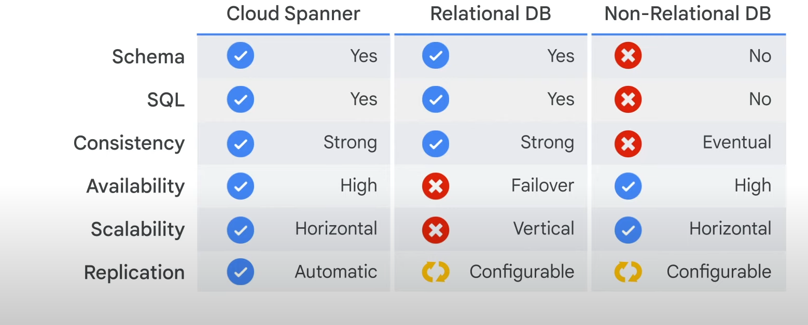

### **Cloud Spanner Architecture**

- **Instance Replication**: Data replicated across multiple cloud zones (within one region or across several regions)
- **Configurable Database Placement**: Choose the region for your database
- **Synchronized Replication**: Across zones using Google's global fiber network
- **Atomic Clocks**: Ensure atomicity for data updates

### **Decision Tree: Choosing Cloud Spanner**

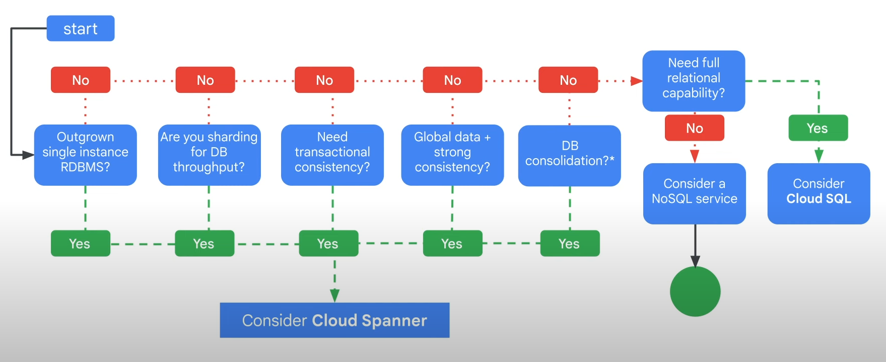

1. **Have you outgrown your relational database or need:**

- High throughput
- High performance
- Transactional consistency
- Global data
- Strong consistency
- **YES**: Consider **Cloud Spanner**

2. **Do you not need full relational capabilities:**

- **YES**: Consider **NoSQL Service (e.g., Cloud Firestore)**

### AlloyDB Overview

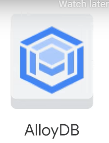

### **Introduction to AlloyDB**

- **Fully Managed, PostgreSQL-Compatible Database Service**
- **Designed for Demanding Workloads**:
  - Hybrid Transactional and Analytical Processing (HTAP)

### **Key Features and Architecture**

- **Google-Built Database Engine**
- **Cloud-Based, Multi-Node Architecture**:
  - Delivers Enterprise-Grade:
    - Performance
    - Reliability
    - Availability
- **Automated Administrative Tasks**:
  - Backups
  - Replication
  - Patching
  - Capacity Management
- **Intelligent Management with**:
  - Adaptive Algorithms
  - Machine Learning (ML) for:
    - PostgreSQL Vacuum Management
    - Storage and Memory Management
    - Data Tiering
    - Analytics Acceleration

### **Performance and Suitability**

- **Transactional Processing**:
  - **> 4x Faster** than Standard PostgreSQL for Transactional Workloads
- **Suitable for Demanding Enterprise Workloads**:
  - High Transaction Throughput
  - Large Data Sizes
  - Multiple Read Replicas

### **Availability, Uptime, and Insights**

- **High Availability**:
  - **99.99% Uptime SLA** (Inclusive of Maintenance)
- **Real-Time Business Insights**:
  - **Up to 100x Faster** than Standard PostgreSQL for Analytical Queries

### **Integration with Google Vertex AI**

- **Built-in Integration** with **Vertex AI** (Google's Artificial Intelligence Platform)
- **Capability to Call Machine Learning Models** for Enhanced Analytics and Decision Making

### **Summary Table**

| **Feature** | **Description** |
| --- | --- |
| **Database Type** | Fully Managed, PostgreSQL-Compatible |
| **Workload Suitability** | Hybrid Transactional and Analytical Processing (HTAP) |
| **Performance Boost** | > 4x (Transactional), Up to 100x (Analytical) |
| **Uptime SLA** | 99.99% (Inclusive of Maintenance) |
| **Integration** | Vertex AI for Machine Learning Capabilities |

## Cloud Firestore

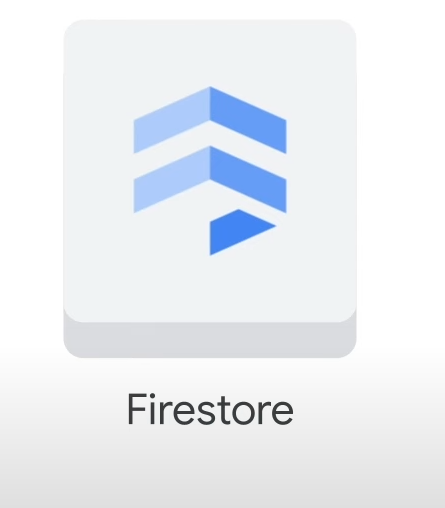

### **Introduction to Cloud Firestore**

- **Highly Scalable NoSQL Database** for mobile, web, and IoT apps
- **Key Characteristics**:
- Fast
- Fully Managed
- Serverless
- Cloud Native
- NoSQL
- Document Database

### **Features and Benefits**

- **Client Libraries**: Live synchronization and offline support
- **Security Features**: Accelerate building truly serverless apps with Firebase and GCP integrations
- **ACID Transactions**: Ensures transactional consistency
- **Automatic Multi-Region Replication**: Strong consistency and disaster recovery
- **Sophisticated Queries**: No performance degradation, flexible data structuring

### **Relationship with Cloud Datastore**

- **Next Generation of Cloud Datastore**
- **Operates in Datastore Mode**: Backwards compatible, improved storage layer
- **Removes Cloud Datastore Limitations**:
- Strongly consistent queries
- Unrestricted transactions (entity groups and rights)

### **Cloud Firestore Modes**

- **Datastore Mode**:
- Backwards compatible with Cloud Datastore
- Access improved storage layer with Cloud Datastore system behavior
- **Native Mode**:
- New features (storage layer, data model, real-time updates, client libraries)
- Not backwards compatible with Cloud Datastore limitations

### **Guidelines for Choosing a Mode**

- **New Server Projects**: Use Cloud Firestore in **Datastore Mode**
- **New Mobile and Web Apps**: Use Cloud Firestore in **Native Mode**

### **Compatibility and Upgrade**

- **Compatible with All Cloud Datastore APIs and Client Libraries**
- **Existing Cloud Datastore Users**: Will be live upgraded to Cloud Firestore automatically at a future date

### **Decision Tree**

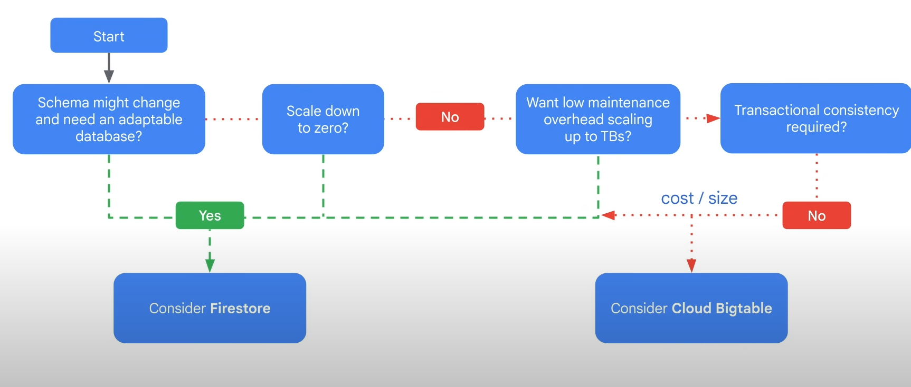

1. **Schema Flexibility, Scalability to Zero, or Low Maintenance Overhead**:

- **Consider Using Cloud Firestore**

2. **No Requirement for Transactional Consistency**:

- **Consider Cloud Bigtable** (depending on cost or size, to be covered next)

Below are the notes in Markdown format based on the provided text about Cloud Bigtable:

## Cloud Bigtable

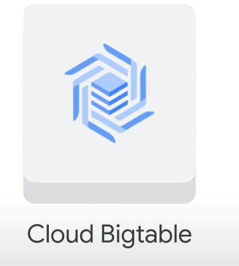

- Consider Cloud Bigtable if transactional consistency is not required.
- Fully managed NoSQL database with petabyte-scale and very low latency.

### **Key Features**

- **Scalability**: Seamlessly scales for throughput and adjusts to specific access patterns.
- **Performance**: Supports high read and write throughput at low latency.
- **Use Cases**:
- Operational and analytical applications
- IoT
- User analytics
- Financial data analysis
- Storage engine for machine learning applications
- **Integration**:
- Easily integrates with Hadoop, Cloud Dataflow, and Cloud Dataproc
- Supports the open-source industry-standard HBase API

### **Data Structure**

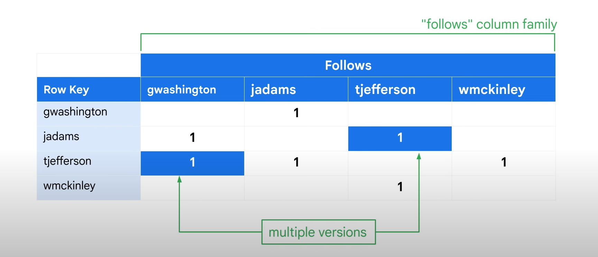

- **Tables**: Massively scalable, sorted key/value maps
- **Rows**: Typically describe a single entity
- **Columns**:
- Contain individual values for each row
- Related columns are grouped into **Column Families**
- Identified by a combination of **Column Family** and **Column Qualifier** (unique name within the family)
- **Cells**:
- Row/Column intersections can contain multiple cells (versions) at different timestamps
- Provide a record of data alterations over time
- **Table Sparsity**: Empty cells do not occupy space

### **Example Use Case**

- **Hypothetical Social Network for US Presidents**
- **Column Family**: "follows"
- **Column Qualifiers**: Used as data, leveraging table sparseness
- **Row Key**: Username, ensuring reasonably uniform data access

### **Architecture**

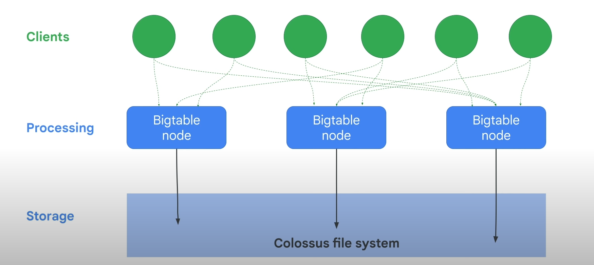

- **Processing**:
- Handled separately from storage
- Through a front-end server pool and nodes
- **Storage**:
- Tables are sharded into **Tablets** (blocks of contiguous rows) for workload balance
- Tablets stored on **Colossus** (Google's file system) in **SSTable** format
- SSTable: Persistent, ordered, immutable map from keys to values

### **Auto-Optimization**

- Cloud Bigtable adjusts indexes based on access patterns to distribute workload evenly across nodes
- **Scalability Benefit**: Linear throughput scale with node addition (up to hundreds of nodes)

### **Summary and Recommendations**

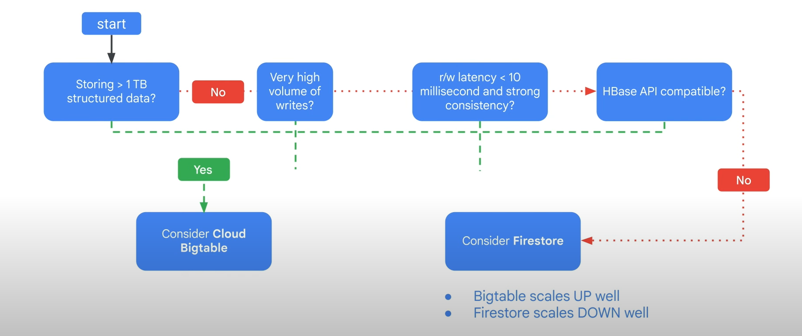


- **Use Cloud Bigtable if**:
- Storing >1 TB of structured data
- Very high volume of writes
- Need read/write latency < 10 milliseconds with strong consistency
- Compatible with HBase API
- **Otherwise, consider Firestore** if scaling down is a priority
- **Minimum Cluster Size**: 3 nodes, handling 30,000 operations per second (nodes are paid for whether in use or not)

Here is a quick overview of Memorystore in Markdown format:

## Memorystore for Redis 

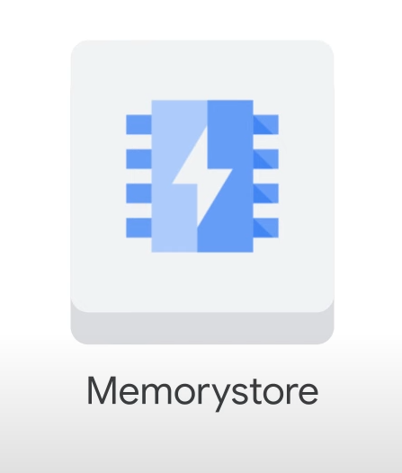

### **Key Benefits**

- **Fully Managed**: Scalable, secure, and highly available infrastructure managed by Google
- **Extreme Performance**: Highly scalable and available Redis service for Google Cloud applications
- **Simplified Management**: Automates complex tasks (HA, failover, patching, monitoring) for more development time

### **Core Features**

- **High Availability**:

- Replicated across two zones
- 99.9% availability SLA

- **Performance**:

- Sub-millisecond latency achievable
- High throughput support

- **Scalability**:

- Start with lowest tier/smallest size and grow effortlessly
- Minimal impact on application availability
- **Max Capacity**:

- Up to 300 GB instance size
- Up to 12 Gbps network throughput

### **Compatibility & Migration**

- **Fully Compatible**: With the Redis Protocol
- **Easy Migration**:

- Lift and shift from open-source Redis to Memorystore
- No code changes required (using import/export feature)
- **Tooling Compatibility**: Existing client libraries and tools work seamlessly