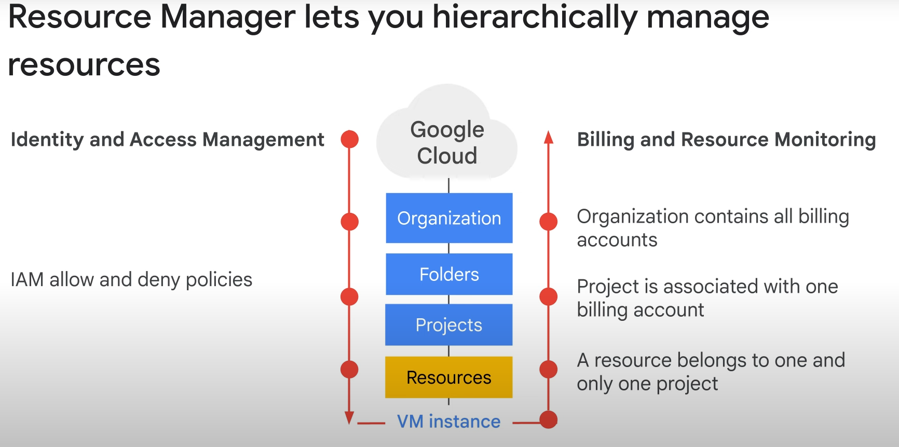
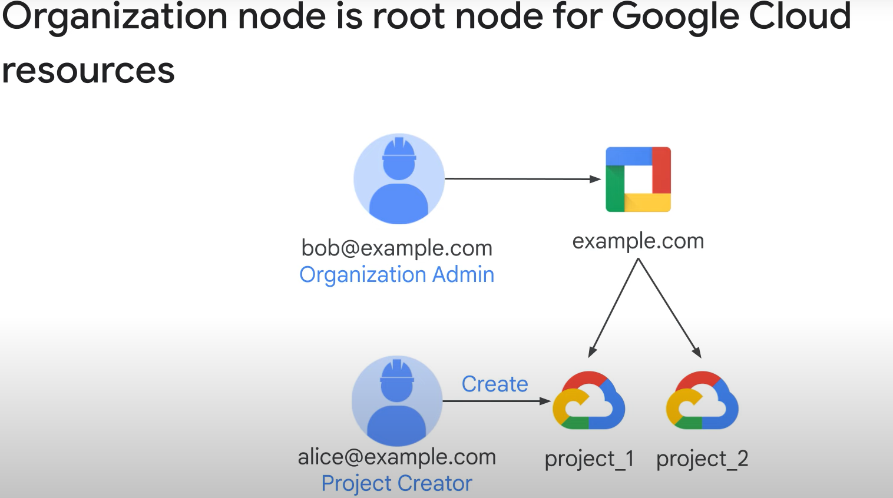
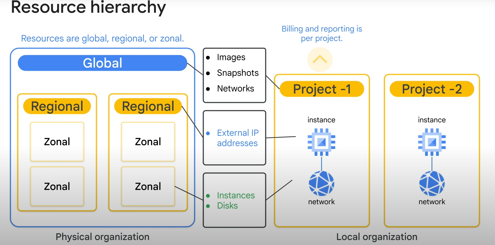

# **Resource Management in GCP**

## **Introduction**

* **Objective**: Controlling costs by managing billable resources in GCP
* **Key Aspects**:

* Controlling access to resources
* Managing quotas to limit consumption

### **Quotas and Access Control**

* **Default Quotas**: Limit resource consumption, can be raised upon request in most cases
* **Purpose of Quotas**: Provide a checkpoint to ensure intentional increased resource usage
* **Access Control Methodologies**: Several methods in place (building on Cloud IAM module knowledge)

### **Module Outline**

1. **Resource Manager Overview**
2. **Quotas**: In-depth exploration
3. **Labels and Names**: Organizing and identifying resources
4. **Billing**:
      * Setting budgets
      * Configuring alerts

5. **Hands-on Lab**:

* **Examining Billing Data with BigQuery**: Practical experience with billing analysis

### **Up Next: Resource Manager Overview**

* **Topic Introduction**: Detailed explanation of the Resource Manager's role in GCP resource management will follow.

Here is the text rewritten in Markdown format with added sections, emphasis, and clarity:

## **Resource Manager Overview**

### **Hierarchical Resource Management**

* Manage resources by:

 1. **Project**
 2. **Folder**
 3. **Organization** (root node for all GCP resources)

* **Familiar Concept**: Builds upon Cloud IAM module knowledge

### **IAM Policy Inheritance & Billing Accumulation**

* **IAM Policies**:

* Contain sets of roles and members
* Set on resources, inheriting from parents (**Top-to-Bottom**)
* **Union of Parent and Resource Policies** (unless IAM Deny policy is associated)

* **Billing Accumulation**:

* Measured in quantities (rate of use, time, items, feature use)
* **Accumulated from the Bottom Up** (Resource > Project > Billing Account > Organization)

### **Organization, Project, and Resource Hierarchy**

* **Organization Node**:

* Root node for all GCP resources
* Example:

* **Bob (Organization Admin)** delegates to **Alice (Project Creator)**

* **Project**:

* Accumulates consumption of all its resources
* Used for:
* Tracking resources and quota usage
* Enabling billing
* Managing permissions and credentials
* Enabling services and APIs

* **Identification**:

  1. **Project Name** (human-readable, not used by Google APIs)
  2. **Project Number** (automatically generated)
  3. **Project ID** (unique, generated from project name)

* **Finding Identifiers**: GCP Console dashboard or Resource Manager API

### **Resource Categorization and Hierarchy**

* **Resource Types by Scope**:

* **Global**: Images, Snapshots, Networks
* **Regional**: External IP addresses
* **Zonal**: Instances, Disks

* **Key Point**: Regardless of type, each resource is organized into a **Project** for:

* Individual billing
* Reporting

Here is the text rewritten in Markdown format with added sections, emphasis, and clarity:

## **Understanding Quotas in Google Cloud**

### **What are Quotas?**

* **Definition**: Project quotas or limits on all Google Cloud resources
* **Purpose**: Manage and restrict resource consumption within a project

### **Quota Categories**

1. **Creation Limits**

* **Example**: Maximum 15 VPC networks per project
* **Restriction**: Number of resources that can be created in a project

2. **Rate Limits**

* **Example**: 5 administrative actions/second/project (default for Cloud Spanner API)
* **Restriction**: Speed at which API requests can be made in a project

3. **Regional Quotas**

* **Example**: Maximum 24 CPUs per region (default)
* **Restriction**: Resource limits within a specific region

### **Working with Quotas**

* **Increasing Quotas**: May be possible as your Google Cloud usage expands over time
* **Proactive Quota Adjustments**:
  * Request changes in advance for expected increased usage
  * Manage through the **Quotas page** in the Cloud Console (also displays current quotas)

### **Why Do Quotas Exist?**

* **Prevent Runaway Consumption**:
  * Protect against errors (e.g., accidentally creating 100 instead of 10 Compute Engine instances)
  * Safeguard against malicious attacks
* **Avoid Billing Spikes or Surprises**:
  * Related to billing; setting up budgets and alerts will be covered later
* **Sizing Considerations and Periodic Review**:
  * Encourage evaluation of resource needs (e.g., do you really need a 96 Core instance?)

### **Important Quota Notes**

* **Quotas vs. Resource Availability**:
  * Quotas represent the maximum resources you can create, **if those resources are available**
  * **No guarantee of resource availability at all times** (e.g., regional resource exhaustion, like local SSDs)

Here is the text rewritten in Markdown format with added sections, emphasis, and clarity:

## **Using Labels for Resource Organization**

### **Introduction to Labels**

* **Definition**: Key-value pairs for organizing GCP resources
* **Supported Resources**: VMs, disks, snapshots, images, and more
* **Management Tools**: GCP Console, `gcloud`, or Resource Manager API
* **Label Limit**: Up to 64 labels per resource

### **Use Cases for Labels**

* **Environment Classification**:
  * Distinguish between production and test environments
  * Example: `environment:production` or `environment:test`
* **Cost Accounting/Budgeting**:
  * Label by team or cost center
  * Example: `team:marketing`, `team:research`
* **Component Identification**:
  * Label by component
  * Example: `component:redis`, `component:frontend`
* **Ownership and Contact Information**:
  * Label by owner or primary contact
  * Example: `owner:gaurav`, `contact:opm`
* **Resource State**:
  * Label by state
  * Example: `state:inuse`, `state:readyfordeletion`

### **Key Differences: Labels vs. Network Tags**

| **Characteristic** | **Labels**                                              | **Network Tags**                                    |
| ------------------ | ------------------------------------------------------- | ---------------------------------------------------- |
| **Definition**     | User-defined key-value strings for resource organization | User-defined strings for instances only, mainly for networking |
| **Scope**         | All resources                                           | Instances only                                        |
| **Primary Use**   | Organization, billing, and inventory                  | Networking (firewall rules, custom static routes)      |
| **Propagation**   | Can propagate through billing                           | Does not propagate through billing                     |

### **Additional Resources**

* For more information on using labels, refer to the links in the **Course Resources**.

Here is the text rewritten in Markdown format with added sections, emphasis, and clarity:

## **Managing Billing and Costs in Google Cloud**

### **Project Planning and Cost Control with Budgets**

* **Setting a Budget**:
  * Track spend growth towards a specified amount
  * Aid in project planning and cost control
* **Budget Creation Interface**:

 1. **Budget Name**
 2. **Project Selection**
 3. **Budget Amount**:

* Specify a fixed amount
* Match the previous month's spend

 4. **Budget Alerts**:

* Receive emails at specified spend percentages (e.g., 50%, 90%, 100%)
* Receive alerts when forecasted to exceed budget by the end of the period

### **Budget Alerts and Notifications**

* **Email Notifications**:
  * Sent to billing admins when spend thresholds are exceeded
  * Example: Project name, exceeded percentage, and budget amount
* **Pub/Sub Notifications**:
  * Programmatically receive spend updates about the budget
  * **Use Case**: Create a Cloud Function to automate cost management by listening to the Pub/Sub topic

### **Optimizing Spend with Labels and Analysis**

* **Labeling Resources**:
  * Organize resources (e.g., VM instances across different regions)
  * Identify potential cost optimization opportunities (e.g., high cross-continent traffic)
* **Exporting Billing Data to BigQuery**:
  * Analyze spend with Google’s scalable, fully managed Enterprise Data Warehouse
  * **Benefits**:
    * Fast response times
    * SQL querying (e.g., as shown in the upcoming lab screenshot)
* **Visualizing Spend with Looker Studio**:
  * Turn data into informative, customizable dashboards and reports
  * **Use Case**: Slice and dice billing reports using labels for in-depth analysis
