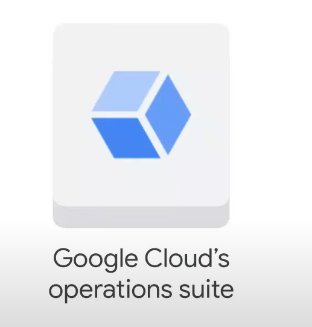
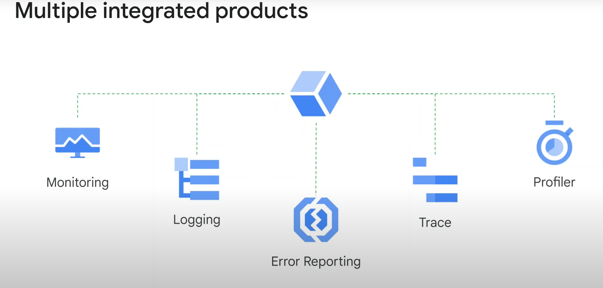
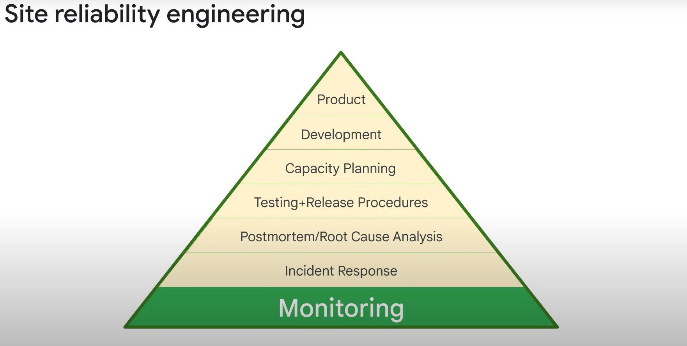
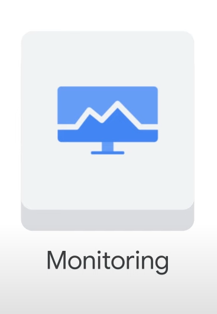
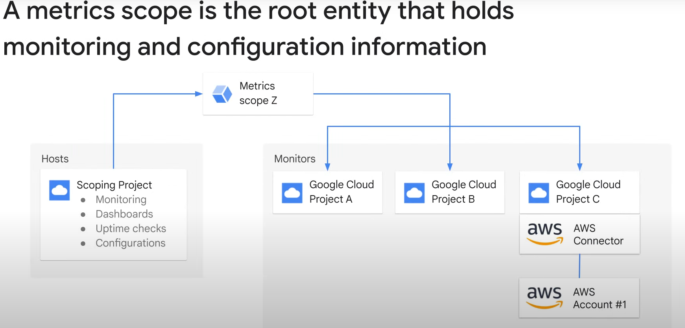
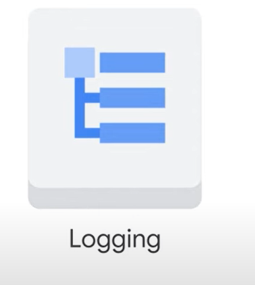
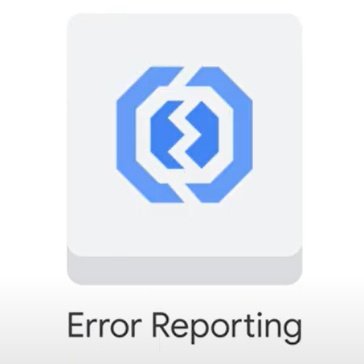
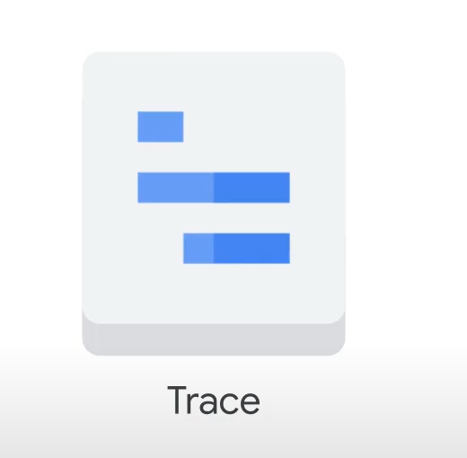
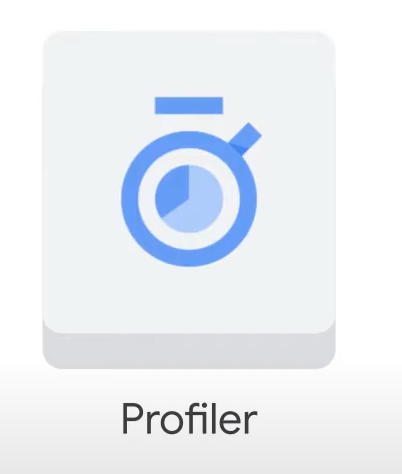

# **Google Cloud Resource Monitoring Overview**

## **Module Introduction**

### Foundation of the Module

* **Key Point:** Features in this module rely on **Google Cloud’s Operations Suite**.
* **Operations Suite Description:** Provides monitoring, logging, and diagnostics for applications.

### Services to be Explored

* **List of Services:**
  1. **Cloud Monitoring**
  2. **Cloud Logging**
  3. **Error Reporting**
  4. **Cloud Trace**
  5. **Cloud Profiler**

### High-Level Overview

* **Topic:** Google Cloud’s Operations Suite and its Features
* **Note:** Detailed explanation to follow (**_No detailed text provided in the original notes for this section_**)

Here are the notes in Markdown format, excluding time stamps as per your previous request:

## **Google Cloud’s Operations Suite**

### Key Capabilities

* **Resource Discovery:** Dynamically discovers cloud resources and application services through deep integration with:
  * Google Cloud
  * Amazon Web Services

### Quick Setup and Core Visibility

* **Smart Defaults:** Enables core visibility into your cloud platform in **minutes**
* **Benefits:**
  * Access to powerful data and analytics tools
  * Collaboration with multiple third-party software providers

### Suite Components

* **Integrated Services:**

 1. **Monitoring**
 2. **Logging**
 3. **Error Reporting**
 4. **Fault Tracing** (referred to as "Cloud Trace" in previous notes)

### Pricing Model

* **Pay-As-You-Use:** Only pay for the services you utilize
* **Free Usage Allotments:** No upfront fees or commitments to get started
* **Detailed Pricing Information:** Refer to the link in the **Course Resources**

### Integrated Advantage

* **Unified Service:** Unlike loosely integrated collections of software, Google Cloud’s Operations Suite offers a **single, comprehensive solution**
* **Benefits for Applications:**
  * Enhanced Reliability
  * Improved Stability
  * Simplified Maintainability

# Google Cloud’s Operations Suite: Cloud Monitoring

## Importance of Monitoring

* **Base of Site Reliability Engineering (SRE)**: Applies software engineering to operations to create ultra-scalable and highly reliable software systems.
* **Google's Achievement**: Enabled Google to build, deploy, monitor, and maintain some of the largest software systems in the world.

## Cloud Monitoring Features

* **Dynamic Configuration**: Automatically configures monitoring after resources are deployed.
* **Intelligent Defaults**: Easily create charts for basic monitoring activities.
* **Data Ingestion**: Monitor platform, system, and application metrics by ingesting data such as metrics, events, and metadata.
* **Insights Generation**: Generate insights through dashboards, charts, and alerts.
* **Uptime and Health Checks**: Configure and measure uptime and health checks that send alerts via email.

## Metrics Scope

* **Definition**: Root entity holding monitoring and configuration information.
* **Capacity**: Can have between 1 and 375 monitored projects.
* **Visibility**: Monitoring data for all projects in the scope is visible.
* **Components**: Contains custom dashboards, alerting policies, uptime checks, notification channels, and group definitions.
* **Data Access**: Can access metric data from monitored projects, but data and log entries remain in individual projects.
* **Scoping Project**: The first monitored Google Cloud project in a metrics scope, which must be specified when creating the scope. The name of this project becomes the name of the metrics scope.

## AWS Integration

* **AWS Connector**: Configure a project in Google Cloud to hold the AWS Connector.
* **Single Pane of Glass**: View resources from multiple Google Cloud projects and AWS accounts in one place.
* **Access Control**: All users with access to the metrics scope have access to all data by default. To control visibility, consider placing projects in separate metrics scopes.

## Custom Dashboards

* **Creation**: Create custom dashboards with charts of desired metrics.
* **Examples**: Display instances’ CPU utilization, network traffic, and firewall data.
* **Customization**: Use filters, groups, and aggregates to customize charts.
* **Supported Metrics**: Refer to the documentation for a full list of supported metrics.

## Alerting Policies

* **Necessity**: Create alerting policies to notify when specific conditions are met.
* **Examples**:
  * Network egress threshold alerts.
  * Usage threshold alerts for Google Cloud’s operations suite.
* **Notification Channels**: Email, SMS, and other channels.
* **Best Practices**:
  * Alert on symptoms, not necessarily causes.
  * Use multiple notification channels to avoid single points of failure.

## Example Alerting Policy

* **HTTP Check Condition**: Example of an alerting policy with an HTTP check condition on an instance.
* **Customized Email**: Sends a customized email with documentation content.

For more information, please refer to the documentation.

## Customizing Alerts

* **Audience Needs**: Customize alerts to describe actions needed or resources to be examined.

* **Avoid Noise**: Adjust alerts to be actionable and avoid setting up alerts on everything possible to prevent them from being dismissed over time.

## Uptime Checks

* **Configuration**: Test the availability of public services from global locations.

* **Types**: HTTP, HTTPS, or TCP.
* **Resources**: App Engine application, Compute Engine instance, URL of a host, AWS instance, or load balancer.
* **Alerting Policy**: Create policies and view latency for each global location.
* **Example**: HTTP uptime check with a resource checked every minute and a 10-second timeout. Failures occur if no response within the timeout period. Example shows 100% uptime with no outages.

## Monitoring Data Sources

* **Google Compute Engine Instances**: VMs run on Google hardware; hypervisor cannot access some internal metrics like memory usage.

* **Ops Agent**: Collects metrics inside the VM, not at the hypervisor level. Primary agent for collecting telemetry data from Compute Engine instances.
* **Data Collection**: Ops Agent collects data beyond system metrics, used by Cloud Monitoring for dashboards, alerts, uptime checks, and notifications.
* **Third-Party Applications**: Ops Agent can monitor many third-party applications. Refer to documentation for a detailed list.
* **Supported OS**: CentOS, Ubuntu, Windows.

## Custom Metrics

* **Creation**: Create custom metrics if standard metrics do not fit needs.

* **Example**: Game server with a capacity of 50 users. Use custom metrics to pass the current number of users directly from the application into Cloud Monitoring.
* **Getting Started**: Refer to documentation for creating custom metrics.

## Autoscaling with Metrics

* **Utilization Target**: Maintain a metric at a target value.

* **VM Creation/Deletion**: Autoscaler creates VMs when metric value is above target and deletes VMs when below target.
* **Metric Source**:
  * From each VM: Autoscaler takes average metric value across all VMs in the managed instance group.
  * Whole managed instance group: Autoscaler compares metric value with utilization target.
* **Multiple Values**: Apply a filter to autoscale using an individual value from the metric.

Here are your notes in **Markdown format**, ignoring times as requested:

### **Introduction to Logging**

* Logging is a key component of Google Cloud's operation suite, alongside monitoring, error reporting, and tracing.

### **Cloud Logging Overview**

* **Capabilities**:
  * Store log data and events from Google Cloud and AWS
  * Search, analyze, monitor, and alert on log data
* **Service Characteristics**:
  * Fully managed
  * Scalable (ingests log data from thousands of VMs)
* **Key Features**:
  * Storage for logs
  * **Logs Explorer** (user interface)
  * API for programmatic log management
  * Read/write log entries
  * Search and filter logs
  * Create log-based metrics

### **Log Retention and Export**

* **Default Retention**: 30 days
* **Export Options**:
  * **Cloud Storage**: for storing logs beyond 30 days
  * **BigQuery**:
    * Analyze logs with fast SQL queries (gigabytes to petabytes of data)
    * Visualize logs in **Looker Studio**
    * Example use cases:
      * Forecast capacity with traffic growth analysis
      * Optimize network traffic expenses with usage analysis
      * Network forensics for incident analysis
  * **Pub/Sub**:
    * Stream logs to applications or endpoints

### **Use Case Example: BigQuery and Looker Studio**

* **Querying Logs in BigQuery**:
  * Identify top IP addresses exchanging traffic with a web server
  * Inform decisions on infrastructure relocation or access control
* **Visualizing Logs with Looker Studio**:
  * Transform raw data into actionable metrics and dimensions
  * Create easy-to-understand reports and dashboards

Here are your notes in **Markdown format**, ignoring times as requested:

## **Error Reporting**

### **Introduction to Error Reporting**

* Learn about Error Reporting, a key feature of Google Cloud's operations suite.

### **Error Reporting Overview**

* **Key Functions**:
  * Counts errors in running cloud services
  * Analyzes errors
  * Aggregates error data
* **Centralized Error Management Interface**:
  * Displays error results
  * **Sorting and Filtering Capabilities**
  * **Real-time Notifications** for new error detections

### **Availability and Support**

* **Supported Platforms (Generally Available)**:
  * **App Engine**:
    * Standard Environment
    * Flexible Environment
  * **Apps Script**
  * **Compute Engine**
  * **Cloud Functions**
  * **Cloud Run**
  * **Google Kubernetes Engine (GKE)**
  * **Amazon EC2**
* **Supported Programming Languages (Exception Stack Trace Parser)**:
  * Go
  * Java
 +.NET
  * Node.js
  * PHP
  * Python
  * Ruby

Here are your notes in **Markdown format**, ignoring times as requested:

## **Cloud Trace**

### **Introduction to Cloud Trace**

* Cloud Trace: a distributed tracing system integrated into Google Cloud Operations.

### **Cloud Trace Overview**

* **Key Functionality**:
  * Collects latency data from applications
  * Displays data in the Google Cloud Console
* **Performance Insights**:
  * Track request propagation through applications
  * Receive detailed, near real-time performance insights
* **Automated Analysis**:
  * Generates in-depth latency reports
  * Surfaces performance degradations

### **Supported Integrations**

* **Automatic Trace Capture From**:
  * **App Engine**
  * **HTTP(S) Load Balancers**
  * **Applications instrumented with the Cloud Trace API**

### **Importance of Cloud Trace**

* **Application Performance Management**:
  * Manage request handling and operation times
  * Crucial for overall application performance optimization

### **Cloud Trace Heritage**

* **Based on Google's Internal Tools**:
  * Developed from technologies used to maintain Google's services at extreme scale

Here are your notes in **Markdown format**, ignoring times as requested:

## **Cloud Profiler**

### **Introduction to Cloud Profiler**

* Final feature of Google Cloud's operations suite covered in this module: Cloud Profiler.

### **The Impact of Poorly Performing Code**

* **Consequences**:
  * Increased latency in applications and web services
  * Higher operational costs

### **Cloud Profiler Overview**

* **Key Functionality**:
  * Continuously analyzes performance of:
    * CPU-intensive functions
    * Memory-intensive functions
  * Covers entire application scope, across all instances

### **Challenges of Traditional Profiling**

* **Development Environment Limitations**:
  * Results often don't translate to production environments
* **Production Profiling Challenges**:
  * Many techniques:
    * Introduce significant performance overhead (slow down code execution)
    * Only inspect a small subset of the codebase

### **Cloud Profiler's Unique Approach**

* **Statistical Techniques**:
  * Provide a complete performance picture
* **Low-Impact Instrumentation**:
  * Runs across all production application instances without slowing them down

### **Cloud Profiler Capabilities**

* **Multi-Environment Support**:
  * Google Cloud
  * Other cloud platforms
  * On-premises environments
* **Supported Programming Languages**:
  * Java
  * Go
  * Node.js
  * Python
