# Elastic Google Cloud Infrastructure: Scaling and Automation

## **Module Introduction: Interconnecting Networks with Google Cloud**

### **Instructor Introduction**

* **Name**: Priyanka Vergadia
* **Role**: Developer Advocate for Google Cloud

### **Module Overview**

* **Focus**: Interconnecting networks
* **Rationale**: Different applications and workloads require varied network connectivity solutions
* **Google Cloud's Approach**: Supports multiple connectivity methods to GCP

### **Module Topics**

* **Hybrid Connectivity Products**:

 1. **Cloud VPN**
 2. **Cloud Interconnect**
 3. **Peering**

* **Additional Topic**:
  * **Sharing VPC Networks within GCP**

### **Next Steps**

* **Initial Focus**: Cloud VPN
* **Hands-on Activity**: Explore Cloud VPN in a lab environment

## Google Cloud VPN Gateways

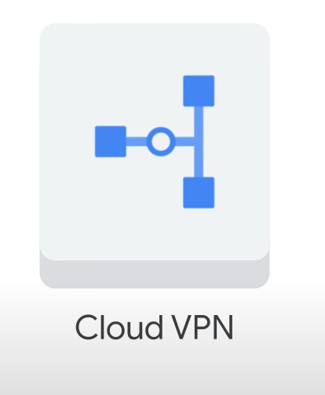

### Types of Cloud VPN Gateways

* **HA VPN**
* **Classic VPN**

### Classic VPN

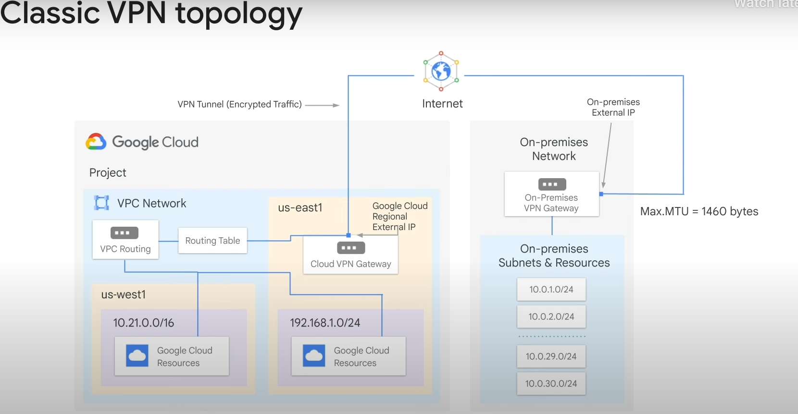

* All Cloud VPN gateways created before the introduction of HA VPN are considered Classic VPN gateways.

* Securely connects your on-premises network to your Google Cloud VPC network through an IPsec VPN tunnel.
* Traffic traveling between the two networks is encrypted by one VPN gateway, then decrypted by the other VPN gateway.
* Useful for low-volume data connections.
* Provides an SLA of 99.9% service availability.
* Supports:
  * Site-to-site VPN
  * Static and dynamic routes
  * IKEv1 and IKEv2 ciphers
* Does not support use cases where client computers need to “dial in” to a VPN using client VPN software.
* Dynamic routes are configured with Cloud Router.

### Example of Classic VPN

* Classic VPN connection between your VPC and on-premises network.

* VPC network has subnets in `us-east1` and `us-west1`.
* Resources in these regions can communicate using their internal IP addresses.
* To connect to your on-premises network:
  * Configure your Cloud VPN gateway, on-premises VPN gateway, and two VPN tunnels.
  * Cloud VPN gateway is a regional resource with a regional external IP address.
  * On-premises VPN gateway can be a physical device or a software-based VPN offering.
  * VPN tunnel connects your VPN gateways and serves as the virtual medium for encrypted traffic.
  * Establish two VPN tunnels for the connection.
  * Maximum transmission unit (MTU) for your on-premises VPN gateway cannot be greater than 1460 bytes.

### HA VPN

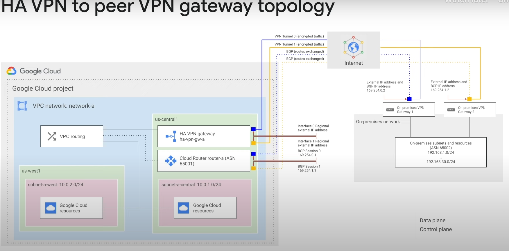

* High Availability Cloud VPN solution.

* Securely connects your on-premises network to your VPC network through an IPsec VPN connection in a single region.
* Provides an SLA of 99.99% service availability.
* To guarantee 99.99% availability SLA:
  * Properly configure two or four tunnels from your HA VPN gateway to your peer VPN gateway or another HA VPN gateway.
* Google Cloud automatically chooses two external IP addresses for HA VPN gateway interfaces.
* Each interface supports multiple tunnels.
* You can create multiple HA VPN gateways.
* When you delete the HA VPN gateway, Google Cloud releases the IP addresses for reuse.
* Configuring an HA VPN gateway with only one active interface and one external IP address does not provide a 99.99% service availability SLA.
* VPN tunnels connected to HA VPN gateways must use dynamic (BGP) routing.
* Route priorities for HA VPN tunnels can create an active/active or active/passive routing configuration.

### Recommended Topologies for HA VPN

* HA VPN gateway to peer VPN devices.

* HA VPN gateway to an Amazon Web Services (AWS) virtual private gateway.
* Two HA VPN gateways connected to each other.

### Typical Peer Gateway Configurations for HA VPN

* HA VPN gateway to two separate peer VPN devices, each with its own IP address.

* HA VPN gateway to one peer VPN device that uses two separate IP addresses.
* HA VPN gateway to one peer VPN device that uses one IP address.

## HA VPN Topologies and Configurations

### HA VPN Gateway to Two Peer Devices

* One HA VPN gateway connects to two peer devices.

* Each peer device has one interface and one external IP address.
* The HA VPN gateway uses two tunnels, one to each peer device.
* Provides redundancy and failover with a second peer-side gateway.
* Allows for software upgrades or scheduled maintenance without downtime.
* Protects against device failure.
* **REDUNDANCY_TYPE**: `TWO_IPS_REDUNDANCY`
* Provides 99.99% availability.

### HA VPN Gateway to AWS

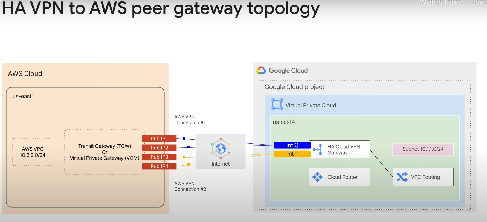

* Configure an HA VPN external VPN gateway to AWS using either a transit gateway or a virtual private gateway.

* Only the transit gateway supports equal-cost multipath (ECMP) routing.
* ECMP distributes traffic equally across active tunnels.

#### Example Configuration

* Three major gateway components:
  * HA VPN gateway in Google Cloud with two interfaces.
  * Two AWS virtual private gateways connecting to the HA VPN gateway.
  * An external VPN gateway resource in Google Cloud representing the AWS virtual private gateway.

* Supported AWS configuration uses four tunnels:
  * Two tunnels from one AWS virtual private gateway to one interface of the HA VPN gateway.
  * Two tunnels from the other AWS virtual private gateway to the other interface of the HA VPN gateway.

### Connecting Two Google Cloud VPC Networks

* Use an HA VPN gateway in each network.

* Provides 99.99% availability.
* Create two tunnels from the perspective of each HA VPN gateway:
  * Connect interface 0 on one HA VPN gateway to interface 0 on the other HA VPN.
  * Connect interface 1 on one HA VPN gateway to interface 1 on the other HA VPN.

## Dynamic Routes with Cloud Router

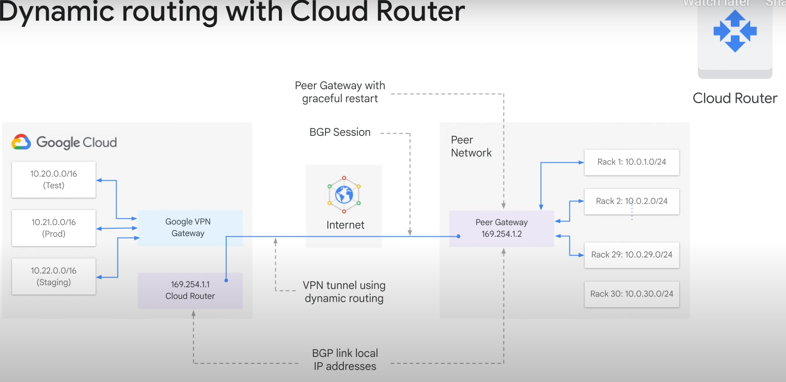

* Cloud VPN supports both static and dynamic routes.

* To use dynamic routes, configure Cloud Routers.
* Cloud Router manages routes for a Cloud VPN tunnel using Border Gateway Protocol (BGP).
* BGP allows routes to be updated and exchanged without changing the tunnel configuration.

### Example of Adding New Subnets

* Diagram shows two regional subnets in a VPC network: Test and Prod.

* On-premises network has 29 subnets connected through Cloud VPN tunnels.
* To add new subnets:
  * Use Cloud Router to establish a BGP session between the VPC and the on-premises VPN gateway.
  * New subnets are seamlessly advertised between networks.
  * Instances in new subnets can start sending and receiving traffic immediately.

### Setting Up BGP

* Assign an additional IP address to each end of the VPN tunnel.

* IP addresses must be link-local, from the range `169.254.0.0/16`.
* These addresses are used exclusively for establishing a BGP session.

Below are your notes reformatted in Markdown:

# **Configuring Google Cloud HA VPN**

* **HA VPN Definition**: High-availability (HA) Cloud VPN solution for securely connecting on-premises networks to VPC networks through an IPsec VPN connection in a single region.
* **Service Availability**: Provides an SLA of **99.99%** service availability.

## Key Characteristics of HA VPN

* **Scope**: Regional per VPC, VPN solution.
* **HA VPN Gateways**:
  * Have **two interfaces**.
  * Each interface has its **own public IP address**.
  * Two public IP addresses are **automatically chosen from different address pools** upon gateway creation.
* **Service Uptime with Two Tunnels**: Cloud VPN offers **99.99%** service availability uptime when HA VPN is configured with two tunnels.

### Lab Configuration Overview

* **Step 1: VPC Creation**
  * Create a **global VPC** named `vpc-demo`.
  * Add **two custom subnets** in:
    * `us-central1`
    * `us-west1`
  * Deploy a **Compute Engine instance** in **each region**.
* **Step 2: On-Premises Simulation**
  * Create a **second VPC** named `on-prem` to simulate a customer's on-premises data center.
  * Add a **subnet** in region `us-west1`.
  * Run a **Compute Engine instance** in this region.
* **Step 3: HA VPN and Cloud Router Setup**
  * Add an **HA VPN** in **each VPC**.
  * Configure a **Cloud Router** in **each VPC**.
  * Establish **two tunnels** from each HA VPN gateway.
* **Step 4: Testing**
  * **Verify the configuration** to confirm adherence to the **99.99% SLA**.

# **Task 1: Set up a Global VPC Environment**

### Objective

* Set up a **Global VPC** with:
  * Two **custom subnets**
  * Two **VM instances** running in each zone

### Step-by-Step Configuration

#### 1. Create a Global VPC Network

* **Command**:

```bash
gcloud compute networks create vpc-demo --subnet-mode custom
```

* **Expected Output**:
  * `NAME`: vpc-demo
  * `SUBNET_MODE`: CUSTOM
  * `BGP_ROUTING_MODE`: REGIONAL
  * `IPV4_RANGE` & `GATEWAY_IPV4`: (empty, as expected for custom subnet mode)

#### 2. Create Custom Subnets

* **Subnet 1 (us-west1)**:
  * **Command**:

```bash
gcloud compute networks subnets create vpc-demo-subnet1 \
--network vpc-demo --range 10.1.1.0/24 --region "us-west1"
```

* **Details**:

* `Name`: vpc-demo-subnet1
* `Network`: vpc-demo
* `IP Range`: 10.1.1.0/24
* `Region`: us-west1

* **Subnet 2 (us-central1)**:
  * **Command**:

```bash
gcloud compute networks subnets create vpc-demo-subnet2 \
--network vpc-demo --range 10.2.1.0/24 --region us-central1
```

* **Details**:

* `Name`: vpc-demo-subnet2
* `Network`: vpc-demo
* `IP Range`: 10.2.1.0/24
* `Region`: us-central1

#### 3. Configure Firewall Rules

* **Allow All Custom Traffic Within the Network**:
  * **Command**:

```bash
gcloud compute firewall-rules create vpc-demo-allow-custom \
  --network vpc-demo \
  --allow tcp:0-65535,udp:0-65535,icmp \
  --source-ranges 10.0.0.0/8
```

* **Expected Output**:

* `NAME`: vpc-demo-allow-custom
* `NETWORK`: vpc-demo
* `ALLOW`: tcp:0-65535,udp:0-65535,icmp

* **Allow SSH & ICMP Traffic from Anywhere**:
  * **Command**:

```bash
gcloud compute firewall-rules create vpc-demo-allow-ssh-icmp \
    --network vpc-demo \
    --allow tcp:22,icmp
```

#### 4. Create VM Instances

* **VM Instance 1 (us-west1-a)**:
  * **Command**:

```bash
gcloud compute instances create vpc-demo-instance1 --machine-type=e2-medium --zone us-west1-a --subnet vpc-demo-subnet1
```

* **Expected Output**:

* `NAME`: vpc-demo-instance1
* `ZONE`: us-west1-a
* `MACHINE_TYPE`: e2-medium
* `INTERNAL_IP`: (assigned IP, e.g., 10.1.1.2)
* `EXTERNAL_IP`: (assigned external IP)
* `STATUS`: RUNNING

* **VM Instance 2 (us-central1-f)**:
  * **Command**:

```bash
gcloud compute instances create vpc-demo-instance2 --machine-type=e2-medium --zone us-central1-f --subnet vpc-demo-subnet2
```

* **Details** (similar to Instance 1, with respective zone and subnet changes)

Below are your notes reformatted in Markdown for Task 2: Set up a simulated on-premises environment:

# **Task 2: Set up a Simulated On-Premises Environment**

## Objective

* Create a VPC named `on-prem` to **simulate an on-premises environment** for connecting to the Google Cloud environment.

### Step-by-Step Configuration

#### 1. Create the On-Premises VPC Network

* **Command**:

```bash
gcloud compute networks create on-prem --subnet-mode custom
```

* **Expected Output**:
  * `NAME`: on-prem
  * `SUBNET_MODE`: CUSTOM
  * `BGP_ROUTING_MODE`: REGIONAL
  * `IPV4_RANGE` & `GATEWAY_IPV4`: (empty, as expected for custom subnet mode)

#### 2. Create a Subnet for the On-Premises Environment

* **Subnet Details**:
  * `Name`: on-prem-subnet1
  * `Network`: on-prem
  * `IP Range`: 192.168.1.0/24
  * `Region`: us-west1
* **Command**:

```bash
gcloud compute networks subnets create on-prem-subnet1 \
--network on-prem --range 192.168.1.0/24 --region us-west1
```

#### 3. Configure Firewall Rules for the On-Premises Network

* **Allow All Custom Traffic Within the On-Premises Network**:
  * **Command**:

```bash
gcloud compute firewall-rules create on-prem-allow-custom \
  --network on-prem \
  --allow tcp:0-65535,udp:0-65535,icmp \
  --source-ranges 192.168.0.0/16
```

* **Expected Output**:

* `NAME`: on-prem-allow-custom
* `NETWORK`: on-prem
* `ALLOW`: tcp:0-65535,udp:0-65535,icmp

* **Allow SSH, RDP, HTTP, and ICMP Traffic to Instances**:
  * **Note**: The provided command only allows SSH and ICMP. To also allow RDP (tcp:3389) and HTTP (tcp:80), modify the command as shown below:

```bash
gcloud compute firewall-rules create on-prem-allow-ssh-rdp-http-icmp \
    --network on-prem \
    --allow tcp:22,tcp:3389,tcp:80,icmp
```

* **Original Command (for reference, allows only SSH and ICMP)**:

```bash
gcloud compute firewall-rules create on-prem-allow-ssh-icmp \
    --network on-prem \
    --allow tcp:22,icmp
```

#### 4. Create an Instance in the On-Premises Environment

* **Instance Details**:
  * `Name`: on-prem-instance1
  * `Machine Type`: e2-medium
  * `Region`: us-west1
  * **Zone**: *Choose a zone in `us-west1` different from the one used for `vpc-demo-instance1` in `vpc-demo-subnet1* (e.g.,`us-west1-b`,`us-west1-c` if `us-west1-a` was used previously)
  * `Subnet`: on-prem-subnet1
* **Command (replace `zone_name` with your chosen zone)**:

```bash
gcloud compute instances create on-prem-instance1 --machine-type=e2-medium --zone zone_name --subnet on-prem-subnet1
```

Below are your notes reformatted in Markdown for Task 3: Set up an HA VPN gateway:

# **Task 3: Set up an HA VPN Gateway**

### Objectives

* Create an **HA VPN gateway** in each VPC network (`vpc-demo` and `on-prem`).
* Create **HA VPN tunnels** on each Cloud VPN gateway.
* Set up **Cloud Routers** for both networks.

### Step-by-Step Configuration

#### 1. Create HA VPN Gateways

* **HA VPN Gateway in `vpc-demo` Network**:
  * **Command**:

```bash
gcloud compute vpn-gateways create vpc-demo-vpn-gw1 --network vpc-demo --region us-west1
```

* **Expected Output**:

* `NAME`: vpc-demo-vpn-gw1
* `INTERFACE0` & `INTERFACE1`: (assigned public IP addresses, e.g., `35.242.117.95` and `35.220.73.93`)
* `NETWORK`: vpc-demo
* `REGION`: us-west1

* **HA VPN Gateway in `on-prem` Network**:
  * **Command**:

```bash
gcloud compute vpn-gateways create on-prem-vpn-gw1 --network on-prem --region us-west1
```

* **Expected Output** (similar to above, with different IP addresses and network name)

#### 2. Verify HA VPN Gateway Settings

* **Verify `vpc-demo-vpn-gw1` Settings**:
  * **Command**:

```bash
gcloud compute vpn-gateways describe vpc-demo-vpn-gw1 --region us-west1
```

* **Expected Output**:

* `name`: vpc-demo-vpn-gw1
* `network`: vpc-demo
* `region`: us-west1
* `vpnInterfaces`: (details for INTERFACE0 and INTERFACE1, including IP addresses)

* **Verify `on-prem-vpn-gw1` Settings**:
  * **Command**:

```bash
gcloud compute vpn-gateways describe on-prem-vpn-gw1 --region us-west1
```

* **Expected Output** (similar to above, with different details for `on-prem` network)

#### 3. Create Cloud Routers

* **Cloud Router in `vpc-demo` Network**:
  * **Command**:

```bash
gcloud compute routers create vpc-demo-router1 \
    --region us-west1 \
    --network vpc-demo \
    --asn 65001
```

* **Expected Output**:

* `NAME`: vpc-demo-router1
* `REGION`: us-west1
* `NETWORK`: vpc-demo

* **Cloud Router in `on-prem` Network**:
  * **Command**:

```bash
gcloud compute routers create on-prem-router1 \
    --region us-west1 \
    --network on-prem \
    --asn 65002
```

* **Expected Output** (similar to above, with different network name and ASN)

### Next Steps (Not Provided in Original Text)

* **Create HA VPN Tunnels** on each Cloud VPN gateway, connecting the `vpc-demo` and `on-prem` networks.
* **Configure Routing** to enable traffic flow between the networks through the HA VPN tunnels.

Below are your notes reformatted in Markdown for Task 4: Create two VPN tunnels:

# **Task 4: Create Two VPN Tunnels**

### Objective

* Create **two HA VPN tunnels** between the `vpc-demo` and `on-prem` gateways, ensuring:
  * **Interface0** (one gateway) connects to **Interface0** (remote gateway)
  * **Interface1** (one gateway) connects to **Interface1** (remote gateway)

### Important Notes for HA VPN Setup

* **Connecting to Remote VPN Gateways**:

 1. **Two On-Premises VPN Gateway Devices**: Each Cloud VPN tunnel connects to its own peer gateway.
 2. **Single On-Premises VPN Gateway with Two Interfaces**: Each Cloud VPN tunnel connects to its own interface on the peer gateway.
 3. **Single On-Premises VPN Gateway with One Interface**: Both Cloud VPN tunnels connect to the same interface on the peer gateway.

### Step-by-Step Configuration for Simulated On-Premises Setup

#### **Tunnels in `vpc-demo` Network**

* **Create First VPN Tunnel (`vpc-demo-tunnel0`)**:
  * **Command**:

```bash
gcloud compute vpn-tunnels create vpc-demo-tunnel0 \
    --peer-gcp-gateway on-prem-vpn-gw1 \
    --region us-west1 \
    --ike-version 2 \
    --shared-secret [SHARED_SECRET] \
    --router vpc-demo-router1 \
    --vpn-gateway vpc-demo-vpn-gw1 \
    --interface 0
```

* **Expected Output**:

* `NAME`: vpc-demo-tunnel0
* `REGION`: us-west1
* `GATEWAY`: vpc-demo-vpn-gw1
* `VPN_INTERFACE`: 0
* `PEER_ADDRESS`: (IP address of on-prem-vpn-gw1's interface0, e.g., 35.242.106.234)

* **Create Second VPN Tunnel (`vpc-demo-tunnel1`)**:
  * **Command**:

```bash
gcloud compute vpn-tunnels create vpc-demo-tunnel1 \
    --peer-gcp-gateway on-prem-vpn-gw1 \
    --region us-west1 \
    --ike-version 2 \
    --shared-secret [SHARED_SECRET] \
    --router vpc-demo-router1 \
    --vpn-gateway vpc-demo-vpn-gw1 \
    --interface 1
```

* **Expected Output** (similar to above, with `VPN_INTERFACE`: 1 and possibly different `PEER_ADDRESS`)

#### **Tunnels in `on-prem` Network**

* **Create First VPN Tunnel (`on-prem-tunnel0`)**:
  * **Command**:

```bash
gcloud compute vpn-tunnels create on-prem-tunnel0 \
    --peer-gcp-gateway vpc-demo-vpn-gw1 \
    --region us-west1 \
    --ike-version 2 \
    --shared-secret [SHARED_SECRET] \
    --router on-prem-router1 \
    --vpn-gateway on-prem-vpn-gw1 \
    --interface 0
```

* **Expected Output** (similar to `vpc-demo-tunnel0`, with reversed gateway and router names)

* **Create Second VPN Tunnel (`on-prem-tunnel1`)**:
  * **Command**:

```bash
gcloud compute vpn-tunnels create on-prem-tunnel1 \
    --peer-gcp-gateway vpc-demo-vpn-gw1 \
    --region us-west1 \
    --ike-version 2 \
    --shared-secret [SHARED_SECRET] \
    --router on-prem-router1 \
    --vpn-gateway on-prem-vpn-gw1 \
    --interface 1
```

* **Expected Output** (similar to above, with `VPN_INTERFACE`: 1)

### Next Steps (Not Provided in Original Text)

* **Verify VPN Tunnel Connectivity** between `vpc-demo` and `on-prem` networks.
* **Test Network Connectivity** between resources in both networks to ensure HA VPN setup is functioning as expected.

Below are your notes reformatted in Markdown for Task 5: Create Border Gateway Protocol (BGP) peering for each tunnel:

# **Task 5: Create BGP Peering for Each Tunnel**

### Objective

* Configure **BGP (Border Gateway Protocol) peering** for each VPN tunnel between `vpc-demo` and `on-prem` networks.
* **Enable dynamic routing** to support 99.99% availability for HA VPN.

### Step-by-Step Configuration

#### **Configure BGP Peering for `vpc-demo` Network**

* **Router Interface for `vpc-demo-tunnel0`**:
  * **Command**:

```bash
gcloud compute routers add-interface vpc-demo-router1 \
    --interface-name if-tunnel0-to-on-prem \
    --ip-address 169.254.0.1 \
    --mask-length 30 \
    --vpn-tunnel vpc-demo-tunnel0 \
    --region us-west1
```

* **Expected Output**: Updated router interface configuration

* **BGP Peer for `vpc-demo-tunnel0`**:
  * **Command**:

```bash
gcloud compute routers add-bgp-peer vpc-demo-router1 \
    --peer-name bgp-on-prem-tunnel0 \
    --interface if-tunnel0-to-on-prem \
    --peer-ip-address 169.254.0.2 \
    --peer-asn 65002 \
    --region us-west1
```

* **Expected Output**: Created BGP peer configuration

* **Router Interface for `vpc-demo-tunnel1`**:
  * **Command**:

```bash
gcloud compute routers add-interface vpc-demo-router1 \
    --interface-name if-tunnel1-to-on-prem \
    --ip-address 169.254.1.1 \
    --mask-length 30 \
    --vpn-tunnel vpc-demo-tunnel1 \
    --region us-west1
```

* **Expected Output**: Updated router interface configuration

* **BGP Peer for `vpc-demo-tunnel1`**:
  * **Command**:

```bash
gcloud compute routers add-bgp-peer vpc-demo-router1 \
    --peer-name bgp-on-prem-tunnel1 \
    --interface if-tunnel1-to-on-prem \
    --peer-ip-address 169.254.1.2 \
    --peer-asn 65002 \
    --region us-west1
```

* **Expected Output**: Created BGP peer configuration

#### **Configure BGP Peering for `on-prem` Network**

* **Router Interface for `on-prem-tunnel0`**:
  * **Command**:

```bash
gcloud compute routers add-interface on-prem-router1 \
    --interface-name if-tunnel0-to-vpc-demo \
    --ip-address 169.254.0.2 \
    --mask-length 30 \
    --vpn-tunnel on-prem-tunnel0 \
    --region us-west1
```

* **Expected Output**: Updated router interface configuration

* **BGP Peer for `on-prem-tunnel0`**:
  * **Command**:

```bash
gcloud compute routers add-bgp-peer on-prem-router1 \
    --peer-name bgp-vpc-demo-tunnel0 \
    --interface if-tunnel0-to-vpc-demo \
    --peer-ip-address 169.254.0.1 \
    --peer-asn 65001 \
    --region us-west1
```

* **Expected Output**: Created BGP peer configuration

* **Router Interface for `on-prem-tunnel1`**:
  * **Command**:

```bash
gcloud compute routers add-interface on-prem-router1 \
    --interface-name if-tunnel1-to-vpc-demo \
    --ip-address 169.254.1.2 \
    --mask-length 30 \
    --vpn-tunnel on-prem-tunnel1 \
    --region us-west1
```

* **Expected Output**: Updated router interface configuration

* **BGP Peer for `on-prem-tunnel1`**:
  * **Command**:

```bash
gcloud compute routers add-bgp-peer on-prem-router1 \
    --peer-name bgp-vpc-demo-tunnel1 \
    --interface if-tunnel1-to-vpc-demo \
    --peer-ip-address 169.254.1.1 \
    --peer-asn 65001 \
    --region us-west1
```

* **Expected Output**: Created BGP peer configuration

### Next Steps (Not Provided in Original Text)

* **Verify BGP Peering Status** for all tunnels to ensure successful configuration.
* **Test Network Connectivity** between resources in both networks to validate end-to-end connectivity via the HA VPN setup.

Below are your notes reformatted in Markdown for Task 6: Verify router configurations:

# **Task 6: Verify Router Configurations**

## Objective

* **Verify Cloud Router configurations** for both `vpc-demo` and `on-prem` networks.
* **Confirm BGP peering settings** and tunnel configurations.

### Step-by-Step Verification

#### **Verify `vpc-demo-router1` Configuration**

* **Command**:

```bash
gcloud compute routers describe vpc-demo-router1 \
    --region us-west1
```

* **Expected Output** (key points to verify):
  * `bgp`:
    * `asn`: 65001
    * `advertiseMode`: DEFAULT
  * `bgpPeers` (two entries for each tunnel):
    * `enable`: TRUE
    * `interfaceName`: matches tunnel interface names (e.g., `if-tunnel0-to-on-prem`)
    * `ipAddress` and `peerIpAddress`: match configured IP addresses (e.g., `169.254.0.1` and `169.254.0.2`)
    * `peerAsn`: 65002 (matches `on-prem` ASN)
  * `interfaces` (two entries for each tunnel):
    * `ipRange`: matches configured IP ranges (e.g., `169.254.0.1/30`)
    * `linkedVpnTunnel`: matches tunnel URLs (e.g., `vpc-demo-tunnel0`)

#### **Verify `on-prem-router1` Configuration**

* **Command**:

```bash
gcloud compute routers describe on-prem-router1 \
    --region us-west1
```

* **Expected Output** (similar to `vpc-demo-router1`, with reversed ASN and IP addresses):
  * `bgp`:
    * `asn`: 65002
    * `advertiseMode`: DEFAULT
  * `bgpPeers` (two entries for each tunnel):
    * `enable`: TRUE
    * `interfaceName`: matches tunnel interface names (e.g., `if-tunnel0-to-vpc-demo`)
    * `ipAddress` and `peerIpAddress`: match configured IP addresses (e.g., `169.254.0.2` and `169.254.0.1`)
    * `peerAsn`: 65001 (matches `vpc-demo` ASN)
  * `interfaces` (two entries for each tunnel):
    * `ipRange`: matches configured IP ranges (e.g., `169.254.0.2/30`)
    * `linkedVpnTunnel`: matches tunnel URLs (e.g., `on-prem-tunnel0`)

### Additional Tasks (Not Provided in Original Text)

* **Verify Firewall Rules** to ensure traffic is allowed between VPCs.
* **Test Private Connectivity** over VPN between resources in both VPCs.
* **Enable Global Routing Mode** for the VPCs, if required, to allow global routing of packets.

Below are your notes reformatted in Markdown for configuring firewall rules and verifying tunnel status:

## **Configure Firewall Rules and Verify Tunnel Status**

* **Configure firewall rules** to allow traffic between `vpc-demo` and `on-prem` networks.
* **Verify the status** of the VPN tunnels created for connectivity between the two networks.

### Step-by-Step Configuration and Verification

#### **Configure Firewall Rules**

* **Allow Traffic from `on-prem` to `vpc-demo`**:
  * **Command**:

```bash
gcloud compute firewall-rules create vpc-demo-allow-subnets-from-on-prem \
    --network vpc-demo \
    --allow tcp,udp,icmp \
    --source-ranges 192.168.1.0/24
```

* **Expected Output**:

* `NAME`: vpc-demo-allow-subnets-from-on-prem
* `NETWORK`: vpc-demo
* `DIRECTION`: INGRESS
* `ALLOW`: tcp, udp, icmp
* `DISABLED`: False

* **Allow Traffic from `vpc-demo` to `on-prem`**:
  * **Command**:

```bash
gcloud compute firewall-rules create on-prem-allow-subnets-from-vpc-demo \
    --network on-prem \
    --allow tcp,udp,icmp \
    --source-ranges 10.1.1.0/24,10.2.1.0/24
```

* **Expected Output** (similar to above, with network name changed to `on-prem` and source ranges updated)

#### **Verify VPN Tunnel Status**

* **List All VPN Tunnels**:
  * **Command**:

```bash
gcloud compute vpn-tunnels list
```

* **Expected Output**:

* **Four VPN Tunnels** (two for each VPN gateway, e.g., `on-prem-vpn-gw1` and `vpc-demo-vpn-gw1`)
* **Tunnel Details** for each:
* `NAME`: (e.g., `on-prem-tunnel0`, `on-prem-tunnel1`, `vpc-demo-tunnel0`, `vpc-demo-tunnel1`)
* `REGION`: us-west1
* `GATEWAY`: (e.g., `on-prem-vpn-gw1`, `vpc-demo-vpn-gw1`)
* `PEER_ADDRESS`: (e.g., `35.242.117.95`, `35.220.73.93`, `35.242.106.234`, `35.220.88.140`)

### Next Steps (Not Provided in Original Text)

* **Test Connectivity** between resources in `vpc-demo` and `on-prem` networks to ensure firewall rules are correctly configured.
* **Monitor VPN Tunnel Status** for any changes or issues that may affect network connectivity.

Below are your notes reformatted in Markdown for verifying tunnel status:

## **Verify Tunnel Status**

### Objective

* **Verify the status** of each VPN tunnel to ensure they are up and running.

### Step-by-Step Verification

#### **Verify `vpc-demo-tunnel0` Status**

* **Command**:

```bash
gcloud compute vpn-tunnels describe vpc-demo-tunnel0 \
      --region us-west1
```

* **Expected Output**:
  * `detailedStatus`: **Tunnel is up and running**
  * `status`: **ESTABLISHED**
  * Other details (e.g., `creationTimestamp`, `id`, `ikeVersion`, `kind`, etc.)

#### **Verify `vpc-demo-tunnel1` Status**

* **Command**:

```bash
gcloud compute vpn-tunnels describe vpc-demo-tunnel1 \
      --region us-west1
```

* **Expected Output**:
  * `detailedStatus`: **Tunnel is up and running**
  * `status`: **ESTABLISHED**
  * Other details (similar to `vpc-demo-tunnel0`)

#### **Verify `on-prem-tunnel0` Status**

* **Command**:

```bash
gcloud compute vpn-tunnels describe on-prem-tunnel0 \
      --region us-west1
```

* **Expected Output**:
  * `detailedStatus`]: **Tunnel is up and running**
  * `status`: **ESTABLISHED**
  * Other details (similar to `vpc-demo-tunnel0`)

#### **Verify `on-prem-tunnel1` Status**

* **Command**:

```bash
gcloud compute vpn-tunnels describe on-prem-tunnel1 \
      --region us-west1
```

* **Expected Output**:
  * `detailedStatus`: **Tunnel is up and running**
  * `status`: **ESTABLISHED**
  * Other details (similar to `vpc-demo-tunnel0`)

### Verification Summary

| Tunnel Name | Status | Detailed Status |
| --- | --- | --- |
| vpc-demo-tunnel0 | ESTABLISHED | Tunnel is up and running |
| vpc-demo-tunnel1 | ESTABLISHED | Tunnel is up and running |
| on-prem-tunnel0 | ESTABLISHED | Tunnel is up and running |
| on-prem-tunnel1 | ESTABLISHED | Tunnel is up and running |

### Next Steps (Not Provided in Original Text)

* **Test End-to-End Connectivity** between resources in `vpc-demo` and `on-prem` networks to ensure tunnels are functioning as expected.
* **Monitor Tunnel Status** for any changes or issues that may impact network connectivity.

Below are your notes reformatted in Markdown for verifying private connectivity over VPN:

## **Verify Private Connectivity over VPN**

### Objective

* **Verify private connectivity** over VPN between `on-prem` and `vpc-demo` networks.
* **Confirm successful pinging** from an instance in `on-prem` to an instance in `vpc-demo`.

### Step-by-Step Verification

#### **Connect to `on-prem-instance1` via SSH**

* **Command**:

```bash
gcloud compute ssh on-prem-instance1 --zone <zone_name>
```

* **Prompt**:
  * Type "y" to confirm continuation.
  * Press Enter twice to skip creating a password.

#### **Ping `vpc-demo-instance1` from `on-prem-instance1`**

* **Command**:

```bash
ping -c 4 10.1.1.2
```

* **Expected Output** (successful pings):
  * **PING** 10.1.1.2:
    * `64 bytes from 10.1.1.2: icmp_seq=<number> ttl=62 time=<time> ms`
  * **Ping Statistics**:
    * `4 packets transmitted, 4 received, 0% packet loss, time <time>ms`
    * `rtt min/avg/max/mdev = <time>/ <time>/ <time>/ <time> ms`

### Verification Summary

| **Verification Step** | **Expected Outcome** |
| --- | --- |
| Connect to `on-prem-instance1` via SSH | Successful SSH connection |
| Ping `vpc-demo-instance1` from `on-prem-instance1` | Successful pings with 0% packet loss |

### Next Steps (Not Provided in Original Text)

* **Verify Connectivity in the Reverse Direction**: Ping from `vpc-demo-instance1` to `on-prem-instance1` to ensure bidirectional connectivity.
* **Test Application-Level Connectivity**: Verify that applications running on instances in both networks can communicate with each other over the VPN.

Below are your notes reformatted in Markdown for configuring global routing with VPN:

## **Global Routing with VPN**

### Objective

* **Enable Global Routing Mode** for the `vpc-demo` VPC.
* **Verify successful pinging** from an instance in `on-prem` to an instance in a different region within `vpc-demo`.

### Step-by-Step Configuration and Verification

#### **Enable Global Routing Mode for `vpc-demo`**

* **Command**:

```bash
gcloud compute networks update vpc-demo --bgp-routing-mode GLOBAL
```

* **Expected Outcome**: Global routing mode updated to `GLOBAL`

#### **Verify Global Routing Mode Update**

* **Command**:

```bash
gcloud compute networks describe vpc-demo
```

* **Expected Output**:
  * `routingConfig`:
    * `routingMode`: **GLOBAL**
  * Other network details (e.g., `autoCreateSubnetworks`, `creationTimestamp`, `id`, etc.)

#### **Verify Connectivity Across Regions**

* **From the SSH connection to `on-prem-instance1`**:
  * **Ping `vpc-demo-instance2` in `us-central1`**:

```bash
ping -c 2 10.2.1.2
```

* **Expected Output** (successful pings):
  * **PING** 10.2.1.2:
    * `64 bytes from 10.2.1.2: icmp_seq=<number> ttl=62 time=<time> ms`
  * **`vpc-demo`**:

| **Region** | **Subnet** | **Instance** |
| --- | --- | --- |
| **us-west1** | vpc-demo-subnet1 | vpc-demo-instance1 |
| **us-central1** | vpc-demo-subnet2 | vpc-demo-instance2 |

### **Next Steps (Not Provided in Original Text)**

* **Test Bidirectional Connectivity**: Verify that `vpc-demo-instance2` can ping `on-prem-instance1`.
* **Validate Application Connectivity**: Ensure applications on instances across regions can communicate over the VPN with global routing enabled.

Below are your notes reformatted in Markdown for Task 7: Verify and test the configuration of HA VPN tunnels:

## **Task 7: Verify and Test HA VPN Tunnels**

### Objective

* **Test the high availability configuration** of each HA VPN tunnel.
* **Verify successful failover** to the secondary tunnel when the primary tunnel is brought down.

### Step-by-Step Test and Verification

#### **Bring Down `vpc-demo-tunnel0`**

* **Command**:

```bash
gcloud compute vpn-tunnels delete vpc-demo-tunnel0  --region us-west1
```

* **Prompt**:
  * Respond with "y" to verify deletion.

#### **Verify `on-prem-tunnel0` Status**

* **Command**:

```bash
gcloud compute vpn-tunnels describe on-prem-tunnel0  --region us-west1
```

* **Expected Output**:
  * `detailedStatus`: **Handshake with peer broken for unknown reason. Trying again soon.** (indicating the tunnel is down due to the peer tunnel being deleted)

#### **Verify Pings Between Instances**

* **From the SSH session to `on-prem-instance1`**:
  * **Ping `vpc-demo-instance1` in `vpc-demo`**:

```bash
ping -c 3 10.1.1.2
```

* **Expected Output** (successful pings, indicating traffic is now sent over the secondary tunnel):
  * **PING** 10.1.1.2:
    * `64 bytes from 10.1.1.2: icmp_seq=<number> ttl=62 time=<time> ms`
  * **`vpc-demo-instance1` Ping Statistics**:
    * `<number> packets transmitted, <number> received, 0% packet loss, time <time>ms`
    * `rtt min/avg/max/mdev = <time>/<time>/<time>/<time> ms`

### Test Summary

| **Test Step** | **Expected Outcome** |
| --- | --- |
| Bring down `vpc-demo-tunnel0` | Successful deletion |
| Verify `on-prem-tunnel0` status | Handshake with peer broken |
| Ping `vpc-demo-instance1` from `on-prem-instance1` | Successful pings (0% packet loss) |

### Conclusion

* **HA VPN tunnels are successfully configured** to provide high availability.
* **Traffic fails over to the secondary tunnel** when the primary tunnel is brought down.

Below are your notes reformatted in Markdown for Task 8: (Optional) Clean up lab environment:

# **Task 8: (Optional) Clean Up Lab Environment**

### Objective

* **Delete all resources** created during the lab to save on costs and reduce resource usage.

### Step-by-Step Clean Up

#### **Delete VPN Tunnels**

* **Commands**:

```bash
gcloud compute vpn-tunnels delete on-prem-tunnel0  --region us-west1
gcloud compute vpn-tunnels delete vpc-demo-tunnel1  --region us-west1
gcloud compute vpn-tunnels delete on-prem-tunnel1  --region us-west1
```

* **Prompt**: Type "y" to confirm each action.

#### **Remove BGP Peering**

* **Commands**:

```bash
gcloud compute routers remove-bgp-peer vpc-demo-router1 --peer-name bgp-on-prem-tunnel0 --region us-west1
gcloud compute routers remove-bgp-peer vpc-demo-router1 --peer-name bgp-on-prem-tunnel1 --region us-west1
gcloud compute routers remove-bgp-peer on-prem-router1 --peer-name bgp-vpc-demo-tunnel0 --region us-west1
gcloud compute routers remove-bgp-peer on-prem-router1 --peer-name bgp-vpc-demo-tunnel1 --region us-west1
```

#### **Delete Cloud Routers**

* **Commands**:

```bash
gcloud compute routers delete on-prem-router1 --region us-west1
gcloud compute routers delete vpc-demo-router1 --region us-west1
```

* **Prompt**: Type "y" to confirm each action.

#### **Delete VPN Gateways**

* **Commands**:

```bash
gcloud compute vpn-gateways delete vpc-demo-vpn-gw1 --region us-west1
gcloud compute vpn-gateways delete on-prem-vpn-gw1 --region us-west1
```

* **Prompt**: Type "y" to confirm each action.

#### **Delete Instances**

* **Commands**:

```bash
gcloud compute instances delete vpc-demo-instance1 --zone us-west1-a
gcloud compute instances delete vpc-demo-instance2 --zone us-central1-f
gcloud compute instances delete on-prem-instance1 --zone <zone_name>
```

* **Note**: Replace `<zone_name>` with the actual zone where `on-prem-instance1` was created.
* **Prompt**: Type "y" to confirm each action.

#### **Delete Firewall Rules**

* **Commands**:

```bash
gcloud compute firewall-rules delete vpc-demo-allow-custom
gcloud compute firewall-rules delete on-prem-allow-subnets-from-vpc-demo
gcloud compute firewall-rules delete on-prem-allow-ssh-icmp
gcloud compute firewall-rules delete on-prem-allow-custom
gcloud compute firewall-rules delete vpc-demo-allow-subnets-from-on-prem
gcloud compute firewall-rules delete vpc-demo-allow-ssh-icmp
```

* **Prompt**: Type "y" to confirm each action.

#### **Delete Subnets**

* **Commands**:

```bash
gcloud compute networks subnets delete vpc-demo-subnet1 --region us-west1
gcloud compute networks subnets delete vpc-demo-subnet2 --region us-central1
gcloud compute networks subnets delete on-prem-subnet1 --region us-west1
```

* **Prompt**: Type "y" to confirm each action.

#### **Delete VPCs**

* **Commands**:

```bash
gcloud compute networks delete vpc-demo
gcloud compute networks delete on-prem
```

* **Prompt**: Type "y" to confirm each action.

### Clean Up Complete

* All resources created during the lab have been successfully deleted.

# Google Cloud Interconnect Options


## Dedicated Interconnect

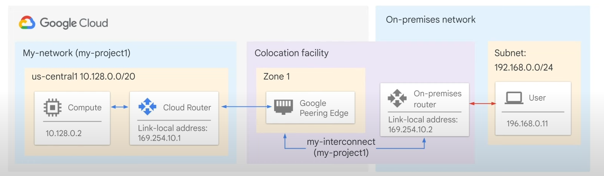

* Provides direct physical connections between your on-premises network and Google’s network.
* Enables large data transfers, potentially more cost-effective than additional public internet bandwidth.
* Requires provisioning a cross connect between the Google network and your router in a colocation facility.
* Configure a BGP session over the interconnect between the Cloud Router and the on-premises router.
* Offers 99.9% or 99.99% uptime SLA.
* Requires physical presence in a supported colocation facility.
* Dedicated Interconnect Documentation
* Colocation Facilities Locations

## Partner Interconnect


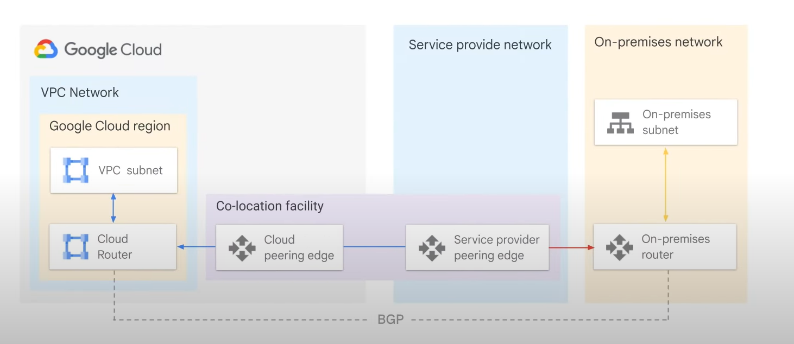

* Provides connectivity between your on-premises network and your VPC network through a supported service provider.
* Useful if your data center cannot reach a Dedicated Interconnect colocation facility or if data needs don't warrant Dedicated Interconnect.
* Work with a supported service provider to connect your VPC and on-premises networks.
* Establish a BGP session between your Cloud Router and on-premises router via the service provider's network.
* Offers 99.9% or 99.99% uptime SLA between Google and the service provider.
* Partner Interconnect Documentation
* Service Providers List

## Cross-Cloud Interconnect

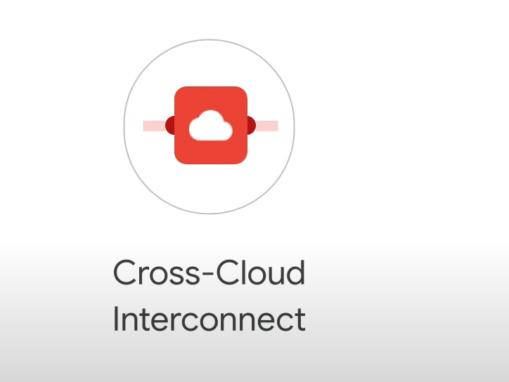

* Establishes high-bandwidth dedicated connectivity between Google Cloud and another cloud service provider.
* Supports Amazon Web Services, Microsoft Azure, Oracle Cloud Infrastructure, and Alibaba Cloud.
* Supports integrated multi-cloud strategy, reduced complexity, site-to-site data transfer, and encryption.
* Available in two sizes: 10 Gbps or 100 Gbps.
* Identify supported locations, purchase primary and redundant Cross-Cloud Interconnect ports, and buy ports from your cloud service provider.
* Google supports the connection up to the point where it reaches the other cloud service provider's network.

## Comparison of Interconnect Options

* **Cloud VPN**:
  * Capacity: 1.5 to 3 Gbps per tunnel.
  * Requires a VPN device on your on-premises network.
  * Multiple tunnels can be configured to scale capacity.
* **Dedicated Interconnect**:
  * Capacity: 10 Gbps or 100 Gbps per link.
  * Requires connection in a Google-supported colocation facility.
  * Up to 8 links for multiples of 10 Gbps, or up to 2 links for multiples of 100 Gbps.
* **Partner Interconnect**:
  * Capacity: 50 Mbps to 50 Gbps per connection.
  * Requirements depend on the service provider.
* **Cross-Cloud Interconnect**:
  * Capacity: 10 Gbps or 100 Gbps.
  * Connects Google Cloud to another cloud service provider.

## Recommendations

* **Cloud VPN**: Lower cost solution, lower bandwidth needs, or experimenting with migrating workloads to Google Cloud.
* **Dedicated Interconnect or Partner Interconnect**: Enterprise-grade connection to Google Cloud with higher throughput.
* **Cross-Cloud Interconnect**: Connecting to another cloud service provider.
* Google recommends using Cloud Interconnect instead of Direct Peering and Carrier Peering, except in certain circumstances.

# Cloud Peering Services

## Direct Peering

* Establish a direct peering connection between your business network and Google's network.
* Exchange Internet traffic at one of Google's edge network locations.
* Done by exchanging BGP routes between Google and the peering entity.
* Allows access to all Google services, including Google Cloud platform products.
* Does not have an SLA.
* Requires satisfying Google's peering requirements.
* GCP's Edge Points of Presence (PoPs) connect Google's network to the Internet via peering.
* PoPs are present at over 90 Internet exchanges and over 100 interconnection facilities worldwide.
* Google's Peering DB Entries

## Carrier Peering

* Provides access to Google public infrastructure if direct peering requirements cannot be met.
* Connect via a carrier peering partner.
* Work with a service provider to establish the connection and understand their requirements.
* Does not have an SLA.
* Capacity and requirements vary depending on the service provider.
* Service Providers List

## Comparison of Peering Options

* Both options provide public IP address access to all Google services.
* **Direct Peering**:
  * Capacity: 10 Gbps per link.
  * Requires a connection in a GCP Edge Point of Presence.
* **Carrier Peering**:
  * Capacity and requirements vary depending on the service provider.

# Determining the Best Hybrid Connectivity Service

## Overview

* **5 Ways to Connect to Google Cloud**:
  * Dedicated vs. Shared connections
  * Layer 2 vs. Layer 3 connections

* **Interconnect Services**:
  * Provide direct access to RFC1918 IP addresses in your VPC
  * Include an SLA
* **Peering Services**:
  * Offer access to Google public IP addresses only
  * Do not include an SLA

## Choosing the Right Service

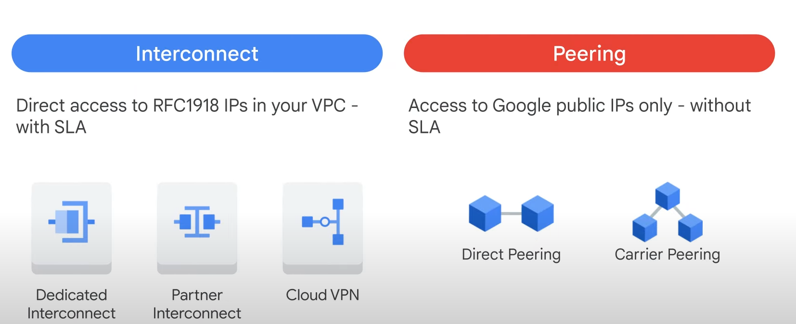

### Peering Services

* **Use Case**: Extend your network for Workspace services, YouTube, or Google Cloud APIs.
  * **Direct Peering**: If you can meet Google’s Direct Peering requirements.
  * **Carrier Peering**: If you cannot meet Direct Peering requirements.

### Cross Cloud Interconnect

* **Use Case**: Connect your Google Cloud network with other cloud services.
  * Ideal for workloads needing high bandwidth and a Google-managed routing solution.

### Cloud VPN

* **Use Case**: Connect Google Cloud VPC with another cloud service without high bandwidth requirements.
  * Keeps encryption managed by Google.

### Interconnect Services

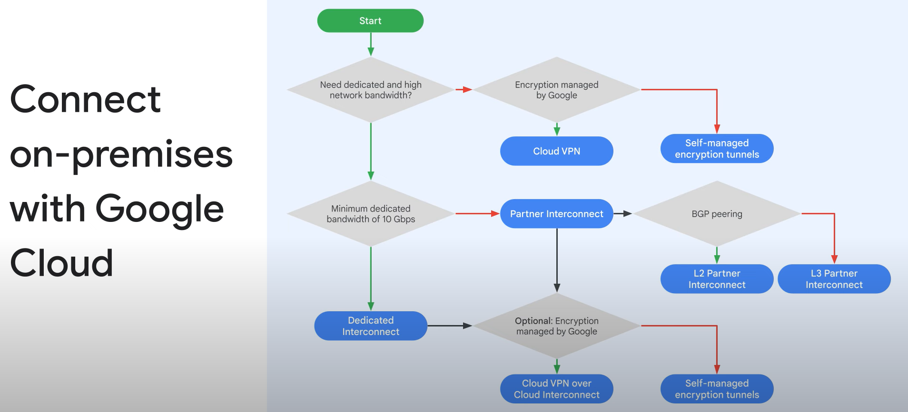

* **Use Case**: Extend the reach of your network to Google Cloud.
  * **Colocation Facilities**: Start here if possible.
  * **Cloud VPN or Partner Interconnect**: If colocation facilities are not an option.
    * **Cloud VPN**: For modest bandwidth needs, short durations, trials, and encrypted channels.
    * **Partner Interconnect**: For higher bandwidth needs.
      * **L2 Partner Interconnect**: If you need BGP peering.
      * **L3 Partner Interconnect**: If you don’t need BGP peering.

### Dedicated Interconnect

* **Use Case**: Meet Google at a colocation facility.
  * Consider Cloud VPN or Partner Interconnect if:
    * You cannot provide your own encryption mechanisms for sensitive traffic.
    * A 10 Gbps connection is too large.
    * You want access to multiple cloud services.

### VPN over Interconnect

* **Use Case**: After deciding on Interconnect options.
  * Choose Cloud VPN over Interconnect for Google-managed encryption.

# Sharing VPC Networks

## Overview

* In a simple cloud environment, a single project might have one VPC network spanning many regions.

* Many organizations deploy multiple, isolated projects with multiple VPC networks and subnets.

## Configurations for Sharing VPC Networks

1. **Shared VPC**
2. **VPC Network Peering**

### Shared VPC

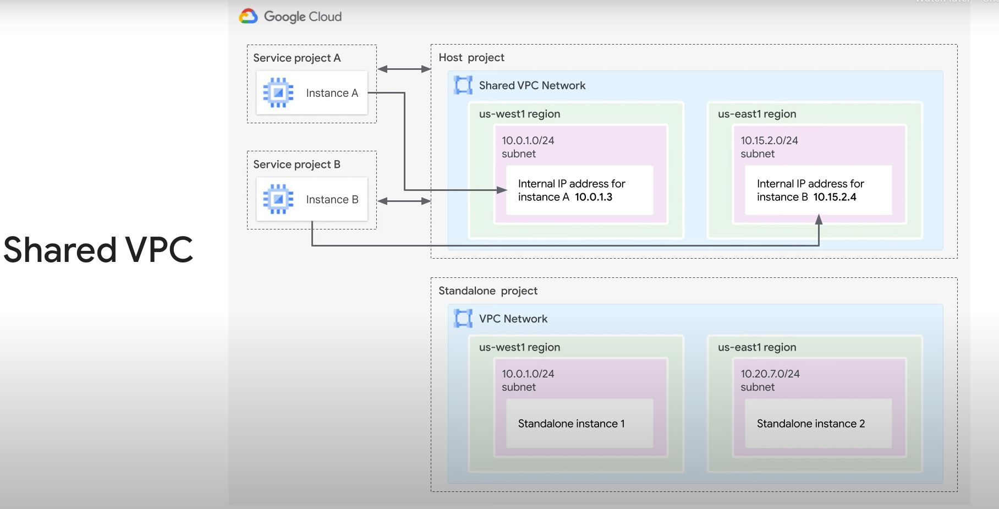

* Allows an organization to connect resources from multiple projects to a common VPC network.

* Resources can communicate securely and efficiently using internal IP addresses.
* Designate a project as a host project and attach one or more service projects.
* VPC networks in the host project are called Shared VPC networks.
* Eligible resources from service projects can use subnets in the Shared VPC network.
* Allows delegation of administrative responsibilities to Service Project Admins while maintaining centralized control over network resources.
* **Project Types**:
  * **Host Project**: Contains the Shared VPC network.
  * **Service Project**: Uses subnets from the Shared VPC network.
  * **Standalone Project**: Does not participate in Shared VPC.

### VPC Network Peering

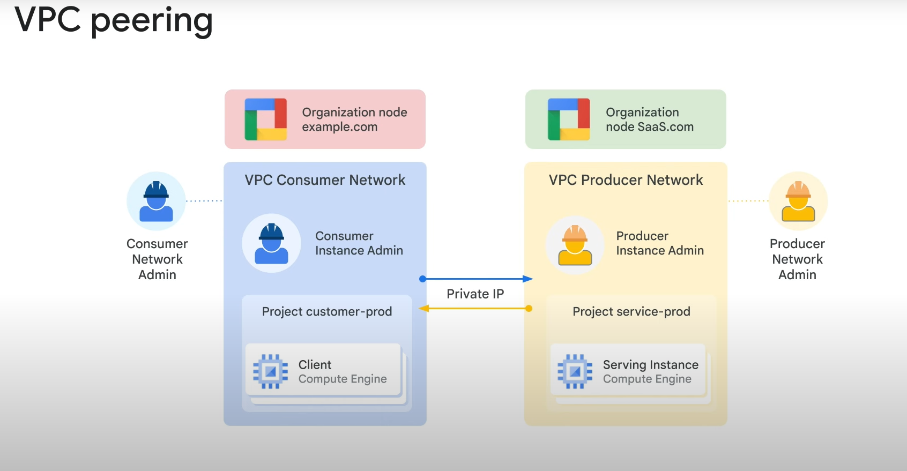

* Allows private RFC 1918 connectivity across two VPC networks, regardless of project or organization.

* Each VPC network has firewall rules defining allowed or denied traffic.
* Requires mutual peering connections between the networks.
* When both peering connections are created, the peering session becomes Active and routes are exchanged.
* Allows VM instances to communicate privately using internal IP addresses.
* Decentralized approach to multi-project networking, with each VPC network maintaining its own global firewall and routing tables.
* Avoids network latency, security, and cost drawbacks of using external IP addresses or VPNs.

## Comparison of Shared VPC and VPC Network Peering

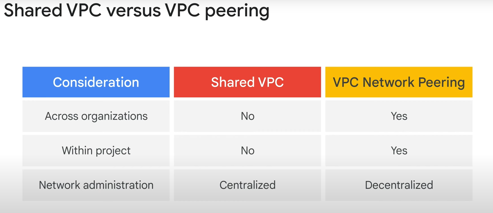

* **Private Communication**:
  * **Different Organizations**: Use VPC Network Peering.
  * **Same Organization**: Use Shared VPC.
  * **Same Project**: Use VPC Network Peering.

* **Network Administration Models**:
  * **Shared VPC**: Centralized approach, with security and network policy in a single designated VPC network.
  * **VPC Network Peering**: Decentralized approach, with each VPC network under separate administrator control and maintaining its own firewall and routing tables.
