# Load Balancing and Autoscaling

## Cloud Load Balancing

- Distributes load-balanced compute resources in single or multiple regions.
- Meets high availability requirements.
- Puts resources behind a single anycast IP address.
- Scales resources up or down with intelligent autoscaling.
- Can respond to over 1 million queries per second.
- Fully distributed, software-defined, managed service.
- No need to manage physical load balancing infrastructure.

## Types of Load Balancers

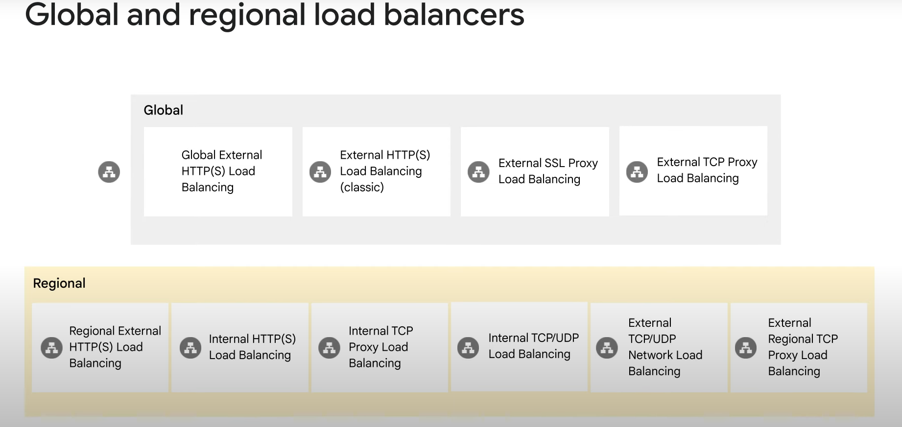

### Global Load Balancers

- **HTTP(S)(Hypertext Transfer Protocol) Load Balancer**
- **SSL(Secure Sockets Layer) Proxy Load Balancer**
- **TCP(Transmission Control Protocol) Proxy Load Balancer**
- Leverage Google frontends, distributed globally.
- Use when users and instances are globally distributed, need access to the same applications and content, and require a single anycast IP address.

### Regional Load Balancers

- **External and Internal HTTP(S) Load Balancer**
- **TCP Proxy Load Balancer**
- **Internal TCP/UDP(User Datagram Protocol) Load Balancer**
- **External TCP/UDP Network Load Balancer**
- Distribute traffic to instances in a single Google Cloud region.
- Internal load balancer uses Andromeda (Google Cloud’s software-defined network virtualization stack).
- Network load balancer uses Maglev (large, distributed software system).
- Internal HTTP(S) load balancer is a proxy-based, regional Layer 7 load balancer.

## Managed Instance Groups and Autoscaling

- Managed instance groups can be used by load balancing configurations.
- Autoscaling configurations help scale resources based on demand.

## Choosing the Right Load Balancer

- The module helps determine which Google Cloud load balancer best meets your needs.

# Managed Instance Groups

## Overview

- A managed instance group is a collection of identical VM instances controlled as a single entity using an instance template.
- Easily update all instances in a group by specifying a new template in a rolling update.
- Automatically scale the number of instances in the group based on application needs.
- Work with load balancing services to distribute network traffic to all instances in the group.
- Automatically recreate instances that stop, crash, or are deleted by actions other than instance group commands.
- Recreated instances use the same name and instance template as the previous instance.
- Automatically identify and recreate unhealthy instances to ensure optimal performance.

## Regional vs. Zonal Managed Instance Groups

- **Regional Managed Instance Groups**:
  - Recommended over zonal managed instance groups.
  - Spread application load across multiple zones.
  - Protect against zonal failures and unforeseen scenarios.
  - Ensure application continues serving traffic from instances in another zone within the same region.
- **Zonal Managed Instance Groups**:
  - Confine application to a single zone.
  - Require managing multiple instance groups across different zones.

## Creating a Managed Instance Group

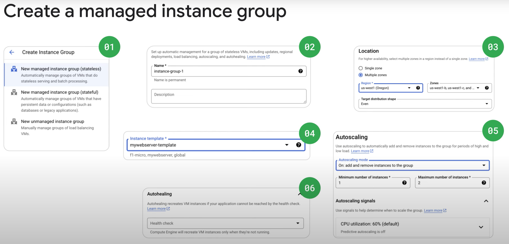

1. **Create an Instance Template**:
   - Use the cloud console to create instance templates.
   - Instance template dialogue works like creating an instance, with choices recorded for repetition.
2. **Create a Managed Instance Group**:
   - Define specific rules for the instance group.
   - Decide the type of managed instance group (stateless or stateful).
   - Provide a name for the instance group.
   - Decide whether the instance group is single or multizoned and specify locations.
   - Optionally provide port name mapping details.
   - Select the instance template to use.
   - Decide on autoscaling and under what circumstances.
   - Consider creating a health check to determine which instances are healthy and should receive traffic.

## Use Cases

- **Stateless Serving or Batch Workloads**:
  - Examples: Website front end, image processing from a queue.
- **Stateful Applications**:
  - Examples: Databases, legacy applications.

## Autoscaling and Health Checks in Managed Instance Groups

### Autoscaling

- **Purpose**: Automatically add or remove instances based on load changes.
- **Benefits**:
  - Gracefully handle traffic increases.
  - Reduce costs when resource demand is lower.
- **Autoscaling Policies**:
  - **CPU Utilization**: Scale based on CPU usage.
  - **Load Balancing Capacity**: Scale based on load balancer metrics.
  - **Monitoring Metrics**: Scale based on custom metrics.
  - **Queue-Based Workload**: Scale based on Pub/Sub or other queue metrics.
  - **Schedule**: Scale based on specific times, durations, and recurrence.
- **Example**:
  - If two instances are at 100% and 85% CPU utilization, and the target is 75%, the autoscaler adds another instance to distribute the load.
  - If the load is much lower than the target, the autoscaler removes instances to maintain the target utilization.
- **Monitoring Utilization**:
  - View metrics like CPU, disk, and network usage for instance groups or individual VMs.
  - Use Cloud Monitoring to set up alerts through various notification channels.

### Health Checks

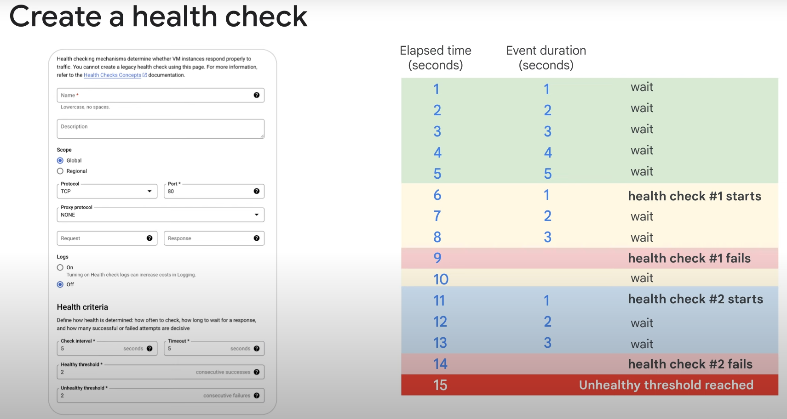

- **Purpose**: Ensure instances are healthy and can receive traffic.
- **Configuration**:
  - Define protocol, port, and health criteria.
  - **Health Criteria**:
    - **Check Interval**: How often to check instance health.
    - **Timeout**: How long to wait for a response.
    - **Healthy Threshold**: Number of successful attempts to consider an instance healthy.
    - **Unhealthy Threshold**: Number of failed attempts to consider an instance unhealthy.
- **Example**:
  - A health check fails twice over 15 seconds before an instance is marked unhealthy.

### Stateful IP Addresses

- **Purpose**: Ensure applications function seamlessly during autohealing, updates, and recreation events.
- **Types**: Both internal and external IPv4 addresses can be preserved.
- **Configuration**:
  - Automatically assign IP addresses or assign specific IP addresses to each VM instance.
- **Use Cases**:
  - Applications requiring static IP addresses.
  - Applications dependent on specific IP addresses.
  - Users or applications accessing servers through dedicated static IP addresses.
  - Migrating existing workloads without changing network configuration.
- **Operations**:
  - Configure IP addresses as stateful for all existing and future instances.
  - Promote ephemeral IP addresses to static IP addresses.
  - Update existing stateful configuration for IP addresses.

# HTTP(S) Load Balancing

-Load-Balancing.png)

## Overview

- Acts at Layer 7 of the OSI model (application layer).
- Deals with the actual content of each message, allowing for routing decisions based on the URL.
- Provides global load balancing for HTTP(S) requests destined for your instances.
- Applications are available to customers at a single anycast IP address, simplifying DNS setup.
- Balances HTTP and HTTPS traffic across multiple back-end instances and regions.
- Supports both IPv4 and IPv6 clients.
- Scalable, requires no pre-warming, and enables content-based and cross-regional load balancing.

## Ports

- **HTTP**: Port 80 or 8080
- **HTTPS**: Port 443

## URL Maps

- Configure URL maps to route specific URLs to different sets of instances.
- Requests are generally routed to the closest instance group with sufficient capacity.

## Architecture

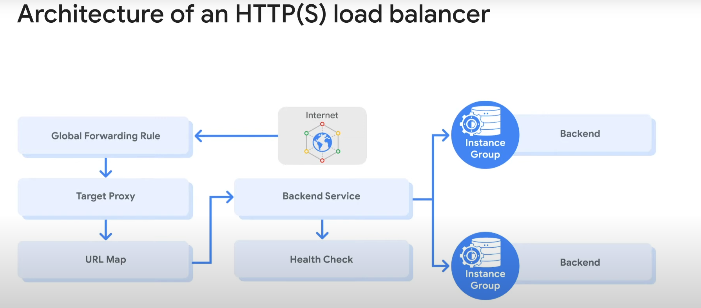

1. **Global Forwarding Rule**: Directs incoming requests from the Internet to a target HTTP proxy.
2. **Target HTTP Proxy**: Checks each request against a URL map to determine the appropriate back-end service.
3. **Back-End Service**: Directs each request to an appropriate back-end based on serving capacity, zone, and instance health.

## Back-End Services

- Contain a health check, session affinity, a timeout setting, and one or more backends.
- **Health Check**: Polls instances at configured intervals; only healthy instances receive new requests.
- **Session Affinity**: Attempts to send all requests from the same client to the same VM instance.
- **Timeout Setting**: Default is 30 seconds; adjust for longer-lived connections if needed.

## Backends

- Contain an instance group, a balancing mode, and a capacity scaler.
- **Instance Group**: May be managed (with or without autoscaling) or unmanaged.
- **Balancing Mode**: Determines when the back-end is at full usage (based on CPU utilization or requests per second).
- **Capacity Setting**: Interacts with the balancing mode setting to control instance utilization.

## Example

- If instances should operate at a maximum of 80% CPU utilization, set balancing mode to 80% CPU utilization and capacity to 100%.
- To cut instance utilization in half, set balancing mode to 80% CPU utilization and capacity to 50%.

## Propagation

- Changes to back-end services are not instantaneous and may take several minutes to propagate throughout the network.

# HTTP Load Balancer in Action

## Scenario

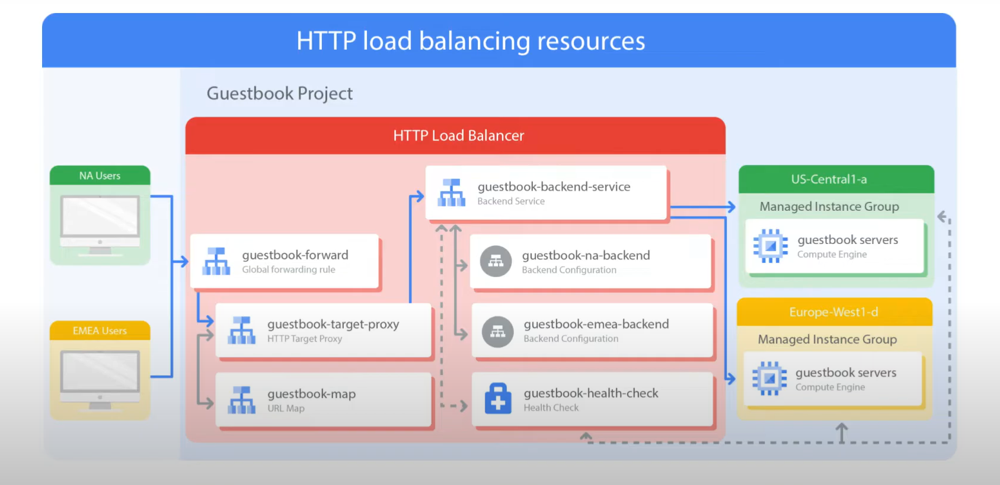

- The project has a single global IP address.
- Users enter the Google Cloud network from two different locations: North America and EMEA.

## Steps

1. **Global Forwarding Rule**:
   - Directs incoming requests to the target HTTP proxy.
2. **Target HTTP Proxy**:
   - Checks the URL map to determine the appropriate backend service for the request.
   - Example: Serving a guestbook application with one backend service.
3. **Backend Service**:
   - Two backends: one in `us-central1-a` and one in `europe-west1-d`.
   - Each backend consists of a managed instance group.

## Request Handling

- **User Request**:
  - Load balancing service determines the approximate origin of the request from the source IP address.
  - Knows the locations, overall capacity, and current usage of instances.
  - Forwards the request to the closest set of instances with available capacity.
- **Example**:
  - Traffic from North America is forwarded to the managed instance group in `us-central1-a`.
  - Traffic from EMEA is forwarded to the managed instance group in `europe-west1-d`.

## Load Distribution

- Incoming requests in a region are distributed evenly across all available backend services and instances.
- If no healthy instances with available capacity are in a region, the load balancer sends the request to the next closest region with available capacity.
- **Cross-Region Load Balancing**:
  - Example: Traffic from EMEA could be forwarded to `us-central1-a` if `europe-west1-d` has no capacity or healthy instances.

## Content-Based Load Balancer

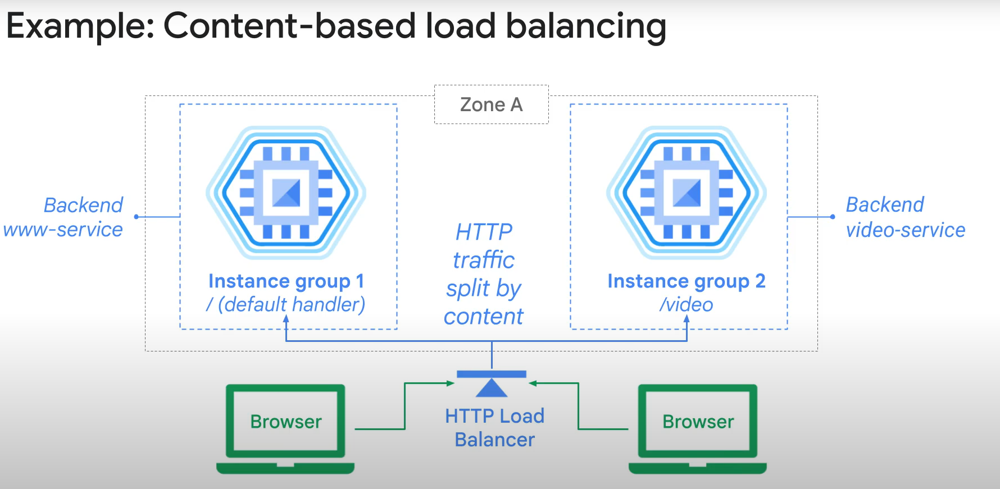

- Two separate backend services handle web or video traffic.
- Traffic is split based on the URL header as specified in the URL map.
- **Example**:
  - Traffic to `/video` is sent to the backend video service.
  - Traffic to other URLs is sent to the web-service backend.
- Achieved with a single global IP address.

### Session Affinity in Content-Based Load Balancing

**Session affinity** in content-based load balancing ensures that all requests from the same client are directed to the same backend instance. This is particularly useful for maintaining session state and providing a consistent user experience.

### How Session Affinity Works

- **Mechanism**: Session affinity works by using cookies or other identifiers to track the client’s session.
- **Purpose**: Ensures that all requests from a single client are sent to the same backend instance, maintaining session consistency.

### HTTP(S) Load Balancer Differences

- **Target HTTPS Proxy**: Uses a target HTTPS proxy instead of a target HTTP proxy.
- **SSL Certificates**: Requires at least one signed SSL certificate installed on the target HTTPS proxy.
- **Client SSL Sessions**: Terminate at the load balancer.
- **QUIC Protocol**: Supports the QUIC transport layer protocol for faster client connection initiation, eliminating head-of-line blocking, and supporting connection migration when a client's IP address changes.

### SSL Certificates

- **Requirement**: At least one SSL certificate for the target proxy.
- **Configuration**: Up to 15 SSL certificates can be configured for the target proxy.
- **SSL Certificate Resource**: Contains SSL certificate information and is used with load balancing proxies.

### Backend Buckets

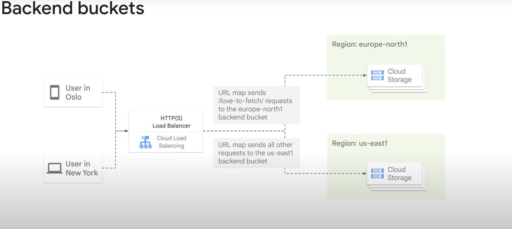

- **Purpose**: Use Google Cloud Storage buckets with HTTP(S) Load Balancing.
- **URL Map**: Directs traffic from specified URLs to either a backend service or a backend bucket.
- **Use Case**: Send requests for dynamic content to a backend service and static content to a backend bucket.

### Network Endpoint Groups (NEGs)

- **Definition**: Configuration object specifying a group of backend endpoints or services.
- **Use Cases**: Deploying services in containers, distributing traffic to applications on backend instances.
- **Types**:
  - **Zonal NEGs**: Contain endpoints that can be Compute Engine VMs or services running on VMs.
  - **Internet NEGs**: Contain a single endpoint hosted outside of Google Cloud.
  - **Hybrid Connectivity NEGs**: Point to Traffic Director services running outside of Google Cloud.
  - **Serverless NEGs**: Point to Cloud Run, App Engine, Cloud Functions services in the same region as the NEG.

### Example of Content-Based Load Balancing

- **Scenario**: Two separate backend services handle web or video traffic.
- **URL Map**: Splits traffic based on the URL header.
  - **/video**: Traffic sent to the backend video service.
  - **Other URLs**: Traffic sent to the web-service backend.
- **Single Global IP Address**: Achieves content-based load balancing with a single global IP address.

# Configure an Application Load Balancer with Autoscaling in Google Cloud

## Overview

Application Load Balancing (HTTP/HTTPS) is implemented at the edge of Google's network in points of presence (POP) around the world. User traffic directed to an Application Load Balancer enters the POP closest to the user and is then load-balanced over Google's global network to the closest backend with sufficient available capacity.

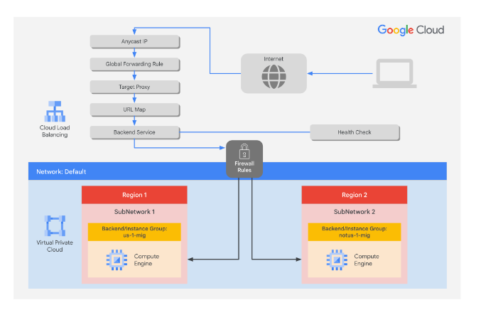

### Lab Objectives

In this lab, you will learn how to perform the following tasks:

1. **Create a Health Check Firewall Rule**
   - Define firewall rules to allow health check probes to reach your instances.

2. **Create a NAT Configuration Using Cloud Router**
   - Set up Network Address Translation (NAT) to allow instances without external IP addresses to access the internet.

3. **Create a Custom Image for a Web Server**
   - Build a custom image that includes your web server configuration and any necessary software.

4. **Create an Instance Template Based on the Custom Image**
   - Use the custom image to create an instance template that can be used to deploy instances.

5. **Create Two Managed Instance Groups**
   - Deploy two managed instance groups in different regions or zones for high availability.

6. **Configure an Application Load Balancer (HTTP) with IPv4 and IPv6**
   - Set up an HTTP load balancer that supports both IPv4 and IPv6 traffic.

7. **Stress Test an Application Load Balancer (HTTP)**
   - Perform a stress test to ensure the load balancer can handle high traffic and demonstrate autoscaling.

### Task 1: Configure a Health Check Firewall Rule

Health checks determine which instances of an Application Load Balancer (HTTP) can receive new connections. The health check probes to your load-balanced instances come from addresses in the ranges `130.211.0.0/22` and `35.191.0.0/16`. Your firewall rules must allow these connections.

#### Steps to Create the Health Check Rule

1. **Open the Cloud Console**:
   - Go to the Navigation menu and click **VPC network** > **Firewall**.

2. **Review Existing Firewall Rules**:
   - Notice the existing ICMP, internal, RDP, and SSH firewall rules.
   - Each Google Cloud project starts with the default network and these firewall rules.

3. **Create a New Firewall Rule**:
   - Click **Create Firewall Rule**.

4. **Configure the Firewall Rule**:
   - **Name**: `fw-allow-health-checks`
   - **Network**: `default`
   - **Targets**: `Specified target tags`
   - **Target tags**: `allow-health-checks`
   - **Source filter**: `IPv4 ranges`
   - **Source IPv4 ranges**: `130.211.0.0/22` and `35.191.0.0/16`
   - **Protocols and ports**: `Specified protocols and ports`
     - Select `tcp` and specify port `80`.

5. **Create the Rule**:
   - Click **Create**.

By following these steps, you will have created a firewall rule that allows health checks to reach your load-balanced instances, ensuring they can receive new connections.

### Task 2: Create a NAT Configuration Using Cloud Router

The Google Cloud VM backend instances that you set up in Task 3 will not be configured with external IP addresses. Instead, you will set up the Cloud NAT service to allow these VM instances to send outbound traffic only through the Cloud NAT and receive inbound traffic through the load balancer.

#### Steps to Create the Cloud Router Instance

1. **Open Network Services**:
   - In the Google Cloud Console title bar, type **Network services** in the search field.
   - Click **Network services** in the Network management tools section.

2. **Pin Network Services**:
   - On the Network services page, click **Pin** next to Network services.

3. **Access Cloud NAT**:
   - Click **Cloud NAT**.

4. **Configure NAT Gateway**:
   - Click **Get started** to configure a NAT gateway.

5. **Specify NAT Gateway Settings**:
   - **Gateway name**: `nat-config`
   - **Network**: `default`
   - **Region**: `Region 1`

6. **Create Cloud Router**:
   - Click **Cloud Router**, and select **Create new router**.
   - For **Name**, type `nat-router-us1`.
   - Click **Create**.

7. **Create NAT Gateway**:
   - In **Create a NAT gateway**, click **Create**.

8. **Wait for NAT Gateway Status**:
   - Wait until the NAT Gateway Status changes to **Running** before moving on to the next task.

By following these steps, you will have successfully created a NAT configuration using Cloud Router, allowing your VM instances to send outbound traffic through Cloud NAT and receive inbound traffic through the load balancer.

### Task 3: Create a Custom Image for a Web Server

Create a custom web server image for the backend of the load balancer.

#### Steps to Create a VM

1. **Create a VM**:
   - In the Cloud Console, go to **Compute Engine** > **VM instances**.
   - Click **Create Instance**.
   - Specify the following settings:
     - **Name**: `webserver`
     - **Region**: `Region 1`
     - **Zone**: `Zone 1`
     - **Boot disk**: Click **Change** > **Show Advanced Configuration**.
       - **Deletion rule**: Select **Keep boot disk**.
       - Click **Select**.
     - **Advanced options**: Click **Networking**.
       - **Network tags**: Type `allow-health-checks`.
       - **Network interfaces**: Click `default`.
       - **External IPv4 IP**: Select `None`.
       - Click **Done**.
   - Click **Create**.

2. **Customize the VM**:
   - For `webserver`, click **SSH** to launch a terminal and connect.
   - If prompted, allow SSH-in-browser to connect to VMs by clicking **Authorize**.
   - Install Apache2 by running the following commands:

     ```sh
     sudo apt-get update
     sudo apt-get install -y apache2
     ```

   - Start the Apache server:

     ```sh
     sudo service apache2 start
     ```

   - Test the default page for the Apache2 server:

     ```sh
     curl localhost
     ```

   - The default page for the Apache2 server should be displayed.

3. **Set the Apache Service to Start at Boot**:
   - In the `webserver` SSH terminal, set the service to start on boot:

     ```sh
     sudo update-rc.d apache2 enable
     ```

   - In the Cloud Console, select `webserver`, and then click **More actions**.
   - Click **Reset**.
   - In the confirmation dialog, click **Reset**.
   - Check the server by connecting via SSH to the VM and entering:

     ```sh
     sudo service apache2 status
     ```

   - The result should show `Started The Apache HTTP Server`.

4. **Prepare the Disk to Create a Custom Image**:
   - Verify that the boot disk will not be deleted when the instance is deleted.
   - On the VM instances page, click `webserver` to view the VM instance details.
   - For **Storage** > **Boot disk**, verify that **When deleting instance** is set to **Keep disk**.
   - Return to the VM instances page, select `webserver`, and then click **More actions**.
   - Click **Delete**.
   - In the confirmation dialog, click **Delete**.
   - In the left pane, click **Disks** and verify that the `webserver` disk exists.

5. **Create the Custom Image**:
   - In the left pane, click **Images**.
   - Click **Create image**.
   - Specify the following settings:
     - **Name**: `mywebserver`
     - **Source**: `Disk`
     - **Source disk**: `webserver`
   - Click **Create**.

You have now created a custom image that multiple identical web servers can be started from. The next step is to use that image to define an instance template that can be used in the managed instance groups.

### Task 4: Configure an Instance Template and Create Instance Groups

A managed instance group uses an instance template to create a group of identical instances. Use these to create the backends of the HTTP load balancer.

#### Steps to Configure the Instance Template

1. **Create an Instance Template**:
   - In the Cloud Console, go to **Compute Engine** > **Instance templates**.
   - Click **Create Instance Template**.
   - Specify the following settings:
     - **Name**: `mywebserver-template`
     - **Location**: `Global`
     - **Series**: `E2`
     - **Machine type**: `Shared-core`, select `e2-micro (2 vCPU, 1 core, 1 GB memory)`
     - **Boot disk**: Click **Change**.
       - Click **Custom images**.
       - For **Source project for images**, ensure that Qwiklabs project ID is selected.
       - For **Image**, select `mywebserver`.
       - Click **Select**.
     - **Advanced options**: Click **Networking**.
       - **Network tags**: Type `allow-health-checks`.
       - **Network interfaces**: Click `default`.
       - **External IPv4 IP**: Select `None`.
       - Click **Done**.
   - Click **Create**.

#### Steps to Create the Health Check for Managed Instance Groups

1. **Create a Health Check**:
   - In the Navigation menu, go to **Compute Engine** > **Health checks**.
   - Click **Create health check**.
   - Specify the following settings:
     - **Name**: `http-health-check`
     - **Protocol**: `TCP`
     - **Port**: `80`
   - Click **Create**.

#### Steps to Create the Managed Instance Groups

1. **Create a Managed Instance Group in Region 1**:
   - In the Navigation menu, go to **Compute Engine** > **Instance groups**.
   - Click **Create Instance Group**.
   - Specify the following settings:
     - **Name**: `us-1-mig`
     - **Instance template**: `mywebserver-template`
     - **Location**: `Multiple zones`
     - **Region**: `Region 1`
     - **Autoscaling**:
       - **Minimum number of instances**: `1`
       - **Maximum number of instances**: `2`
       - **Autoscaling signals**: Click on the CPU utilization.
       - **Signal type**: `HTTP load balancing utilization`
       - **Target HTTP load balancing utilization**: `80`
       - **Initialization period**: `60 seconds`
     - **Autohealing**:
       - **Health check type**: `http-health-check (TCP)`
       - **Initial delay**: `60 seconds`
   - Click **Create**.
   - Click **Confirm** in the dialog window.

2. **Create a Managed Instance Group in Region 2**:
   - Repeat the same procedure for `notus-1-mig` in Region 2.
   - Specify the following settings:
     - **Name**: `notus-1-mig`
     - **Instance template**: `mywebserver-template`
     - **Location**: `Multiple zones`
     - **Region**: `Region 2`
     - **Autoscaling**:
       - **Minimum number of instances**: `1`
       - **Maximum number of instances**: `2`
       - **Autoscaling signals**: Click on the CPU utilization.
       - **Signal type**: `HTTP load balancing utilization`
       - **Target HTTP load balancing utilization**: `80`
       - **Initialization period**: `60 seconds`
     - **Autohealing**:
       - **Health check type**: `http-health-check (TCP)`
       - **Initial delay**: `60 seconds`
   - Click **Create**.
   - Click **Confirm** in the dialog window.

By following these steps, you will have configured an instance template and created managed instance groups for the backends of the HTTP load balancer.

### Task 5: Configure the Application Load Balancer (HTTP)

Configure the Application Load Balancer (HTTP) to balance traffic between the two backends (`us-1-mig` in Region 1 and `notus-1-mig` in Region 2) as illustrated in the network diagram.

#### Steps to Configure the Application Load Balancer

1. **Start the Configuration**:
   - In the Navigation menu, go to **Network Services** > **Load balancing**.
   - Click **Create Load Balancer**.
   - For **Type of load balancer**, select **Application Load Balancer (HTTP/HTTPS)**, then click **Next**.
   - For **Public facing or internal**, select **Public facing (external)**, then click **Next**.
   - For **Global or single region deployment**, select **Best for global workloads**, then click **Next**.
   - For **Load balancer generation**, select **Global external Application Load Balancer**, then click **Next**.
   - For **Create load balancer**, click **Configure**.
   - For **Load Balancer Name**, type `http-lb`.

2. **Configure the Frontend**:
   - Click **Frontend configuration**.
   - Specify the following settings:
     - **Protocol**: `HTTP`
     - **IP version**: `IPv4`
     - **IP address**: `Ephemeral`
     - **Port**: `80`
   - Click **Done**.
   - Click **Add Frontend IP and Port**.
   - Specify the following settings:
     - **Protocol**: `HTTP`
     - **IP version**: `IPv6`
     - **IP address**: `Auto-allocate`
     - **Port**: `80`
   - Click **Done**.

3. **Configure the Backend**:
   - Click **Backend Configuration**.
   - Click **Backend services & backend buckets** > **Create a Backend Service**.
   - Specify the following settings:
     - **Name**: `http-backend`
     - **Backend type**: `Instance group`
     - **Instance group**: `us-1-mig`
     - **Port numbers**: `80`
     - **Balancing mode**: `Rate`
     - **Maximum RPS**: `50`
     - **Capacity**: `100`
   - Click **Done**.
   - Click **Add Backend**.
   - Specify the following settings:
     - **Instance group**: `notus-1-mig`
     - **Port numbers**: `80`
     - **Balancing mode**: `Utilization`
     - **Maximum backend utilization**: `80`
     - **Capacity**: `100`
   - Click **Done**.
   - For **Health Check**, select `http-health-check`.
   - Check the **Enable logging** checkbox.
   - Specify **Sample rate** as `1`.
   - Click **Create**.
   - Click **OK**.

4. **Review and Create the HTTP Load Balancer**:
   - Click **Review and finalize**.
   - Review the Backend services and Frontend.
   - Click **Create**.
   - Wait for the load balancer to be created.
   - Click on the name of the load balancer (`http-lb`).
   - Note the IPv4 and IPv6 addresses of the load balancer for the next task. They will be referred to as `[LB_IP_v4]` and `[LB_IP_v6]`, respectively.

By following these steps, you will have configured an Application Load Balancer (HTTP) to balance traffic between the two managed instance groups.

### Task 6: Stress Test the Application Load Balancer (HTTP)

Now that you have created the Application Load Balancer (HTTP) for your backends, it is time to verify that traffic is forwarded to the backend service.

#### Steps to Access the Application Load Balancer (HTTP)

1. **Activate Cloud Shell**:
   - On the Google Cloud console title bar, click **Activate Cloud Shell**.
   - If prompted, click **Continue**.

2. **Check the Status of the Load Balancer**:
   - Run the following command, replacing `[LB_IP_v4]` with the IPv4 address of the load balancer:

     ```sh
     LB_IP=[LB_IP_v4]
     while [ -z "$RESULT" ] ;
     do
       echo "Waiting for Load Balancer";
       sleep 5;
       RESULT=$(curl -m1 -s $LB_IP | grep Apache);
     done
     ```

   - Note: Once the load balancer is ready, the command will exit.

3. **Verify the Load Balancer**:
   - Open a new tab in your browser and navigate to the load balancer's IPv4 address.

#### Steps to Stress Test the Application Load Balancer (HTTP)

1. **Create a New VM for Stress Testing**:
   - In the Cloud Console, go to **Compute Engine** > **VM instances**.
   - Click **Create instance**.
   - Specify the following settings:
     - **Name**: `stress-test`
     - **Region**: A region different but closer to Region 1
     - **Zone**: A zone from the region
     - **Series**: `E2`
     - **Machine type**: `e2-micro (2 vCPU)`
     - **Boot Disk**: Click **Change**.
       - Click **Custom images**.
       - For **Source project for images**, ensure that Qwiklabs project ID is selected.
       - For **Image**, select `mywebserver`.
       - Click **Select**.
   - Click **Create**.
   - Wait for the `stress-test` instance to be created.

2. **Connect to the Stress Test VM**:
   - For `stress-test`, click **SSH** to launch a terminal and connect.
   - If prompted, allow SSH-in-browser to connect to VMs by clicking **Authorize**.

3. **Set Up the Environment Variable**:
   - Create an environment variable for your load balancer IP address:

     ```sh
     export LB_IP=[LB_IP_v4]
     ```

   - Verify it with:

     ```sh
     echo $LB_IP
     ```

4. **Place a Load on the Load Balancer**:
   - Run the following command to stress test the load balancer:

     ```sh
     ab -n 500000 -c 1000 http://$LB_IP/
     ```

5. **Monitor the Load Balancer**:
   - In the Cloud Console, go to **Network Services** > **Load balancing**.
   - Click `http-lb`.
   - Click **Monitoring**.
   - Monitor the **Frontend Location (Total inbound traffic)** between North America and the two backends for a couple of minutes.
     - Note: Initially, traffic should be directed to `us-1-mig`, but as the RPS increases, traffic will also be directed to `notus-1-mig`.

6. **Monitor the Instance Groups**:
   - In the Cloud Console, go to **Compute Engine** > **Instance groups**.
   - Click on `us-1-mig` to open the instance group page.
   - Click **Monitoring** to monitor the number of instances and LB capacity.
   - Repeat the same for the `notus-1-mig` instance group.
     - Note: Depending on the load, you might see the backends scale to accommodate the load.

By following these steps, you will have successfully stress tested the Application Load Balancer (HTTP) and verified that traffic is balanced across both backends.

# Cloud CDN Overview

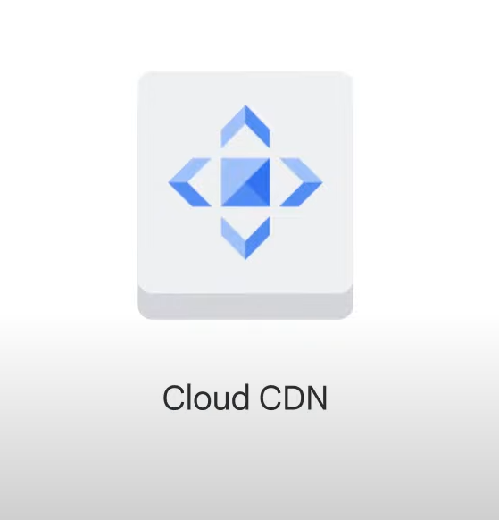

Cloud CDN (Content Delivery Network) uses Google's globally distributed edge points of presence to cache HTTP(S) load-balanced content close to your users. This improves content delivery speed and reduces serving costs.

#### Key Points

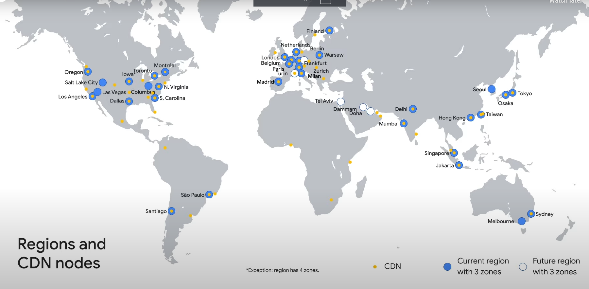

- **Cache Sites**: Over 90 cache sites across Asia Pacific, Americas, and EMEA.
- **Benefits**: Faster content delivery and reduced serving costs.
- **Enablement**: Easily enabled with a checkbox when setting up the backend service of your HTTP(S) load balancer.

### Cloud CDN Response Flow

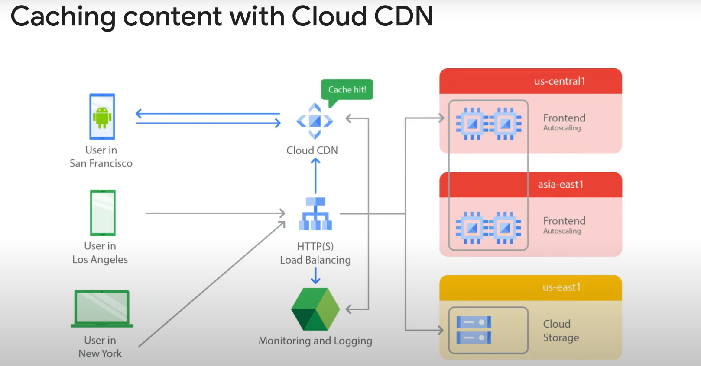

1. **Initial Request**:
   - User in San Francisco requests content.
   - Cache site in San Francisco checks if it has the content (cache miss if not).

2. **Cache Miss Handling**:
   - Cache may try to get content from a nearby cache (e.g., Los Angeles).
   - If not available, request is forwarded to the HTTP(S) load balancer.

3. **Backend Request**:
   - Load balancer forwards request to the appropriate backend (e.g., us-central1 instance group or us-east1 storage bucket).

4. **Caching**:
   - If content is cacheable, it is stored at the San Francisco cache site for future requests (cache hit on subsequent requests).

### Cloud CDN Logging

- Each request is logged with a “Cache Hit” or “Cache Miss” status.
- Logs help in monitoring and analyzing CDN performance.

### Cache Modes

Cloud CDN offers three cache modes to control caching behavior:

1. **USE_ORIGIN_HEADERS**:
   - Requires origin responses to set valid cache directives and headers.

2. **CACHE_ALL_STATIC**:
   - Automatically caches static content unless it has `no-store`, `private`, or `no-cache` directives.
   - Caches origin responses with valid caching directives.

3. **FORCE_CACHE_ALL**:
   - Unconditionally caches responses, overriding any cache directives set by the origin.
   - Avoid caching private, per-user content with this mode.

By understanding and configuring these cache modes, you can optimize how Cloud CDN caches your content, ensuring efficient and effective content delivery to your users.

# SSL Proxy and TCP Proxy Load Balancing

## SSL Proxy

- **Global Load Balancing Service**: For encrypted non-HTTP traffic.
- **Connection Termination**: Terminates user SSL connections at the load balancing layer.
- **Protocol Support**: Balances connections across instances using SSL or TCP protocols.
- **Multi-Region Support**: Instances can be in multiple regions; traffic is directed to the closest region with capacity.
- **IPv4 and IPv6 Support**: Supports both IPv4 and IPv6 addresses for client traffic.
- **Features**:
  - **Intelligent Routing**: Routes requests to back-end locations with capacity.
  - **Certificate Management**: Update customer-facing certificates in one place.
  - **Security Patching**: GCP applies patches automatically to keep instances safe.
  - **SSL Policies**: Provides SSL policies for enhanced security.

## Benefits

- **Reduced Management Overhead**: Use self-signed certificates on instances.
- **Automatic Patching**: GCP handles vulnerabilities in the SSL or TCP stack.

## Example Network Diagram

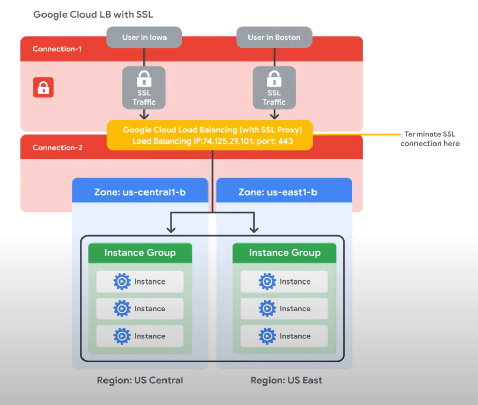

- **Traffic Flow**:
  - Traffic from users in Iowa and Boston is terminated at the global load balancing layer.
  - Separate connections are established to the closest back-end instance.
  - Users in Boston reach the US east region, and users in Iowa reach the US central region if there's enough capacity.
- **Protocol Use**: Traffic between the proxy and the backend can use SSL and TCP.

## Recommendation

- **Use SSL**: Recommended for secure traffic between the proxy and backend.

# TCP Proxy Load Balancing

## TCP Proxy

- **Global Load Balancing Service**: For unencrypted, non-HTTP traffic.
- **Connection Termination**: Terminates customer TCP sessions at the load balancing layer.
- **Protocol Support**: Forwards traffic to virtual machine instances using TCP or SSL.
- **Multi-Region Support**: Instances can be in multiple regions; traffic is directed to the closest region with capacity.
- **IPv4 and IPv6 Support**: Supports both IPv4 and IPv6 addresses for client traffic.
- **Features**:
  - **Intelligent Routing**: Routes requests to back-end locations with capacity.
  - **Security Patching**: GCP applies patches automatically to keep instances safe.

## Benefits

- **Reduced Management Overhead**: Similar to SSL proxy load balancing.
- **Automatic Patching**: GCP handles vulnerabilities in the TCP stack.

## Example Network Diagram

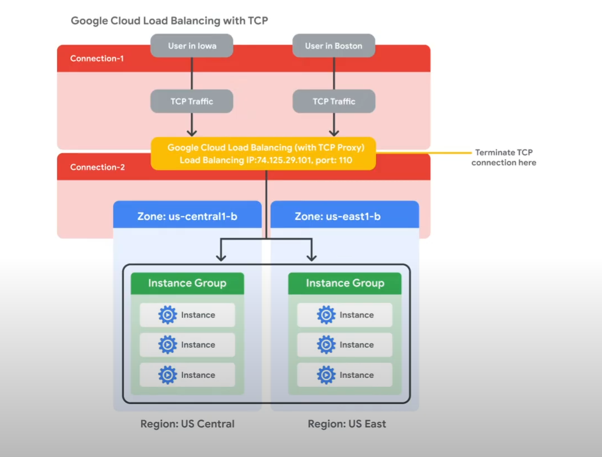

- **Traffic Flow**:
  - Traffic from users in Iowa and Boston is terminated at the global load balancing layer.
  - Separate connections are established to the closest back-end instance.
  - Users in Boston reach the US east region, and users in Iowa reach the US central region if there's enough capacity.
- **Protocol Use**: Traffic between the proxy and the backend can use SSL or TCP.

## Recommendation

- **Use SSL**: Recommended for secure traffic between the proxy and backend.

Here's the information about network load balancing in Markdown format:

# Network Load Balancing

## Overview

- **Regional Load Balancing Service**: Non-proxied load balancing service.
- **Traffic Handling**: All traffic is passed through the load balancer instead of being proxied.
- **Region-Specific**: Traffic can only be balanced between VM instances in the same region.

## Features

- **Forwarding Rules**: Uses forwarding rules to balance the load based on incoming IP protocol data (address, port, protocol type).
- **Protocol Support**:
  - Load balances UDP traffic.
  - Load balances TCP and SSL traffic on ports not supported by TCP proxy and SSL proxy load balancers.

## Architecture

- **Back-End Service-Based Network Load Balancer**:
  - Defines the behavior of the load balancer.
  - Distributes traffic across back-end instance groups.
  - Supports new features not available with legacy target pools:
    - Non-legacy health checks.
    - TCP, SSL, HTTP, HTTPS, and HTTP/2.
    - Auto-scaling with managed instance groups.
    - Connection draining.
    - Configurable failover policy.

- **Target Pool-Based Network Load Balancer**:
  - **Target Pool Resource**: Defines a group of instances that receive incoming traffic from forwarding rules.
  - **Traffic Distribution**: Load balancer picks an instance based on a hash of the source IP and port and the destination IP and port.
  - **Protocol Handling**: Can handle TCP and UDP traffic.
  - **Limitations**:
    - Each project can have up to 50 target pools.
    - Each target pool can have only one health check.
    - All instances in a target pool must be in the same region.

## Summary

- **Regional Focus**: Unlike global load balancers, network load balancers are region-specific.
- **Flexible Traffic Management**: Suitable for balancing various types of traffic, including UDP, TCP, and SSL.
- **Enhanced Features**: New back-end service-based load balancers offer advanced features and improved traffic management.

Here's the information about internal load balancing in Markdown format:

# Internal Load Balancing

## Overview

- **Internal TCP/UDP Load Balancer**: A regional private load balancing service for TCP and UDP-based traffic.
- **Private IP Address**: Accessible only through internal IP addresses or VM instances in the same region.
- **Configuration**: Configure an internal TCP/UDP load balancing IP address to act as the front end to private back-end instances.
- **Latency Reduction**: Internal client requests stay within the VPC network and region, often resulting in lowered latency.

## Benefits

- **Software-Defined**: Not based on a device or VM instance; fully distributed load balancing solution.
- **Simplified Configuration**: All load balanced traffic stays within Google's network.

## Traditional Proxy Model vs. Google Cloud Internal Load Balancing

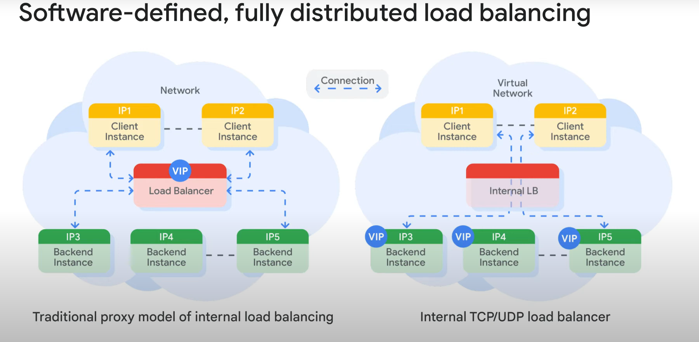

- **Traditional Proxy Model**:
  - Configure an internal IP address on a load balancing device or instance.
  - Client instance connects to this IP address.
  - Traffic is terminated at the load balancer, which selects a back end to establish a new connection.
  - Two connections: one between the client and the load balancer, and one between the load balancer and the back end.

- **Google Cloud Internal Load Balancing**:
  - Uses lightweight load balancing built on top of Andromeda, Google's network virtualization stack.
  - Directly delivers traffic from the client instance to a back-end instance.

## Internal HTTPS Load Balancing

- **Proxy-Based Regional Layer Seven Load Balancer**: Enables running and scaling services behind an internal load balancing IP address.
- **Protocol Support**: Supports HTTP, HTTPS, and HTTP/2 protocols.
- **Managed Service**: Based on the open source Envoy proxy, providing rich traffic control capabilities based on HTTPS parameters.
- **Automatic Scaling**: Automatically allocates Envoy proxies to meet traffic needs.

## Use Cases

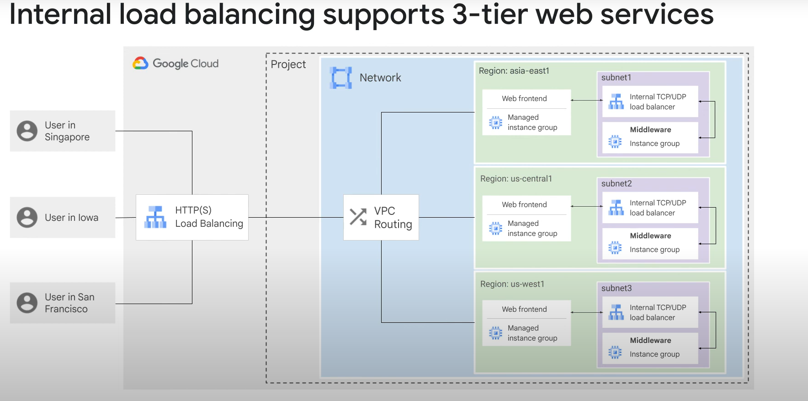

- **Three-Tier Web Services**:
  - **Web Tier**: Uses an external HTTPS load balancer with a single global IP address for users in various locations.
  - **Application/Internal Tier**: Accessed via an internal load balancer in each region.
  - **Data-Based Tier**: Located in specific zones within each region.
  - **Benefits**: Neither the data-based tier nor the application tier is exposed externally, simplifying security and network pricing.

# Configure an Internal Network Load Balancer

## Overview

Google Cloud offers internal Network Load Balancing for your TCP/UDP-based traffic. Internal Network Load Balancing enables you to run and scale your services behind a private load balancing IP address that is accessible only to your internal virtual machine instances.

## Lab Steps

1. **Create Managed Instance Groups**:
   - Create two managed instance groups in the same region.

2. **Configure Internal Network Load Balancer**:
   - Set up the internal Network Load Balancer with the instance groups as the backends.

3. **Test the Configuration**:
   - Verify that the internal Network Load Balancer is correctly distributing traffic to the back-end instances.

## Network Diagram

- **Diagram Description**: The network diagram illustrates the setup where traffic is balanced between the two managed instance groups within the same region.

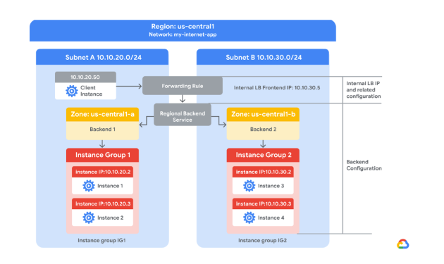

# Task 1: Configure Internal Traffic and Health Check Firewall Rules

## Overview

Configure firewall rules to allow internal traffic connectivity from sources in the `10.10.0.0/16` range. This rule allows incoming traffic from any client located in the subnet.

Health checks determine which instances of a load balancer can receive new connections. For Application Load Balancing (HTTP), the health check probes to your load-balanced instances come from addresses in the ranges `130.211.0.0/22` and `35.191.0.0/16`. Your firewall rules must allow these connections.

## Explore the `my-internal-app` Network

The network `my-internal-app` with `subnet-a` and `subnet-b` and firewall rules for RDP, SSH, and ICMP traffic have been configured for you.

1. In the Cloud Console, on the Navigation menu, click **VPC network > VPC networks**.
2. Notice the `my-internal-app` network with its subnets: `subnet-a` and `subnet-b`.

Each Google Cloud project starts with the default network. In addition, the `my-internal-app` network has been created for you as part of your network diagram.

You will create the managed instance groups in `subnet-a` and `subnet-b`. Both subnets are in the same region because an internal Network Load Balancer is a regional service. The managed instance groups will be in different zones, making your service immune to zonal failures.

## Create the Firewall Rule to Allow Traffic from Any Sources in the `10.10.0.0/16` Range

1. On the Navigation menu, click **VPC network > Firewall**.
2. Notice the `app-allow-icmp` and `app-allow-ssh-rdp` firewall rules. These firewall rules have been created for you.
3. Click **Create Firewall Rule**.
4. Specify the following, and leave the remaining settings as their defaults:
   - **Name**: `fw-allow-lb-access`
   - **Network**: `my-internal-app`
   - **Targets**: Specified target tags
   - **Target tags**: `backend-service`
   - **Source filter**: IPv4 ranges
   - **Source IPv4 ranges**: `10.10.0.0/16`
   - **Protocols and ports**: Allow all
5. Click **Create**.

## Create the Health Check Rule

1. On the Navigation menu, click **VPC network > Firewall**.
2. Click **Create Firewall Rule**.
3. Specify the following, and leave the remaining settings as their defaults:
   - **Name**: `fw-allow-health-checks`
   - **Network**: `my-internal-app`
   - **Targets**: Specified target tags
   - **Target tags**: `backend-service`
   - **Source filter**: IPv4 Ranges
   - **Source IPv4 ranges**: `130.211.0.0/22` and `35.191.0.0/16`
   - **Protocols and ports**: Specified protocols and ports
     - For **tcp**, check the checkbox and specify port 80.
4. Click **Create**.

# Task 2: Create a NAT Configuration Using Cloud Router

## Overview

The Google Cloud VM backend instances that you set up in Task 3 will not be configured with external IP addresses. Instead, you will set up the Cloud NAT service to allow these VM instances to send outbound traffic only through the Cloud NAT and receive inbound traffic through the load balancer.

### Steps to Create the Cloud Router Instance

1. **Access Network Services**:
   - On the Google Cloud console title bar, type **Network services** in the Search field.
   - Click **Network services** in the Products & Page section.

2. **Pin Network Services**:
   - On the Network service page, click **Pin** next to Network services.

3. **Configure Cloud NAT**:
   - Click **Cloud NAT**.
   - Click **Get started** to configure a NAT gateway.

4. **Specify NAT Gateway Settings**:
   - **Gateway name**: `nat-config`
   - **Network**: `my-internal-app`
   - **Region**: `Region`

5. **Create Cloud Router**:
   - Click **Cloud Router**, and select **Create new router**.
   - For **Name**, type `nat-router-Region`.
   - Click **Create**.

6. **Finalize NAT Gateway**:
   - In **Create Cloud NAT gateway**, click **Create**.
   - Wait until the NAT Gateway Status changes to **Running** before moving onto the next task.

7. **Verify Objective**:
   - Click **Check my progress** to verify the objective.

# Task 3: Configure Instance Templates and Create Instance Groups

## Overview

A managed instance group uses an instance template to create a group of identical instances. Use these to create the backends of the internal Network Load Balancer.

This task has been performed for you at the start of this lab. You will need to SSH into each instance group VM and run the following command to set up the environment.

## Steps

1. **Access VM Instances**:
   - On the Navigation menu, click **Compute Engine > VM instances**.
   - Notice the instances that start with `instance-group-1` and `instance-group-2`.

2. **SSH into Instance Group VMs**:
   - Select the **SSH** button next to `instance-group-1` to SSH into the VM.
   - If prompted to allow SSH-in-browser to connect to VMs, click **Authorize**.
   - Run the following command to re-run the instance's startup script:

     ```bash
     sudo google_metadata_script_runner startup
     ```

   - Repeat the previous steps for `instance-group-2`.
   - Wait for both startup scripts to finish executing, then close the SSH terminal to each VM. The output of the startup script should state: `Finished running startup scripts`.

3. **Verify the Backends**:
   - Verify that VM instances are being created in both subnets and create a utility VM to access the backends' HTTP sites.
   - On the Navigation menu, click **Compute Engine > VM instances**.
   - Notice the instances that start with `instance-group-1` and `instance-group-2`. These instances are in separate zones, and their internal IP addresses are part of the `subnet-a` and `subnet-b` CIDR blocks.

4. **Create a Utility VM**:
   - Click **Create Instance**.
   - Specify the following, and leave the remaining settings as their defaults:
     - **Name**: `utility-vm`
     - **Region**: `Region`
     - **Zone**: `Zone 3`
     - **Series**: `E2`
     - **Machine type**: `e2-medium (2 vCPU, 4 GB memory)`
     - **Boot disk**: `Debian GNU/Linux 12 (bookworm)`
   - Click **Advanced options**.
   - Click **Networking**.
   - For **Network interfaces**, click the dropdown to edit.
   - Specify the following, and leave the remaining settings as their defaults:
     - **Network**: `my-internal-app`
     - **Subnetwork**: `subnet-a`
     - **Primary internal IPv4 address**: `Ephemeral (Custom)`
     - **Custom ephemeral IP address**: `10.10.20.50`
     - **External IPv4 address**: `None`
   - Click **Done**.
   - Click **Create**.

5. **Verify Backend IP Addresses**:
   - Note that the internal IP addresses for the backends are `10.10.20.2` and `10.10.30.2`.
   - If these IP addresses are different, replace them in the two `curl` commands below.

6. **Verify Backend Connectivity**:
   - For `utility-vm`, click **SSH** to launch a terminal and connect.
   - If prompted to allow SSH-in-browser to connect to VMs, click **Authorize**.
   - To verify the welcome page for `instance-group-1-xxxx`, run the following command:

     ```bash
     curl 10.10.20.2
     ```

   - The output should look like this:

     ```bash
     Internal Load Balancing Lab
     Client IP
     Your IP address : 10.10.20.50
     Hostname
     Server Hostname: instance-group-1-1zn8
     Server Location
     Region and Zone: 
     ```

   - To verify the welcome page for `instance-group-2-xxxx`, run the following command:

     ```bash
     curl 10.10.30.2
     ```

   - The output should look like this:

     ```bash
     Internal Load Balancing Lab
     Client IP
     Your IP address : 10.10.20.50
     Hostname
     Server Hostname: instance-group-2-q5wp
     Server Location
     Region and Zone: 
     ```

7. **Identify Backend Location**:
   - The **Server Location** field identifies the location of the backend.

8. **Close SSH Terminal**:
   - Close the SSH terminal to `utility-vm` by typing:

     ```bash
     exit
     ```

# Task 4: Configure the Internal Network Load Balancer

## Overview

Configure the internal Network Load Balancer to balance traffic between the two backends (`instance-group-1` in Zone 1 and `instance-group-2` in Zone 2), as illustrated in the network diagram.

## Steps to Configure

1. **Start the Configuration**:
   - In the Cloud Console, on the Navigation menu, click **Network services > Load balancing**.
   - Click **Create load balancer**.
   - For **Type of load balancer**, select **Network Load Balancer (TCP/UDP/SSL)**, click **Next**.
   - For **Proxy or passthrough**, select **Passthrough load balancer** and click **Next**.
   - For **Public facing or internal**, select **Internal** and click **Next**.
   - For **Create load balance**, click **Configure**.
   - For **Load balancer name**, type `my-ilb`.
   - For **Region**, type `Region`.
   - For **Network**, select `my-internal-app` from the dropdown.

2. **Configure the Regional Backend Service**:
   - Click **Backend configuration**.
   - Specify the following, and leave the remaining settings as their defaults:
     - **Instance group**: `instance-group-1` (Zone 1)
   - Click **Done**.
   - Click **Add a backend**.
   - For **Instance group**, select `instance-group-2` (Zone 2).
   - Click **Done**.
   - For **Health Check**, select **Create a health check**.
   - Specify the following, and leave the remaining settings as their defaults:
     - **Name**: `my-ilb-health-check`
     - **Protocol**: TCP
     - **Port**: 80
     - **Check interval**: 10 sec
     - **Timeout**: 5 sec
     - **Healthy threshold**: 2
     - **Unhealthy threshold**: 3
   - Click **Save**.
   - Verify that there is a blue checkmark next to **Backend configuration** in the Cloud Console. If there isn't, double-check that you have completed all the steps above.

3. **Configure the Frontend**:
   - Click **Frontend configuration**.
   - Specify the following, and leave the remaining settings as their defaults:
     - **Subnetwork**: `subnet-b`
     - **Internal IP purpose > IP address**: Create IP address
     - **Name**: `my-ilb-ip`
     - **Static IP address**: Let me choose
     - **Custom IP address**: `10.10.30.5`
   - Click **Reserve**.
   - Under **Ports**, for **Port number**, type `80`.
   - Click **Done**.

4. **Review and Create the Internal Network Load Balancer**:
   - Click **Review and finalize**.
   - Review the Backend and Frontend.
   - Click **Create**.
   - Wait for the load balancer to be created before moving to the next task.

# Task 5: Test the Internal Network Load Balancer

## Overview

Verify that the `my-ilb` IP address forwards traffic to `instance-group-1` in Zone 1 and `instance-group-2` in Zone 2.

## Steps to Test

1. **Access the Internal Network Load Balancer**:
   - On the Navigation menu, click **Compute Engine > VM instances**.
   - For `utility-vm`, click **SSH** to launch a terminal and connect.
   - If prompted to allow SSH-in-browser to connect to VMs, click **Authorize**.

2. **Verify Traffic Forwarding**:
   - To verify that the internal Network Load Balancer forwards traffic, run the following command:

     ```bash
     curl 10.10.30.5
     ```

   - The output should look like this:

     ```bash
     Internal Load Balancing Lab
     Client IP
     Your IP address : 10.10.20.50
     Hostname
     Server Hostname: instance-group-2-1zn8
     Server Location
     Region and Zone: Zone 2
     ```

   - Note: As expected, traffic is forwarded from the internal load balancer (`10.10.30.5`) to the backend.

3. **Run the Command Multiple Times**:
   - Run the following command multiple times to see responses from both `instance-group-1` in Zone 1 and `instance-group-2` in Zone 2:

     ```bash
     curl 10.10.30.5
     curl 10.10.30.5
     curl 10.10.30.5
     curl 10.10.30.5
     curl 10.10.30.5
     curl 10.10.30.5
     curl 10.10.30.5
     curl 10.10.30.5
     curl 10.10.30.5
     curl 10.10.30.5
     ```

   - You should be able to see responses from both instance groups. If not, run the command again.

## Conclusion

Congratulations on successfully testing the internal Network Load Balancer!

# Load Balancing Services in Google Cloud

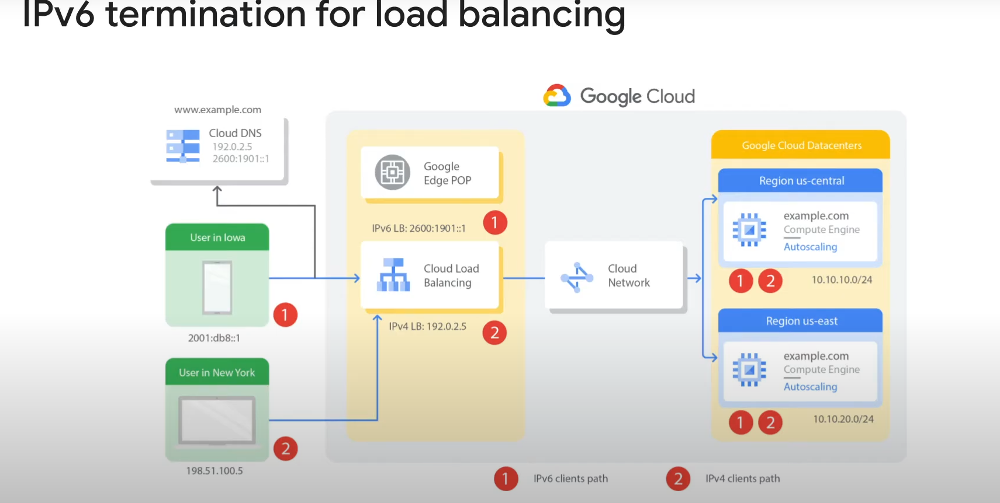

## IPv6 Support

- **Supported Load Balancers**: HTTP(S), SSL proxy, TCP proxy
- **IPv6 Termination**: Handles IPv6 requests and proxies them over IPv4 to backends
  - Example: `www.example.com` translated by Cloud DNS to both IPv4 and IPv6 addresses
  - Desktop user in New York accesses via IPv4, mobile user in Iowa via IPv6
  - Load balancer acts as a reverse proxy, converting IPv6 client connections to IPv4 backend connections and vice versa

### Choosing the Right Load Balancer


- **Application Load Balancer**: For flexible feature set with HTTP(S) traffic
- **Proxy Network Load Balancer**: For TLS offload, TCP proxy, or external load balancing across multiple regions
- **Passthrough Network Load Balancer**: Preserves client source IP addresses, avoids proxy overhead, supports additional protocols like UDP, ESP, ICMP

### Application Requirements

- **External (Internet-facing) vs. Internal Applications**
- **Global vs. Regional Backend Deployment**

### Load-Balancing Scheme

- **Attribute**: On forwarding rule and backend service
- **Internal vs. External Traffic**: Indicates usage
- **MANAGED Scheme**: Implemented as a managed service on Google Front Ends or Envoy proxy
  - Requests routed to Google Front End or Envoy proxy

### Additional Information

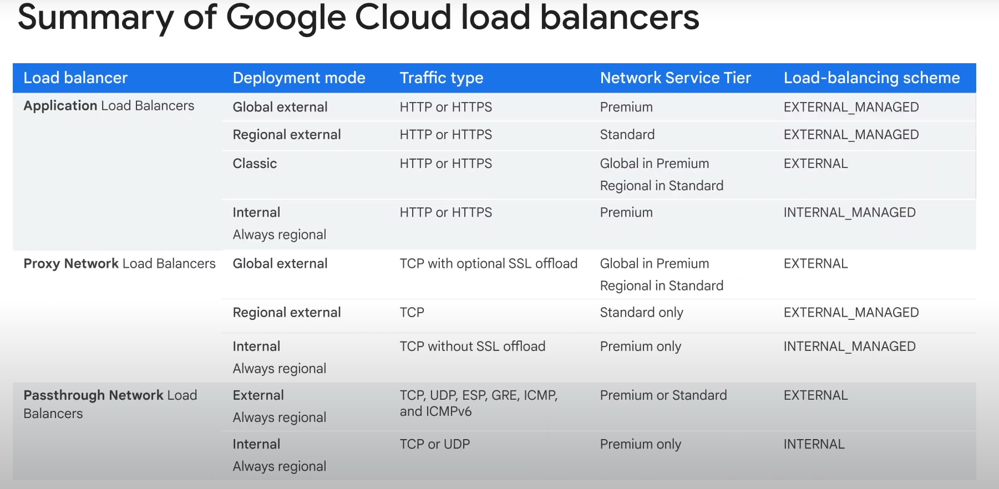

- **Network Service Tiers**: Refer to the documentation for more details
