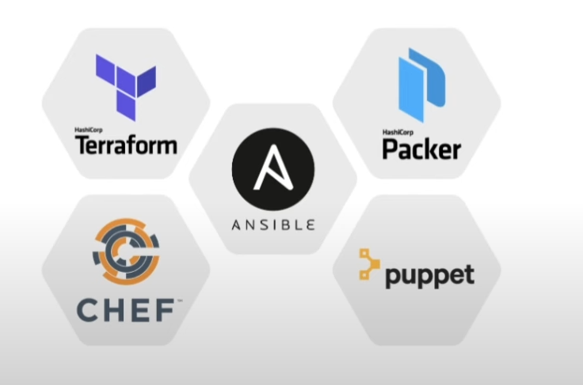
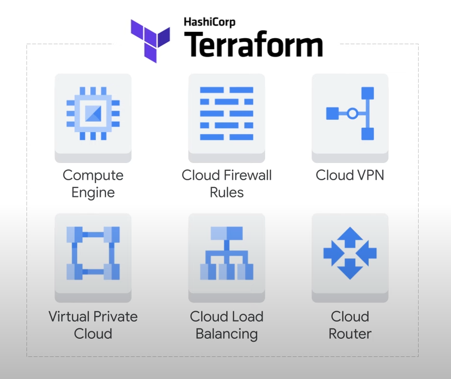
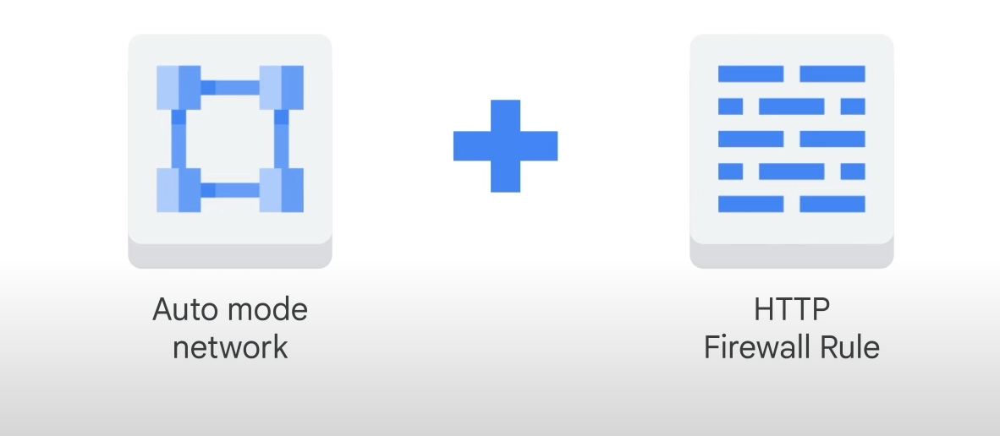

# Automating Google Cloud Infrastructure Deployment

## Introduction

- **Automating Deployment**: Using Cloud API from code to generate infrastructure
- **Challenges**: Maintainability depends on software quality
  - Example: Multiple locations in code calling Cloud API to create VMs
  - Fixing issues requires identifying the specific call among many

## Importance of Software Development Best Practices

- **Rapid Changes**: Applications change quickly, requiring code maintenance
- **Need for Organization**: Terraform provides a structured approach

## Terraform Overview

- **Purpose**: Uses structured templates and configuration files
  - **Documentation**: Infrastructure is documented in an easily readable format
  - **Conceals API Calls**: Focus on infrastructure definition without writing code

## Module Coverage

- **Using Terraform**: Automate deployment of infrastructure
- **Google Cloud Marketplace**: Launch infrastructure solutions

## Lab Activities

- **Deployments with Terraform**:
  - VPC network
  - Firewall rule
  - VM instances

## Getting Started with Terraform

- **Next Steps**: Introduction to Terraform

# Automating Google Cloud Infrastructure Deployment

## Using Google Cloud Console and Cloud Shell

- **Google Cloud Console**: Recommended for beginners or those who prefer a UI
- **Cloud Shell**: Best for users comfortable with command line for quick resource creation

## Introduction to Terraform

- **Infrastructure as Code (IaC)**: Quick provisioning and removal of infrastructure
  - **On-Demand Provisioning**: Powerful for continuous integration and deployment
  - **Automated Provisioning**: Manages deployment complexity in code
  - **Flexibility**: Easily change infrastructure as requirements evolve
  - **Consistency**: Replicate production environments for development and testing

## Tools for IaC



- **Supported Tools**: Terraform, Chef, Puppet, Ansible, Packer
- **Focus on Terraform**: Declarative configuration files for provisioning resources

### Terraform Overview



- **Declarative Approach**: Specify desired state, system determines steps
- **Parallel Deployment**: Deploy resources simultaneously
- **Underlying APIs**: Uses Google Cloud service APIs for deployment
- **Supported Resources**: Instances, instance templates, VPC networks, firewall rules, VPN tunnels, Cloud Routers, load balancers

### Terraform Language

- **User Interface**: Declare resources using HashiCorp Configuration Language (HCL)
- **Configuration**: Complete document detailing infrastructure management
  - **Blocks**: Represent objects, can have labels, body for arguments and nested blocks
  - **Arguments**: Assign values to names
  - **Expressions**: Represent values assigned to identifiers

### Example Terraform Configuration

- **Provider Block**: Specifies Google Cloud as the provider, region for deployment
- **Resource Block**: Details of the instance to be created
- **Output Block**: Specifies output variable for the Terraform module

### Setting Up Infrastructure with Terraform



- **Example Setup**: Auto mode network with HTTP firewall rule
  - **main.tf File**: Blueprint for desired state
  - **Provider Definition**: Google Cloud provider
  - **Network Definition**: Auto create subnetworks, set MTU
  - **Firewall Definition**: Allow TCP access to port 80 and 8080

### Terraform Commands

- **terraform init**: Initialize new Terraform configuration, download provider plugin
- **terraform plan**: Check execution plan without making changes
- **terraform apply**: Create infrastructure defined in main.tf file

### Additional Resources

- **Using Terraform with Google Cloud**: Documentation for supported resource types

# Automating the Deployment of Infrastructure Using Terraform

## Task 1: Set Up Terraform and Cloud Shell

### Configure Cloud Shell Environment

- **Install Terraform**: Integrated into Cloud Shell
- **Verify Installation**:
  - Activate Cloud Shell
  - Run: `terraform --version`
  - Expected Output: `Terraform v1.3.3`
  - Note: Lab instructions work with Terraform v1.3.3 and later

### Create Directory for Terraform Configuration

- **Command**: `mkdir tfinfra`
- **Open Cloud Shell Editor**:
  - Click Open editor
  - If prompted, open in a new window

### Initialize Terraform

- **Plugin-Based Architecture**: Supports various infrastructure and service providers
- **Set Google as Provider**:
  - Create `provider.tf` file in `tfinfra` folder
  - Add the following code:

    ```hcl
    provider "google" {}
    ```

  - Save the file

### Initialize Terraform Configuration

- **Commands**:
  - `cd tfinfra`
  - `terraform init`
- **Expected Output**:

  ```hcl
  * provider.google: version = "~> 4.43.0"
  Terraform has been successfully initialized!
  ```

You are now ready to work with Terraform in Cloud Shell.

Feel free to add or modify any sections as needed! If you have more notes to include, just let me know.

## Task 2: Create `mynetwork` and Its Resources

### Configure `mynetwork`

Create a new configuration and define `mynetwork`.

### Steps

1. **Create Configuration File**:
   - Right-click on `tfinfra` folder and click **New File**.
   - Name the new file `mynetwork.tf` and open it.

2. **Base Code for `mynetwork.tf`**:

   ```hcl
   # Create the mynetwork network
   resource "google_compute_network" "mynetwork" {
     name = "mynetwork"
     auto_create_subnetworks = "true"
   }
   ```

3. **Save the File**:
   - Click **File > Save**.

## Configure the Firewall Rule

Define a firewall rule to allow HTTP, SSH, RDP, and ICMP traffic on `mynetwork`.

### Steps

1. **Add Base Code to `mynetwork.tf`**:

   ```hcl
   # Add a firewall rule to allow HTTP, SSH, RDP and ICMP traffic on mynetwork
   resource "google_compute_firewall" "mynetwork-allow-http-ssh-rdp-icmp" {
     name = "mynetwork-allow-http-ssh-rdp-icmp"
     network = google_compute_network.mynetwork.self_link
     allow {
       protocol = "tcp"
       ports    = ["22", "80", "3389"]
     }
     allow {
       protocol = "icmp"
     }
     source_ranges = ["0.0.0.0/0"]
   }
   ```

2. **Save the File**:
   - Click **File > Save**.

You have now configured `mynetwork` and its firewall rule. Next, you can proceed to create the VM instances `mynet_vm_1` and `mynet_vm_2`.

## Configure the VM Instances

Define the VM instances by creating a VM instance module. This module will be reused for both VM instances in this lab.

### Steps

1. **Create Folder for VM Instance Module**:
   - Select the `tfinfra` folder, click **File > New Folder**.
   - Name the new folder `instance`.

2. **Create Configuration File for VM Instances**:
   - Right-click on the `instance` folder, click **New File**.
   - Name the new file `main.tf` and open it.

3. **Base Code for `main.tf`**:

   ```hcl
   resource "google_compute_instance" "vm_instance" {
     name         = "${var.instance_name}"
     zone         = "${var.instance_zone}"
     machine_type = "${var.instance_type}"
     boot_disk {
       initialize_params {
         image = "debian-cloud/debian-11"
       }
     }
     network_interface {
       network = "${var.instance_network}"
       access_config {
         # Allocate a one-to-one NAT IP to the instance
       }
     }
   }
   ```

4. **Save the File**:
   - Click **File > Save**.

5. **Create Variables File**:
   - Right-click on the `instance` folder, click **New File**.
   - Name the new file `variables.tf` and open it.

6. **Define Input Variables in `variables.tf`**:

   ```hcl
   variable "instance_name" {}
   variable "instance_zone" {}
   variable "instance_type" {
     default = "e2-micro"
   }
   variable "instance_network" {}
   ```

7. **Save the File**:
   - Click **File > Save**.

8. **Add VM Instances to `mynetwork.tf`**:

   ```hcl
   # Create the mynet-vm-1 instance
   module "mynet-vm-1" {
     source           = "./instance"
     instance_name    = "mynet-vm-1"
     instance_zone    = "asia-east1-a"
     instance_network = google_compute_network.mynetwork.self_link
   }

   # Create the mynet-vm-2 instance
   module "mynet-vm-2" {
     source           = "./instance"
     instance_name    = "mynet-vm-2"
     instance_zone    = "us-east1-d"
     instance_network = google_compute_network.mynetwork.self_link
   }
   ```

9. **Save the File**:
   - Click **File > Save**.

### Final `mynetwork.tf` File

```hcl
# Create the mynetwork network
resource "google_compute_network" "mynetwork" {
  name = "mynetwork"
  auto_create_subnetworks = "true"
}

# Add a firewall rule to allow HTTP, SSH, RDP and ICMP traffic on mynetwork
resource "google_compute_firewall" "mynetwork-allow-http-ssh-rdp-icmp" {
  name = "mynetwork-allow-http-ssh-rdp-icmp"
  network = google_compute_network.mynetwork.self_link
  allow {
    protocol = "tcp"
    ports    = ["22", "80", "3389"]
  }
  allow {
    protocol = "icmp"
  }
  source_ranges = ["0.0.0.0/0"]
}

# Create the mynet-vm-1 instance
module "mynet-vm-1" {
  source           = "./instance"
  instance_name    = "mynet-vm-1"
  instance_zone    = "asia-east1-a"
  instance_network = google_compute_network.mynetwork.self_link
}

# Create the mynet-vm-2 instance
module "mynet-vm-2" {
  source           = "./instance"
  instance_name    = "mynet-vm-2"
  instance_zone    = "us-east1-d"
  instance_network = google_compute_network.mynetwork.self_link
}
```

### Apply the Configuration

1. **Format the Configuration Files**:
   - Run: `terraform fmt`
   - Expected Output: `mynetwork.tf`

2. **Initialize Terraform**:
   - Run: `terraform init`
   - Expected Output:

     ```hcl
     Initializing modules...
     - mynet-vm-1 in instance
     - mynet-vm-2 in instance
     * provider.google: version = "~> 4.43.0"
     Terraform has been successfully initialized!
     ```

3. **Create an Execution Plan**:
   - Run: `terraform plan`
   - Expected Output:

     ```hcl
     Plan: 4 to add, 0 to change, 0 to destroy.
     ```

4. **Apply the Desired Changes**:
   - Run: `terraform apply`
   - Confirm the planned actions by typing: `yes`
   - Expected Output:

     ```hcl
     Apply complete! Resources: 4 added, 0 changed, 0 destroyed.
     ```

You have now successfully created `mynetwork` and its resources.

## Task 3: Verify Your Deployment

### Verify Your Network in the Cloud Console

1. **Navigate to VPC Networks**:
   - In the Cloud Console, click on the **Navigation menu** (☰).
   - Select **VPC network > VPC networks**.
   - Verify that the `mynetwork` VPC network has a subnetwork in every region.

2. **Check Firewall Rules**:
   - In the **Navigation menu**, click **VPC network > Firewall**.
   - Sort the firewall rules by **Network**.
   - Verify the `mynetwork-allow-http-ssh-rdp-icmp` firewall rule for `mynetwork`.

### Verify Your VM Instances in the Cloud Console

1. **Navigate to VM Instances**:
   - In the **Navigation menu** (☰), click **Compute Engine > VM instances**.
   - Verify the `mynet-vm-1` and `mynet-vm-2` instances.

2. **Note Internal IP Address**:
   - Note the internal IP address for `mynet-vm-2`.

3. **Connect to `mynet-vm-1`**:
   - For `mynet-vm-1`, click **SSH** to launch a terminal and connect.

4. **Test Connectivity**:
   - In the SSH terminal, run the following command (replace with `mynet-vm-2`'s internal IP address):

     ```sh
     ping -c 3 <mynet-vm-2-internal-IP>
     ```

   - Note: This should work because both VM instances are on the same network, and the firewall rule allows ICMP traffic!

# Google Cloud Marketplace

## Overview

- **Quick Deployment**: Deploy functional software packages that run on Google Cloud.
- **Production-Grade Solutions**: Offers solutions from third-party vendors with pre-configured deployment setups based on Terraform.

## Billing and Licensing

- **Integrated Billing**: Solutions are billed together with all of your project's Google Cloud services.
- **Bring-Your-Own-License (BYOL)**: If you have an existing license for a third-party service, you might be able to use a BYOL solution.

## Scalability and Updates

- **Scalable Deployments**: Deploy a software package now and scale as your application requires additional capacity.
- **Image Updates**: Google Cloud updates the images of these software packages to fix critical issues and vulnerabilities, but does not update software that you've already deployed.

## Support

- **Partner Support**: Direct access to partner support is available.
