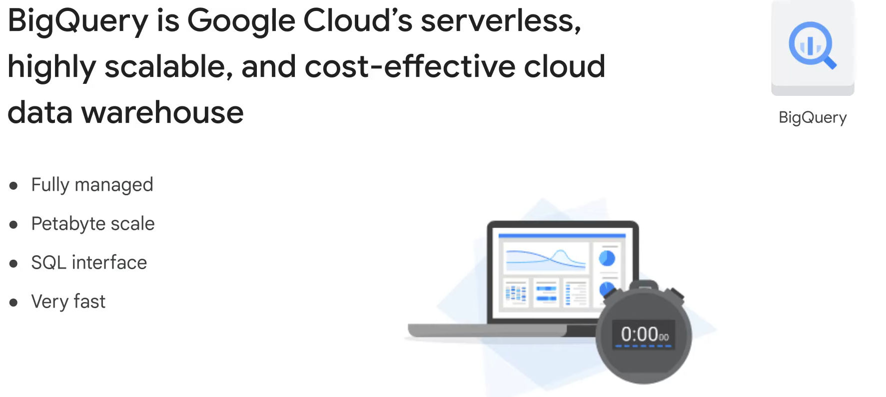
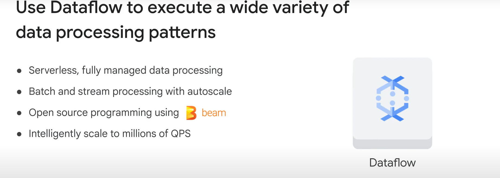
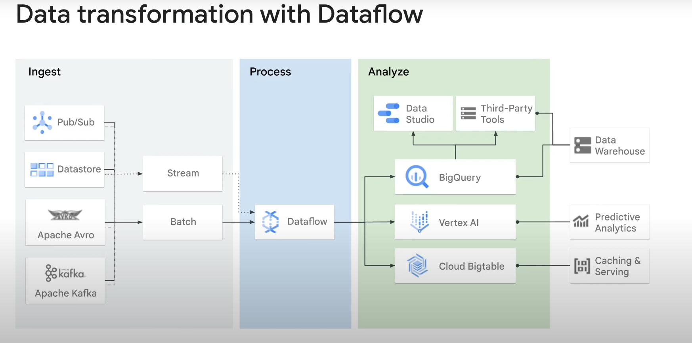
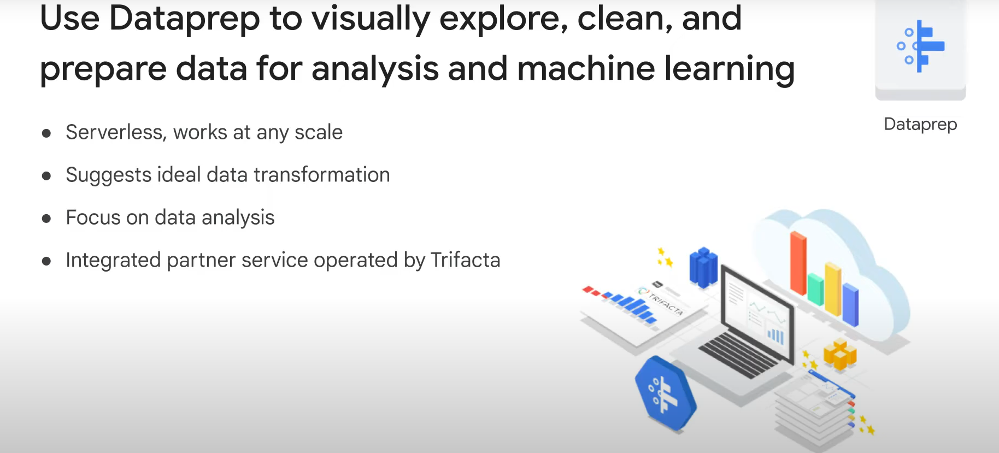
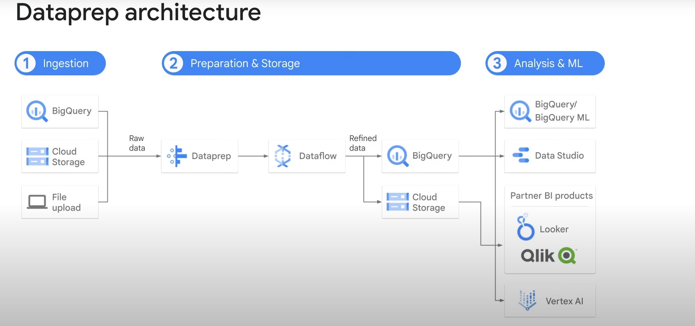
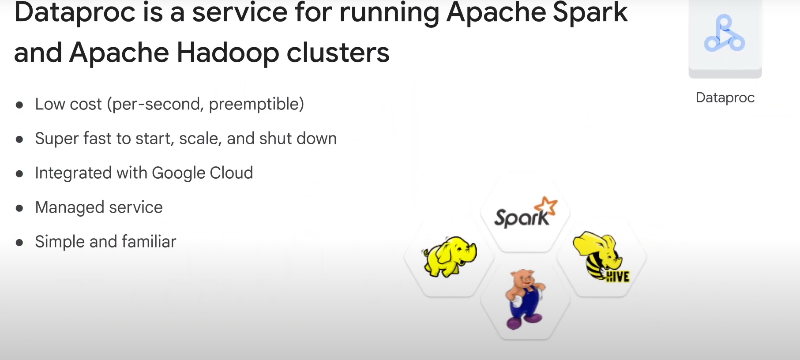

# Managed Services

## Overview

- **Alternative to Infrastructure Automation**: Eliminate the need to create infrastructure by leveraging managed services.
- **Definition**: Partial or complete solutions offered as a service.
  - **Continuum**: Exists between Platform as a Service (PaaS) and Software as a Service (SaaS), depending on the level of internal methods and controls exposed.

## Benefits of Managed Services

- **Outsource Overhead**: Outsource administrative and maintenance tasks to Google.
- **Fit for Application Requirements**: Suitable if your application requirements align with the service offering.

## Data Analytics Managed Services

- **BigQuery**
- **Cloud Dataflow**
- **Cloud Dataprep by Trifacta**
- **Cloud Dataproc**

### Note

- These services are focused on data analytics.
- No labs for this module, but a quick demo will illustrate the ease of using managed services.

# Introduction to BigQuery

## BigQuery



### Overview

- **Serverless Data Warehouse**: Google Cloud's serverless, highly-scalable, and cost-effective cloud data warehouse.
- **Petabyte Scale**: Allows for super-fast queries using Google's infrastructure.
- **No Infrastructure Management**: Focus on uncovering insights using SQL without needing a database administrator.

### Usage

- **Organizations**: Used by all types of organizations.
- **Access Methods**:
  - Cloud Console
  - Command Line Tool
  - BigQuery REST API with client libraries (Java, .NET, Python)
- **Third-Party Tools**: Available for data visualization and loading.

### Example Query

- **Standard SQL Query**:

  ```sql
  SELECT client
  FROM Groceries AS G
  ```

  - Produces one output client for each client in the table `Groceries` aliased as "G".

# Cloud Dataflow



## Overview

- **Managed Service**: Executes a wide variety of data processing patterns.
- **Stream and Batch Modes**: Transforms and enriches data with equal reliability and expressiveness.

## Benefits

- **Infrastructure Management**: Complexity of setup and maintenance is handled for you.
- **Auto-Scaling**: Built on Google Cloud infrastructure, scales to meet data pipeline demands, handling millions of queries per second.

## Development Support

- **Pipeline Development**: Supports fast, simplified development via expressive SQL, Java, and Python APIs in the Apache Beam SDK.
- **Primitives and Connectors**: Provides a rich set of windowing and session analysis primitives, and an ecosystem of source and sync connectors.

## Integration with GCP Services

- **Monitoring**: Tightly coupled with Stackdriver for setting up priority alerts and notifications to monitor pipelines and data quality.

## Use Cases



- **Data Sources**:
  - GCP Services: Cloud Datastore, Cloud Pub/Sub
  - Third-Party Services: Apache Avro, Apache Kafka
- **Data Analysis**: Transformed data can be analyzed in BigQuery, AI Platform, or Cloud Bigtable.
- **Real-Time Dashboards**: Build real-time dashboards for IoT devices using Data Studio.

# Cloud Dataprep



## Overview

- **Intelligent Data Service**: For visually exploring, cleaning, and preparing structured and unstructured data for analysis, reporting, and machine learning.
- **Serverless**: No infrastructure to deploy or manage, works at any scale.

## Features

- **UI-Driven Transformations**: Suggested and predicted with each UI input, eliminating the need to write code.
- **Automatic Features**: Schema, data types, possible joins, and anomaly detection to skip time-consuming data profiling.

## Integration and Management

- **Partner Service**: Operated by Trifacta, based on Trifacta Wrangler.
- **Seamless User Experience**: No up-front software installation, separate license, or ongoing operational overhead.
- **Fully Managed**: Scaled on-demand to meet growing data-preparation needs.

## Example Architecture



- **Data Sources**: Prepare raw data from BigQuery, Cloud Storage, or file uploads.
- **Transformational Pipeline**: Data can be ingested into Cloud Dataflow.
- **Refined Data Export**: Export to BigQuery or Cloud Storage for analysis and machine learning.

# Cloud Dataproc



## Overview

- **Managed Service**: Fast, easy to use, fully managed service for running Apache Spark and Apache Hadoop clusters.
- **Billing**: Pay per second for the resources you use. Costs can be reduced further by using preemptible instances.

## Benefits

- **Quick Operations**: Clusters start, scale, and shut down in 90 seconds or less.
- **Integration**: Built-in integration with other GCP services like BigQuery, Cloud Storage, Cloud Bigtable, Stackdriver Logging, and Stackdriver Monitoring.
- **Complete Data Platform**: Provides more than just a Spark or Hadoop cluster.

## Ease of Use

- **Cluster Management**: Create, manage, and turn off clusters easily to save money.
- **Focus on Data**: Less time and money spent on administration, more focus on jobs and data.
- **Compatibility**: No need to learn new tools or APIs if you're already using Spark, Hadoop, Pig, or Hive.

## Choosing Between Cloud Dataproc and Cloud Dataflow

- **Dependencies**: Use Cloud Dataproc if you have dependencies on specific tools or packages in the Apache Hadoop or Spark ecosystem.
- **Approach**:
  - **DevOps Approach**: Use Cloud Dataproc.
  - **Serverless Approach**: Use Cloud Dataflow.
