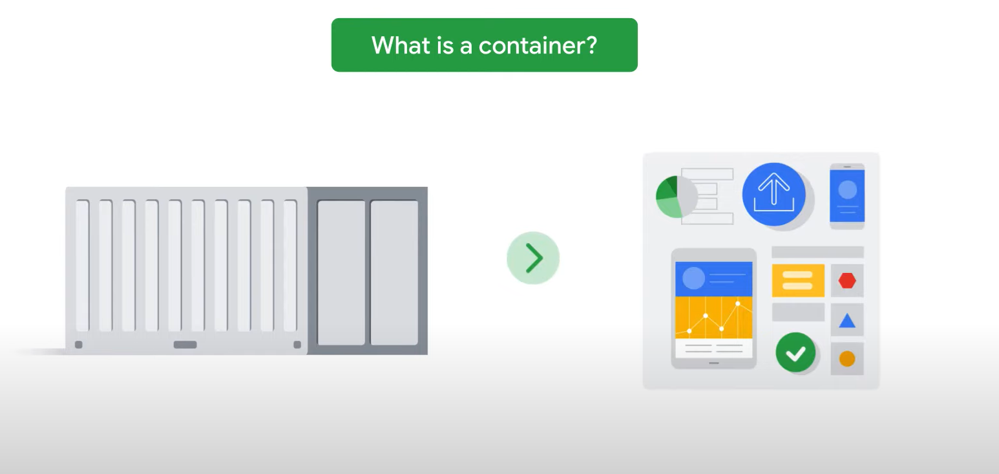
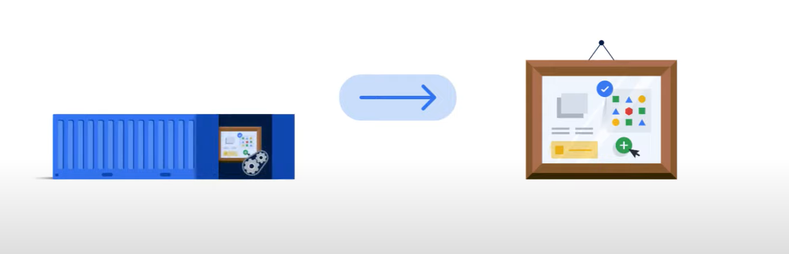
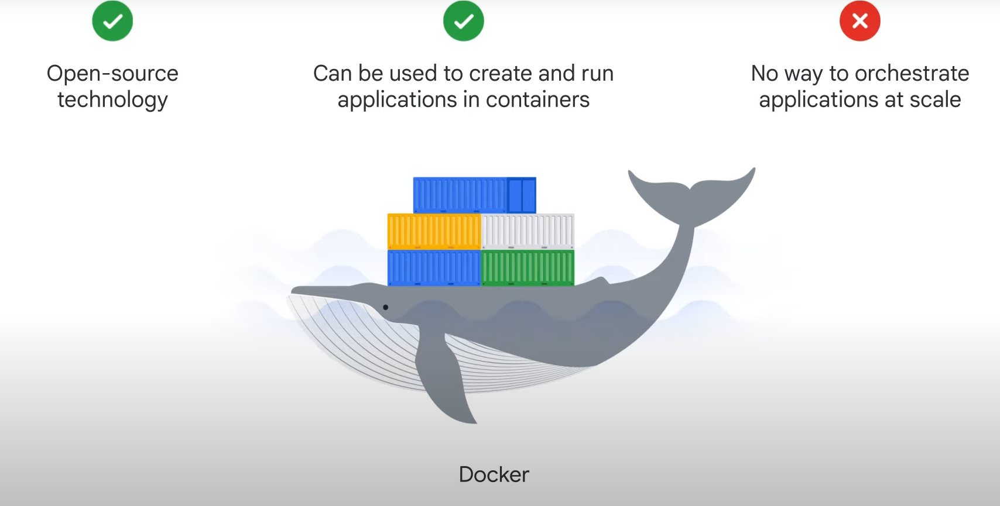
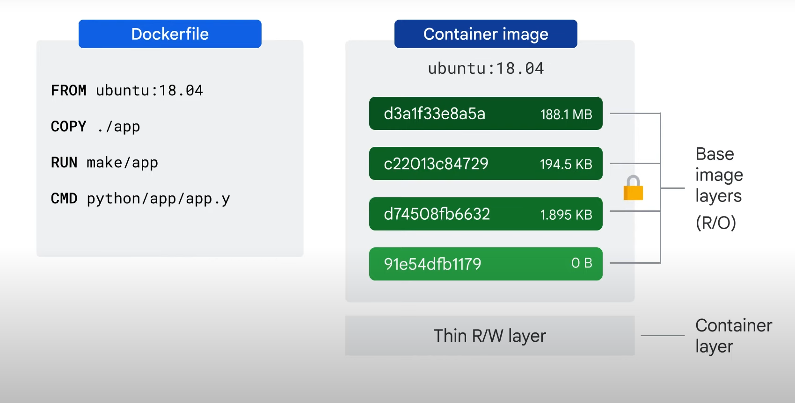
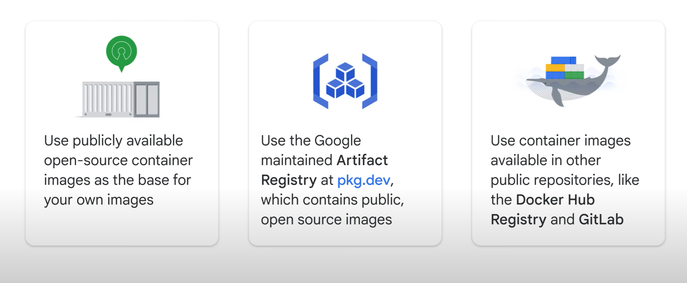
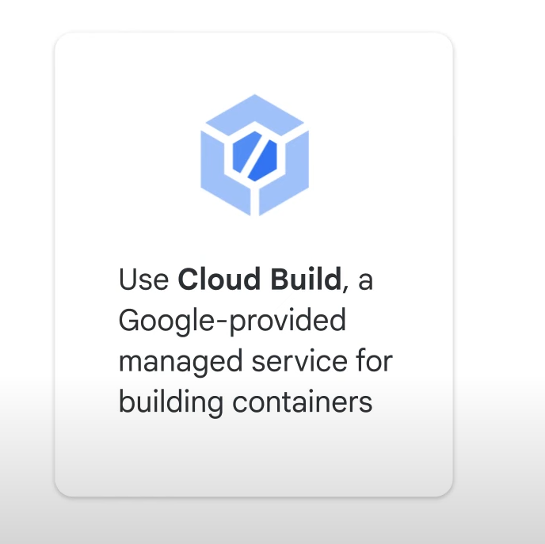
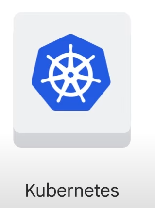
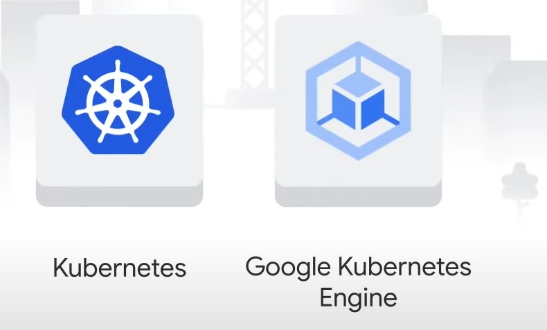

# Introduction to Containerization and Kubernetes


Containerization helps development teams move fast, deploy software efficiently, and operate at an unprecedented scale. But what exactly are containers, how do they work, and where does Kubernetes come into play? This section of the course is designed to help answer those questions.

## Key Topics Covered

1. **Containers**:
   - Lightweight, standalone, and executable software packages that include everything needed to run a piece of software, including the code, runtime, libraries, and system settings.

2. **Container Images**:
   - Immutable files that contain the source code, libraries, dependencies, tools, and other files needed to run applications.

3. **Kubernetes**:
   - An open-source platform designed to automate deploying, scaling, and operating application containers.

4. **Google Kubernetes Engine (GKE)**:
   - A managed Kubernetes service that simplifies deploying, managing, and scaling containerized applications using Google infrastructure.

5. **Cloud Build**:
   - A continuous integration and continuous delivery (CI/CD) platform that lets you build, test, and deploy applications quickly and at scale.

#### Hands-On Practice

- You’ll get hands-on practice with Cloud Build, learning how to automate your build, test, and deployment processes.

Let's dive in and explore these concepts in more detail! If you have any specific questions or need further clarification on any topic, feel free to ask.

### What is a Container?



To understand containers, let's first explore how applications are traditionally deployed and how containerization improves this process.

#### Traditional Application Deployment

- **Local Computer Setup**: Required physical space, power, cooling, network connectivity, an operating system, software dependencies, and the application itself.
- **Scaling**: Adding more computers for processing power, redundancy, security, or scalability.
- **Single Purpose**: Each computer often had a single purpose (e.g., database, web server), leading to resource wastage and time-consuming deployment, maintenance, and scaling.

#### Virtualization

- **Definition**: Creating a virtual version of a physical resource (e.g., server, storage device, network).
- **Hypervisor**: Software layer that allows multiple virtual machines (VMs) to share hardware (e.g., Kernel-based Virtual Machine, KVM).
- **Benefits**: Faster deployment, reduced resource wastage, improved portability.
- **Limitations**: Bundling application, dependencies, and operating system together; slow boot times; difficulty moving VMs between hypervisors.

#### Challenges with VMs

- **Shared Dependencies**: Applications within a single VM share dependencies, leading to potential conflicts and resource contention.
- **Dependency Upgrades**: Upgrading dependencies for one application might break another.
- **Isolation**: Running multiple applications in a single VM lacks isolation, leading to performance issues.

#### Containers

- **Abstraction**: Implement abstraction at the application and dependency level, not the entire machine or operating system.
- **User Space**: Containers isolate the user space (code above the kernel, including applications and dependencies).
- **Lightweight**: Containers don't carry a full operating system, making them efficient and quick to start/stop.
- **Development**: Develop application code on desktops, laptops, and servers; execute final code on VMs.
- **Packaging**: Application code is packaged with all dependencies; the container engine makes them available at runtime.

#### Benefits of Containers

1. **Code-Centric Delivery**: Deliver high-performing, scalable applications.
2. **Reliable Hardware and Software**: Access to reliable underlying hardware and software, ensuring code runs successfully in various environments.
3. **Speed**: Incremental changes can be deployed quickly with a single file copy, speeding up development.
4. **Microservices Design**: Easier to build applications using the microservices design pattern (loosely coupled, fine-grained components), allowing for scalable and upgradable application components without affecting the whole application.

Containers revolutionize application deployment by providing a lightweight, efficient, and scalable solution that addresses the limitations of traditional deployment and virtualization.

# What is a Container?



An application and its dependencies are called an image, and a container is simply a running instance of an image. By building software into container images, developers can package and ship an application without worrying about the system it will run on.

#### Building and Running Container Images



- **Software Needed**: To build and run container images, you need software like Docker.
- **Docker**: An open-source technology used to create and run applications in containers. However, Docker does not offer orchestration at scale like Kubernetes.

#### Key Linux Technologies for Containers

1. **Linux Processes**:
   - Each process has its own virtual memory address space, separate from others.
   - Processes can be rapidly created and destroyed.

2. **Linux Namespaces**:
   - Control what an application can see (e.g., process ID numbers, directory trees, IP addresses).
   - Note: Linux namespaces are different from Kubernetes namespaces.

3. **Linux cgroups**:
   - Control what an application can use (e.g., CPU time, memory, I/O bandwidth).

4. **Union File Systems**:
   - Bundle applications and dependencies into clean, minimal layers.

#### Container Image Structure



- **Layers**: A container image is structured in layers, each specified by instructions in a Dockerfile.
- **Dockerfile**: A file that contains instructions to build a Docker-formatted container image.
  - **FROM**: Creates a base layer from a public repository (e.g., Ubuntu Linux runtime environment).
  - **COPY**: Adds a new layer with files from the build tool’s current directory.
  - **RUN**: Builds the application and adds the results to a new layer.
  - **CMD**: Specifies the command to run within the container when launched.

#### Best Practices for Dockerfiles

- **Multi-Stage Build Process**: Separate the build environment from the runtime environment to avoid clutter and reduce attack surface.
- **Layer Order**: Start with layers least likely to change at the top and most likely to change at the bottom.

#### Container Runtime

- **Writable Layer**: When a container runs, it has a writable, ephemeral topmost layer called the container layer.
- **Ephemeral Changes**: Changes made to the running container (e.g., new files, modified files) are written to this layer and are lost when the container is deleted.
- **Permanent Data**: Must be stored outside the running container image.

#### Efficiency of Containers

- **Layer Sharing**: Multiple containers can share access to the same underlying image while maintaining their own data state.
- **Smaller Images**: Each layer only contains the differences from the previous layer, making updates faster and more efficient than running new virtual machines.

#### Getting and Creating Containers



- **Public Repositories**: Use publicly available open-source container images as the base for your own images or for unmodified use.
- **Artifact Registry**: Google maintains Artifact Registry at pkg.dev for public and private container images.
- **Cloud Build**: Google’s managed service for building containers, integrated with Cloud IAM, and designed to retrieve source code from various repositories.

#### Cloud Build



- **Build Steps**: Define a series of steps to fetch dependencies, compile source code, run tests, and use tools like Docker, Gradle, and Maven.
- **Execution Environments**: Deliver newly built images to environments like Google Kubernetes Engine, App Engine, and Cloud Functions.

Containers provide a lightweight, efficient, and scalable solution for deploying applications, leveraging key Linux technologies and best practices for building and running container images.

# Working with Cloud Build

In this lab, you will build a Docker container image from provided code and a Dockerfile using Cloud Build. You will then upload the container to the Artifact Registry.

## Objectives

- Use Cloud Build to build and push containers.
- Use Artifact Registry to store and deploy containers.

### Task 1: Confirm that Needed APIs are Enabled

1. **Note Your Google Cloud Project Name**:
   - This value is shown in the top bar of the Google Cloud console and will be of the form `qwiklabs-gcp-` followed by hexadecimal numbers.

2. **Enable Cloud Build API**:
   - In the Google Cloud console, go to **APIs & Services** > **Library**.
   - Search for **Cloud Build**.
   - If the Cloud Build API is not enabled, click **Enable**.

3. **Enable Artifact Registry API**:
   - Return to the search box and enter **Artifact Registry**.
   - If the Google Artifact Registry API is not enabled, click **Enable**.

### Task 2: Building Containers with Dockerfile and Cloud Build

1. **Activate Cloud Shell**:
   - Click **Activate Cloud Shell** on the Google Cloud console title bar.
   - Click **Continue** if prompted.

2. **Create `quickstart.sh` File**:
   - Use the nano text editor to create an empty `quickstart.sh` file:

     ```sh
     nano quickstart.sh
     ```

   - Add the following lines to the file:

     ```sh
     #!/bin/sh
     echo "Hello, world! The time is $(date)."
     ```

   - Save and close nano by pressing `CTRL+X`, then `Y`, and `ENTER`.

3. **Create `Dockerfile`**:
   - Use the nano text editor to create an empty `Dockerfile`:

     ```sh
     nano Dockerfile
     ```

   - Add the following commands to the `Dockerfile`:

     ```sh
     FROM alpine
     COPY quickstart.sh /
     CMD ["/quickstart.sh"]
     ```

   - Save and close nano by pressing `CTRL+X`, then `Y`, and `ENTER`.

4. **Make `quickstart.sh` Executable**:
   - Run the following command:

     ```sh
     chmod +x quickstart.sh
     ```

5. **Create Docker Repository**:
   - Create a new Docker repository named `quickstart-docker-repo`:

     ```sh
     gcloud artifacts repositories create quickstart-docker-repo --repository-format=docker --location="REGION" --description="Docker repository"
     ```

6. **Build Docker Container Image**:
   - Build the Docker container image in Cloud Build:

     ```sh
     gcloud builds submit --tag "REGION"-docker.pkg.dev/${DEVSHELL_PROJECT_ID}/quickstart-docker-repo/quickstart-image:tag1
     ```

7. **Verify Docker Image in Artifact Registry**:
   - In the Google Cloud console, search for **Artifact Registry**.
   - Click the repository named `quickstart-docker-repo`.
   - The `quickstart-image` Docker image should appear in the list.

### Task 3: Building Containers with a Build Configuration File and Cloud Build

1. **Create `cloudbuild.yaml` File**:
   - Use the nano text editor to create and open a file called `cloudbuild.yaml`:

     ```sh
     nano cloudbuild.yaml
     ```

   - Add the following content to the file:

     ```yaml
     steps:
     - name: 'gcr.io/cloud-builders/docker'
       args: [ 'build', '-t', 'YourRegionHere-docker.pkg.dev/$PROJECT_ID/quickstart-docker-repo/quickstart-image:tag1', '.' ]
     images:
     - 'YourRegionHere-docker.pkg.dev/$PROJECT_ID/quickstart-docker-repo/quickstart-image:tag1'
     ```

   - Save and close nano by pressing `CTRL+O`, `ENTER`, and `CTRL+X`.

2. **Set Region Variable**:
   - Run the following command to set the region variable and insert that value into the YAML file:

     ```sh
     export REGION="REGION"
     sed -i "s/YourRegionHere/$REGION/g" cloudbuild.yaml
     ```

3. **View `cloudbuild.yaml` Contents**:
   - Run the following command to view the contents of `cloudbuild.yaml`:

     ```sh
     cat cloudbuild.yaml
     ```

4. **Start Cloud Build**:
   - Execute the following command to start a Cloud Build using `cloudbuild.yaml`:

     ```sh
     gcloud builds submit --config cloudbuild.yaml
     ```

5. **Verify Docker Image in Artifact Registry**:
   - In the Google Cloud console, search for **Artifact Registry**.
   - Click the repository named `quickstart-docker-repo`.
   - Two versions of `quickstart-image` should now be in the list.

6. **Check Build History in Cloud Build**:
   - In the Google Cloud console, search for **Cloud Build**.
   - Click **Cloud Build** in the search results.
   - Click **History**. Two builds should appear in the list.
   - Click the build ID for the build at the top of the list to view the build details and log.

By following these steps, you will have successfully built and pushed Docker container images using Cloud Build and stored them in the Artifact Registry.

### Task 4: Building and Testing Containers with a Build Configuration File and Cloud Build

The true power of custom build configuration files is their ability to perform other actions, in parallel or in sequence, in addition to simply building containers: running tests on your newly built containers, pushing them to various destinations, and even deploying them to Kubernetes Engine.

In this task, we will see a simple example of a build configuration file that tests the container it built and reports the result to its calling environment. The first step is to alter the `quickstart.sh` file.

#### Steps to Modify `quickstart.sh`

1. **Open `quickstart.sh` in Nano**:
   - In Cloud Shell, run:

     ```sh
     nano quickstart.sh
     ```

2. **Replace the Existing Content**:
   - Replace the existing content with the following:

     ```sh
     #!/bin/sh
     if [ -z "$1" ]
     then
         echo "Hello, world! The time is $(date)."
         exit 0
     else
         exit 1
     fi
     ```

3. **Save and Close Nano**:
   - Press `Ctrl+O`, then `Enter` to save the file.
   - Press `Ctrl+X` to exit the nano text editor.

#### Steps to Create `cloudbuild2.yaml`

1. **Create and Open `cloudbuild2.yaml`**:
   - In Cloud Shell, run:

     ```sh
     nano cloudbuild2.yaml
     ```

2. **Add the Following Content**:
   - Paste the following into the `cloudbuild2.yaml` file:

     ```yaml
     steps:
     - name: 'gcr.io/cloud-builders/docker'
       args: [ 'build', '-t', 'YourRegionHere-docker.pkg.dev/$PROJECT_ID/quickstart-docker-repo/quickstart-image:tag1', '.' ]
     - name: 'YourRegionHere-docker.pkg.dev/$PROJECT_ID/quickstart-docker-repo/quickstart-image:tag1'
       args: ['fail']
     images:
     - 'YourRegionHere-docker.pkg.dev/$PROJECT_ID/quickstart-docker-repo/quickstart-image:tag1'
     ```

3. **Save and Close Nano**:
   - Press `Ctrl+O`, then `Enter` to save the file.
   - Press `Ctrl+X` to exit the nano text editor.

4. **Insert Region Value into YAML File**:
   - Run the following command to insert the region value into the YAML file:

     ```sh
     sed -i "s/YourRegionHere/$REGION/g" cloudbuild2.yaml
     ```

5. **View the Contents of `cloudbuild2.yaml`**:
   - Run:

     ```sh
     cat cloudbuild2.yaml
     ```

   - You should see the following:

     ```yaml
     steps:
     - name: 'gcr.io/cloud-builders/docker'
       args: [ 'build', '-t', '"REGION"-docker.pkg.dev/$PROJECT_ID/quickstart-docker-repo/quickstart-image:tag1', '.' ]
     - name: 'gcr.io/$PROJECT_ID/quickstart-image'
       args: ['fail']
     images:
     - '"REGION"-docker.pkg.dev/$PROJECT_ID/quickstart-docker-repo/quickstart-image:tag1'
     ```

#### Steps to Start Cloud Build

1. **Start Cloud Build Using `cloudbuild2.yaml`**:
   - Run the following command to start a Cloud Build using `cloudbuild2.yaml`:

     ```sh
     gcloud builds submit --config cloudbuild2.yaml
     ```

2. **Check Build Output**:
   - You will see output that ends with text indicating a build failure, such as:

     ```sh
     BUILD FAILURE: Build step failure: build step 1 "us-east1-docker.pkg.dev/qwiklabs-gcp-02-1c7ba5c697a0/quickstart-docker-repo/quickstart-image:tag1" failed: starting step container failed: Error response from daemon: failed to create shim task: OCI runtime create failed: runc create failed: unable to start container process: exec: "fail": executable file not found in $PATH: unknown
     ERROR: (gcloud.builds.submit) build 96c4a454-be06-4010-aa7c-da57c14165f4 completed with status "FAILURE"
     ```

3. **Confirm Build Failure**:
   - Run the following command to confirm that the build failed:

     ```sh
     echo $?
     ```

   - The command will reply with a non-zero value, indicating the build failure. If you had embedded this build in a script, your script would be able to act upon the build's failure.

By following these steps, you will have successfully built and tested containers using a custom build configuration file with Cloud Build.

# Kubernetes Overview

## Introduction

- **Containers**: Lean and numerous, surpassing virtual machines.
- **Networking Issue**: Applications in containers need to communicate, but no network fabric exists for container discovery.
- **Solution**: Kubernetes.

## What is Kubernetes?



- **Definition**: Open source platform for managing containerized workloads and services.
- **Functions**: Orchestrates many containers on many hosts, scales them as microservices, and deploys rollouts and rollbacks.
- **APIs**: Deploy containers on a set of nodes called a cluster.
- **Components**: Divided into control plane and nodes running containers.

## Nodes

- **Definition**: Represents a computing instance, like a machine.
- **Google Cloud Difference**: A node is a virtual machine in Compute Engine.

## Configuration

- **Declarative Configuration**:
  - Describe the desired state.
  - Kubernetes ensures the system conforms to this state despite failures.
  - Saves work and reduces error risk.
- **Imperative Configuration**:
  - Issue commands to change the system’s state.
  - Used for quick temporary fixes and building declarative configurations.

## Features

- **Workload Types**:
  - Stateless applications (e.g., Nginx, Apache).
  - Stateful applications with persistent data.
  - Batch jobs and daemon tasks.
- **Automatic Scaling**: Based on resource utilization.
- **Resource Controls**: Specify resource request levels and limits to improve workload performance.
- **Extensibility**:
  - Rich ecosystem of plugins and addons.
  - Custom Resource Definitions for new resource types.
- **Portability**: Deployable on premises or other cloud service providers, avoiding vendor lock-in.

# Google Kubernetes Engine (GKE)

## Introduction

- **Challenge**: Maintaining Kubernetes infrastructure can be complex.
- **Solution**: Google Kubernetes Engine (GKE).

## What is GKE?



- **Definition**: Managed Kubernetes service hosted on Google’s infrastructure.
- **Purpose**: Deploy, manage, and scale Kubernetes environments for containerized applications.
- **Management**: Fully managed service, no need to provision underlying resources.
- **Operating System**: Uses a container-optimized OS maintained by Google, optimized for quick scaling with minimal resource footprint.

## GKE Autopilot

- **Mode of Operation**: Manages cluster configuration, including nodes, scaling, security, and other settings.

## Cluster Setup

- **Process**: Direct GKE to create and set up a Kubernetes system, called a cluster.
- **Auto-Upgrade**: Ensures clusters are always on the latest stable version of Kubernetes.

## Nodes

- **Definition**: Virtual machines that host containers in a GKE cluster.
- **Auto-Repair**: Periodic health checks on nodes; unhealthy nodes are drained and recreated.

## Scaling

- **Workloads**: Supports scaling containerized applications.
- **Cluster**: Supports scaling the cluster itself.

## Integration with Google Services

- **Cloud Build**: Uses private container images stored in Artifact Registry for automated deployment.
- **IAM**: Controls access with accounts and role permissions.
- **Google Cloud Observability**: Provides insights into application performance.
- **Virtual Private Clouds (VPCs)**: Provides network infrastructure, including load balancers and ingress access.

## Google Cloud Console

- **Dashboard**: Offers a powerful dashboard for GKE clusters and workloads, eliminating the need for manual setup.
- **Features**: View, inspect, and delete resources in clusters.

## Advantages Over Open Source Kubernetes

- **Ease of Use**: More powerful and easier to manage dashboard compared to open source Kubernetes.
