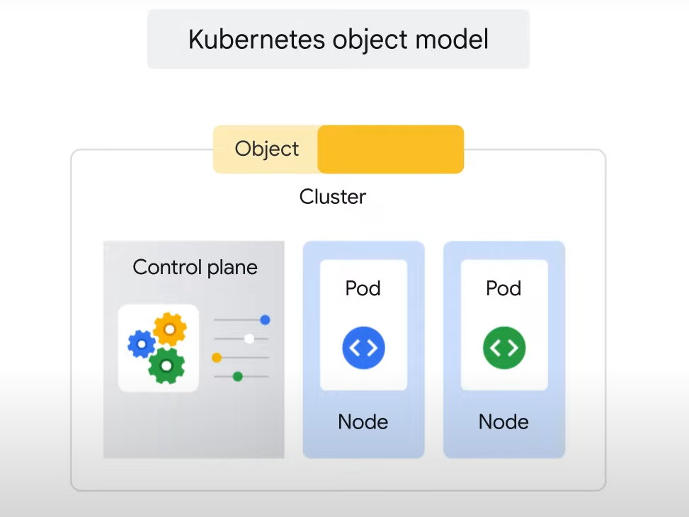
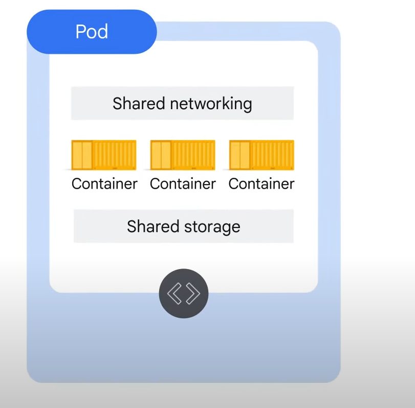

# Understanding Kubernetes

## Key Concepts

### Kubernetes Object Model

- **Objects**: Each item managed by Kubernetes is represented by an object.
- **Attributes and State**: You can view and change these objects' attributes and state.

### Declarative Management

- **Principle**: Kubernetes needs to be told how objects should be managed and will work to achieve and maintain that desired state.
- **Watch Loop**: This is accomplished through a continuous "watch loop."

## Kubernetes Objects

- **Definition**: Persistent entities representing the state of something running in a cluster, including its desired and current state.
- **Types of Objects**: Represent containerized applications, resources available to them, and policies affecting their behavior.

### Elements of Kubernetes Objects

- **Object Spec**: Defines the desired state of the object.
- **Object Status**: Represents the current state of the object, provided by the Kubernetes control plane.

## Kubernetes Control Plane

- **Definition**: Refers to the various system processes that collaborate to make a Kubernetes cluster work.

## Object Types

- **Kinds**: Each object represents a certain type, or "kind."
- **Pods**: The foundational building block of Kubernetes, the smallest deployable object.
  - **Containers**: Every running container in Kubernetes is in a Pod.
  - **Environment**: Pods create the environment for containers, accommodating one or more containers.
  - **Resource Sharing**: Containers in a Pod share resources like networking and storage.
  - **Unique IP**: Each Pod has a unique IP address; containers within a Pod share the network namespace.

## Communication and Storage

- **Localhost Communication**: Containers within the same Pod can communicate through `localhost` (127.0.0.1).
- **Shared Storage Volumes**: Pods can specify storage volumes shared among containers.

## Example: Running nginx Web Servers

- **Objective**: Keep three instances of an nginx Web server running, each in its own container.
- **Declarative Management**: Declare objects (Pods) to represent the nginx containers.
- **Kubernetes Role**: Launch and maintain the Pods to match the desired state.
- **Control Plane Action**: Compares desired state to current state and remedies discrepancies.
  - **Example Scenario**: If 3 nginx Pods are desired but 0 are running, Kubernetes will launch 3 Pods.
  - **Continuous Monitoring**: The control plane continuously monitors and adjusts the cluster state to match the declared state.

# Kubernetes Control Plane

The Kubernetes control plane is the fleet of cooperating processes that make a Kubernetes cluster work. Although you might only directly work with a few of these components, it’s important to understand what the fleet does and the role they each play.

In this section of the course, you’ll get an opportunity to see how a Kubernetes cluster is constructed, part by part. This will help illustrate how a Kubernetes cluster that runs in GKE is easier to manage than one you provisioned yourself.

## Cluster Components

First, a cluster needs computers, and these computers are usually virtual machines. They always are in GKE, but they could be physical computers too. One computer is called the control plane, and the others are called nodes. The node’s job is to run Pods, and the control plane’s is to coordinate the entire cluster.

### Control-Plane Components

Several critical Kubernetes components run on the control plane:

- **kube-APIserver**: The only single component that you'll interact with directly. Its job is to accept commands that view or change the state of the cluster, including launching Pods.
- **kubectl command**: Connects to the kube-APIserver and communicates with it using the Kubernetes API. The kube-APIserver also authenticates incoming requests, determines whether they are authorized and valid, and manages admission control.
- **etcd**: The cluster’s database, responsible for reliably storing the state of the cluster, including all the cluster configuration data and dynamic information such as what nodes are part of the cluster, what Pods should be running, and where they should be running.
- **kube-scheduler**: Responsible for scheduling Pods onto the nodes. It evaluates the requirements of each individual Pod and selects the most suitable node.
- **kube-controller-manager**: Continuously monitors the state of a cluster through the kube-APIserver. It attempts to make changes to achieve the desired state whenever the current state of the cluster doesn’t match the desired state.
- **kube-cloud-manager**: Manages controllers that interact with underlying cloud providers, bringing in features like load balancers and storage volumes.

### Node Components

Each node runs a small family of control-plane components called a kubelet. The kubelet acts as Kubernetes’s agent on each node. When the kube-APIserver wants to start a Pod on a node, it connects to that node’s kubelet. The kubelet uses the container runtime to start the Pod and monitors its lifecycle, including readiness and liveness probes, and reports back to the kube-APIserver.

- **Container Runtime**: The software used to launch a container from a container image. Kubernetes offers several container runtime choices, but the Linux distribution that GKE uses for its nodes launches containers that use containerd, the runtime component of Docker.
- **kube-proxy**: Maintains network connectivity among the Pods in a cluster. In open source Kubernetes, network connectivity is accomplished by using the firewalling capabilities of iptables, which are built into the Linux kernel.

## GKE vs. Kubernetes

The Kubernetes Control Plane is a complex management system. However, GKE simplifies this by managing all the control plane components for us. It still exposes an IP address to which we send all of our Kubernetes API requests, but GKE is responsible for provisioning and managing all the control plane infrastructure behind it. It also eliminates the need for a separate control plane.

Node configuration and management depend on the type of GKE mode you use:

- **Autopilot mode**: GKE manages the underlying infrastructure such as node configuration, autoscaling, auto-upgrades, baseline security configurations, and baseline networking configuration.
- **Standard mode**: You manage the underlying infrastructure, including configuring the individual nodes.

# Modes of Operation: Autopilot and Standard

## Autopilot Mode

- **Optimizes Kubernetes management** with a hands-off experience.
- **Less management overhead** means fewer configuration options.
- **Pay for what you use**.

## Standard Mode

- Allows for **varied configuration** of Kubernetes management infrastructure.
- **More management overhead** but offers **fine-grained control**.
- **Pay for all provisioned infrastructure**, regardless of usage.

## Benefits and Functionality of Autopilot

- **Optimized for production**:
  - Google-managed and optimized GKE instance.
  - Creates clusters based on best practices.
  - Defines machine type based on workloads for optimized usage and cost.
  - Faster deployment of production-ready GKE clusters.
- **Strong security posture**:
  - Google secures cluster nodes and infrastructure.
  - Reduces attack surface and configuration mistakes.
- **Operational efficiency**:
  - Google monitors the entire cluster (control plane, worker nodes, core components).
  - Ensures Pods are always scheduled and clusters are up to date.
  - Configurable update windows for minimal disruption.
  - Google optimizes resource consumption, charging only for Pods, not nodes.

## Restrictions of Autopilot

- **More restrictive configuration options** compared to Standard mode.
- **Fully managed service** with a pod-scheduling SLA.
- **Restrictions on node access**:
  - No SSH or privilege escalation.
  - Limitations on node affinity and host access.
- **Guaranteed class Quality of Service (QoS)** for all Pods, requiring minor configuration changes.

## GKE Standard Mode

- Same functionality as Autopilot.
- **User responsible** for configuration, management, and optimization.
- Recommended to use Autopilot unless specific configuration control is required.

# Kubernetes Object Management

## Key Concepts

- **Unique Identification**:
  - All Kubernetes objects have a unique name and identifier.
  - Example: Running three nginx web servers by declaring three Pod objects.

## Declaring Objects

- **Manifest Files**:
  - Define objects for Kubernetes to create and maintain.
  - Written in YAML or JSON (YAML used in this course).
  - Define desired state for a Pod: name and container image.

## Required Fields in Manifest Files

- **apiVersion**: Kubernetes API version used to create the object.
- **kind**: Type of object (e.g., Pod).
- **metadata**: Object name, unique ID, and optional namespace.

## Best Practices

- **Related Objects**:
  - Define related objects in the same YAML file for easier management.
  - Save YAML files in version-control repositories for tracking and managing changes.
  - Useful for recreating or restoring a cluster (e.g., Cloud Source Repositories).

## Object Details

- **Names**:
  - Unique string under 253 characters (numbers, letters, hyphens, periods allowed).
  - Only one object can have a particular name at the same time in the same namespace.
  - Names can be reused after an object is deleted.
- **Unique Identifier (UID)**:
  - Generated by Kubernetes for each object.
- **Labels**:
  - Key-value pairs to tag objects during or after creation.
  - Help identify and organize objects.
  - Select resources by label using `kubectl` command.

## Example: Creating Three nginx Web Servers

- **Declare Three Pod Objects**:
  - Each with its own section of YAML.
  - Workload spread evenly across available nodes by default.

## Managing Desired State

- **Controller Objects**:
  - Manage the state of Pods (e.g., Deployments, StatefulSets, DaemonSets, Jobs).
  - Pods are ephemeral and disposable, not meant to run forever.
- **Deployments**:
  - Suitable for long-lived software components like web servers.
  - Monitor and maintain Pods as a group.
  - Deployment controller creates a ReplicaSet to launch desired Pods.
  - ReplicaSet controller fixes failed Pods by launching new ones.

## Deployment YAML

- **Single Deployment YAML**:
  - Launch three replicas of the same container.
  - Define number of replica Pods, containers to run, and volumes to mount.
  - Controllers maintain the Pod’s desired state within a cluster.

# Deploying GKE Autopilot Clusters

## Lab Overview

In this lab, you use the Google Cloud Console to build GKE Autopilot clusters and deploy a sample Pod.

## Objectives

In this lab, you will learn how to:

- Use the Google Cloud Console to build and manipulate GKE Autopilot clusters.
- Use the Google Cloud Console to deploy a Pod.
- Use the Google Cloud Console to examine the cluster and Pods.

## Task 1: Deploy GKE Clusters

In this task, you use the Google Cloud Console and Cloud Shell to deploy GKE clusters.

### Steps:

1. **Deploy a GKE Cluster**:
   - In the Google Cloud Console, navigate to Kubernetes Engine > Clusters.
   - Click **Create** to begin creating a GKE cluster.
   - Change the cluster name to `autopilot-cluster-1` and region to `REGION`. Leave all other values at their defaults and click **Create**.
   - Wait a few minutes for the cluster deployment to complete.
   - Click the cluster name `autopilot-cluster-1` to view the cluster details.
   - Click the **Storage** tab under the cluster name to view more details.

## Task 2: Deploy a Sample Workload

In this task, you will use the Google Cloud Console to deploy a Pod running the nginx web server as a sample workload.

### Steps:

1. **Deploy a Pod**:
   - In the Google Cloud Console, navigate to Kubernetes Engine > Workloads.
   - Click **Create deployment**.
   - For Deployment name, enter `nginx-1`.
   - Accept the default container image, `nginx:latest`, which deploys three Pods each with a single container running the latest version of nginx.
   - Click the **Deploy** button, leaving the Configuration details at the defaults.
   - When the deployment completes, your screen will refresh to show the details of your new nginx deployment.

## Task 3: View Details About Workloads in the Google Cloud Console

In this task, you view details about your GKE workloads directly in the Google Cloud Console.

### Steps:

1. **View Workload Details**:
   - In the Google Cloud Console, navigate to Kubernetes Engine > Workloads.
   - Click `nginx-1` to display the overview information for the workload, showing details like resource utilization charts, links to logs, and details of the Pods associated with this workload.
   - Click the **Details** tab for the `nginx-1` workload to see more details about the workload, including the Pod specification, number and status of Pod replicas, and details about the horizontal Pod autoscaler.
   - Click the **Revision History** tab to see a list of the revisions made to this workload.
   - Click the **Events** tab to list events associated with this workload.
   - Click the **YAML** tab to view the complete YAML file that defines these components and the full configuration of this sample workload.
   - In the **Overview** tab, scroll down to the Managed Pods section and click the name of one of the Pods to view the details page for that Pod.
   - The Pod details page provides information on the Pod configuration, resource utilization, and the node where the Pod is running.
   - In the Pod details page, you can click the **Events** and **Logs** tabs to view event details and links to container logs in Cloud Operations.
   - Click the **YAML** tab to view the detailed YAML file for the Pod configuration.

