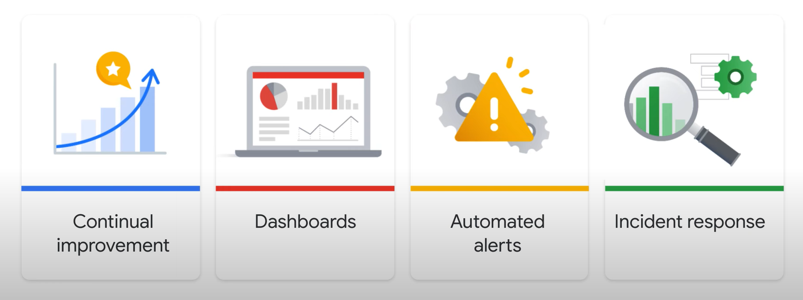
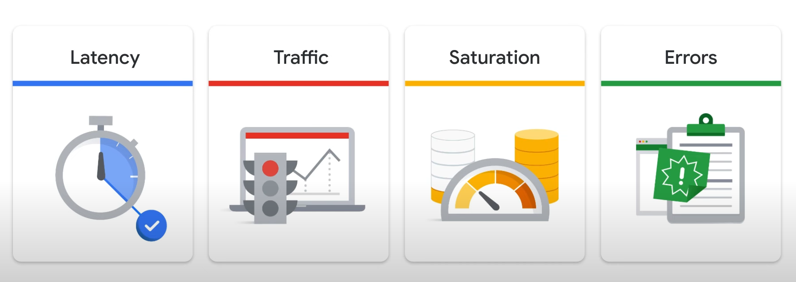
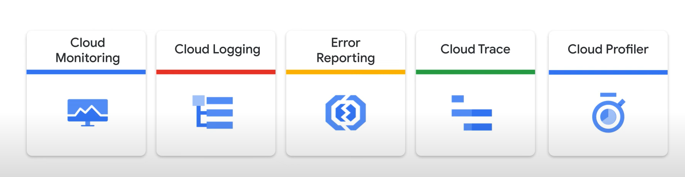
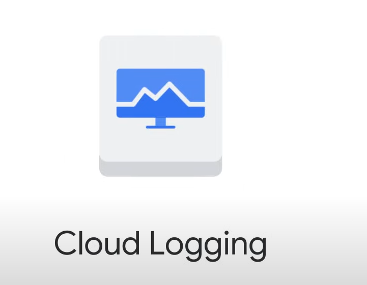
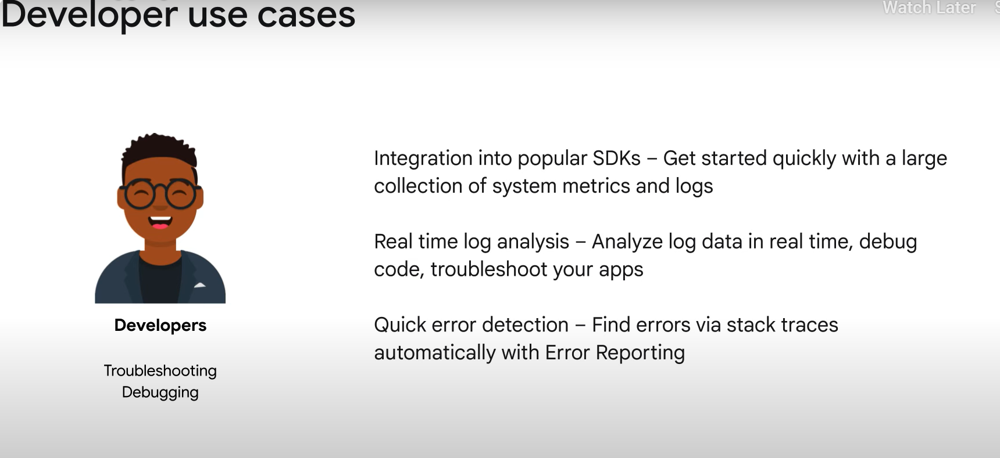
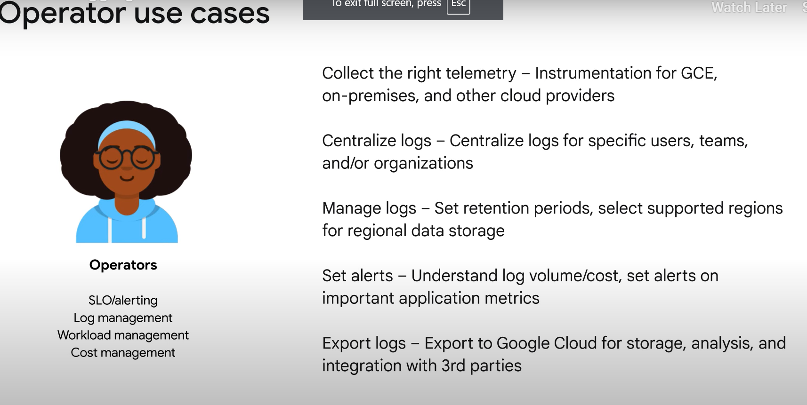
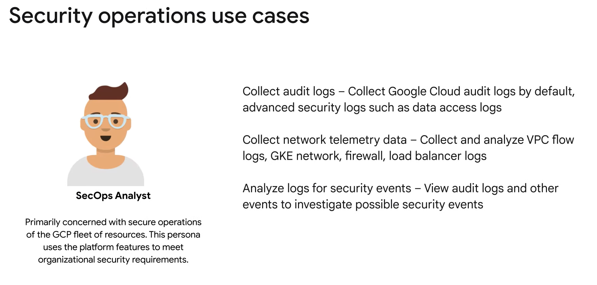
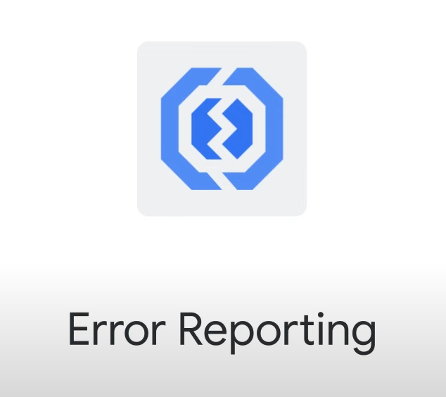
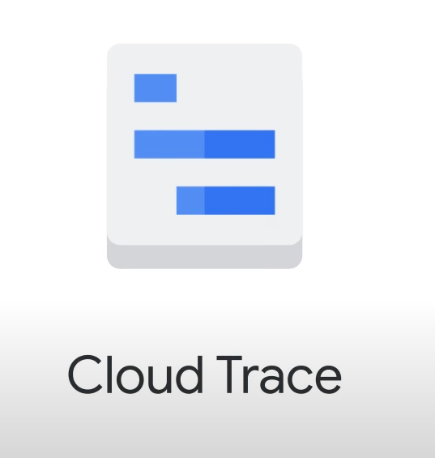
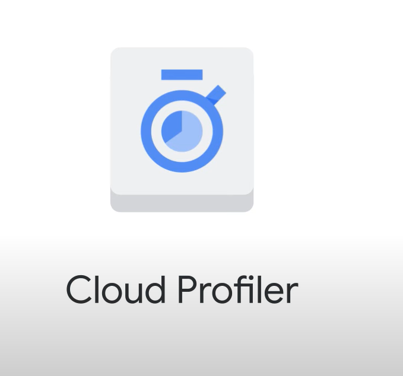

# Logging, Monitoring, and Observability in Google Cloud

## Course Overview

This two-part course covers the core operations tools in Google Cloud, divided into two major categories:

1. **Operations-focused components**: Logging, Monitoring, and Service Monitoring.
2. **Application performance management tools**: Error Reporting, Trace, and Profiler.

### Part 1: Logging and Monitoring in Google Cloud

- Focuses on operations components.
- Ideal for personnel interested in infrastructure maintenance.

### Part 2: Observability in Google Cloud

- Focuses on application performance management.
- Ideal for developers troubleshooting applications in Google Cloud.

## Audience

- Cloud Architects
- Administrators
- SysOps personnel
- Cloud Developers
- DevOps personnel

## Prerequisites

- Basic scripting or coding ability.
- Google Cloud Fundamentals: Core Infrastructure or equivalent experience.
- Proficiency with command-line tools and Linux operating system environments.

## Learning Objectives

- Understand the purpose and capabilities of the Google Cloud operations suite.
- Implement monitoring for multiple cloud projects.
- Create alerting policies, uptime checks, and alerts to identify and resolve problems quickly.
- Use Cloud Logging to collect logs and export them for further analysis.

## Importance of Logging and Monitoring

- Maintain the health and security of cloud resources.
- Enhance skills to manage cloud logging and monitoring solutions within Google Cloud.

## Key Topics

- **Google Cloud operations suite**: Overview and capabilities.
- **Monitoring**: Implementing for multiple projects.
- **Alerting**: Creating policies and checks.
- **Cloud Logging**: Collecting and exporting logs.

By the end of Part 1, you will have a solid grasp of how to implement and manage cloud logging and monitoring solutions within Google Cloud, enhancing your skills to maintain the reliability and security of your infrastructure.

# Overview of Logging, Monitoring, and Observability Tools

## Importance of Monitoring in Product Reliability

- **Monitoring** reveals urgent issues and shows trends in application usage, aiding in capacity planning and improving client experience.
- Defined in Google's Site Reliability Engineering book as collecting, processing, aggregating, and displaying real-time quantitative data about a system.

## Four Golden Signals

- **Latency**: Time taken to service a request.
- **Traffic**: Demand placed on the system.
- **Errors**: Rate of requests that fail.
- **Saturation**: System's workload capacity.

## Google Cloud Operations Suite

- Provides integrated observability tools to monitor and manage cloud resources.
- Essential for understanding system health, error reporting, efficient troubleshooting, and performance improvement.

## User Needs for Observability

1. **Visibility into System Health**:
   - Understand application and system status.
   - Report on overall health and resource availability.
2. **Error Reporting and Alerting**:
   - Monitor service status with healthy/unhealthy indicators.
   - Proactive alerting and anomaly detection.
3. **Efficient Troubleshooting**:
   - Correlate relevant signals and search across data sources.
   - Recommend potential causes and actions.
4. **Performance Improvement**:
   - Perform retrospective analysis.
   - Analyze trends and understand system performance changes.

## Role of Monitoring

- **Foundation of Product Reliability**:
  - Helps in capacity planning and improving client experience.
  - Involves collecting and displaying real-time data like query counts, error counts, processing times, and server lifetimes.
- **Transparency and Trust**:
  - Postmortems and root cause analyses build trust by explaining incidents and preventing recurrence.

## Monitoring Tools and Practices

- **Dashboards**: Provide business intelligence for DevOps.
- **Automated Alerts**: Handle alerts automatically, focusing human attention on critical issues.
- **Triggering Events**: System outages, data loss, monitoring failures, or manual interventions lead to responses by automated systems and DevOps personnel.
- **Debugging Tools**: Provide data crucial for debugging application functional and performance issues.

## Next Steps

- Explore the four golden signals in detail.
- Understand how Google’s integrated monitoring tools support these needs.

# Four Golden Signals of System Performance and Reliability

## 1. Latency

- **Definition**: Measures how long it takes a part of the system to return a result.
- **Importance**: Directly affects user experience; changes can indicate emerging issues.
- **Sample Metrics**:
  - Page load latency
  - Number of requests waiting for a thread
  - Query duration
  - Service response time
  - Transaction duration
  - Time to first response
  - Time to complete data return

## 2. Traffic

- **Definition**: Measures how many requests are reaching your system.
- **Importance**: Indicates current system demand; used for capacity planning and calculating infrastructure spend.
- **Sample Metrics**:
  - Number of HTTP requests per second
  - Number of requests for static vs. dynamic content
  - Number of Network I/Os
  - Number of concurrent sessions
  - Number of transactions per second
  - Number of retrievals per second
  - Number of active requests
  - Number of write IOPS
  - Number of read IOPS
  - Number of active connections

## 3. Saturation

- **Definition**: Indicates how full the service is, focusing on the most constrained resources.
- **Importance**: Ideal indicator of current system demand; tied to degrading performance as capacity is reached.
- **Sample Metrics**:
  - Percentage of memory utilization
  - Percentage of thread pool utilization
  - Percentage of cache utilization
  - Percentage of disk utilization
  - Percentage of CPU utilization
  - Disk quota
  - Memory quota
  - Number of available connections
  - Number of users on the system

## 4. Errors

- **Definition**: Events that measure system failures or other issues.
- **Importance**: Indicate configuration or capacity issues, SLO violations, and when to emit alerts.
- **Sample Metrics**:
  - Wrong answers or incorrect content
  - Number of 400/500 HTTP codes
  - Number of failed requests
  - Number of exceptions
  - Number of stack traces
  - Servers that fail liveness checks
  - Number of dropped connections

# Observability in Google Cloud

## Key Concepts

- **Signals**: Metric, logging, and trace data captured and integrated into Google products.
- **Visualization**: Data visualized in dashboards and Metrics Explorer.
- **Logs Explorer**: Analyze automated and custom logs.
- **Service Monitoring**: Monitor compliance with SLOs and track error budgets.
- **Health Checks**: Check uptime and latency for external-facing sites and services.
- **Automated Alerts**: Generate alerts for incidents to code or key personnel.
- **Error Reporting**: Spot, count, and analyze crashes in cloud-based services.

## Tools for Operations Roles

- **Cloud Monitoring**
- **Cloud Logging**
- **Error Reporting**
- **Cloud Trace**
- **Cloud Profiler**

# Cloud Monitoring Features and Benefits

## Overview

Cloud Monitoring provides visibility into the performance, uptime, and overall health of cloud-powered applications.

## Key Features

- **Data Collection**:
  - Collects metrics, events, and metadata from various sources including projects, logs, services, systems, agents, custom code, and common application components (e.g., Cassandra, Nginx, Apache Web Server, Elasticsearch).

- **Data Ingestion and Insights**:
  - Ingests data and generates insights via dashboards, Metrics Explorer charts, and automated alerts.

## Advanced Capabilities

- **Automatic, Free Ingestion**:
  - Over 100 monitored resources with more than 1,500 metrics available at no cost.

- **Open Source Standards**:
  - Leverages Prometheus and OpenTelemetry to collect metrics across compute workloads.

- **Customization for Key Workloads**:
  - Custom visualization capabilities for GKE through Google Cloud Managed Service for Prometheus.
  - Custom visualization for Google Compute Engine through Ops Agent.

- **In-Context Visualizations & Alerts**:
  - View relevant telemetry data alongside your workloads across Google Cloud.

## Benefits

- **Performance Visibility**: Provides insights into the performance and health of applications.
- **Uptime Monitoring**: Tracks the uptime of cloud-powered applications.
- **Comprehensive Data Collection**: Gathers data from a wide range of sources and components.
- **Customizable Dashboards**: Offers tailored visualizations for specific workloads.
- **Automated Alerts**: Generates alerts to notify of potential issues.

# Cloud Logging

## Overview

Google's Cloud Logging allows users to collect, store, search, analyze, monitor, and alert on log entries and events. It is integrated into Google Cloud products like App Engine, Cloud Run, Compute Engine VMs, and GKE.

## Key Features

- **Automatic Log Ingestion**:
  - Immediate ingestion from Google Cloud services across your stack.
- **Insight Tools**:
  - Tools like Error Reporting, Log Explorer, and Log Analytics help focus on large sets of data quickly.
- **Customizable Routing & Storage**:
  - Route logs to the region or service of your choice for compliance or business benefits.
- **Compliance**:
  - Leverage audit and app logs for compliance patterns and issues.

## Logging Aspects

- **Collection**:
  - Automatically collect cloud events and configuration changes.
- **Analysis**:
  - Use integrated Logs Explorer for log analysis.
- **Export**:
  - Export logs to Google Cloud Storage, Pub/Sub, or BigQuery for further analysis.
- **Retention**:
  - Data access logs retained for 30 days (configurable up to 3650 days).
  - Admin logs stored for 400 days.
  - Extend retention by exporting logs to Google Cloud Storage or BigQuery.

## Use Cases

- **Developers**:
  - Quick start with out-of-the-box collection of system metrics and logs.
  - Real-time analysis, debugging, and troubleshooting.
  - Stack traces automatically mapped to error types.

- **Operators**:
  - Collect telemetry not limited to Google Cloud.
  - Centralize logs for users, teams, and organizations.
  - Control retention periods and log locations.
  - Understand log volume, cost, and set alerts on important metrics.
  - Export logs for storage, analysis, and integrate with third-party services.

- **Security Operations (SecOps)**:
  - Ensure authorized access and prevent unauthorized navigation.
  - Use audit logs, network telemetry, and log analysis for streamlined security operations.

# Error Reporting

## Overview
Error Reporting counts, analyzes, and aggregates crashes in your running cloud services. It provides advanced functionalities to ensure your application runs smoothly.

## Key Features

- **Real-Time Processing**:
  - Application errors are processed and displayed in the interface within seconds.

- **Quickly View and Understand Errors**:
  - Dedicated page displays error details: bar chart over time, list of affected versions, request URL, and link to the request log.

- **Instant Notification**:
  - Instantly alerts you when a new application error cannot be grouped with existing ones.
  - Allows direct navigation from notification to error details.

- **Exception Handling**:
  - Crashes in most modern languages are exceptions not caught and handled by the code itself.
  - Management interface displays results with sorting and filtering capabilities.

- **Detailed Error View**:
  - Shows error details: time chart, occurrences, affected user count, first- and last-seen dates, and a cleaned exception stack trace.

- **Alerts**:
  - Create alerts to receive notifications on new errors.

# Cloud Profiler and Cloud Trace

## Cloud Trace

- **Overview**: A tracing system that collects latency data from distributed applications and displays it in the Google Cloud console.
- **Supported Platforms**: App Engine, Compute Engine VMs, Google Kubernetes Engine containers.
- **Key Features**:
  - **Performance Insights**: Provided in near-real time.
  - **Latency Reports**: Automatically analyzes all application traces to generate in-depth latency reports and surface performance degradations.
  - **Continuous Analysis**: Gathers and analyzes trace data to identify recent changes in application performance.
  - **Latency Profiles**: Analyze changes through Google Cloud Console and on Android devices.

## Cloud Profiler

- **Overview**: Uses statistical techniques and low-impact instrumentation to provide a complete CPU and heap picture of an application without slowing it down.
- **Supported Platforms**: Compute Engine VMs, App Engine, Kubernetes, other cloud platforms, on-premises.
- **Supported Languages**: Java, Go, Python, Node.js.
- **Key Features**:
  - **Call Hierarchy and Resource Consumption**: Presented in an interactive flame graph.
  - **Performance Analysis**: Helps developers understand which paths consume the most resources and how their code is called.

## Google Cloud Operations Suite

- **Purpose**: Helps explore both known and unknown issues underlying workloads.
- **User-Focused Design**: Understands customer journeys with SLO monitoring, uptime checks, tracing, and more.
- **Open and Flexible**: Leverages popular open-source projects like Prometheus, OpenTelemetry, and Fluentbit.
- **Integrated for Ease**: Automatic ingestion, connected data sets, in-context telemetry across Google Cloud service views.
- **Meaningful Analysis and Alerting**: Provides powerful analysis tools and leverages alerting for both automated and human-led resolutions.
