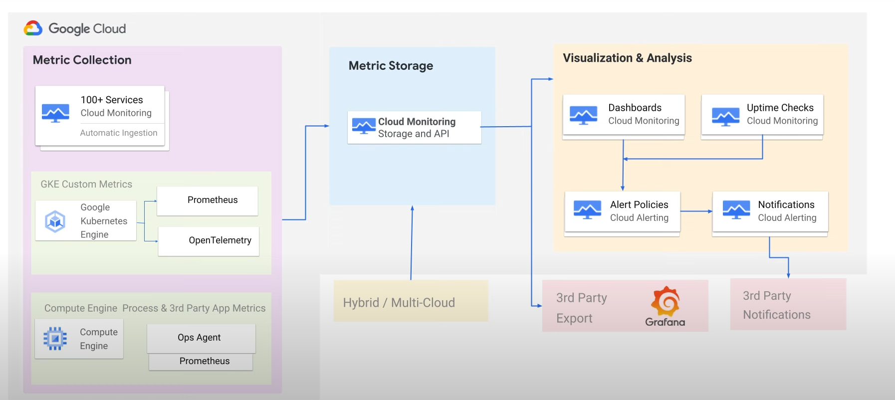
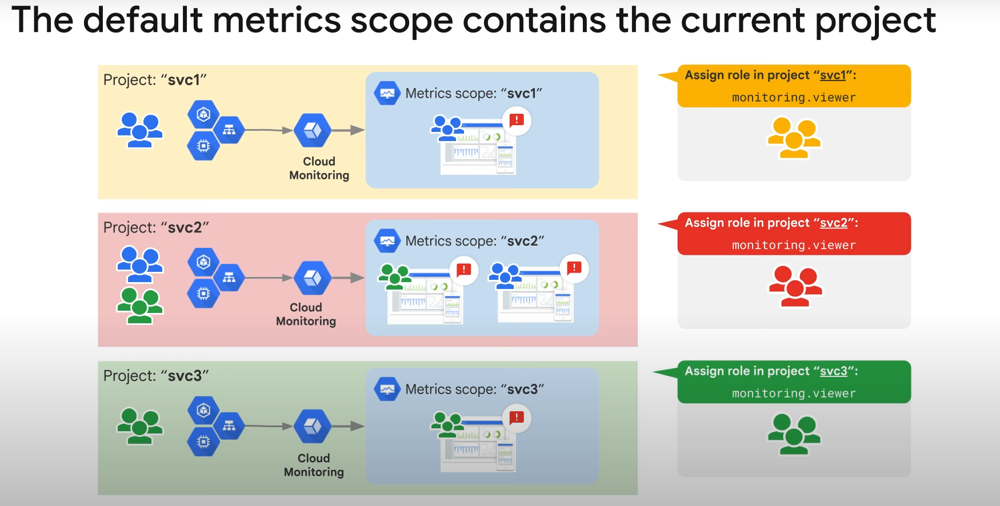
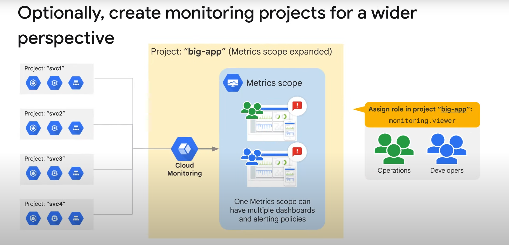

# Monitoring Critical Systems in Google Cloud

## Overview

Monitoring is essential for keeping track of the resources launched inside Google Cloud. This module covers options and best practices for monitoring project architectures.

## Key Topics

### 1. Architectural Decisions

- **Importance**: Make early architectural decisions before starting monitoring.
- **Core IAM Roles**: Differentiate roles to decide who can do what in monitoring.

### 2. Default Dashboards

- **Google-Created Dashboards**: Examine and use them appropriately.

### 3. Custom Dashboards

- **Creating Charts**: Build custom dashboards to show resource consumption and application load.

### 4. Uptime Checks

- **Purpose**: Define uptime checks to track liveliness and latency.

### 5. Monitoring Query Language (MQL)

- **Purpose**: Understand the use of MQL for monitoring.

## Best Practices

- **Early Decisions**: Make architectural and IAM role decisions early.
- **Utilize Default Dashboards**: Leverage Google-created dashboards for initial insights.
- **Customize Dashboards**: Create custom charts and dashboards tailored to specific needs.
- **Implement Uptime Checks**: Regularly track the liveliness and latency of your services.
- **Learn MQL**: Use MQL for advanced monitoring queries and insights.

# Common Monitoring Architecture Patterns



## Typical Cloud Monitoring Architecture

A typical Cloud Monitoring architecture includes three layers:

1. **Data Collection Layer**
2. **Data Storage Layer**
3. **Data Analysis and Visualization Layer**

### Data Collection Layer

- Collects metrics, logs, and traces from cloud-based systems.
- Includes Google Cloud services such as GKE (Google Kubernetes Engine), GCE (Google Compute Engine), App Engine, etc.

### Data Storage Layer

- Stores the collected data and routes it to the configured visualization and analysis layer.
- Includes the Cloud Monitoring API that helps triage the metrics collected for further analysis.

### Data Analysis and Visualization Layer

- Analyzes the collected data to identify problems and trends.
- Presents the analyzed data in an easy-to-understand way.
- Comprises various features within Cloud Monitoring such as:
  - **Dashboards** to visualize data
  - **Uptime checks** to monitor applications
  - **Alerting policies** to configure alerts and notifications for immediate attention

## Platform Monitoring

- One of the most common uses of Cloud Monitoring is platform monitoring.
- Blackbox monitoring of the platform enables visibility into the performance of Google Cloud services.
- Enabled by default in Google Cloud, with system metrics automatically collected without user effort.
- Google Cloud Monitoring is the recommended solution for platform monitoring.
- System metrics from Google Cloud are available at no cost to customers.
- Over 1500 metrics are collected across more than 100 Google Cloud services automatically.
- For example, Compute Engine reports over 25 unique metrics for each virtual machine (VM) instance.

## Integration with Third-Party Products

- Customers using third-party products for monitoring can aggregate their Google Cloud metrics into those partner products using Cloud Monitoring APIs.
- For applications or workloads deployed in GKE, many customers prefer a Prometheus-based solution for monitoring.
- Google Managed Prometheus (GMP) is part of Cloud Monitoring and makes GKE cluster and workload metrics available as Prometheus data.
- GMP supports PromQL compatible query language and has natively integrated the Prometheus expression browser and rule evaluation.

## Recommendations for Different Workloads

- **GKE Workloads**: Use Google Managed Prometheus.
- **Compute Engine Workloads**: Use the Ops Agent to collect in-process metrics and metrics from third-party applications running in VMs.
  - Ops Agent supports more than 30 plugins for different open-source and ISV software.
  - Collects richer and more fine-grained metrics at the OS level for Windows and Linux.
  - Based on OpenTelemetry standards, allowing custom applications to leverage OTEL client libraries for telemetry.

## Partner Products and BindPlane

- If additional support for other software products or services is needed, consider using partner products like Datadog or NewRelic.
- Partner products can collect system metrics from Google Cloud using native API-based integrations.
- BindPlane by Blue Medora allows importing monitoring and logging data from both on-premises VMs and other cloud providers (AWS, Azure, Alibaba Cloud, IBM Cloud) into Google Cloud.
- BindPlane provides a single pane of glass for hybrid cloud monitoring.
- No additional licensing costs for using BindPlane.
- BindPlane metrics are imported into Monitoring as custom metrics, which are chargeable.
- BindPlane logs are charged at the same rate as other Cloud Logging logs.

# Monitoring Multiple Projects Using Metrics Scope

## Introduction to Metrics Scope

- **Metrics Scope**: Allows monitoring multiple projects from a single project.
- When accessing monitoring settings for a project, the current metrics scope typically includes only that project.
- Each Google Cloud project hosts a metrics scope and becomes the scoping project for that scope.
- Stores alerts, uptime checks, dashboards, and monitoring groups configured for the scope.

## Project-Based Monitoring

- Each project creates its own metrics scope and hosts its own monitoring configuration.
- Example: A staging project will show metrics for resources in that staging project.

## Centralized Monitoring

- Centralizing data storage and access can be beneficial.
- One metrics scope can monitor multiple projects, but a project can be monitored from only a single metrics scope.
- Choose the relationship that best fits your organizational culture and project needs.

## Strategy A: Local Project Monitoring



### Advantages

- Clear and obvious separation for each project.
- Easy to provide access to development personnel for development-related resources.
- Project resources and monitoring resources are in the same place.
- Easy to automate as monitoring becomes a standard part of the initial project setup.

### Disadvantages

- Limited visibility into application performance if the application spans multiple projects.

## Strategy B: Single Metrics Scope for Multiple Projects



- Add multiple projects to an existing scope.
- Monitoring data for all projects in the scope becomes visible.
- Create dashboards and alerting policies that apply to resources in multiple projects within the scope.

### Recommended Approach for Production

- Create a dedicated project to host monitoring configuration data.
- Use its metrics scope to set up monitoring for projects with actual resources.
- Ensures that if a project is deleted, the monitoring configuration for other projects remains unaffected.

### Advantages

- Provides a single pane of glass for visibility into related resources or projects.
- Helps compare non-production and production environments easily.

### Disadvantages

- Anyone with IAM permissions to access Cloud Monitoring can see metrics for all environments.
- Does not preserve separation of monitoring responsibilities among different teams in production.
- Metric data and log entries remain in individual projects, but the Monitoring Viewer role applies to all projects in the metrics scope.

## Important Considerations

- Metrics scope only affects Google Cloud resources related to Cloud Monitoring.
- Other tools like Cloud Logging, Error Reporting, and Application Performance Management (APM) tools are project-based and do not rely on metrics scope or monitoring IAM roles.

# Monitoring Data Model and Visualization

## Cloud Monitoring Data Model

- **Time Series**: Monitoring data is recorded in time series.
- Each time series includes four key pieces of information:
  1. **Metric Field**: Describes the metric itself.
     - **Metric Label**: Represents one combination of label values.
     - **Metric Type**: Specifies available labels and describes what is represented by the data points.
  2. **Resource Field**: Records the resource label and specific monitored resource.
     - **Resource Label**: Represents one combination of label values and the specific monitored resource from which the data was collected.
  3. **MetricKind and ValueType Fields**: Indicate how to interpret the values.
     - **ValueType**: Data type for the measurements (BOOL, INT64, DOUBLE, STRING, DISTRIBUTION).
     - **MetricKind**: Type of metric data (GAUGE, DELTA, CUMULATIVE).

### Types of Metrics

- **Gauge Metric**: Measures a specific instant in time (e.g., CPU utilization).
- **Delta Metric**: Measures the change in a time interval (e.g., request counts).
- **Cumulative Metric**: Value constantly increases over time (e.g., sent bytes).

### Example of a Time Series

- **Metric Field**: Activity logs of type `log_entry_count` with severity level `INFO`.
- **Resource Field**: Compute Engine instance with specific instance and project ID.
- **Metric Kind**: DELTA
- **Value Type**: Integer
- **Points**: Array of timestamped values.

## Visualizing Metrics as Charts in a Dashboard

### Steps to Monitor Google Cloud Systems

1. **Identify the Google Cloud monitoring resource** you want to monitor.
2. **Check Monitoring > Dashboards** for an auto-created dashboard.
3. **Use Metrics Explorer** if you need something specific or can't find what you need.

### Dashboards

- **Purpose**: View and analyze metric data important to you.
- **Graphical Representations**: Help make key decisions about Google Cloud-based resources.
- **Auto-Created Dashboards**: Google Cloud auto-creates dashboards for resources like Compute Engine VMs or GKE Clusters.
- **Dashboard Builder**: Visualize application metrics of interest.
  - Select chart type and filter metrics based on requirements.

### Metrics Explorer

- **Build Charts**: For any metric collected by your project.
- **Save Charts**: To a custom dashboard.
- **Share Charts**: By their URL.
- **View Configuration**: For charts as JSON.
- **Explore Data**: Use Metrics Explorer to explore data not needed for long-term display on a custom dashboard.

### Metrics Explorer Interface

- **Configuration Region**: Pick the metric and its options.
- **Chart**: Displays the selected metric.
- **Display Panel**: Configure the axis, set threshold lines, and more.

### Defining a Chart

- **Metric**: Specify at least one pair of values (monitored resource type and metric type).
- **Filter**: Reduce the amount of data returned by specifying a filter.
  - Filtering removes data from the chart by excluding time series that don't meet your criteria.
  - Results in fewer lines on the chart and a better signal-to-noise ratio.

### Filtering Data

- **Filter Field**: Clicking in the Filter field opens a panel with lists of criteria for filtering.
- **Filter Criteria**: You can filter by resource group, name, resource label, and metric label.
- **Example**: Filtering by machine type.
  - Compare the zone to a direct value (e.g., `=n1-standard-4`) or use a regular expression with the `=` operator.
- **Documentation**: Check the documentation for fully supported filter syntax.

## Grouping Data

- **Group By**: Combine different time series by specifying a grouping and a function.
  - Grouping is done by label values.
  - The function defines how time-series data within a group are combined into a new time series.

## Aligning Data

- **Alignment**: Creates a new time series with regularized data points.
  - Produces time series with regularly spaced data.
  - **Alignment Period**: Used to break data points into regular time buckets (e.g., one-minute or one-hour chunks).
  - **Alignment Function**: Summarizes data in each alignment period (e.g., sum, mean).
  - **Default Alignment Period**: One minute, but can be adjusted.

## Legend Configuration

- **Sorting**: Click legend column headers to sort by that field.
- **Configurable Columns**: Legend columns in the chart's display are configurable.
- **Chart Display**: Determined by the widget type and analysis mode setting.

## Analysis Modes

- **Standard Mode**: Displays each time series with a unique color.
- **Stats Mode**: Displays common statistical measures for the data.
- **X-Ray Mode**: Displays each time series with a translucent gray color, useful for charts with many lines.

## Threshold Values

- **Threshold Option**: Creates a horizontal line on the Y-axis for visual reference.
- **Adding Thresholds**: Can refer to values on the left or right Y-axis.

## Compare to Past Mode

- **Legend Modification**: Adds a second "values" column for past data (e.g., Last Week).

## Legend Alias

- **Custom Descriptions**: Customize descriptions for time series on your chart.
- **Default Descriptions**: Created from values of different labels in your time series.
- **Template Building**: Use the Legend Alias field to build templates for descriptions.
  - Enter plain text and templates.
  - Add expressions evaluated when the legend is displayed.
  - Example: `${resource.labels.zone} - ${metric.labels.instance_name}`.

### Adding a Legend Template

1. In the Display pane, expand Legend Alias.
2. Click + (Plus) and select an entry from the menu.
3. Mix variables to create custom legend descriptions.

# Query Languages for Interacting with Metrics

## Introduction to Query Languages

- **Cloud Monitoring** supports two query languages:
  1. **Monitoring Query Language (MQL)**
  2. **PromQL**

## Monitoring Query Language (MQL)

- **Advanced Query Language**: Provides an expressive, text-based interface to Cloud Monitoring time-series data.
- **Capabilities**:
  - Retrieve, filter, and manipulate time-series data.
  - Create ratio-based charts and alerts.
  - Perform time-shift analysis (e.g., week over week, month over month).
  - Apply mathematical, logical, table operations, and other functions to metrics.
  - Fetch, join, and aggregate over multiple metrics.
  - Select by arbitrary percentile values.
  - Create new labels using arbitrary string manipulations, including regular expressions.

### MQL Operations and Functions

- **Operations**: Linked together using the "pipe" idiom, where the output of one operation becomes the input to the next.
- **Example**: Analyzing error rate for a distributed web service.
  - **Metric Type**: `loadbalancing.googleapis.com/https/request_count`
  - **Response Code Class**: Captures the class of response codes.
  - **Aggregation Expression**: Ratio of two sums (500-valued HTTP responses to total requests).

## PromQL

- **Alternative Interface**: Provides an alternative to the Metrics Explorer menu-driven and MQL interfaces for creating charts and dashboards.
- **Sources**:
  - Google Cloud services (e.g., Google Kubernetes Engine, Compute Engine).
  - User-defined metrics (e.g., log-based metrics, Cloud Monitoring user-defined metrics).
  - Google Cloud Managed Service for Prometheus.
- **Tools**: Use tools like Grafana to chart metric data ingested into Cloud Monitoring.

## Using Queries

- **Metrics Explorer**: Navigate to Metrics Explorer and click the CODE button to use queries.
- **Switching Between MQL and PromQL**: Use the radio button to switch between MQL and PromQL.

## Example Use Cases for MQL

- **Ratio-Based Charts and Alerts**: Create charts and alerts based on ratios.
- **Time-Shift Analysis**: Compare metric data over different time periods.
- **Mathematical and Logical Operations**: Apply various operations to metrics.
- **Fetching and Aggregating Metrics**: Fetch, join, and aggregate multiple metrics.
- **Custom Labels**: Create new labels using string manipulations and regular expressions.

## Advanced Example with MQL

- **Scenario**: Distributed web service running on Compute Engine VM instances using Cloud Load Balancing.
- **Objective**: Analyze error rate (request-failure ratio).
- **Metric Type**: `loadbalancing.googleapis.com/https/request_count`
- **Response Code Class**: Captures response codes.
- **Aggregation Expression**:
  - Sum of 500-valued HTTP responses.
  - Sum of all requests.
  - Ratio of 500 responses to all responses.

# Uptime Checks

## Overview

- **Purpose**: Test the availability of public services from locations around the world.
- **Types of Uptime Checks**: HTTP, HTTPS, TCP.
- **Resources to Check**:
  - App Engine application
  - Compute Engine instance
  - URL of a host
  - AWS instance or load balancer

## Features

- **Alerting Policy**: Create an alerting policy for each uptime check.
- **Latency View**: View the latency of each global location.
- **Error Budget**: Ensure externally facing services are running without burning error budgets.

## Example: HTTP Uptime Check

- **Frequency**: Resource is checked every minute.
- **Timeout**: 10-second timeout.
- **Failure Condition**: Uptime checks that do not get a response within the timeout period are considered failures.
- **Current Status**: 100% uptime with no outages.

## Creating Uptime Checks

1. **Navigate to Uptime Checks**: In Monitoring, go to Uptime Checks and click "Create Uptime Check".
2. **Name/Title**: Give the uptime check a descriptive name or title.
3. **Check Type Protocol**: Select the protocol (HTTP, HTTPS, TCP).
4. **Resource Type**: Select the resource type and provide appropriate information (e.g., hostname and optional page path for a URL).
5. **Advanced Options** (optional):
   - Logging failures
   - Narrowing test connection locations
   - Adding custom headers
   - Check timeout
   - Authentication

## Creating Alerts

- The interface makes it easy to create an alert for failing uptime checks.

# Monitoring and Dashboarding Multiple Projects Lab

## Lab Overview

Cloud Monitoring allows users to monitor multiple projects from a single metrics scope. In this exercise, you will start with three Google Cloud projects: two with monitorable resources and one to host a metrics scope. You will attach the two resource projects to the metrics scope, build uptime checks, and construct a centralized dashboard.

### Objectives

1. Configure a Worker project.
2. Create a metrics scope and link the two worker projects into it.
3. Create and configure Monitoring Groups.
4. Create and test an uptime check.

## Task 1: Configure the Resource Projects

### Lab Environment

- **Project IDs**: Displayed in the upper-left corner of the lab steps page.
  - **Project ID 1**: Scoping project (Monitoring Project).
  - **Project ID 2**: Worker 1.
  - **Project ID 3**: Worker 2.

### Steps

1. **Label Projects**:
   - Project ID 1: Monitoring Project.
   - Project ID 2: Worker 1.
   - Project ID 3: Worker 2.

2. **Switch to Worker 1 Project**:
   - Use the project dropdown to switch to the Worker 1 project.

3. **Create VM Instance for Worker 1**:
   - **Name**: `worker-1-server`
   - **Region**: Select appropriate region.
   - **Zone**: Select appropriate zone.
   - **Series**: E2
   - **Machine Type**: 2 vCPU (e2-medium), 4GB RAM
   - **Boot Disk**: New 10 GB balanced persistent disk, OS Image: Debian GNU/Linux 11 (bullseye)
   - **Firewall**: Allow HTTP traffic

4. **Connect to VM via SSH**:
   - Click SSH next to the instance name `worker-1-server`.
   - Authorize if prompted.

5. **Install NGINX on Worker 1**:
   - Update the OS:

     ```bash
     sudo apt-get update
     ```

   - Install NGINX:

     ```bash
     sudo apt-get install -y nginx
     ```

   - Confirm NGINX is running:

     ```bash
     ps auwx | grep nginx
     ```

6. **Access Worker 1 Web Server**:
   - Click the External IP link or add the External IP value to `http://EXTERNAL_IP/` in a new browser window or tab.
   - Verify the default NGINX page is displayed.

7. **Switch to Worker 2 Project**:
   - Perform similar steps to create a VM instance `worker-2-server`, allow HTTP traffic, SSH into the VM, and install NGINX.

8. **Verify Worker 2 Web Server**:
   - Access the Worker 2 web server using its External IP and verify the default NGINX page is displayed.

9. **Document External IPs**:
   - Add entries for `worker-1-server` and `worker-2-server` with their respective External IPs in your text file.

10. **Check Progress**:
    - Click "Check my progress" to verify successful completion of the lab steps.

## Task 2: Create a Metrics Scope and Link Worker Projects

### Overview

Configure the central monitoring link to the Worker 1 and Worker 2 projects. The monitoring project should contain only monitoring-related resources and configurations.

### Steps

1. **Switch to Monitoring Project**:
   - Use the project dropdown to switch to the Monitoring Project.

2. **Configure Metric Scope**:
   - In the Cloud console, navigate to **View All Products > Observability > Monitoring**.
   - Click **Settings**.
   - Click **Metric scope**, then click **Add GCP projects**.
   - Click **Select Projects** and select the Worker 1 and Worker 2 projects.
   - Click **Add projects**.

3. **Explore Dashboards**:
   - Switch to the Dashboards page.
   - If nothing appears, refresh the page. After a minute or two, you should see dashboards like Disks, Firewalls, Infrastructure Summary, and VM Instances from the other two projects.
   - Click **VM Instances** and explore the dashboard.
   - Explore other available dashboards, especially Infrastructure Summary.

## Task 3: Create and Configure Monitoring Groups

### Overview

Cloud Monitoring allows you to monitor a set of resources together as a single group. Groups can be linked to alerting policies, dashboards, etc. Each metrics scope can support up to 500 groups and up to six layers of sub-groups.

### Steps

1. **Assign Labels to Web Servers**:
   - Use the project dropdown to switch to the Worker 1 project.
   - Navigate to **Compute Engine > VM instances**.
   - Click the link to navigate to the `worker-1-server` settings.
   - Click the **Edit** button.
   - Click **Manage labels**.
   - Click **+Add label** and create a label with the key `component` and the value `frontend`.
   - Click **+Add label** and create a label with the key `stage` and the value `dev`.
   - Click **Save**.

2. **Repeat for Worker 2**:
   - Switch to the Worker 2 project.
   - Edit the settings for the `worker-2-server`.
   - Click **Manage labels**.
   - Click **+Add label** and create a label with the key `component` and the value `frontend`.
   - Click **+Add label** and create a label with the key `stage` and the value `test`.
   - Click **Save**.

3. **Create a Resource Group**:
   - Switch to the Monitoring Project.
   - Navigate to **View All Products > Observability > Monitoring**.
   - In the left-hand menu, navigate to **Groups**.
   - Create a new monitoring group using the **+CREATE GROUP** link.
   - Name the group **Frontend Servers**.
   - Set the criteria:
     - **Type**: Tag
     - **Tag**: component
     - **Operator**: Equals
     - **Value**: frontend
   - Ensure that **Resources Selected** displays 2 VM Instances.
   - Create the group.
   - Refresh the page to see metrics and charts for your two VMs.

4. **Create a Sub-Group for Frontend Dev Servers**:
   - In the **Frontend Servers** group, locate the **Subgroups** section and click **CREATE SUBGROUP**.
   - Configure the subgroup:
     - **Name**: Frontend Dev
     - **Criteria 1**:
       - **Type**: Tag
       - **Tag**: component
       - **Operator**: Equals
       - **Value**: frontend
     - **Criteria 2**:
       - **Type**: Tag
       - **Tag**: stage
       - **Operator**: Equals
       - **Value**: dev
     - Select the **And combine criteria** operator to join them.
   - Click **Create**.

5. **Verify Sub-Group**:
   - Navigate back to the Groups home page.
   - Expand the **Frontend Servers** group to show its sub-group.
   - The UI displays a clickable link with information about the types of resources contained by the group.

## Task 4: Create and Test an Uptime Check

### Overview

Google Cloud uptime checks test the liveliness of externally facing HTTP, HTTPS, or TCP applications by accessing them from multiple locations around the world. The report includes information on uptime, latency, and status. Uptime checks can also be used in alerting policies and dashboards.

### Steps

1. **Create an Uptime Check for the Frontend Servers Group**:
   - In the Monitoring section of your Monitoring Project, click **Uptime checks**.
   - Click **+CREATE UPTIME CHECK**.
   - Configure the uptime check with the following settings:
     - **Protocol**: HTTP
     - **Resource Type**: Instance
     - **Applies To**: Group
     - **Group**: Frontend Servers
     - **Path**: /
     - **Check Frequency**: 1 minute
   - Click **Continue** to leave other options as defaults.
   - Click **Continue** in the Response Validation section.
   - (Optional) In the Alert & Notification section, add your email address as a notification option.
   - Click **Continue**.
   - Set the Title as **Frontend Servers Uptime**.
   - Click **Test** and verify a 200 response.
   - Create the uptime check.
   - In the list of uptime checks, click **Frontend Servers Uptime** to view its dashboard.
   - Wait a few minutes and refresh to see the check results. Explore the charts and data.
   - Copy the Check ID value from the Configuration box and paste it in your notes text file.

2. **Check How an Uptime Check Handles Failure**:
   - Ensure you have a few minutes of data in your uptime check's dashboard.
   - Switch to the Worker 1 project.
   - Navigate to **Compute Engine > VM instances**.
   - Select the checkbox next to `worker-1-server` and STOP it.
   - Refresh the VM instances page and wait until the server has stopped running.
   - Switch to the Monitoring Project.
   - Navigate to **View All Products > Observability > Monitoring > Uptime checks > Frontend Servers Uptime**.
   - Examine the Uptime Check Latency and the Passed Checks chart. Wait for failures to display.

3. **Investigate Cloud Monitoring, Logging, and Alerting**:
   - Navigate to **Monitoring > Metrics explorer**.
   - Select the metric **VM Instance > Uptime_check > Check passed** and click **Apply**.
   - Click **ADD FILTER**:
     - **Metric labels**: checked_resource_id
     - **Value**: Select from dropdown
   - Examine the results.
   - Navigate to **Logs Explorer**.
   - Enable **Show query** and delete any existing query.
   - Click **All log names**, locate and add the **uptime_checks** log, then select **Apply**. Click **Run query**.
   - Expand and examine one of the log entries for useful information.
   - Compare the `check_id` in the log entry with the ID in your notes.
   - Navigate to **View All Products > Observability > Monitoring > Alerting**.
   - Investigate the firing alert. If you added yourself as a notification channel, review the email.

### Important Note

- If a Monitoring group is created based on labels, it will keep checking for a powered-off server for 5 minutes. After 5 minutes, Google Cloud determines the server should no longer be counted as a member of the group.
- If an uptime check is tied to the group, it will only report failures while the group reports the missing server. When the group stops reporting the off server, the uptime check stops checking for it, and the check starts passing again.

# Monitoring and Dashboarding Multiple Projects

## Task 5: Create a Custom Dashboard

### Overview

Creating a custom dashboard allows you to visualize data in chart form, making it easier to spot trends, anomalies, and highs or lows. This task involves creating a dashboard for developers to track the happenings on the frontend servers.

### Steps

1. **Create a Developer Dashboard and Add an Uptime Chart**:
   - Navigate to **Cloud overview > Dashboard**.
   - Use the project dropdown to switch to the Worker 1 project.
   - Navigate to **Compute Engine > VM instances**.
   - Select the checkbox next to `worker-1-server` and START it.
   - Switch to the Monitoring Project.
   - Navigate to **View All Products > Observability > Monitoring > Dashboards**.
   - Click **+CREATE DASHBOARD**.
   - For **New Dashboard Name**, type **Developer's Frontend**.
   - Click **+ ADD WIDGET** and select **Line chart**.

     **Settings**:
     - **Widget Title**: Dev Server Uptime
     - **Select a metric**: VM Instance > Uptime_check > check_passed
     - Click **Apply**.

   - Examine the values displayed on the chart. Note the `checked_resource_id` value from one of its check response rows.
   - Click **ADD FILTER**:

     **Settings**:
     - **Resource labels**: instance_id
     - **Value**: Select from dropdown

   - For Aggregation, select **Configure Aligner**, set the **Alignment function** to **Count true**.
   - Click the Plus icon (Add query element) and set **Min interval period** to **5m**.
   - Click **Apply**.

2. **Add and Test a CPU Utilization Chart**:
   - Click **+ ADD WIDGET** and select **Line chart**.
   - In the **Select a metric**, search/select **VM Instance > Instance > cpu utilization**.
   - Click **Apply**.
   - Click **ADD FILTER**:

     **Settings**:
     - **Metric labels**: instance_name
     - **Value**: worker-1-server

   - Click **Apply**.

3. **Generate Load Test Traffic**:
   - Use the project dropdown to switch to the Worker 2 project.
   - SSH into your `worker-2-server`.
   - Update the server's package database and install apache2-utils:

     ```bash
     sudo apt-get update
     sudo apt-get install apache2-utils
     ```

   - Set up a URL to your server using the `worker-1-server` external IP:

     ```bash
     URL=http://<worker-1-server-external-IP>
     ```

   - Generate load:

     ```bash
     ab -s 120 -n 100000 -c 100 $URL/
     ```

   - Once Bench finishes its run, wait a minute and then execute:

     ```bash
     ab -s 120 -n 500000 -c 500 $URL/
     ```

   - Switch back to your dashboard and observe the CPU load spikes.

### Conclusion

By following these steps, you can create a custom dashboard that includes uptime and CPU utilization charts, providing valuable insights into the performance and status of your frontend servers.
