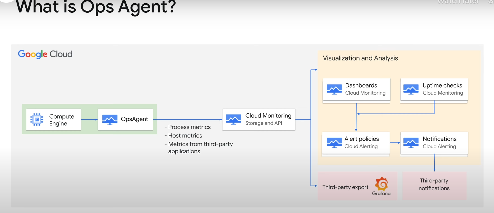
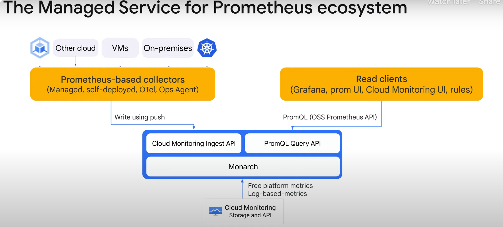
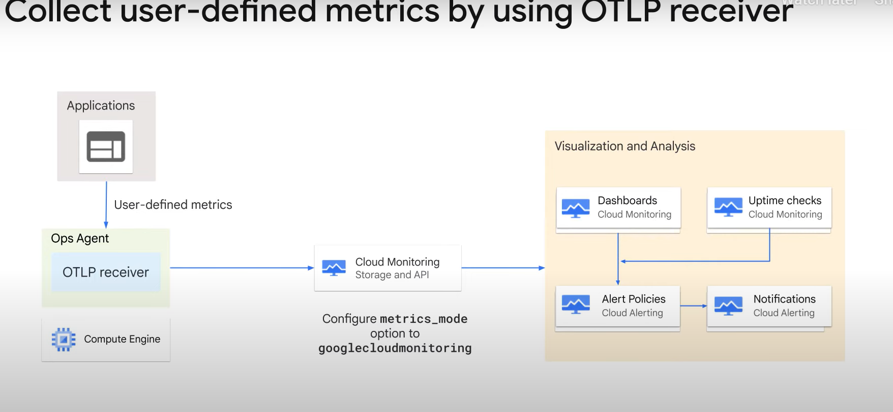
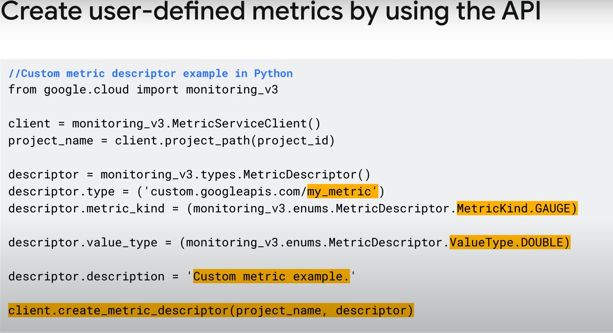

# Observability in Google Cloud

Welcome to the second part of the two-part course, Observability in Google Cloud.

## Course Overview

The first course covered the operations-focused components including:

- Logging
- Monitoring
- Service Monitoring

This course focuses on application performance management tools, including:

- Error Reporting
- Cloud Trace
- Cloud Profiler

These tools are primarily for developers aiming to perfect or troubleshoot applications running in Google Cloud compute products.

## Course Focus

In this course, we will shift our focus to Application Performance Management (APM) and delve into:

- Monitoring various compute options available within Google Cloud
- Profiling, analyzing, and optimizing application code and infrastructure to identify performance bottlenecks

## Learning Objectives

In this course, you will learn to:

- Install and manage Ops Agent to collect logs for Compute Engine
- Use Google Cloud Managed Service for Prometheus
- Analyze VPC Flow logs and Firewall Rules logs
- Analyze resource utilization cost for monitoring-related components within Google Cloud

## Target Audience

This course is designed to equip:

- Cloud Architects
- Administrators
- SysOps personnel
- Cloud Developers
- DevOps personnel

with the essential skills and knowledge needed to excel in logging and monitoring applications and workloads on Google Cloud.

## Prerequisites

The prerequisites for this course are:

- Basic scripting or coding ability
- Google Cloud Fundamentals: Core Infrastructure or equivalent experience
- Proficiency with command-line tools and Linux operating system environments

# Configuring Services for Observability

## Module Overview

In this module, we will examine the art of configuring Google Cloud services for observability.

## Topics Covered

1. **Using Ops Agent with Compute Engine**
   - Learn how to use Ops Agent with Compute Engine.

2. **Google Cloud Managed Service for Prometheus**
   - Explain the benefits of using Google Cloud Managed Service for Prometheus.
   - Usage of Prometheus Query Language (PromQL) to query Cloud Monitoring metrics.

3. **Custom Metrics**
   - Cover custom metrics.

# Collecting Metrics from Compute Engine

## Section Overview

The first section of this module focuses on how to collect metrics from applications deployed on a Google Cloud Compute Engine.

## Monitoring Data Sources

Monitoring data can originate from various sources. With Google Compute Engine instances, Cloud Monitoring can access some instance metrics without the agent, including:

- CPU utilization
- Disk traffic metrics
- Network traffic
- Uptime information

This information can be augmented by installing agents into the VM operating system.

## Improving Observability for Workloads

Many mission-critical services use compute infrastructure directly and run on Google Compute Engine instances. To improve observability for these workloads, the Ops Agent is used.

### Ops Agent



- **Primary agent for collecting telemetry data** from Compute Engine instances.
- Combines logging and metrics into a single agent.
- Uses Fluent Bit for logs (supports high-throughput logging) and the Open Telemetry Collector for metrics.
- Required for security reasons as the hypervisor cannot access some internal metrics inside a VM (e.g., memory usage).

### Supported Applications

The Ops Agent can monitor many third-party applications such as:

- Apache
- MySQL
- Oracle Database
- SAP HANA
- NGINX

### Supported Operating Systems

The Ops Agent supports most major operating systems, including:

- CentOS
- Ubuntu
- Windows

## Benefits of Ops Agent

- Monitors VM instances without additional configuration after installation.
- Helps monitor third-party applications.
- Supports both Windows and Linux guest OS.
- Exposes additional process metrics beyond memory, providing better visibility to CPU, disk, and network performance.
- Unifies gathering of metrics and logs into a single agent.
- Ingests user-defined (Custom) metrics in Prometheus format.

## Installation Methods

You can install the Ops Agent using three different methods:

1. **Google Cloud CLI or Console**: Install the agent on individual VMs.
2. **Agent Policy**: Install and manage agents on a fleet of VMs.
3. **Automation Tools**: Use tools like Ansible, Chef, Puppet, and Terraform to install and manage agents on a fleet of VMs.

### Installing Ops Agent Using Agent Policy

1. Install the beta component.
2. Enable the APIs.
3. Create a policy (e.g., `ops-agents-test-policy` targeting a single CentOS 7 VM instance named `test-instance`).

### Installing Ops Agent on Individual VMs

1. Go to the VM instances page in the Google Cloud console.
2. Click the name of the VM to install the agent on.
3. Open the Observability tab.
4. Click Install.
5. Run the installation command in Cloud Shell.
6. Authorize Cloud Shell to install the agent.

## Troubleshooting

- If the agent is not sending logs to Cloud Logging, check the metrics module in syslog.
- If you see 403 permission errors when writing to the Monitoring API, enable the Logging API and Logs Writer role.

## Previewing Data as Dashboards

- Navigate to Monitoring and select the Integrations page to view logs, metrics, and dashboards for data collected through the Ops Agent.
- Integrations bring together metrics, logs, dashboards, and alerts for quick access to rich data for your application stack.
- Built on an open-source foundation, the data can be customized to fit your needs.

# Monitoring Non-VM Systems

## Overview

In addition to Google Cloud virtual machines, many Google Cloud resources support monitoring. Let's look at a few of these.

## Non-VM Systems Monitoring

When monitoring any of the following non-virtual machine systems in Google Cloud, the Ops Agent is not required and should not be installed:

### App Engine

- **Standard Environment**: Has monitoring built-in.
- **Flexible Environment**: Built on top of GKE with the Monitoring agent pre-installed and configured.

### Google Kubernetes Engine (GKE)

- **Standard Nodes (VMs)**: Cloud Monitoring and Cloud Logging are enabled by default.

### Cloud Run and Cloud Run Functions

- Provide integrated monitoring support.

## Monitoring and Logging Details

- **App Engine Standard and Flexible Environments**: Both support monitoring and logging by writing to stdout or stderr. For refined logging capabilities, review the language-specific logging APIs (e.g., Winston for Node.js). Logs are viewable under the GAE Application resources.

### Cloud Run Functions

- Offers lightweight, purpose-built functions typically invoked in response to an event (e.g., translating a PDF file uploaded to a Cloud Storage bucket).
- Monitoring is automatic and provides access to invocations, execution times, memory usage, and active instances in the Google Cloud console.
- Metrics are available in Cloud Monitoring, where custom alerting and dashboards can be set up.
- Supports simple logging by default (logs written to stdout or stderr appear automatically in the Google Cloud console). The logging API can also be used for extended log support.

### Cloud Run

- **Managed Container Service**: Can run in a fully managed version or on GKE (managed version of open-source KNative).
- Automatically integrated with Cloud Monitoring with no setup or configuration required.
- Metrics are captured automatically and viewable in Cloud Monitoring or on the Cloud Run page in the console.
- Provides more charting and filtering options in Cloud Monitoring.
- **Resource Types**:
  - Fully Managed Cloud Run: "Cloud Run Revision" (cloud_run_revision).
  - Cloud Run for Anthos: "Cloud Run on GKE Revision" (knative_revision).

### Cloud Run Logs

- **Request Logs**: Logs of requests sent to Cloud Run services.
- **Container Logs**: Logs emitted from container instances from your own code, written to stdout or stderr streams, or using the logging API.

# Monitoring Options for GKE

## Overview

We have looked at monitoring for Compute Engine and other compute options. Now, let's explore monitoring options explicitly available for Google Kubernetes Engine (GKE).

## GKE Monitoring Integration

Google Kubernetes Engine (GKE) includes integration with:

- Cloud Logging
- Cloud Monitoring
- Google Cloud Managed Service for Prometheus

### Default Monitoring and Logging

When you create a GKE cluster on Google Cloud:

- Cloud Logging and Cloud Monitoring are enabled by default.
- These services provide observability specifically tailored for Kubernetes.

### Prometheus Metrics

- Enable Google Cloud Managed Service for Prometheus to collect Prometheus metrics.
- Monitor workloads running on GKE and non-GKE compute workloads.

## Configuring Cloud Logging and Cloud Monitoring

You can configure Cloud Logging and Cloud Monitoring for GKE clusters either during creation or after creation.

### During Cluster Creation

1. Navigate to Standard mode under Operations.
2. For new clusters, Cloud Logging and Cloud Monitoring are enabled by default.
3. Change the components for which metrics and logs are collected under the Components section.
4. Enable managed collection by selecting Managed Service for Prometheus.

# Managed Service for Prometheus

## Overview

Google Cloud Managed Service for Prometheus is a fully managed service that simplifies the collection, storage, and analysis of Prometheus metrics.

## Key Features



- **Fully Managed Service**: Collects metrics from Kubernetes and VM environments at scale without operational overhead.
- **Built on Monarch**: Uses Google's globally scalable time series database, Monarch, which is also used by Cloud Monitoring.
- **High-Level Data Management**: Includes data modeling, collection, querying, alerting, and management features.

## Benefits

- **Ease of Use**: Simplifies the use of Prometheus with maintained metric collectors.
- **Scalability**: Handles query evaluation and data storage across all Google Cloud regions.
- **Long-Term Retention**: Supports two years of metric retention by default at no additional cost.

## Data Collection Options

1. **Managed Data Collection**: Recommended for Kubernetes environments; eliminates complexity.
2. **Self-Deployed Data Collection**: Use the Managed Service for Prometheus binary instead of the upstream Prometheus binary.
3. **Ops Agent**: Simplifies VM discovery and eliminates the need for Prometheus installation in VM environments.
4. **OpenTelemetry Collector**: Collects metrics from any environment and sends them to any compatible backend.

## Rule Evaluation

- Handled by locally run and configured rule evaluators.
- Uses the standard Prometheus rule files format for easier migration.

## Querying Metrics

- **Supported UIs**: Any UI that can call the Prometheus query API, including Grafana and Cloud Monitoring.
- **PromQL**: Can be used to query free Kubernetes metrics, custom metrics, and log-based metrics.

## Enabling Managed Collection

1. Select the GKE cluster and click ENABLE SELECTED.
2. Deploy a PodMonitoring resource to scrape a metrics endpoint.

### Example: PodMonitoring Resource

- Defines a `PodMonitoring` resource in the namespace.
- Uses a Kubernetes label selector to find pods with the label `app=prom-example`.
- Scrapes the matching pods on the `/metrics` HTTP path every 30 seconds.

### Example: ClusterPodMonitoring Resource

- Provides the same interface as `PodMonitoring` but applies to pods across all namespaces.

## Query Tools in Cloud Monitoring

- **PromQL**
- **Monitoring Query Language (MQL)**
- **Monitoring Filters**

### Verifying Prometheus Data Export

1. Go to the Cloud Monitoring Metrics Explorer page in the Google Cloud console.
2. Select the PromQL tab.
3. Enter and run the query (e.g., `up` query).

### Example PromQL Query

- Shows the average CPU utilization of compute instances in Google Cloud over a span of 1 hour.

# Google Cloud Observability - Creating Custom Metrics

## Overview

In addition to the more than 1,000 metrics that Google automatically collects, you can create your own application-specific metrics, also known as user or custom metrics.

## Custom Metrics

Custom metrics are metrics that you define and collect to capture information that built-in Cloud Monitoring metrics cannot. You can create charts and alerts for your custom metric data just like built-in metrics.

### Approaches to Creating Custom Metrics

1. **Classic Cloud Monitoring API**
2. **OpenTelemetry Protocol (OTLP) and Ops Agent**

### OpenTelemetry Protocol (OTLP) Receiver



- A plugin installed on the Ops Agent that collects user-defined metrics from the application and sends them to Cloud Monitoring for analysis and visualization.
- Metrics can be used to create dashboards, uptime checks, and alerting policies.
- Ingestion and authorization are handled at the agent level.

### Configuring OTLP

1. Install an Ops Agent.
2. Modify the user configuration file to include the OTLP file.
3. By default, the receiver uses the Prometheus API (`metrics_mode` option is `googlemanagedprometheus`).
4. To receive custom metrics, set the `metrics_mode` to `googlecloudmonitoring`.

## Creating Custom Metrics Using the API



1. **Define a Metric Descriptor**: Associate the data you collect with a descriptor for a custom metric type.
   - Example: Create a gauge double metric named `my_metric` with the description "Custom metric example."
2. **Create the Metric**: Call the `create` method, passing a `MetricDescriptor` object.
3. **Write Data Points**: Pass a list of `TimeSeries` objects to `create_time_series`.
   - Each `TimeSeries` object is identified by the `metric` and `resource` fields, representing the metric type and the monitored resource.
   - Example: Link `my_metric` to a specified Compute Engine instance.
4. **Create a Point**: Add the point to the series and include the details.
   - Each `TimeSeries` object must contain a single `Point` object.
5. **Report the Metric**: After configuring the `metrics_mode` to Prometheus API or Cloud Monitoring API in the OTLP receiver, query the metrics using Metrics Explorer, dashboards, or alternate interfaces.

## Example: Querying Custom Metrics

- Use the Metrics Explorer in the Google Cloud console.
- Navigate to Monitoring > Metrics Explorer.
- Select the PromQL tab and enter the query (e.g., `up` query).
- Click Run Query to see the results.

### Example PromQL Query

- Shows the average CPU utilization of compute instances in Google Cloud over a span of 1 hour.

# Lab: Monitoring a Compute Engine using Ops Agent

## Overview

In this lab, you will create a Compute Engine instance, install and configure an Ops Agent, generate traffic, view metrics on the predefined Apache dashboard, and create an alerting policy.

## Objectives

In this lab, you will learn how to:

1. Create a Compute Engine VM instance.
2. Install an Apache Web Server.
3. Install and configure the Ops Agent for the Apache Web Server.
4. Generate traffic and view metrics on the predefined Apache dashboard.
5. Create an alerting policy.

## Steps

### 1. Create a Compute Engine VM Instance

1. In the Google Cloud console, go to **Compute** and select **Compute Engine**.
2. Click **Create instance**.
3. Fill in the fields for your instance:
   - **Name**: `quickstart-vm`
   - **Machine type**: `e2-small`
   - **Boot disk**: Debian GNU/Linux
   - **Firewall**: Select both **Allow HTTP traffic** and **Allow HTTPS traffic**
4. Click **Create**. When your VM is ready, it appears in the list of instances.

### 2. Install an Apache Web Server

1. Open a terminal to your instance by clicking **SSH** in the Connect column.
2. Update the package lists:

   ```bash
   sudo apt-get update
   ```

3. Install Apache2 HTTP Server:

   ```bash
   sudo apt-get install apache2 php7.0
   ```

   - If the previous command fails, use:

     ```bash
     sudo apt-get install apache2 php
     ```

   - If asked to continue the installation, enter `Y`.
4. Open your browser and connect to your Apache2 HTTP server using the URL `http://EXTERNAL_IP`, where `EXTERNAL_IP` is the external IP address of your VM.

### 3. Install and Configure the Ops Agent

1. Open a terminal to your VM instance by clicking **SSH** in the Connect column.
2. Install the Ops Agent:

   ```bash
   curl -sSO https://dl.google.com/cloudagents/add-google-cloud-ops-agent-repo.sh
   sudo bash add-google-cloud-ops-agent-repo.sh --also-install
   ```

3. Configure the Ops Agent:

   ```bash
   sudo cp /etc/google-cloud-ops-agent/config.yaml /etc/google-cloud-ops-agent/config.yaml.bak
   sudo tee /etc/google-cloud-ops-agent/config.yaml > /dev/null << EOF
   metrics:
     receivers:
       apache:
         type: apache
     service:
       pipelines:
         apache:
           receivers:
             - apache
   logging:
     receivers:
       apache_access:
         type: apache_access
       apache_error:
         type: apache_error
     service:
       pipelines:
         apache:
           receivers:
             - apache_access
             - apache_error
   EOF
   sudo service google-cloud-ops-agent restart
   sleep 60
   ```

### 4. Generate Traffic and View Metrics

1. Open a terminal to your VM instance by clicking **SSH** in the Connect column.
2. Generate traffic on your Apache Web Server:

   ```bash
   timeout 120 bash -c -- 'while true; do curl localhost; sleep $((RANDOM % 4)) ; done'
   ```

3. View the Apache GCE Overview dashboard:
   - In the Google Cloud console, search for **Monitoring** and navigate to the Monitoring service.
   - In the navigation pane, select **Dashboards**.
   - In **All Dashboards**, select the **Apache Overview** dashboard.

### 5. Create an Alerting Policy

1. Set up an email notification channel:
   - In the Google Cloud console, go to **Monitoring** > **Alerting** and click **Edit notification channels**.
   - In the Email section, click **Add new** and enter your desired email address.
   - Name the email channel.
2. Create an alerting policy:
   - In the Google Cloud console, go to **Monitoring** > **Alerting** and click **Create policy**.
   - Select the time series to be monitored:
     - Click **Select a metric** and enter `VM instance` into the filter bar.
     - In the Active metric categories list, select **Apache**.
     - In the Active metrics list, select `workload/apache.traffic`.
     - Click **Apply**.
   - Configure the alert trigger:
     - Rolling window: `1 min`
     - Rolling window function: `rate`
     - Alert trigger: `Any time series violates`
     - Threshold position: `Above threshold`
     - Threshold value: `4000`
   - Configure notifications and finalize the alert:
     - Notification channels: Your email address
     - Incident autoclose duration: `30 min`
     - Name the alert policy: `Apache traffic above threshold`
   - Click **Create policy**.

### 6. Test the Alerting Policy

1. Open a terminal to your VM instance by clicking **SSH** in the Connect column.
2. Generate traffic on your Apache Web Server:

   ```bash
   timeout 120 bash -c -- 'while true; do curl localhost; sleep $((RANDOM % 4)) ; done'
   ```

3. After the traffic rate threshold value of 4 KiB/s is exceeded, an email notification is sent. It might take several minutes for this process to complete.
