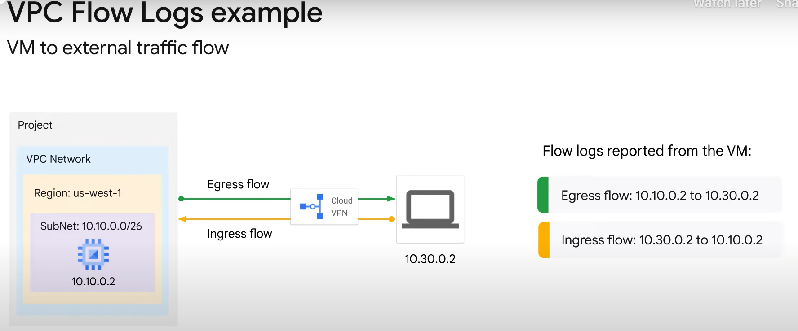
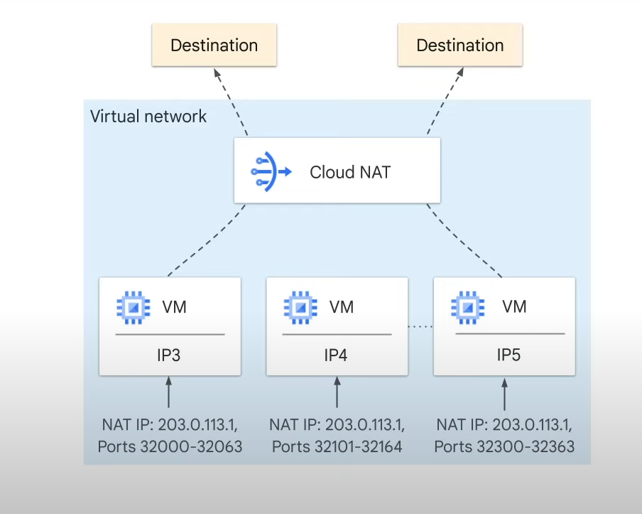
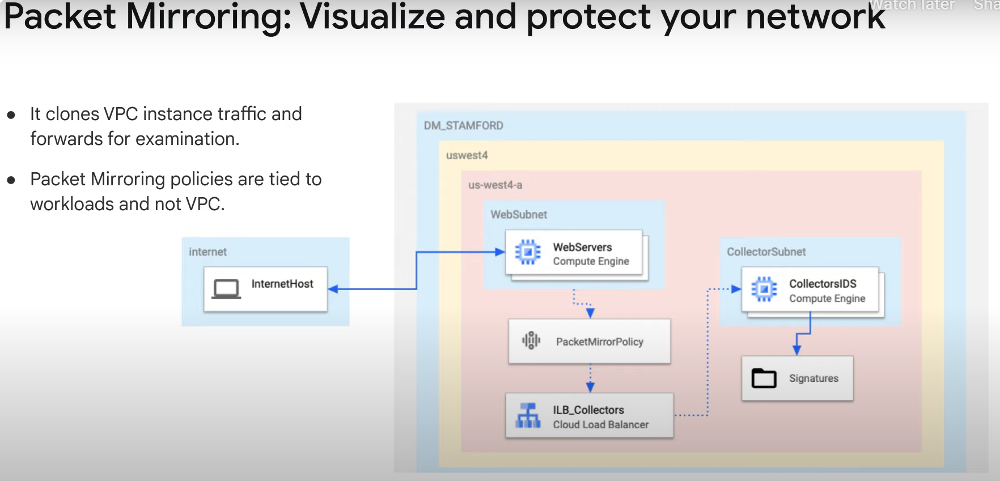

# Monitoring Google Cloud Network

## Module Overview

In this module, we will analyze Google’s Virtual Private Cloud (VPC). Specifically, you will learn to:

1. **Collect and Analyze Logs**
   - VPC Flow Logs
   - Firewall Rules Logging
   - Load Balancer Logs
   - Cloud NAT Logs

   These logs help you see what's happening to the traffic across your network.

2. **Enable Packet Mirroring**
   - Replicate packets at the virtual machine network interface.
   - Forward packets for further analysis.

3. **Network Intelligence Center**
   - Cover the capabilities of the Network Intelligence Center.

# Monitoring the Network

## VPC Flow Logs

VPC Flow Logs record a sample (about one out of ten packets) of network flows sent from and received by VM instances, including Google Kubernetes Engine nodes. These logs can be used for:

- Network monitoring
- Traffic analysis
- Forensics
- Real-time security analysis
- Expense optimization

### Key Features

- **Part of Andromeda**: The software that powers VPC networks.
- **No Delay or Performance Penalty**: When enabled.
- **Traffic Visibility**: Helps monitor the flow between zones and IP addresses.

### Traffic Flow Example



- **Ingress Traffic**: Logs reported with VM as its destination (e.g., from source VM `10.30.0.2` to `10.10.0.2`).
- **Egress Traffic**: Logs reported with VM as its source (e.g., from source VM `10.10.0.2` to `10.30.0.2`).

### Properties of VPC Flow Logs

- **VM’s Perspective**: Samples are from a VM’s perspective.
  - Egress firewall denied packets are sampled.
  - Ingress blocked packets are not logged.
- **Flow Types**: Samples TCP, UDP, ICMP, ESP, and GRE flows from each VM.
- **Traffic Recording**: Records inbound and outbound flows for each VM, capturing traffic between VMs, VM to on-premises, and VM to another host on the internet.
- **Multiple Network Interfaces**: VMs support multiple network interfaces and can be enabled at the subnet level.
- **Subnet Level Activation**: Can activate or deactivate VPC Flow Logs per VPC subnet.

### Enabling VPC Flow Logs

- During subnet creation, select **On** next to Flow Logs.
- Optionally adjust log sampling and aggregation to modify the metadata and sample rate written to logs.

### Log Entry Fields

- **5-Tuple**: Source IP address and port, destination IP address and port, and protocol number.
- **Additional Fields**: Start and end time of the first and last observed packet, bytes and packets sent, instance details, network tags, VPC details, and geographic details.

### Accessing VPC Flow Logs

- Use **Logs Explorer** to access VPC Flow Logs.
- Entries will be under `vpc_flows` below the Compute Engine section.
- Search for log names `vpc_flows`.

### Log Analytics

- Powered by BigQuery, provides capabilities to analyze flow log data and generate insights.
- **Ad-Hoc Query-Time Analysis**: Without complex pre-processing.
- **BigQuery Integration**: Query data and upgrade buckets to use Log Analytics, then create a linked dataset.

Refer to the documentation for curated sample queries to get started with Flow Log Analysis.

# Firewall Rules Logging

## Overview

VPC firewall rules allow or deny connections to or from your VM instances based on a specified configuration. Enabled VPC firewall rules are always enforced, protecting your instances regardless of their configuration and operating system.

Firewall Rules Logging lets you audit, verify, and analyze the effects of your firewall rules. It can help answer questions like:

- Did my firewall rules cause that application outage?
- How many connections match the rule I just created?
- Are my firewall rules stopping (or allowing) the correct traffic?

### Enabling Firewall Rules Logging

- By default, Firewall Rules Logging is disabled.
- You can enable it on a per-rule basis.
- Example: Editing the firewall rule named `enable-rdp` and selecting the radio button to enable firewall rules.

### Important Notes

- Firewall Rules Logging can only record TCP and UDP connections. For other protocols, use Packet Mirroring.
- Firewall Rules Logging can generate a lot of data, which might have cost implications.
- Can be activated on existing firewall rules using the CLI.

### Viewing Logs

- Use Logs Explorer to view logs in real time or to configure exports.
- To filter for firewall logs and network policy firewall logs, select `firewall` under the Compute Engine resource.

## Micro-Segmentation Firewalls

Google Cloud VPC firewalls are micro-segmentation firewalls, functioning like a bunch of micro-firewalls operating over the Network Interface Controller (NIC) of every VM connected to the VPC. They can grant or deny any configured incoming or outgoing traffic.

## Troubleshooting Firewall Issues

### Scenario

Two web servers can no longer access a shared application server after configuration changes.

### Possible Causes

1. A firewall rule is actively blocking the incoming connections from the web servers.
2. Network traffic is blocked by default, and a firewall rule might not be allowing the traffic as it should.

### Steps to Troubleshoot

1. **Create a Temporary High-Priority Rule**: Allow the web server traffic through to the app server and enable Cloud logging on it.
2. **Examine Log Entries**: If traffic gets through, it's firewall-related.
3. **Check Existing Rules**: Find the rule supposed to allow the traffic and verify its configuration.

### Example Issue

- The rule supposed to allow the traffic is based on a network tag named `webserver`.
- The web server machines are using the network tag `web-server`.
- Correcting the network tag resolves the issue.

# Load Balancer Monitoring and Logging

## Overview

Several Google Cloud load balancers support monitoring and logging. While all Google Cloud load balancers support Cloud Logging and Cloud Monitoring, the log type and log fields supported vary based on the type of load balancer.

### Types of Load Balancers

- Internal and external Application Load Balancers
- Internal and external Network Load Balancers
- Internal and external Proxy Load Balancers

## Cloud Logging for Load Balancing

Cloud Logging logs all the load balancing requests sent to your load balancer. These logs can be used for debugging and analyzing user traffic. You can view request logs and export them to Cloud Storage, BigQuery, or Pub/Sub for analysis.

### Key Features

- **Per-Connection Logging**: For network load balancers, provides insight into how each connection is routed to serving backends.
- **Automatic Logging**: For external Application Load Balancers with backend buckets, logging is automatically enabled and cannot be disabled.
- **Per Backend Service Logging**: Activate logging on a per backend service basis.
- **Multiple Backend Services**: A single internal Application Load Balancer URL map can reference more than one backend service, requiring logging to be enabled for each.

### Default Settings

- Logging is enabled by default for all new load balancer backends.
- Backends created before the GA release of load balancer logging might require manual configuration.

## Log Entry Information

Application Load Balancing log entries contain information useful for monitoring and debugging HTTP(S) traffic.

### LogEntry Format

- **General Information**: Includes severity, project ID, project number, timestamp, etc.
- **HttpRequest**: Includes method, URL, remote IP address, protocol, latency string, user agent (HttpRequest.protocol is not populated for Application Load Balancing logs).
- **Resource**: Contains the monitored resource type associated with the log entry.
- **jsonPayload**: Contains the `statusDetails` field, explaining why the load balancer returned a specific HTTP status.

### Redirects

- Redirects issued from the load balancer (e.g., HTTP response status code 302 Found) are not logged.
- Redirects issued from the backend instances are logged.

## Troubleshooting Load Balancing Issues

### Example Scenario

- The load balancer generates an HTTP error resource code 5XX and sends the same error code to the client.

### Steps to Determine the Source of an Error

1. Refer to the load balancer logs.
2. Check the `statusDetails` field:
   - `response_sent_by_backend`: Indicates a backend issue.
   - `failed_to_pick_backend`: Indicates the load balancer failed to pick a healthy backend to handle the request.

# Cloud NAT Logs

## Overview

Cloud NAT (Network Address Translation) is a Google-managed service that allows you to provision application instances without public IP addresses, enabling controlled and efficient internet access.

### Benefits of Cloud NAT



- **Private Instances Access**: VMs without external IP addresses can access the internet for updates, patching, configuration management, etc.
- **Fewer External IP Addresses**: Reduces the need for external IP addresses by using internal IP addresses.
- **Automatic Scaling**: Can automatically scale the number of NAT IP addresses used.
- **Support for Managed Instance Groups**: Supports VMs in managed instance groups, including those with autoscaling enabled.
- **Distributed Service**: Not dependent on a single, physical gateway device; it is a distributed, software-defined managed service.

### Configuration

- **NAT Gateway on Cloud Router**: Configure a NAT gateway on a Cloud Router, which provides the control plane for Cloud NAT.
- **NAT Configuration Parameters**: Contained within the Cloud Router.

## Cloud NAT Logging

Cloud NAT logging allows you to log NAT TCP and UDP connections and errors.

### Log Entries

- **Connection Logs**: Generated when a network connection using Cloud NAT is created.
- **Error Logs**: Generated when an egress packet is dropped because no port was available for Cloud NAT.
- **Log Options**: You can opt to log both connection and error events, or just one type.
- **Traffic Types**: Logs contain TCP and UDP traffic only.
- **Log Rate Threshold**: Maximum of 50-100 log events per vCPU before log filtering.

### Enabling Cloud NAT Logging

- **New Gateway**: Enable logging when a new Cloud NAT gateway is created.
- **Existing Gateway**: Enable logging by editing the settings of an existing gateway.

### Viewing Logs

- Use **Logs Explorer** to view collected logs.
- Filter to the **Cloud NAT Gateway** resource.
- Optionally, restrict logs to a particular region or gateway.

# Packet Mirroring

## Overview

Packet Mirroring clones the traffic of specific instances in your Virtual Private Cloud (VPC) network and forwards it for examination. It captures all ingress and egress traffic and packet data, such as payloads and headers.



### Key Features

- **Mirroring on VM Instances**: The mirroring happens on the VM instances, not on the network, consuming additional bandwidth on the hosts.
- **Full Traffic Export**: Exports all traffic, not just between sampling periods.

### Use Cases

1. **Security Monitoring and Analysis**
   - Use security software to analyze mirrored traffic for threats or anomalies.
   - Inspect full traffic flow for application performance issues and network forensics for PCI DSS compliance and other regulatory use cases.

2. **Network and Application Monitoring**
   - Maintain integrity of deployment.
   - Troubleshoot packet loss issues by analyzing protocols.
   - Troubleshoot reconnection and latency issues by analyzing real-time traffic patterns.

### Limitations

- **Bandwidth Consumption**: Consumes the egress bandwidth of the mirrored instances.
- **Significant Data Generation**: Generates significant data, requiring storage and processing.

### Workaround

- **Use Filters**: Reduce the traffic collected for mirrored instances using filters for IP address ranges, protocols, traffic directions, etc. (maximum of 30 filters).

## Security and Compliance

- **Zero-Trust Implementation**: Monitor network traffic across and within trust boundaries without network re-architecture.
- **Security Tools**:
  - Intrusion detection systems: Match signatures with multiple packets of a single flow.
  - Deep Packet Inspection engines: Inspect payloads for anomalies.
  - Network forensics for PCI compliance: Capture, process, and preserve forensic data of different attack vectors.

## Monitoring Metrics

Packet Mirroring exports monitoring data about mirrored traffic to Cloud Monitoring. You can use monitoring metrics to check whether traffic from a VM instance is being mirrored as intended.

### Metrics

- **Mirrored Packet Count**
- **Mirrored Byte Count**
- **Dropped Packet Count**

### Usage

- View the mirrored packet or byte count for a specific instance.
- View the monitoring metrics of mirrored VM instances or instances that are part of the collector destination (internal load balancer).

### Considerations

- Mirroring generates significant data that requires storage and processing.
- It slows the network throughput of the virtual machines being monitored and might accidentally expose sensitive data.

# Network Intelligence Center

Network Intelligence Center provides centralized monitoring and visibility into your network, reducing troubleshooting time and effort, increasing network security, and improving the overall user experience.

## Modules

1. **Network Topology**
   - Visualizes your Google Cloud network as a graph.
   - Explore configurations, troubleshoot issues, filter entities, see communication lines with bandwidth information, and select time boundaries.

2. **Connectivity Tests**
   - Diagnose connectivity issues within Google Cloud or from Google Cloud to an external IP address.
   - Verify the effect of configuration changes and ensure network intent is not violated.
   - Assure network security and compliance.

3. **Performance Dashboard**
   - **Packet Loss Tab**: Shows results of active probing between VMs in a VPC.
     - Workers on physical hosts insert and receive probe packets, revealing network issues.
   - **Latency Tab**: Aggregates latency information based on a sample of actual TCP VM traffic.
     - Latency is calculated as the time between sending a TCP sequence number (SEQ) and receiving a corresponding Acknowledgement (ACK).

4. **Firewall Insights**
   - Produces metrics and insights for better firewall rule decisions.
   - Uses Cloud Monitoring metrics and Recommender insights.
   - Analyze firewall rule usage, expose misconfigurations, and identify rules that could be stricter.

5. **Network Analyzer**
   - Monitors VPC network configurations and detects misconfigurations and suboptimal configurations.
   - Provides insights on network topology, firewall rules, routes, configuration dependencies, and connectivity.
   - Identifies network failures, provides root cause information, and suggests resolutions.

### Key Features

- **Network Topology**: Visualize and troubleshoot network configurations.
- **Connectivity Tests**: Diagnose and prevent connectivity issues.
- **Performance Dashboard**: Monitor packet loss and latency.
- **Firewall Insights**: Analyze firewall rule usage and improve security.
- **Network Analyzer**: Detect and resolve network misconfigurations.

### Example Use Case

- **Error Insight**: GKE node to control plane connectivity issue.
  - **Root Cause**: Ingress firewall rule blocking the connection.
  - **Solution**: Create a new firewall rule or increase the priority of the existing rule.

# Lab: Analyzing Network Traffic with VPC Flow Logs

In this lab, you will configure a network to record traffic to and from an Apache web server using VPC Flow Logs. You will then export the logs to BigQuery to analyze them.

## Objectives

In this lab, you will learn how to:

1. Configure a custom network with VPC flow logs.
2. Create an Apache web server.
3. Verify that network traffic is logged.
4. Export the network traffic to BigQuery to further analyze the logs.
5. Set up VPC flow log aggregation.

## Task 1: Configure a Custom Network with VPC Flow Logs

### Create the Custom Network

1. In the Cloud Console, go to **VPC network > VPC networks**.
2. Click **Create VPC Network**.
3. Specify the following settings:
   - **Name**: `vpc-net`
   - **Description**: (optional)
   - **Subnet creation mode**: Custom
4. For the subnet, specify:
   - **Name**: `vpc-subnet`
   - **Region**: `REGION`
   - **IP address range**: `10.1.3.0/24`
   - **Flow Logs**: On
5. Click **Done** and then **Create**.

### Create the Firewall Rule

1. In the Navigation menu, go to **VPC network > Firewall**.
2. Click **Create Firewall Rule**.
3. Specify the following settings:
   - **Name**: `allow-http-ssh`
   - **Network**: `vpc-net`
   - **Targets**: Specified target tags
   - **Target tags**: `http-server`
   - **Source filter**: IPv4 Ranges
   - **Source IPv4 ranges**: `0.0.0.0/0`
   - **Protocols and ports**: Specified protocols and ports, check `tcp`, type: `80, 22`
4. Click **Create**.

## Task 2: Create an Apache Web Server

### Create the Web Server

1. In the Navigation menu, go to **Compute Engine > VM instances**.
2. Click **Create instance**.
3. Specify the following settings:
   - **Name**: `web-server`
   - **Region**: `REGION`
   - **Zone**: `ZONE`
   - **Series**: E2
   - **Machine type**: `e2-micro`
4. Click **Advanced Options**.
5. Click **Networking**.
6. For **Network tags**, type `http-server`.
7. For **Network interfaces**, click **default** and specify:
   - **Network**: `vpc-net`
   - **Subnetwork**: `vpc-subnet (10.1.3.0/24)`
8. Click **Done** and then **Create**.

### Install Apache

1. For `web-server`, click **SSH** to launch a terminal and connect.
2. Update the package index:

   ```bash
   sudo apt-get update
   ```

3. Install the Apache2 package:

   ```bash
   sudo apt-get install apache2 -y
   ```

4. Create a new default web page:

   ```bash
   echo '<!doctype html><html><body><h1>Hello World!</h1></body></html>' | sudo tee /var/www/html/index.html
   ```

5. Exit the SSH terminal:

   ```bash
   exit
   ```

## Task 3: Verify that Network Traffic is Logged

### Generate Network Traffic

1. Return to the VM instances page in the Cloud Console.
2. For `web-server`, click on the **External IP** to access the server.
   - You should see the "Hello World!" welcome page.

### Find Your IP Address

1. Open a browser in a new tab.
2. Go to Google.com and search for "what's my IP".
3. Copy your IP address (referred to as `YOUR_IP_ADDRESS`).

### Access the VPC Flow Logs

1. In the Google Cloud console, search for **Logging** and click **Logging**.
2. In the Log fields panel, under **RESOURCE TYPE**, click **Subnetwork**.
3. In the Log fields panel, under **LOG NAME**, click `compute.googleapis.com/vpc_flows`.
4. Enable the **Show query** button.
5. In the Query builder box, enter `YOUR_IP_ADDRESS` on a new line and click **Run Query**.
6. Expand one of the log entries, then expand the `jsonPayload` and `connection`.

## Task 4: Export the Network Traffic to BigQuery to Further Analyze the Logs

### Create an Export Sink

1. On the Google Cloud console title bar, type **Logs explorer** in the Search field, then select **Logs explorer** from the search results.
2. Under **RESOURCE TYPE**, click **Subnetwork**. In the Query results pane, entries for all available subnetworks appear.
3. Under the **LOG NAME** filter, click `compute.googleapis.com/vpc_flows`. In the Query results pane, only the VPC flow log entries are shown.
4. Select **Actions > Create Sink**.
5. For the **Sink name**, type `bq_vpcflows`, and click **NEXT**.
6. In the **Select sink service** drop-down list, select **BigQuery dataset**.
7. In the **Select BigQuery dataset** drop-down list, select **Create new BigQuery dataset**.
8. For **Dataset ID**, enter `bq_vpcflows`, and click **CREATE DATASET**.
9. Click **NEXT** twice.
10. Click **CREATE SINK**.

### Generate Log Traffic for BigQuery

1. In the Navigation menu, select **Compute Engine > VM instances**.
2. Note the External IP address for the `web-server` instance. It will be referred to as `EXTERNAL_IP`.
3. Click **Activate Cloud Shell**.
4. If prompted, click **Continue**.
5. Store the `EXTERNAL_IP` in an environment variable in Cloud Shell:

   ```bash
   export MY_SERVER=<Enter the EXTERNAL_IP here>
   ```

6. Access the web-server 50 times from Cloud Shell:

   ```bash
   for ((i=1;i<=50;i++)); do curl $MY_SERVER; done
   ```

### Visualize the VPC Flow Logs in BigQuery

1. In the Cloud Console, in the Navigation menu, click **BigQuery**.
2. If prompted, click **Done**.
3. In the left pane, expand the `bq_vpcflows` dataset to reveal the table. You might have to first expand the Project ID to reveal the dataset.
4. Click on the name of the table. It should start with `compute_googleapis`.
5. Click on the **Details** tab.
6. Copy the **Table ID** value under Table info.
   - Note: If you do not see the `bq_vpcflows` dataset or if it does not expand, wait and refresh the page.
7. Click the **+** icon to open a new BigQuery Editor tab.
8. Add the following to the BigQuery Editor and replace `your_table_id` with `TABLE_ID` while retaining the accents (`` ` ``) on both sides:

   ```sql
   #standardSQL
   SELECT
     jsonPayload.src_vpc.vpc_name,
     SUM(CAST(jsonPayload.bytes_sent AS INT64)) AS bytes,
     jsonPayload.src_vpc.subnetwork_name,
     jsonPayload.connection.src_ip,
     jsonPayload.connection.src_port,
     jsonPayload.connection.dest_ip,
     jsonPayload.connection.dest_port,
     jsonPayload.connection.protocol
   FROM
     `your_table_id`
   GROUP BY
     jsonPayload.src_vpc.vpc_name,
     jsonPayload.src_vpc.subnetwork_name,
     jsonPayload.connection.src_ip,
     jsonPayload.connection.src_port,
     jsonPayload.connection.dest_ip,
     jsonPayload.connection.dest_port,
     jsonPayload.connection.protocol
   ORDER BY
     bytes DESC
   LIMIT
     15
   ```

9. Click **Run**.
   - Note: If you get an error, ensure that you did not remove the `#standardSQL` part of the query. If it still fails, ensure that the `TABLE_ID` did not include the Project ID.

### Analyze the VPC Flow Logs in BigQuery

1. Create a new query in the BigQuery Editor with the following and replace `your_table_id` with `TABLE_ID` while retaining the accents (`` ` ``) on both sides:

   ```sql
   #standardSQL
   SELECT
     jsonPayload.connection.src_ip,
     jsonPayload.connection.dest_ip,
     SUM(CAST(jsonPayload.bytes_sent AS INT64)) AS bytes,
     jsonPayload.connection.dest_port,
     jsonPayload.connection.protocol
   FROM
     `your_table_id`
   WHERE jsonPayload.reporter = 'DEST'
   GROUP BY
     jsonPayload.connection.src_ip,
     jsonPayload.connection.dest_ip,
     jsonPayload.connection.dest_port,
     jsonPayload.connection.protocol
   ORDER BY
     bytes DESC
   LIMIT
     15
   ```

2. Click **Run**.
   - Note: The results table now has a row for each source IP and is sorted by the highest amount of bytes sent to the web-server. The top result should reflect your Cloud Shell IP address.
   - Note: Unless you accessed the web-server after creating the export sink, you will not see your machine's IP address in the table.

You can generate more traffic to the web-server from multiple sources and query the table again to determine the bytes sent to the server.

## Task 5: Add VPC Flow Log Aggregation

In this task, you will explore VPC flow log volume reduction. By adjusting specific aspects of logs collection, you can balance your traffic visibility and storage cost needs.

### Setting Up Aggregation

1. In the Console, navigate to the **Navigation menu** and select **VPC network > VPC networks**.
2. Click `vpc-net`.
3. In the **Subnets** tab, click `vpc-subnet`.
4. Click **Edit > Advanced Settings** to expose the following fields:

#### Flow Log Settings

- **Aggregation Time Interval**: Sampled packets for a time interval are aggregated into a single log entry. Options include 5 sec (default), 30 sec, 1 min, 5 min, 10 min, or 15 min.
- **Metadata Annotations**: By default, flow log entries are annotated with metadata information (e.g., names of source and destination VMs, geographic region of external sources and destinations). This can be turned off to save storage space.
- **Log Entry Sampling**: The number of logs can be sampled to reduce their number before being written to the database. By default, the log entry volume is scaled by 0.50 (50%), meaning half of the entries are kept. This can be set from 1.0 (100%, all log entries are kept) to 0.0 (0%, no logs are kept).

### Configuration Steps

1. Set the **Aggregation Interval** to 30 seconds.
2. Set the **Secondary Sampling Rate** to 25%.
3. Click **Save**.

### Result
You should see a message indicating the estimated logs generated per day. Setting the aggregation level to 30 seconds can reduce your flow logs size by up to 83% compared to the default aggregation interval of 5 seconds. Configuring your flow log aggregation can significantly affect your traffic visibility and storage costs.


