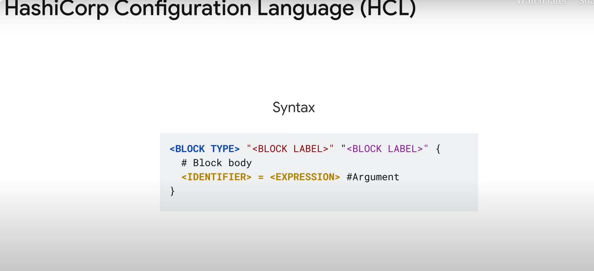
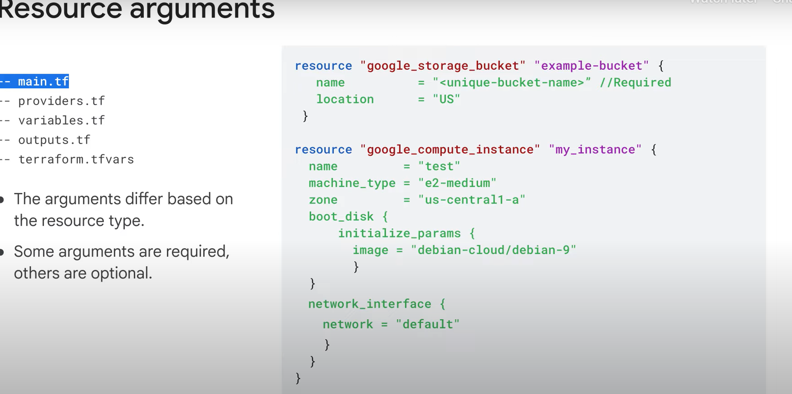

# Terms and Concepts

## Introduction

**Hi there.**

Welcome to Module 2: Terms and Concepts. This module elaborates on the Terraform workflow that was introduced in Module 1. Now this is going to be a very short module; while there's a lot to cover about how to author infrastructure, this module explores the foundational concepts you’ll need to be familiar with before getting into the details of code constructs such as resources, variables, and output values.

## Key Concepts and Terminology

This module includes key concepts and terminology and the basics of the HashiCorp Configuration Language (HCL).

- **HCL Language**: Wondering what HCL language looks like? What do resources mean in the Terraform world? This module is for you.

## Terraform Workflow Phases

This module will cover each phase of the Terraform workflow, from author to apply.

- **Author Phase**: You’ll learn to create basic configuration files and explore the HCL language. HCL is similar to JSON, easy to learn, and powerful for configuring infrastructure resources.
- **Initialize Phase**: You’ll learn about the initialize phase, which includes providers.
- **Plan and Apply Phases**: Next comes the plan and apply phases, where you’ll examine the purpose of a few important Terraform commands.
- **Validate Phase**: This module will also cover an optional phase called validate, where you’ll learn about the Terraform validator tool.

## Creating, Updating, and Destroying Resources

The module concludes by describing how to create, update, and destroy Google Cloud resources using Terraform.

## Conclusion

This module concludes with a short demo on creating infrastructure objects, a hands-on lab to apply your knowledge, and a recap of topics covered in the module.

**Let’s get started!**

# Overview of Terraform Configurations and the HashiCorp Language

## Core Terraform Workflow

This course focuses on the core Terraform workflow: **author, initialize, plan, and apply**. In this module, you’ll explore how these individual phases fit together to transform code into cloud resources.

## Author Phase

### Writing Terraform Code

- Write Terraform code in `.tf` files.
- Start by creating directories for a Terraform configuration.
- A Terraform configuration is a complete document in the Terraform language that tells Terraform how to manage a given collection of infrastructure.
- The configuration is stored with a `.tf` extension.
- A Terraform directory can consist of multiple files and directories.

### Terraform Configuration Structure

- **Root Module**: The working directory in which Terraform commands are run.
- **Child Modules**: Optional, can include variables, outputs, providers, etc.
- Best practice: Logically separate your files.

## HashiCorp Configuration Language (HCL)

### Introduction to HCL



- HCL is used to create and manage API-based resources, predominantly in the cloud.
- Resources are infrastructure objects such as virtual machines, storage buckets, containers, and networks.
- Terraform uses HCL to define resources in your Google Cloud environment, create dependencies, and define the data to be fetched.

### Characteristics of HCL

- HCL is a configuration language, not a programming language.
- It’s a JSON-based variant that’s human and machine friendly.
- The simplicity of HCL makes Terraform accessible to developers.
- HCL includes a limited set of primitives such as variables, resources, outputs, and modules.
- It does not include traditional statements or control loops.
- Logic is expressed through assignments, count, and interpolation functions.

### HCL Syntax

- **Blocks**: Lines of code that belong to a certain type (e.g., resource, variable, output). Blocks can be simple or nested.
- **Arguments**: Part of a block, used to allocate a value to a name. Some blocks have mandatory arguments, while others are optional.
- **Identifiers**: Names of an argument, block type, or any Terraform-specific constructs. Identifiers can include letters, underscores, hyphens, and digits, but cannot start with a digit.
- **Expressions**: Used to assign a value to an identifier within a code block. These expressions can be simple or complex.
- **Comments**: Single-line comments start with a `#`.

### Declarative Nature of HCL

- HCL is declarative by nature, meaning you define the end state of an infrastructure.
- The order of the blocks or files does not matter.

## Conclusion

Understanding the core Terraform workflow and the basics of HCL is essential for managing infrastructure as code. This module provides the foundation needed to explore more detailed code constructs such as resources, variables, and output values.

# Common Terms and Concepts in the Author Phase

## Resources



- **Resources**: Code blocks that define the infrastructure components.
  - Identified by the keyword `resource`, followed by the resource type and a custom name.
  - The resource type depends on the provider defined in your configuration.
  - Inside the curly brackets are the resource arguments, where you specify the inputs needed for the configuration.
  - Example:

    ```hcl
    resource "google_storage_bucket" "example-bucket" {
      name     = "example-bucket"
      location = "US"
    }
    ```

## Providers

- **Providers**: Implement every resource type; without providers, Terraform can't manage any kind of infrastructure.
  - Specified in the `providers.tf` file.
  - Example of a provider block:

    ```hcl
    terraform {
      required_providers {
        google = {
          source  = "hashicorp/google"
          version = "~> 3.0"
        }
      }
    }

    provider "google" {
      project = "my-project-id"
      region  = "us-central1"
    }
    ```

  - The `source` argument provides the global source address for the provider.
  - The `version` argument constrains the provider to a specific version or range of versions.

## Variables

- **Variables**: Used to parameterize your configuration.
  - Serve as parameters for Terraform, allowing easy customization and sharing without altering source code.
  - Defined in a `.tf` file and can be set at runtime using environment variables, CLI options, key or value files, etc.
  - Example:

    ```hcl
    variable "location" {
      description = "The location for the storage bucket"
      type        = string
      default     = "US"
    }

    resource "google_storage_bucket" "example-bucket" {
      name     = "example-bucket"
      location = var.location
    }
    ```

## Outputs

- **Outputs**: Hold output values from your resources.
  - Resource instances managed by Terraform each export attributes whose values can be used elsewhere in the configuration.
  - Example:

    ```hcl
    output "bucket_url" {
      value = google_storage_bucket.example-bucket.url
    }
    ```

## State Files

- **State Files**: Terraform saves the state of resources that it manages in a state file.
  - By default, the state file is stored locally, but it can also be stored remotely.
  - Remote storage is often preferred in a team environment.
  - Do not modify or touch this file; it’s created and updated automatically.

## Modules

- **Modules**: A set of Terraform configuration files in a single directory.
  - Even a simple configuration consisting of a single directory with one or more `.tf` files is considered a module.
  - Modules are the primary method for code reuse in Terraform.
  - Example of using a module:

    ```hcl
    module "vpc" {
      source = "terraform-google-modules/network/google"
      version = "~> 2.0"

      project_id   = "my-project-id"
      network_name = "example-vpc"
      subnets = [
        {
          subnet_name   = "subnet-1"
          subnet_ip     = "10.0.0.0/16"
          subnet_region = "us-central1"
        },
      ]
    }
    ```

Understanding these terms and concepts is crucial for effectively using Terraform to manage your infrastructure. This module provides the foundation needed to explore more detailed code constructs and workflows.

# Terraform Commands

Once Terraform is installed on your machine, you can use commands at your root module to interact with Terraform. Common commands covered in this module include:

- `terraform init`
- `terraform plan`
- `terraform apply`
- `terraform destroy`
- `terraform fmt`

## terraform init

- Used to initialize the provider with a plugin.
- Run during the initialize phase.
- First command to run after creating a configuration or checking out an existing configuration from version control.
- Ensures that the Google provider plugin is downloaded and installed in a subdirectory of the current working directory, along with various other bookkeeping files.
- Example:

  ```hcl
  terraform {
    required_providers {
      google = {
        source  = "hashicorp/google"
        version = "~> 4.21"
      }
    }
  }

  provider "google" {
    project = "my-project-id"
    region  = "us-central1"
  }
  ```

## terraform plan

- Provides a preview of the resources that will be created, modified, or destroyed upon executing `terraform apply`.
- Reads the current state of existing remote objects to ensure that Terraform state is up to date.
- Compares the current configuration to the prior state and notes any differences.
- Builds an execution plan that only modifies what is necessary to reach your desired state.
- Does not actually create or change any infrastructure resources, but provides an opportunity to preview changes.
- Example:

  ```sh
  terraform plan -out=plan.out
  ```

## terraform apply

- Executes the actions proposed in a Terraform plan, creates the resources, and establishes the dependencies.
- Symbols next to the resources and arguments indicate the action performed on the resource:
  - `+` means that Terraform will create this resource.
  - `-/+` means that Terraform will destroy and recreate the resource.
  - `~` means that Terraform will update the resource in-place.
  - `-` means that the instance and the network will be destroyed.
- Example:

  ```sh
  terraform apply plan.out
  ```

## terraform destroy

- Destroys infrastructure resources.
- Similar to `terraform apply`, but behaves as if all resources have been removed from the configuration.
- Useful for managing ephemeral infrastructure for development purposes.
- Can destroy specific resources by specifying a target in the command.
- Example:

  ```sh
  terraform destroy
  ```

## terraform fmt

- Auto-formats code to match canonical conventions.
- Automatically applies all formatting rules and recommended styles to assist with readability and consistency.
- Example:

  ```sh
  terraform fmt
  ```

## Code Formatting Best Practices

- Separate the meta arguments from the other arguments by placing them first or last in the code with a blank line.
- Indent your arguments with two spaces from the block definition.
- Align the values at the equal sign when two or more arguments are defined in a given block.
- Place nested blocks following all the arguments.
- Separate multiple blocks with a blank line for readability.

## Conclusion

Using these commands effectively allows you to manage your infrastructure with Terraform, ensuring that your configurations are consistent, readable, and maintainable.

# Validate Phase in the Terraform Workflow

## Introduction to the Validate Phase

Between the plan and apply phases, there is an optional validate phase. During this phase, pre-deployment checks are run against organizational policies.

## Terraform Validator

The Terraform Validator is a tool for enforcing policy compliance as part of an infrastructure CI/CD pipeline. It is incredibly useful in an infrastructure-as-code (IaC) environment, as it helps mitigate configuration errors that can cause security and governance violations.

### Importance of Validation

- **Mitigates Configuration Errors**: Helps prevent security and governance violations.
- **Compliance and Governance**: Ensures adherence to organizational policies, such as data residency laws.

### Constraints and Guardrails

- **Constraints**: Define the source of truth for security and governance requirements.
- **Guardrails**: Set up by security and governance teams to enforce policies.

## Running the Terraform Validator

- **Command**: `gcloud beta terraform vet`
  - Enforces policy compliance as part of an infrastructure CI/CD pipeline.
  - Retrieves project data with Google Cloud APIs for accurate validation.
  - Detects policy violations and provides warnings or halts deployments before they reach production.

### Difference from terraform validate

- **terraform validate**: Tests syntax and the structure of your configuration without deploying any resources.
- **Terraform Validator**: Ensures that the configuration adheres to the set of constraints, automating the enforcement of organizational policies.

## Benefits of Using Terraform Validator

- **Enforce Policies**: At any stage of application development.
- **Remove Manual Errors**: By automating policy validation.
- **Reduce Learning Time**: Using a single paradigm for all policy management.

## Use Cases for Terraform Validator

- **Platform Teams**: Add guardrails to infrastructure CI/CD pipelines to ensure all requests for infrastructure are validated before deployment to the cloud. Provides failure messages to end users during pre-deployment checks.
- **Application Teams and Developers**: Validate Terraform configurations against a central policy library to identify misconfigurations early in the development process. Ensures compliance with organizational policies before submitting to a CI/CD pipeline.
- **Security Teams**: Create a centralized policy library used by all teams across the organization to identify and prevent policy violations. Add necessary policies to meet compliance requirements.

## Conclusion

The Terraform Validator is a powerful tool for ensuring policy compliance and preventing configuration errors in an IaC environment. By integrating it into your CI/CD pipeline, you can enforce organizational policies, reduce manual errors, and streamline policy management across your infrastructure.

# Infrastructure as Code with Terraform

## Lab Overview

In this lab, you will use Terraform to create, update, and destroy Google Cloud resources. You will start by defining Google Cloud as the provider. You will then create a VM instance without mentioning the network to see how Terraform parses the configuration code. After that, you will edit the code to add a network and create a VM instance on Google Cloud. You will explore how to update the VM instance by adding tags and changing the machine type. Finally, you will execute Terraform commands to destroy the resources created.

## Objectives

In this lab, you will learn how to perform the following tasks:

- Verify Terraform installation
- Define Google Cloud as the provider
- Create, change, and destroy Google Cloud resources using Terraform

## Tasks

### Task 1: Sign In

### Task 2: Check Terraform Installation

1. On the Google Cloud menu, click **Activate Cloud Shell**. If a dialog box appears, click **Continue**.
2. Confirm that Terraform is installed by running the following command:

   ```sh
   terraform --version
   ```

   Note: Don't worry if you get a warning that the version of Terraform is out of date, as the lab instructions will work with Terraform v1.0.5 and later.

### Task 3: Add Google Cloud Provider

1. Create the `main.tf` file:

   ```sh
   touch main.tf
   ```

2. Click **Open Editor** on the toolbar of Cloud Shell. Click **Open in a new window** to leave the Editor open in a separate tab.
3. Copy the following code into the `main.tf` file:

   ```hcl
   terraform {
     required_providers {
       google = {
         source = "hashicorp/google"
       }
     }
   }

   provider "google" {
     project = "Project ID"
     region  = "Region"
     zone    = "Zone"
   }
   ```

4. Click **File > Save**.
5. Switch to the Cloud Shell and run the `terraform init` command:

   ```sh
   terraform init
   ```

### Task 4: Build the Infrastructure

1. Switch to the editor window. Within the `main.tf` file, enter the following code block:

   ```hcl
   resource "google_compute_instance" "terraform" {
     name         = "terraform"
     machine_type = "e2-micro"
     boot_disk {
       initialize_params {
         image = "debian-cloud/debian-11"
       }
     }
   }
   ```

2. Save the `main.tf` file by clicking **File > Save**.
3. Run the following command to preview if the compute engine will be created:

   ```sh
   terraform plan
   ```

   The configuration fails with the following error:

   ```ssh
   Error: Insufficient network_interface blocks
   on main.tf line 15, in resource "google_compute_instance" "terraform":
   15: resource "google_compute_instance" "terraform" {
   At least 1 "network_interface" blocks are required.
   ```

4. Add the network by including the following code segment to the `google_compute_instance` block:

   ```hcl
   network_interface {
     network = "default"
     access_config {
     }
   }
   ```

5. The final code in the `main.tf` file will look like this:

   ```hcl
   terraform {
     required_providers {
       google = {
         source = "hashicorp/google"
       }
     }
   }

   provider "google" {
     project = "Project ID"
     region  = "Region"
     zone    = "Zone"
   }

   resource "google_compute_instance" "terraform" {
     name         = "terraform"
     machine_type = "e2-micro"
     boot_disk {
       initialize_params {
         image = "debian-cloud/debian-11"
       }
     }
     network_interface {
       network = "default"
       access_config {
       }
     }
   }
   ```

6. Save the `main.tf` file by clicking **File > Save**.
7. Run the `terraform plan` command to preview if the compute engine will be created:

   ```sh
   terraform plan
   ```

8. Click **Authorize** when prompted.
9. Apply the desired changes by running the following command:

   ```sh
   terraform apply
   ```

10. Confirm the planned actions by typing `yes`.

Note: If you get an error, revisit the previous steps to ensure that you have the correct code entered in the `main.tf` file.

# Verify and Change Infrastructure with Terraform

## Verify on Cloud Console

1. **Verify Resources**:
   - In the Cloud Console, navigate to **Compute Engine > VM instances**.
   - View the `terraform_instance` created.

## Task 5: Change the Infrastructure

In this task, we will perform two types of changes to the infrastructure:

- Adding network tags
- Editing the machine type

### Adding Tags to the Compute Resource

1. **Add Tags**:
   - Modify the instance configuration to include tags:

     ```hcl
     resource "google_compute_instance" "terraform" {
       name         = "terraform"
       machine_type = "e2-micro"
       tags         = ["web", "dev"]
       # ...
     }
     ```

2. **Run Terraform Plan**:
   - Command: `terraform plan`
3. **Apply Changes**:
   - Command: `terraform apply`
   - Respond `yes` when prompted.

### Editing the Machine Type Without Stopping the VM

1. **Edit Machine Type**:
   - Change `machine_type` from `e2-micro` to `e2-medium`:

     ```hcl
     resource "google_compute_instance" "terraform" {
       name         = "terraform"
       machine_type = "e2-medium"
       tags         = ["web", "dev"]
       # ...
     }
     ```

2. **Run Terraform Plan**:
   - Command: `terraform plan`
3. **Apply Changes**:
   - Command: `terraform apply`
   - This will fail with a warning that the machine type cannot be changed on a running VM.

4. **Allow Stopping for Update**:
   - Modify the configuration to include `allow_stopping_for_update = true`:

     ```hcl
     resource "google_compute_instance" "terraform" {
       name         = "terraform"
       machine_type = "e2-medium"
       tags         = ["web", "dev"]
       
       boot_disk {
         initialize_params {
           image = "debian-cloud/debian-11"
         }
       }

       network_interface {
         network = "default"
         access_config {
         }
       }
       allow_stopping_for_update = true
     }
     ```

5. **Run Terraform Plan**:
   - Command: `terraform plan`
6. **Apply Changes**:
   - Command: `terraform apply`
   - Respond `yes` when prompted.

7. **Verify Changes**:
   - Navigate to **VM Instances** in the Cloud Console and click on the `terraform` instance.
   - Verify the machine type and network tags.

## Task 6: Destroy the Infrastructure

1. **Destroy Infrastructure**:
   - Command: `terraform destroy`
   - Respond `yes` when prompted.

2. **Verify Destruction**:
   - Navigate to **VM Instances** in the Cloud Console and ensure that the `terraform` instance no longer exists.
